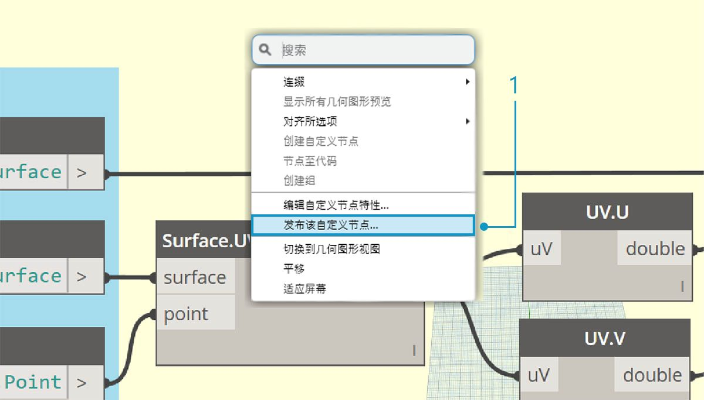
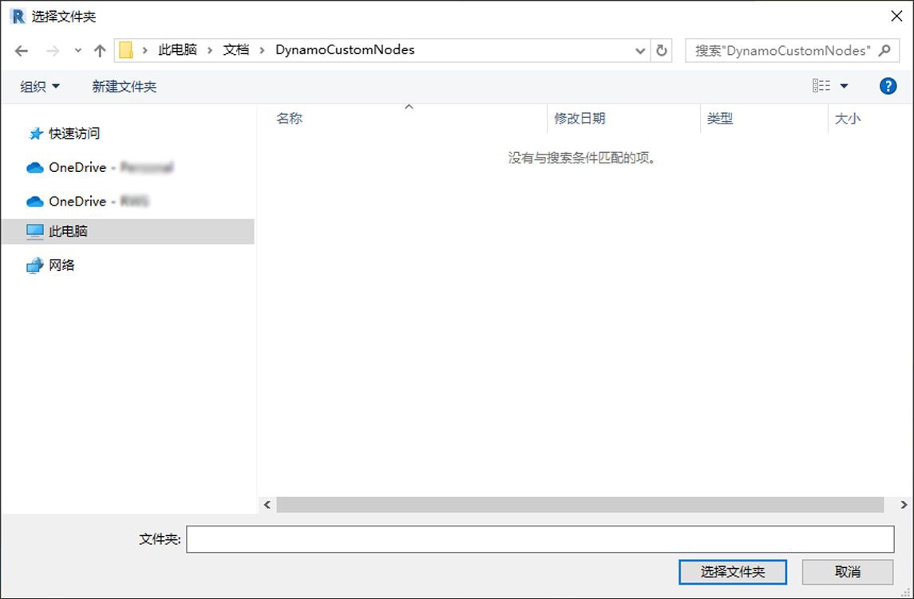
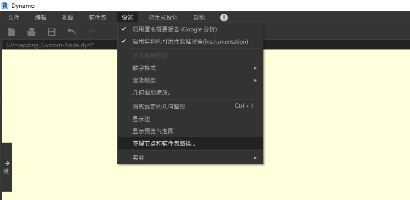
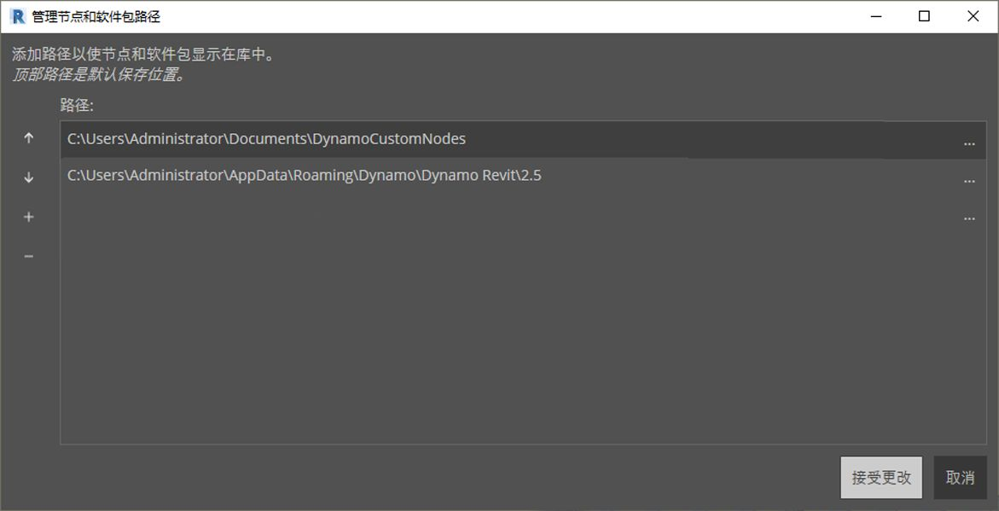
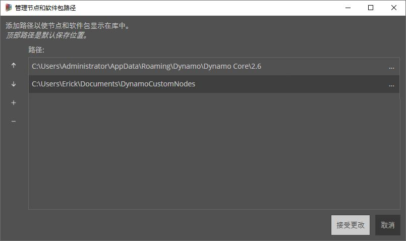
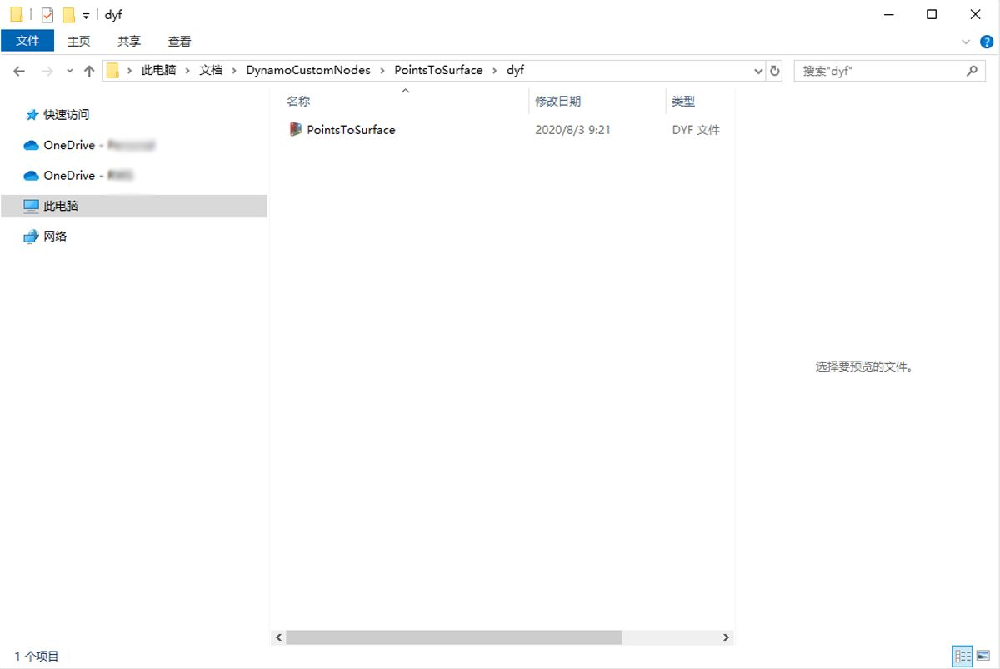

## 添加到库

我们刚创建了一个自定义节点，并将它应用到 Dynamo 图形中的特定流程。我们非常喜欢这个节点，我们想将它保留在 Dynamo 库中，以便在其他图形中引用。为此，我们将本地发布节点。这与发布资料包的过程类似，我们将在下一章中详细介绍。

### 本地发布自定义节点

让我们继续处理上一节中创建的自定义节点。通过本地发布节点，可以在打开新会话时在 Dynamo 库中访问该节点。如果不发布节点，则引用自定义节点的 Dynamo 图形也必须在其文件夹中具有该自定义节点（或必须使用*“文件”>“导入库”*将自定义节点导入 Dynamo）。

> 下载本练习随附的示例文件（单击鼠标右键，然后单击“将链接另存为...”）。可以在附录中找到示例文件的完整列表。[PointsToSurface.dyf](datasets/10-3/PointsToSurface.dyf)

> 打开 PointsToSurface 自定义节点后，我们可以在 Dynamo 自定义节点编辑器中看到上图。您还可以在 Dynamo 图形编辑器中双击自定义节点来打开它。

> 1. 若要在本地发布自定义节点，只需在画布上单击鼠标右键，然后选择*“发布此自定义节点...”*即可

> 填写与上图类似的相关信息，然后选择*“本地发布”。*. 请注意，“组”字段定义可从 Dynamo 菜单访问的主图元。

> 选择一个文件夹以容纳计划在本地发布的所有自定义节点。Dynamo 每次加载时都会检查该文件夹，因此请确保该文件夹处于永久位置。导航到此文件夹，然后选择*“选择文件夹”。* Dynamo 节点现在已本地发布，并且每次加载程序时都将保留在 Dynamo 工具栏中！

> 1. 若要检查自定义节点文件夹位置，请转到*“设置”>“管理节点和软件包路径...”*

> 在此窗口中，我们看到两个路径：*AppData\Roaming\Dynamo...* 是指联机安装的 Dynamo 软件包的默认位置。*Documents\DynamoCustomNodes...* 是指我们已本地发布的自定义节点的位置。*

> 1. 您可能希望按照上述列表顺序将本地文件夹路径下移（通过选择文件夹路径并单击路径名左侧的向下箭头）。顶层文件夹是安装软件包的默认路径。因此，通过保留默认的 Dynamo 软件包安装路径作为默认文件夹，联机软件包将与本地发布的节点分离。*

> 我们切换了路径名称的顺序，以便让 Dynamo 的默认路径作为软件包安装位置。

> 导航到此本地文件夹，我们可以在 *.dyf* 文件夹中找到原始自定义节点，该文件夹是 Dynamo 自定义节点文件的扩展名。我们可以编辑此文件夹中的文件，并且节点将在 UI 中更新。我们还可以向 *DynamoCustomNode* 主文件夹添加更多节点，Dynamo 会在重新启动时将它们添加到您的库中！

> 现在，每次使用 Dynamo 库的*“DynamoPrimer”*组中的*“PointsToSurface”*时，Dynamo 都会加载。

