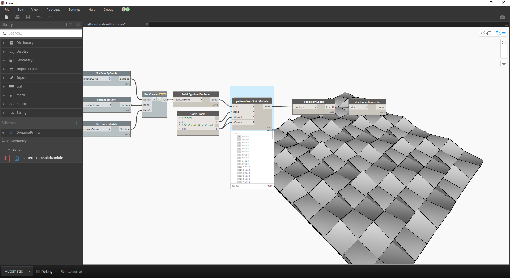

## Python

 
Python 是一种广泛使用的编程语言，其流行程度与其语法风格有很大关系。它的可读性很高，因此比许多其他语言更易于学习。Python 支持模块和软件包，并且可以嵌入到现有应用程序中。本部分中的示例假定您对 Python 基本熟悉。有关如何启动和运行 Python 的信息，请访问 [Python.org](https://www.python.org/about/gettingstarted/) 上的[“快速入门”](https://www.python.org/)页面（这是一个很好的资源）。

### 可视化与文本编程

为什么要在 Dynamo 的可视化编程环境中使用文本编程？正如我们在第 1.1 章中所述，可视化编程具有许多优势。它使您无需在直观的可视化界面中学习特殊语法即可创建程序。但是，可视化程序可能会变得混乱，有时可能会在功能上有所降低。例如，Python 提供了更多可实现的方法来编写条件语句 (if/then) 和循环。Python 是一款功能强大的工具，可扩展 Dynamo 的功能，并允许您将许多节点替换为几行简明的代码。

**可视化程序**：

**文本程序**：

```
import clr
clr.AddReference('ProtoGeometry')
from Autodesk.DesignScript.Geometry import *

solid = IN[0]
seed = IN[1]
xCount = IN[2]
yCount = IN[3]

solids = []

yDist = solid.BoundingBox.MaxPoint.Y-solid.BoundingBox.MinPoint.Y
xDist = solid.BoundingBox.MaxPoint.X-solid.BoundingBox.MinPoint.X

for i in xRange:
for j in yRange:
fromCoord = solid.ContextCoordinateSystem
toCoord = fromCoord.Rotate(solid.ContextCoordinateSystem.Origin,Vector.ByCoordinates(0,0,1),(90*(i+j%val)))
vec = Vector.ByCoordinates((xDist*i),(yDist*j),0)
toCoord = toCoord.Translate(vec)
solids.append(solid.Transform(fromCoord,toCoord))

OUT = solids
```

### Python 节点

与代码块一样，Python 节点也是可视化编程环境中的脚本编写界面。Python 节点位于库中的*“核心”>“脚本编写”*下。双击节点会打开 Python 脚本编辑器（也可以在节点上单击鼠标右键，然后选择*“编辑...”*）。


> 您会注意到顶部的一些样本文字，旨在帮助您引用所需的库。输入存储在 IN 数组中。通过将值指定给 OUT 变量，可以将这些值返回到 Dynamo。

Autodesk.DesignScript.Geometry 库允许您使用与代码块类似的点符号。有关 Dynamo 语法的详细信息，请参见第 7.2 章以及[《DesignScript 手册》](http://dynamobim.org/wp-content/links/DesignScriptGuide.pdf)。键入几何图形类型（例如“Point.”）将显示用于创建和查询点的一列方法。


> 方法包括构造函数（如 *ByCoordinates*）、操作（如 *Add*）和查询（如 *X*、*Y* 和 *Z* 坐标）。

### 练习

> 下载本练习随附的示例文件（单击鼠标右键，然后单击“将链接另存为...”）。可以在附录中找到示例文件的完整列表。[Python_Custom-Node.dyn](datasets/10-4/Python-CustomNode.dyn)

在本示例中，我们将编写一个 Python 脚本，该脚本用于从实体模块创建图案，并将其转换为自定义节点。
首先，我们使用 Dynamo 节点创建实体模块。


> 1. **Rectangle.ByWidthLength**：创建一个矩形，它将作为实体的基础。
2. **Surface.ByPatch**：将矩形连接到“*closedCurve*”输入以创建底部曲面。


> 1. **Geometry.Translate**：将矩形连接到“*geometry*”输入以向上移动它，从而使用代码块指定实体的基础厚度。
2. **Polygon.Points**：查询平移的矩形以提取角点。
3. **Geometry.Translate**：使用代码块创建与四个点对应的一列四个值，从而向上平移实体的一个角。
4. **Polygon.ByPoints**：使用平移的点来重建顶部多边形。
5. **Surface.ByPatch**：连接多边形以创建顶部曲面。

现在我们有了顶面和底面，接下来让我们在两个轮廓之间放样来创建实体的侧面。


> 1. **List.Create**：将底部矩形和顶部多边形连接到索引输入。
2. **Surface.ByLoft**：放样两个轮廓以创建实体的侧面。
3. **List.Create**：将顶面、侧面和底面连接到索引输入以创建曲面列表。
4. **Solid.ByJoinedSurfaces**：连接曲面以创建实体模块。

现在我们有了实体，接下来将 Python 脚本节点拖动到工作空间。


> 要向节点添加其他输入，请关闭编辑器，然后单击节点上的“+”图标。输入命名为 IN[0]、IN[1] 等，以指示它们表示列表中的各项目。

首先定义输入和输出。双击该节点以打开 Python 编辑器。


```
# Enable Python support and load DesignScript library
import clr
clr.AddReference('ProtoGeometry')
from Autodesk.DesignScript.Geometry import *

# The inputs to this node will be stored as a list in the IN variables.
#The solid module to be arrayed
solid = IN[0]
#A number that determines which rotation pattern to use
seed = IN[1]
#The number of solids to array in the X and Y axes
xCount = IN[2]
yCount = IN[3]

#Create an empty list for the arrayed solids
solids = []

# Place your code below this line

# Assign your output to the OUT variable.
OUT = solids
```

随着我们在练习中的进展，此代码将更有意义。接下来，我们需要考虑排列实体模块所需的信息。首先，我们需要知道实体的尺寸以确定平动距离。由于存在边界框 Bug，因此我们需要使用边曲线几何图形来创建边界框。


> 在 Dynamo 中查看 Python 节点。请注意，我们使用的语法与在 Dynamo 中节点标题中看到的语法相同。注释的代码如下。

```
# Enable Python support and load DesignScript library
import clr
clr.AddReference('ProtoGeometry')
from Autodesk.DesignScript.Geometry import *

# The inputs to this node will be stored as a list in the IN variables.
#The solid module to be arrayed
solid = IN[0]
#A number that determines which rotation pattern to use
seed = IN[1]
#The number of solids to array in the X and Y axes
xCount = IN[2]
yCount = IN[3]

#Create an empty list for the arrayed solids
solids = []
# Create an empty list for the edge curves
crvs = []

# Place your code below this line
#Loop through edges and append corresponding curve geometry to the list
for edge in solid.Edges:
crvs.append(edge.CurveGeometry)
#Get the bounding box of the curves
bbox = BoundingBox.ByGeometry(crvs)

#Get the X and Y translation distance based on the bounding box
yDist = bbox.MaxPoint.Y-bbox.MinPoint.Y
xDist = bbox.MaxPoint.X-bbox.MinPoint.X

# Assign your output to the OUT variable.
OUT = solids
```

由于我们将平移并旋转实体模块，因此我们使用 Geometry.Transform 操作。通过查看 Geometry.Transform 节点，我们知道需要源坐标系和目标坐标系来变换实体。源是实体的上下文坐标系，而目标是每个阵列模块的不同坐标系。这意味着我们需要遍历 X 和 Y 值，以每次变换不同的坐标系。


> 在 Dynamo 中查看 Python 节点。注释的代码如下。

```
# Enable Python support and load DesignScript library
import clr
clr.AddReference('ProtoGeometry')
from Autodesk.DesignScript.Geometry import *

# The inputs to this node will be stored as a list in the IN variables.
#The solid module to be arrayed
solid = IN[0]
#A number that determines which rotation pattern to use
seed = IN[1]
#The number of solids to array in the X and Y axes
xCount = IN[2]
yCount = IN[3]

#Create an empty list for the arrayed solids
solids = []
# Create an empty list for the edge curves
crvs = []

# Place your code below this line
#Loop through edges and append corresponding curve geometry to the list
for edge in solid.Edges:
crvs.append(edge.CurveGeometry)
#Get the bounding box of the curves
bbox = BoundingBox.ByGeometry(crvs)

#Get the X and Y translation distance based on the bounding box
yDist = bbox.MaxPoint.Y-bbox.MinPoint.Y
xDist = bbox.MaxPoint.X-bbox.MinPoint.X
#get the source coordinate system
fromCoord = solid.ContextCoordinateSystem

#Loop through X and Y
for i in range(xCount):
for j in range(yCount):
#Rotate and translate the coordinate system
toCoord = fromCoord.Rotate(solid.ContextCoordinateSystem.Origin,Vector.ByCoordinates(0,0,1),(90*(i+j%seed)))
vec = Vector.ByCoordinates((xDist*i),(yDist*j),0)
toCoord = toCoord.Translate(vec)
#Transform the solid from the source coord system to the target coord system and append to the list
solids.append(solid.Transform(fromCoord,toCoord))

# Assign your output to the OUT variable.
OUT = solids
```


> 单击 Python 节点上的“运行”将允许代码执行。


> 尝试更改种子值以创建不同的图案。还可以更改实体模块本身的参数以实现不同的效果。在 Dynamo 2.0 中，只需更改种子并单击“运行”即可，而无需关闭 Python 窗口。

现在，我们已创建了一个有用的 Python 脚本，接下来我们将它另存为一个自定义节点。选择 Python 脚本节点，单击鼠标右键，然后选择“从当前选择新建节点”。


> 指定名称、描述和类别。

这将打开一个新的工作空间，可以在其中编辑自定义节点。


> 1. **输入**：将输入名称更改为更具描述性的名称，并添加数据类型和默认值。
2. **输出**：更改输出名称，将节点另存为 .dyf 文件。



> 自定义节点反映了我们刚才所做的更改。

