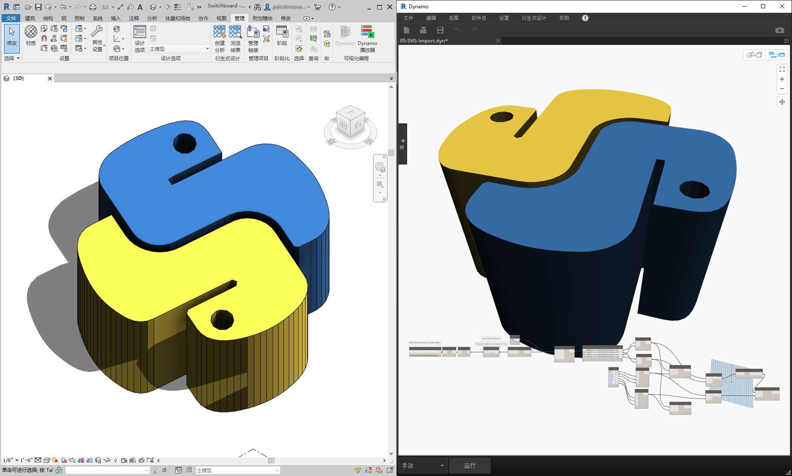
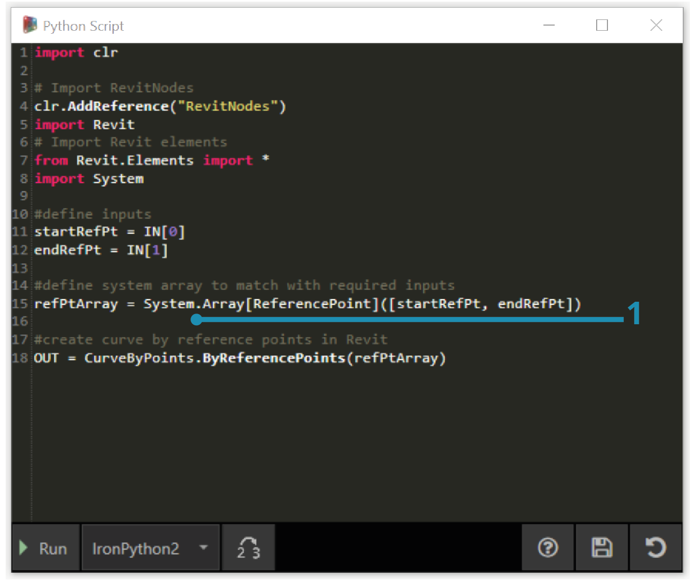
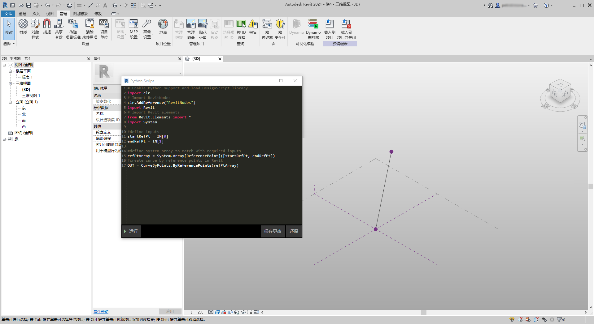
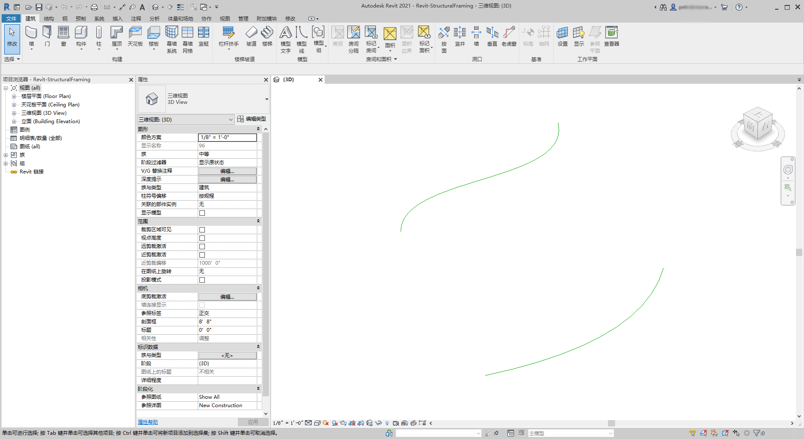
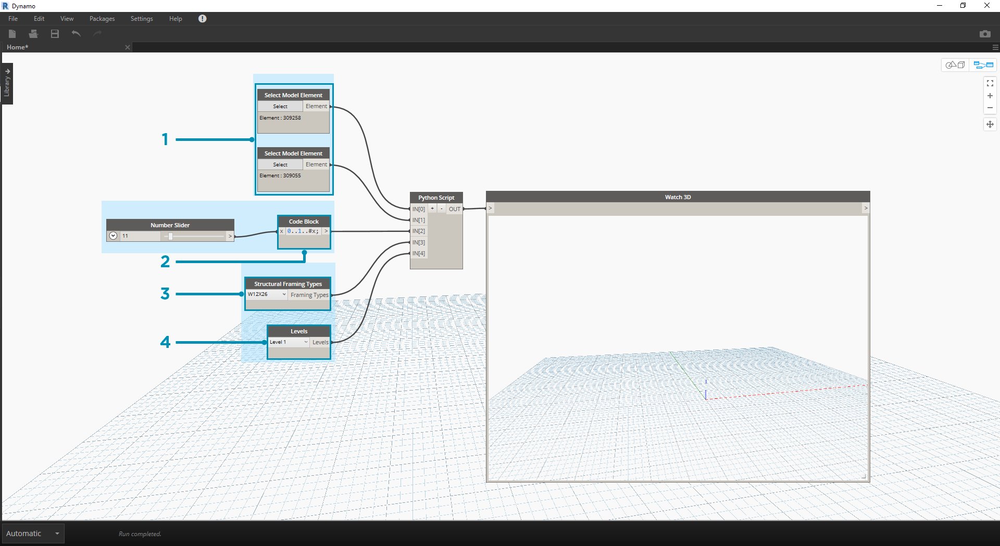
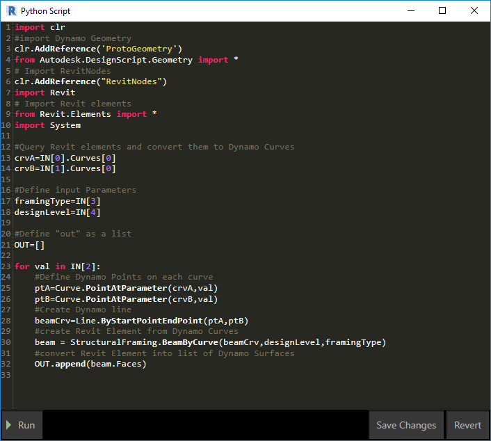
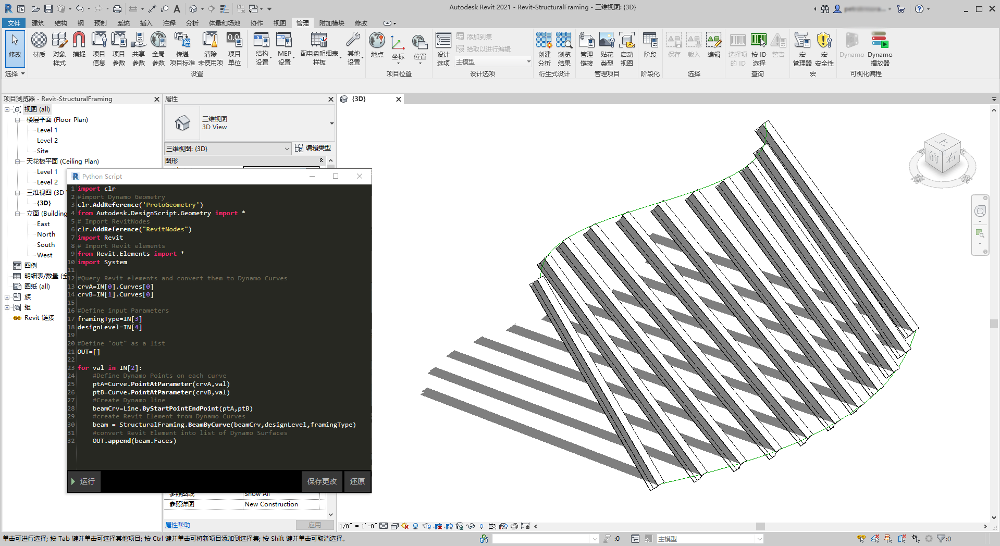
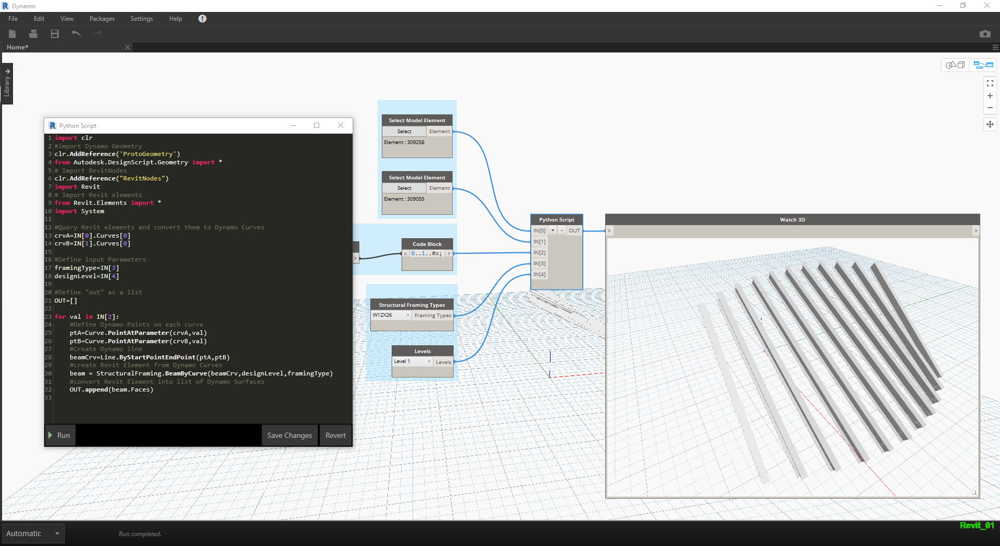

## Python 和 Revit

现在，我们已演示了如何在 Dynamo 中使用 Python 脚本，接下来我们来了解如何将 Revit 库连接到脚本编写环境。请记住，我们输入了 Dynamo 核心节点，其中代码块中前三行如下所示。要输入 Revit 节点、Revit 图元和 Revit 文档管理器，我们只需添加几行代码即可：

```
import clr
clr.AddReference('ProtoGeometry')
from Autodesk.DesignScript.Geometry import *

# Import RevitNodes
clr.AddReference("RevitNodes")
import Revit

# Import Revit elements
from Revit.Elements import *

# Import DocumentManager
clr.AddReference("RevitServices")
import RevitServices
from RevitServices.Persistence import DocumentManager

import System
```

这样，我们便可以访问 Revit API，并为任何 Revit 任务提供自定义脚本编写。通过将可视化编程流程与 Revit API 脚本编写相结合，协作和工具开发得到显着改进。例如，BIM 经理和方案设计人员可以协同处理同一图形。在此协作中，他们可以改进模型的设计和执行。



### 平台特定的 API

Dynamo 项目背后的计划是拓宽平台实施范围。随着 Dynamo 向 Docket 中添加更多程序，用户将可以从 Python 脚本编写环境访问特定于平台的 API。尽管 Revit 是本部分的案例研究，但我们可以预见将来会有更多章节，这就会提供有关在其他平台上编写脚本的综合教程。此外，现在还有许多 [IronPython](http://ironpython.net/) 库可供访问，这些库都可以输入到 Dynamo 中！

下面的示例演示了在 Dynamo 中使用 Python 实现特定于 Revit 操作的方法。有关 Python 与 Dynamo 和 Revit 的关系的更详细查看，请参见 [Dynamo Wiki 页面](https://github.com/DynamoDS/Dynamo/wiki/Python-0.6.3-to-0.7.x-Migration)。Python 和 Revit 的另一个有用资源是 [Revit Python Shell](https://github.com/architecture-building-systems/revitpythonshell) 项目。

### 练习 01

> 创建新的 Revit 项目。下载本练习随附的示例文件（单击鼠标右键，然后单击“将链接另存为...”）。可以在附录中找到示例文件的完整列表。[Revit-Doc.dyn](datasets/10-5/Revit-Doc.dyn)

在这些练习中，我们将在 Dynamo for Revit 中了解基本的 Python 脚本。本练习将重点介绍如何处理 Revit 文件和图元，以及 Revit 和 Dynamo 之间的通信。


> 这是一种用于检索与 Dynamo 任务链接的 Revit 文件的 *doc*、*uiapp* 和 *app* 的简便方法。之前使用过 Revit API 的程序员可能会在观察列表中注意到这些项目。如果这些项目看起来不太熟悉，没关系；我们将在下面练习中使用其他示例。

以下内容介绍我们如何在 Dynamo 中输入 Revit 服务和检索文档数据：

> 在 Dynamo 中查看 Python 节点。注释的代码如下。

```
# Enable Python support and load DesignScript library
import clr
# Import DocumentManager
clr.AddReference("RevitServices")
import RevitServices
from RevitServices.Persistence import DocumentManager

# Place your code below this line
doc = DocumentManager.Instance.CurrentDBDocument
uiapp = DocumentManager.Instance.CurrentUIApplication
app = uiapp.Application

# Assign your output to the OUT variable.
OUT = [doc,uiapp,app]
```

### 练习 02

> 下载本练习随附的示例文件（单击鼠标右键，然后单击“将链接另存为...”）。可以在附录中找到示例文件的完整列表。[Revit-ReferenceCurve.dyn](datasets/10-5/Revit-ReferenceCurve.dyn)

在本练习中，我们将在 Revit 中使用 Dynamo Python 节点创建一个简单的模型曲线。


> 从上图中的节点集开始。首先，我们将在 Revit 中基于 Dynamo 节点创建两个参照点。

> 先在 Revit 中创建新的概念体量族。启动 Dynamo，创建上图中的节点集。首先，我们将在 Revit 中基于 Dynamo 节点创建两个参照点。

> 1. 创建代码块，并为其赋予值“0;”。
2. 将该值插入 X、Y 和 Z 输入的 ReferencePoint.ByCoordinates 节点。
3. 创建三个滑块，范围从 -100 到 100，步长为 1。
4. 将每个滑块都连接到 ReferencePoint.ByCoordinates 节点。
5. 将 Python 节点添加到工作空间，单击节点上的“+”按钮以添加另一个输入并将两个参照点插入每个输入。打开 Python 节点。



> 在 Dynamo 中查看 Python 节点。注释的代码如下。

> 1. **System.Array**：Revit 需要系统数组作为输入（而不是 Python 列表）。这只是一行代码，但注意参数类型将有助于在 Revit 中进行 Python 编程。

```
import clr

# Import RevitNodes
clr.AddReference("RevitNodes")
import Revit
# Import Revit elements
from Revit.Elements import *
import System

#define inputs
startRefPt = IN[0]
endRefPt = IN[1]

#define system array to match with required inputs
refPtArray = System.Array[ReferencePoint]([startRefPt, endRefPt])
#create curve by reference points in Revit
OUT = CurveByPoints.ByReferencePoints(refPtArray)
```



> 在 Dynamo 中，我们使用 Python 创建了两个参照点以及一条连接它们的线。在下一练习中，我们进一步介绍。

### 练习 03

> 下载并解压缩本练习随附的示例文件（单击鼠标右键，然后单击“将链接另存为...”）。可以在附录中找到示例文件的完整列表。[Revit-StructuralFraming.zip](datasets/10-5/Revit-StructuralFraming.zip)

> 本练习尽可能简单，但主要介绍将数据和几何图形从 Revit 连接到 Dynamo 和反向操作的主题。首先，打开 Revit-StructuralFraming.rvt。打开后，加载 Dynamo 并打开文件 Revit-StructuralFraming.dyn。



> 此 Revit 文件实现的是基本功能。两条参照曲线：一条在标高 1 上绘制，另一条在标高 2 上绘制。我们希望将这些曲线输入 Dynamo，并保持实时链接。



> 在此文件中，我们有一组节点，用于插入到 Python 节点的五个输入中。

> 1. **选择模型图元节点**：点击每个节点对应的选择按钮，然后在 Revit 中选择相应曲线。
2. **代码块**：使用语法*“0..1..#x;”*，将范围 0 到 20 之间的整数滑块连接到 *x* 输入。这会指定要在两条曲线之间绘制的梁数。
3. **结构框架类型**：此处，我们将从下拉菜单中选择默认的 W12x26 梁。
4. **标高**：选择“标高 1”。



> Python 中的这段代码更加密集，但代码中的注释描述了该过程中发生的情况：

```
import clr
#import Dynamo Geometry
clr.AddReference('ProtoGeometry')
from Autodesk.DesignScript.Geometry import *
# Import RevitNodes
clr.AddReference("RevitNodes")
import Revit
# Import Revit elements
from Revit.Elements import *
import System

#Query Revit elements and convert them to Dynamo Curves
crvA=IN[0].Curves[0]
crvB=IN[1].Curves[0]

#Define input Parameters
framingType=IN[3]
designLevel=IN[4]

#Define "out" as a list
OUT=[]

for val in IN[2]:
#Define Dynamo Points on each curve
ptA=Curve.PointAtParameter(crvA,val)
ptB=Curve.PointAtParameter(crvB,val)
#Create Dynamo line
beamCrv=Line.ByStartPointEndPoint(ptA,ptB)
#create Revit Element from Dynamo Curves
beam = StructuralFraming.BeamByCurve(beamCrv,designLevel,framingType)
#convert Revit Element into list of Dynamo Surfaces
OUT.append(beam.Faces)
```



> 在 Revit 中，我们有一组梁，它们跨两条曲线作为结构图元。注意：这不是一个真实示例...结构图元用作从 Dynamo 创建的原生 Revit 实例的示例。 在 Dynamo 中，我们也可以看到结果。Watch3D 节点中的梁引用从 Revit 图元查询所得的几何图形。

请注意，我们有一个连续过程将数据从 Revit 环境转换到 Dynamo 环境。总之，下面介绍了该过程的具体流程：

1. 选择 Revit 图元
2. 将 Revit 图元转换为 Dynamo 曲线
3. 将 Dynamo 曲线分割为一系列 Dynamo 点
4. 使用两条曲线之间的 Dynamo 点来创建 Dynamo 线
5. 通过参照 Dynamo 线创建 Revit 梁
6. 通过查询 Revit 梁的几何图形输出 Dynamo 曲面

这听起来可能有点费劲，但脚本使它变得简单，就像在 Revit 中编辑曲线并重新运行求解器一样（尽管这样做可能必须删除以前的梁）。*这是因为我们在 Python 中放置梁，从而打破了 OOTB 节点的关联。*



> 在 Revit 中更新参照曲线后，我们会得到新的梁阵列。

