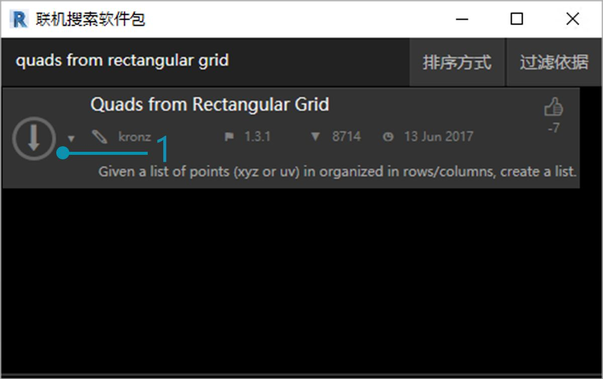
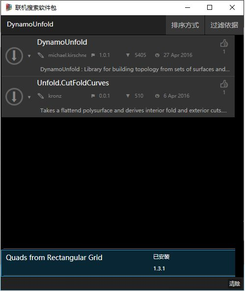
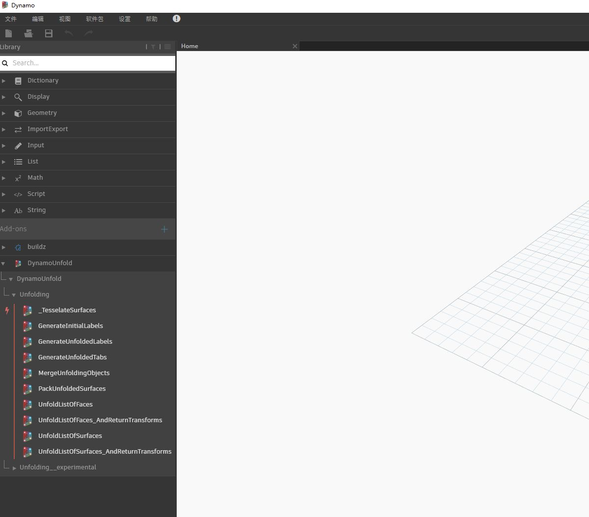
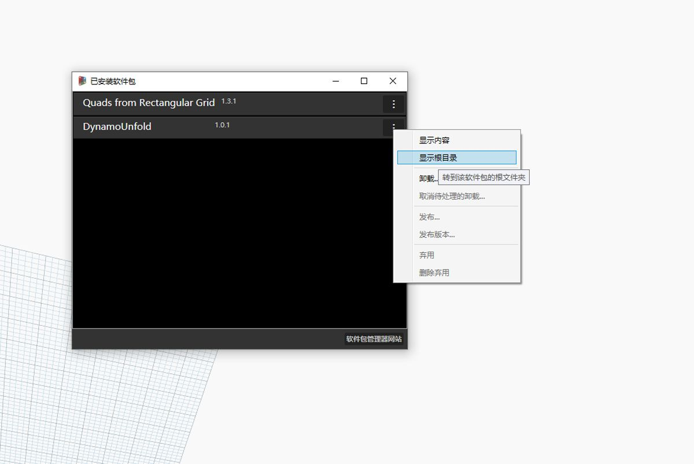
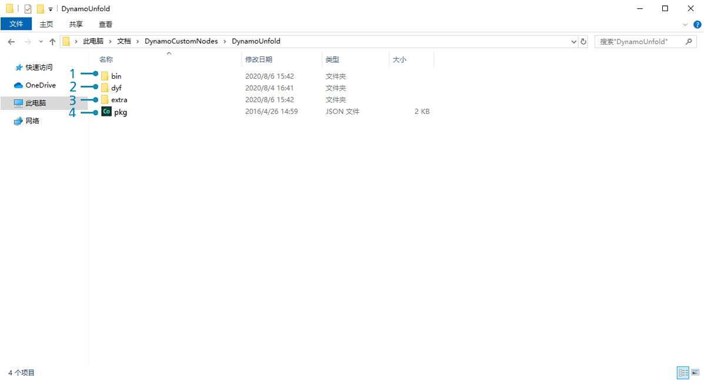
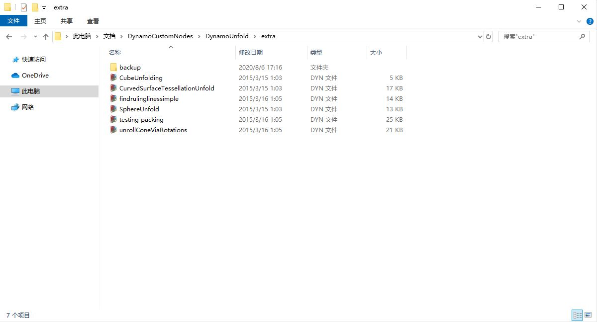
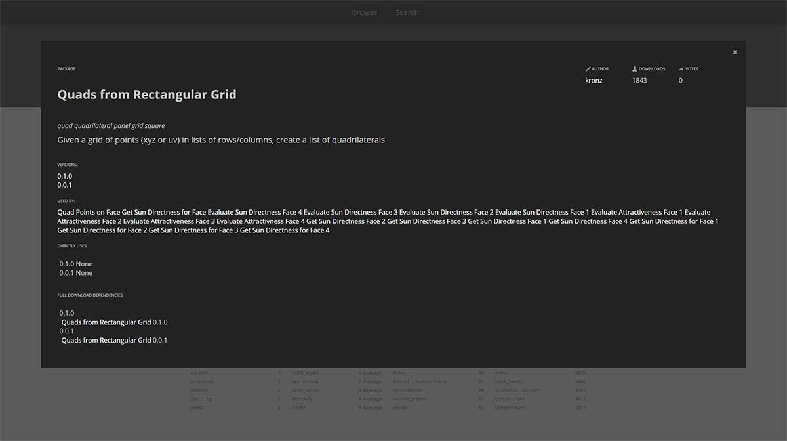

## 软件包

简而言之，软件包是自定义节点集。Dynamo Package Manager 是一个社区门户，可以下载已在线发布的任何软件包。这些工具集由第三方开发，以扩展 Dynamo 的核心功能，可供所有人访问，并可以通过单击相应按钮进行下载。

诸如 Dynamo 之类的开源项目通过此类社区参与有了蓬勃发展。借助专门的第三方开发人员，Dynamo 能够将其应用范围扩展到各行各业的工作流。因此，Dynamo 团队已共同努力来简化软件包的开发和发布（将在以下各节中详细讨论）。

### 安装软件包

安装软件包的最简单方法是使用 Dynamo 界面中的“软件包”工具栏。让我们直接跳转到该工具栏，然后立即安装一个软件包。在本快速示例中，我们将安装一个常用软件包，用于在栅格上创建四边形嵌板。

> 1. 在 Dynamo 中，转到*“软件包”>“搜索软件包...”*

> 在搜索栏中，我们搜索“quads from rectangular grid”。片刻之后，您应该会看到与此搜索查询匹配的所有软件包。我们想要选择具有匹配名称的第一个软件包。

> 1. 单击软件包名称左侧的下载箭头，该软件包将安装。完成！

> 1. 请注意，现在 Dynamo 库中有另一个名为*“buildz”*的组。该名称指代软件包的[开发人员](http://buildz.blogspot.com/)，并且自定义节点将放置在此组中。我们可以立即开始使用此组。

> 通过操作快速代码块定义矩形栅格后，我们就创建了一列矩形嵌板。

### 软件包文件夹

上述示例重点介绍内含一个自定义节点的软件包，但相同过程可用于下载内含多个自定义节点的软件包以及支持数据文件。现在，我们通过一个更全面的软件包来进行演示：Dynamo Unfold。

> 如上例中所示，首先依次选择*“软件包”>“搜索软件包...”*。这次，我们搜索*“DynamoUnfold”*（一个字词，注意大写）。在我们见到软件包后，即可通过单击软件包名称左侧的箭头进行下载。现在，Dynamo Unfold 将安装在 Dynamo 库中。

> 在 Dynamo 库中，我们有一个 *DynamoUnfold* 组，其中包含多个类别和自定义节点。

> 现在，我们来看一下软件包的文件结构。在 Dynamo 中，依次选择*“软件包”>“管理软件包...”*。我们会在上述窗口中看到已安装的两个库。单击 *DynamoUnfold* 右侧的按钮，然后选择*“显示根目录”*。

> 这会转到该软件包的根目录。请注意，我们有 3 个文件夹和一个文件。

> 1. *bin* 文件夹中存储了 .dll 文件。此 Dynamo 软件包使用 Zero-Touch 开发，因此自定义节点保存在此文件夹中。
2. *dyf* 文件夹中存储了自定义节点。此软件包不是使用 Dynamo 自定义节点开发的，因此此软件包的该文件夹为空。
3. “extra”文件夹中存储了所有附加文件，包括我们的示例文件。
4. pkg 文件是一个基本文本文件，用于定义软件包设置。我们现在可以忽略该文件。

> 打开*“extra”*文件夹，我们会在其中看到随安装下载的一系列示例文件。并非所有软件包中都有示例文件，如果示例文件是软件包的一部分，那么就可以在该位置找到它们。让我们打开*“SphereUnfold”*。

> 在打开该文件并点击求解器上的*“运行”*后，我们会得到一个展开的球体！此类示例文件有助于了解如何使用新的 Dynamo 软件包。

### Dynamo Package Manager

了解 Dynamo 软件包的另一种方法是在线浏览 [Dynamo Package Manager](http://dynamopackages.com/)。这是浏览软件包的好方法，因为存储库会按照下载数量和受欢迎程度对软件包进行排序。此外，它也是一种用于收集有关最新软件包更新信息的简便方法，因为某些 Dynamo 软件包受 Dynamo 各内部版本的版本控制和依存关系的制约。

> 通过在 Dynamo Package Manager 中单击*“Quads from Rectangular Grid”*，即可查看其描述、版本、开发人员以及可能的依存关系。

还可以从 Dynamo Package Manager 下载软件包文件，但直接在 Dynamo 中进行下载是一个更无缝的过程。

### 文件本地存储在何处？

如果您确实要从 Dynamo Package Manager 下载文件，或者想要查看所有软件包文件的保存位置，请依存单击*“设置”>“管理节点和软件包路径...”*。通过单击文件夹目录旁边的省略号，即可复制根文件夹并在资源管理器窗口中深入研究软件包。默认情况下，软件包安装在与以下文件夹路径类似的位置：*C:/Users/[用户名]/AppData/Roaming/Dynamo/[Dynamo 版本]*。

### 进一步了解软件包

Dynamo 社区不断发展壮大。通过不时浏览 Dynamo Package Manager，您会发现一些令人兴奋的新进展。在以下各部分中，我们将更深入地探索软件包，从最终用户角度到您自己的 Dynamo 软件包制作。

