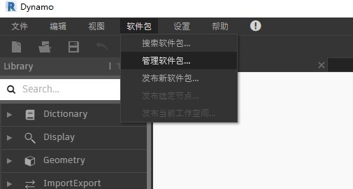
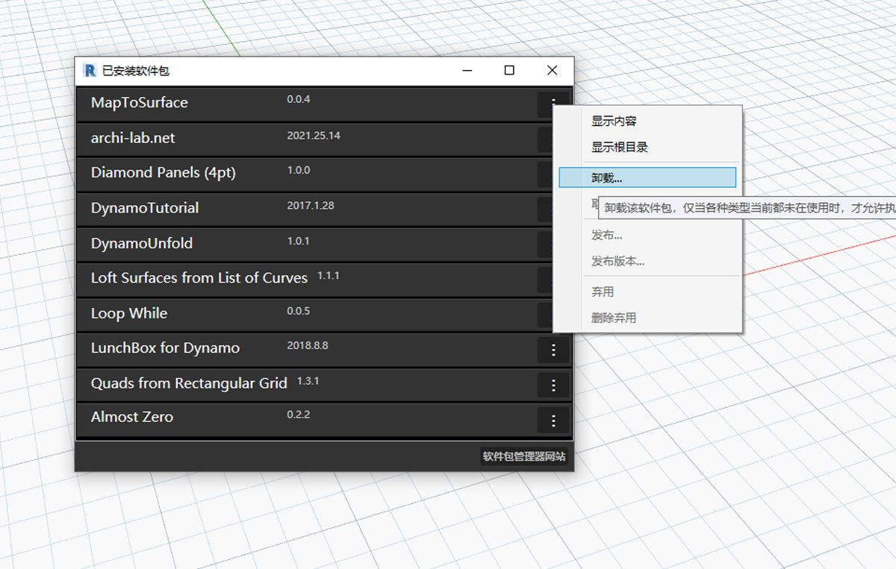
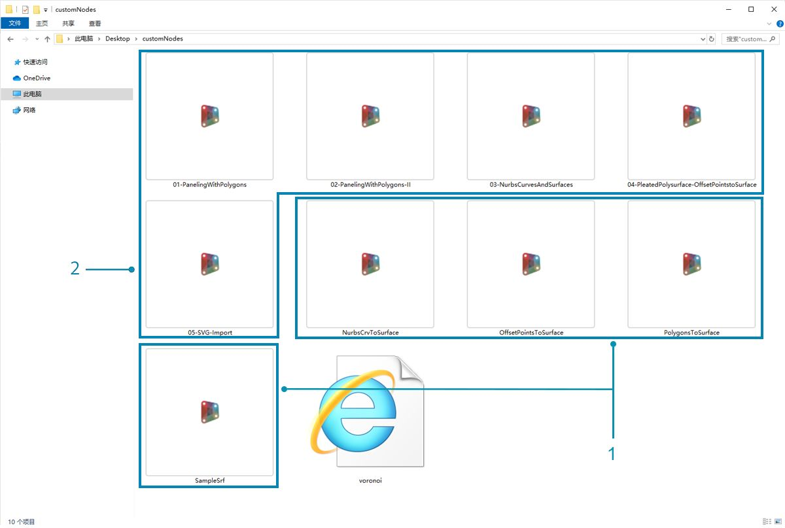
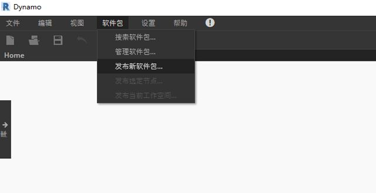
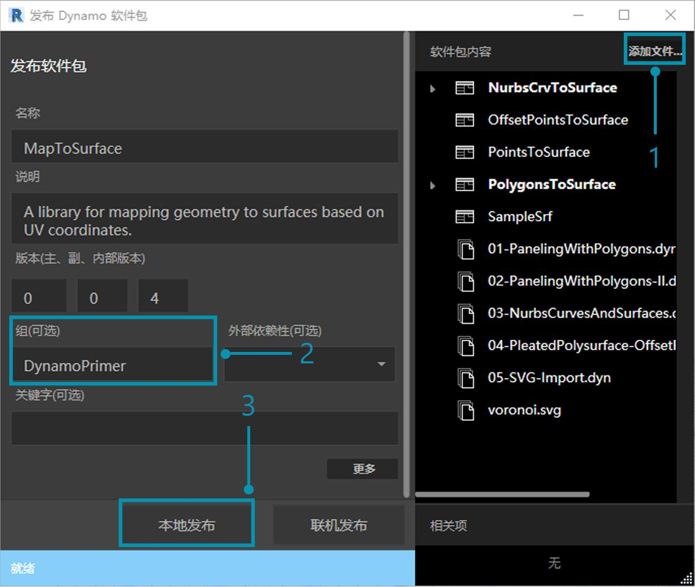
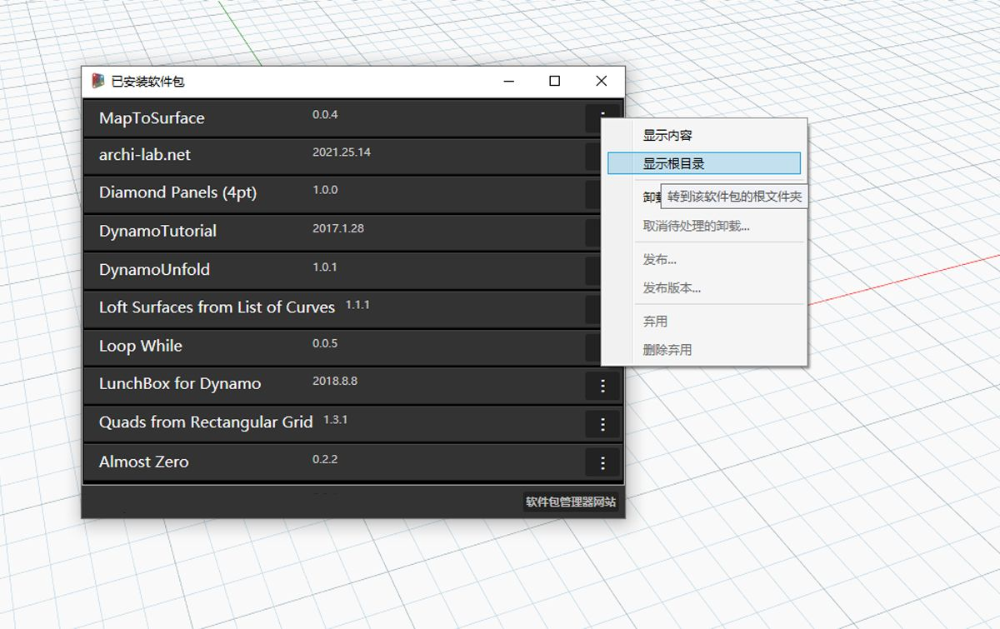
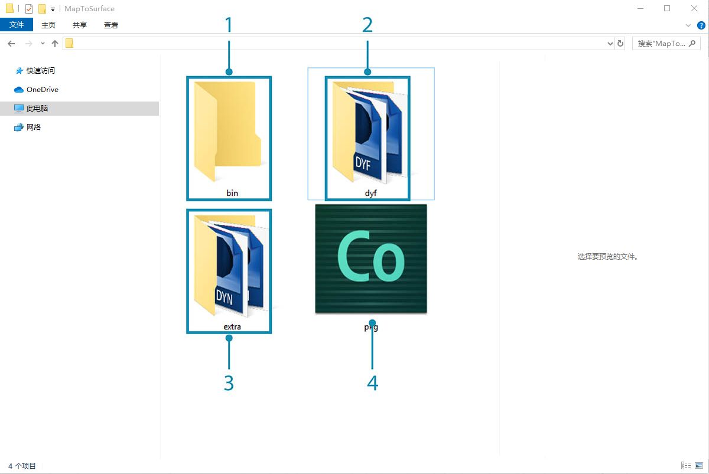
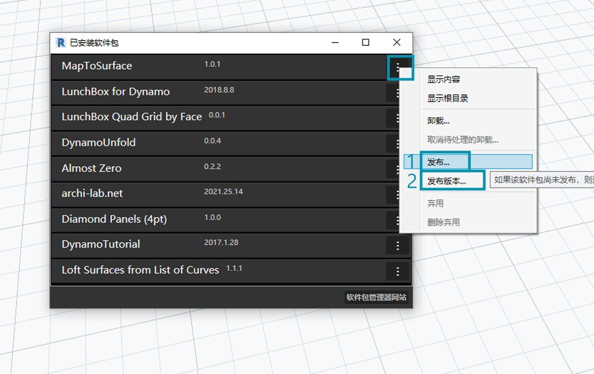

## 发布软件包

在前面的各部分中，我们详细介绍了如何使用自定义节点和示例文件构建 *MapToSurface* 软件包。  但是，我们如何发布本地开发的软件包？  本案例分析演示了如何发布由本地文件夹中的一组文件构成的软件包。

发布软件包有多种方法。下面是我们建议的流程：**本地发布、本地开发，然后联机发布**。我们首先从包含软件包中所有文件的文件夹开始。

### 卸载软件包
在开始发布 MapToSurface 软件包之前，如果您安装了上一课中的软件包，请将其卸载，以免使用相同的软件包。

> 先转到*“软件包”>“管理软件包...”*。

> 选择与*“MapToSurface”*对应的按钮，然后选择*“卸载...”*。然后，重新启动 Dynamo。重新打开后，选中*“管理软件包”*窗口时，*MapToSurface* 应不再存在。现在，我们已准备好从头开始！

### 本地发布软件包

*注意：自编写此内容起，Dynamo 软件包发布仅在 Dynamo for Revit 或 Dynamo for Civil 3d 中启用。Dynamo 沙箱没有发布功能。*

> 下载并解压缩此软件包案例研究随附的示例文件（单击鼠标右键，然后单击“将链接另存为...”）。可以在附录中找到示例文件的完整列表。[MapToSurface.zip](datasets/11-4/MapToSurface.zip)

> 这是软件包的首次提交，我们已将所有示例文件和自定义节点放入一个文件夹中。  准备好此文件夹后，我们便可以上传到 Dynamo 软件包管理器。
1. 此文件夹中包含五个自定义节点 (.dyf)。
2. 此文件夹中还包含五个示例文件 (.dyn) 和一个输入的矢量文件 (.svg)。这些文件将用作介绍性练习，以向用户介绍如何使用自定义节点。

> 在 Dynamo 中，先依次单击*“软件包”>“发布新软件包...”*

> 在*“发布 Dynamo 软件包”*窗口中，我们已填充了窗口左侧的相关表单。
1. 单击*“添加文件”*，我们还在屏幕右侧添加了文件夹结构中的文件以添加非 .dyf 文件的文件，请务必在浏览器窗口中将文件类型更改为**“所有文件(*.*)”**。请注意，我们已随意地添加了每个文件、自定义节点 (.dyf) 或示例文件 (.dyn)。在发布软件包时，Dynamo 会对这些项目进行分类。
2. “组”字段定义了在 Dynamo UI 中查找自定义节点的组。
3. 单击“本地发布”即可发布。如果您遵照执行，请务必单击*“本地发布”*，而**不是***“联机发布”*；我们不希望在软件包管理器中出现一系列重复的软件包。

> 1. 发布后，“DynamoPrimer”组或 Dynamo 库下应提供自定义节点。

> 现在，我们来查看根目录，以了解 Dynamo 如何设置刚刚创建的软件包的格式。为此，请依次单击*“软件包”>“管理软件包...”*

> 在“管理软件包”窗口中，单击*“MapToSurface”*右侧的三个垂直点，然后选择*“显示根目录”。*

> 请注意，根目录位于软件包的本地位置（请记住，我们已“本地”发布了软件包）。  Dynamo 当前正在引用此文件夹来读取自定义节点。因此，请务必将目录本地发布到永久文件夹位置（即：不是桌面）。以下内容详细介绍 Dynamo 软件包文件夹：
1. *bin* 文件夹中存储了使用 C# 或 Zero-Touch 库创建的 .dll 文件。  我们没有任何此软件包的内容，因此对此示例而言此文件夹为空。
2. *dyf* 文件夹中存储了自定义节点。  打开此文件夹将显示该软件包的所有自定义节点（.dyf 文件）。
3. 附加文件夹中存储了所有附加文件。  这些文件可能是 Dynamo 文件 (.dyn)，也可能是所需的任何其他文件（.svg、.xls、.jpeg、.sat 等）。
4. pkg 文件是一个基本文本文件，用于定义软件包设置。这是在 Dynamo 中自动生成的，但如果您想要了解详细信息，可以对其进行编辑。

### 联机发布软件包

> **注意：除非您实际发布自己的软件包，否则请勿遵循此步骤！**
1. 当您准备好发布时，在“管理软件包”窗口中选择 MapToSurface 右侧的按钮，然后选择*“发布...”*
2. 如果要更新已发布的软件包，请选择“发布版本”，Dynamo 将根据该软件包的根目录中的新文件联机更新软件包。就这么简单！

### 发布版本...
更新已发布软件包的根文件夹中的文件时，可以通过在*“管理软件包”*窗口中选择*“发布版本...”*，来发布该软件包的新版本。  这是对内容进行必要更新并与社区共享的无缝方式。  仅当您是该软件包的维护人员时，*“发布版本”*才起作用。
