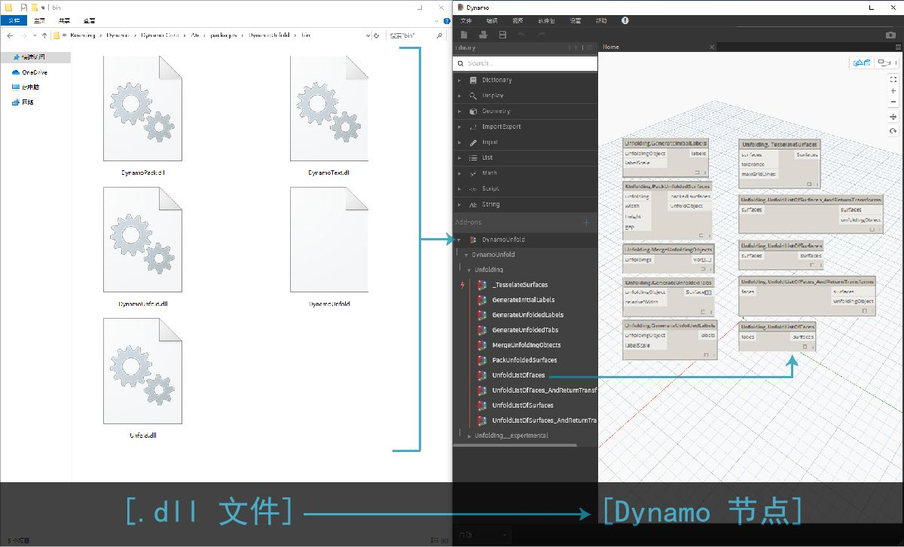
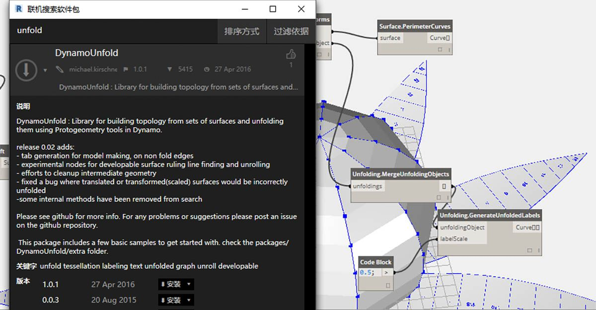
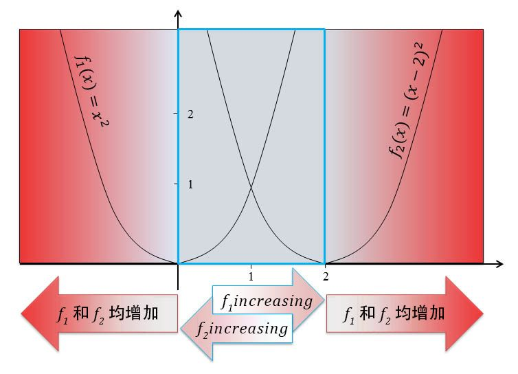
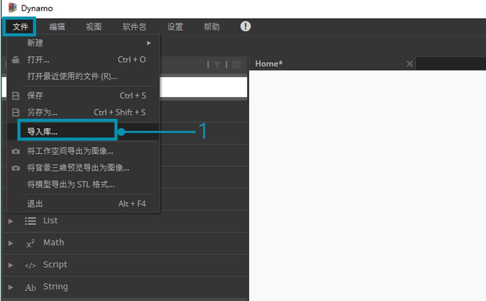
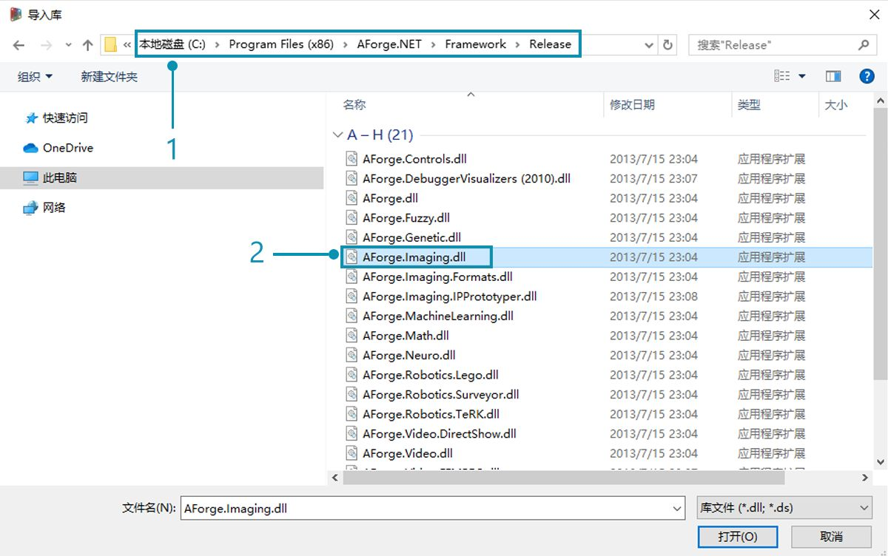
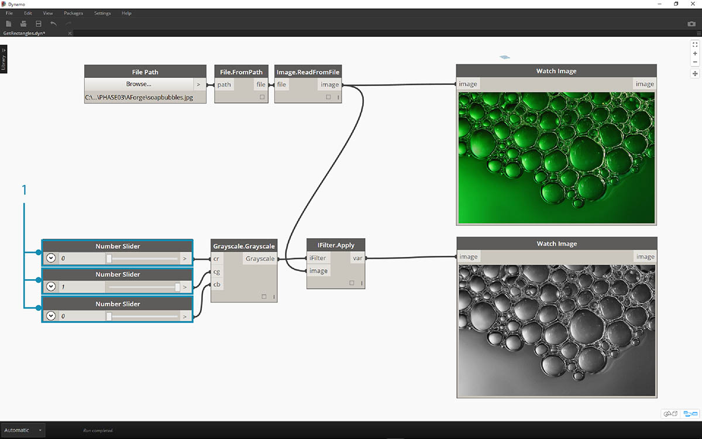
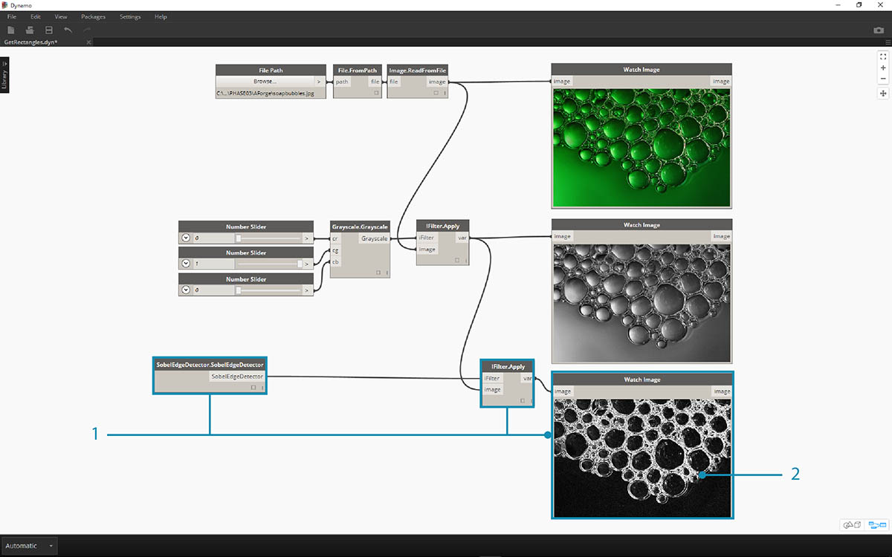

<style>
table{box-shadow: 2px 2px 2px #BBBBBB;max-width:75%;display:block;margin-left: auto;   margin-right: auto }
thead {display: none}
img{display:block;margin-left: auto;   margin-right: auto }
</style>

## 什么是 Zero-Touch？

“Zero-Touch 输入”是指用于输入 C# 库的简单点击方法。Dynamo 将读取 *.dll* 文件的公有方法，并将这些方法转换为 Dynamo 节点。可以将 Zero-Touch 用于开发您自己的自定义节点和软件包，以及将外部库输入到 Dynamo 环境。



使用 Zero-Touch，实际上可以输入不一定为 Dynamo 开发的库，以及创建一组新节点。当前的 Zero-Touch 功能演示了 Dynamo 项目的跨平台思维。

本部分演示如何使用 Zero-Touch 输入第三方库。有关开发您自己的 Zero-Touch 库的信息，请参考 [Dynamo Wiki 页面](https://github.com/DynamoDS/Dynamo/wiki/Zero-Touch-Plugin-Development)。

### Zero-Touch 软件包

Zero-Touch 软件包是对用户定义的自定义节点的良好补充。下表列出了使用 C# 库的一些软件包。有关软件包的更多详细信息，请访问“附录”中的[“软件包”部分](../Appendix/A-3_packages.md)。


<table width="100%">
    <tr>
    <td width="20%"><b>徽标/图像</b></td>
    <td><b>名称</b></td>
</tr>
  <tr>
    <td></img></td>
    <td><a href="https://github.com/DynamoDS/Dynamo/wiki/Dynamo-Mesh-Toolkit">网格工具包</td></a>
  </tr>
  <tr>
    <td></img></td>
    <td><a href="http://dynamobim.com/dynamounfold/">Dynamo 展开</td></a>
  </tr>
  <tr>
    <td></img></td>
    <td><a href="http://www.case-inc.com/blog/what-is-rhynamo">Rhynamo</td></a>
  </tr>
  <tr>
    <td></img></td>
    <td><a href="https://github.com/BPOpt/Optimo">Optimo</td></a>
  </tr>
</table>

### 案例研究 - 输入 AForge

在本案例中，我们将介绍如何输入 [AForge](http://www.aforgenet.com/) 外部 *.dll* 库。AForge 是一个功能强大的库，提供了从图像处理到人工智能的一系列功能。我们将引用 AForge 中的图像处理类，以在下面进行一些图像处理练习。

> 下载并解压缩此软件包案例研究随附的示例文件（单击鼠标右键，然后单击“将链接另存为...”）。可以在附录中找到示例文件的完整列表。[Zero-Touch-Examples.zip](datasets/11-5/Zero-Touch-Examples.zip)。

> 1. 首先下载 AForge。在 [AForge 下载页面](http://www.aforgenet.com/framework/downloads.html)上，选择*“[下载安装程序]”*，然后在下载完成后进行安装。



> 1. 在 Dynamo 中，创建一个新文件，然后依次选择*“文件”>“输入库...”*



> 1. 在弹出窗口中，导航到安装有 AForge 的相应版本文件夹。该文件夹可能类似于以下文件夹：*C:\Program Files (x86)\AForge.NET\Framework\Release*。
2. **AForge.Imaging.dll**：我们只想要将 AForge 库中的此文件用于本案例研究。选择此 *.dll*，然后点击*“打开”*。


> 1. 返回 Dynamo，您应看到已添加到库工具栏的*“AForge”*组节点。现在，我们即可从可视化程序访问 AForge 图像处理库！

### 练习 1 - 边缘检测

现在，库已输入，我们将开始此第一个简单练习。我们将对样例图像进行一些基本图像处理，以显示 AForge 图像如何过滤。我们将使用*“观察图像”(Watch Image)* 节点来显示结果，并在 Dynamo 中应用过滤器（与 Photoshop 中的过滤器类似）。

> 下载并解压缩此软件包案例研究随附的示例文件（单击鼠标右键，然后单击“将链接另存为...”）。可以在附录中找到示例文件的完整列表。[ZeroTouchImages.zip](datasets/11-5/ZeroTouchImages.zip)

现在，库已输入，我们将开始此第一个简单练习 (*01-EdgeDetection.dyn*)。我们将对样例图像进行一些基本图像处理，以显示 AForge 图像如何过滤。我们将使用*“观察图像”(Watch Image)* 节点来显示结果，并在 Dynamo 中应用过滤器（与 Photoshop 中的过滤器类似）


> 首先，我们要输入图像以进行处理。将*“文件路径”(File Path)* 节点添加到画布，然后在下载的练习文件夹中选择“soapbubbles.jpg”（照片来源：[Flickr](https://www.flickr.com/photos/wwworks/667298782)）。


> 1. “文件路径”(File Path) 节点仅提供指向选定图像的路径字符串。我们需要将此“文件路径”(File Path) 转换为 Dynamo 环境中的图像。
2. 将“文件路径”(File Path) 节点连接到 File.FromPath 节点。
3. 要将此文件转换为图像，我们将使用 Image.ReadFromFile 节点。
4. 最后，我们来看看结果！将“观察图像”(Watch Image) 节点拖动到画布上，然后连接到 Image.ReadFromFile。我们尚未使用 AForge，但我们已成功将图像输入 Dynamo。


> 在“AForge.Imaging.AForge.Filters”（在导航菜单中）下，您会注意到有许多可用过滤器。现在，我们将使用其中一个过滤器来基于阈值降低图像饱和度。

> 1. 将这三个滑块拖动到画布上，将它们的范围更改为 0 到 1，将其步长值更改为 0.01。
2. 将“Grayscale.Grayscale”节点添加到画布。这是一个“AForge”过滤器，可将“灰度”过滤器应用于图像。将步骤 1 中的三个滑块连接到 cr、cg 和 cb。将顶部和底部滑块的值更改为 1，将中间滑块的值更改为 0。
3. 为了应用“灰度”过滤器，我们需要对图像执行一个操作。为此，我们使用 IFilter.Apply。将图像连接到图像输入，将 Grayscale.Grayscale 连接到 iFilter 输入。
4. 通过插入“观察图像”(Watch Image) 节点，我们得到饱和度降低的图像。



> 我们可以控制如何根据红、绿和蓝的阈值来降低该图像的饱和度。这些值由 Grayscale.Grayscale 节点的输入定义。请注意，图像看起来很暗，这是因为滑块中的绿色值设置为 0。

> 1. 将顶部和底部滑块的值更改为 0，将中间滑块的值更改为 1。这样，我们获得饱和度明显降低的图像。



> 让我们使用饱和度降低的图像，然后基于它应用另一个过滤器。饱和度降低的图像有一定的对比度，因此我们将测试一些边缘检测。

> 1. 将 SobelEdgeDetector.SobelEdgeDetector 节点添加到画布。将此作为 IFilter 连接到新的 IFilter 节点，然后将饱和度降低的图像连接到 IFilter 节点的图像输入。
2. “Sobel Edge Detector”已在新图像中亮显边缘。


> 放大时，边缘检测器使用像素标注出气泡的轮廓。AForge 库提供的工具可用于获取类似结果以及创建 Dynamo 几何图形。我们将在下一练习中进行探索。

### 练习 2 - 创建矩形

> 下载并解压缩此软件包案例研究随附的示例文件（单击鼠标右键，然后单击“将链接另存为...”）。可以在附录中找到示例文件的完整列表。[ZeroTouchImages.zip](datasets/11-5/ZeroTouchImages.zip)

现在，我们已经介绍了一些基本图像处理，让我们使用图像来驱动 Dynamo 几何图形！从根本上讲，在本练习中我们旨在使用 AForge 和 Dynamo 对图像进行*“实时跟踪”*。我们将遵循简单原则，从参照图像中提取矩形，但在 AForge 中提供一些工具来执行更复杂的操作。我们将从下载的练习文件中使用 *02-RectangleCreation.dyn*。


> 1. 使用“文件路径”(File Path) 节点，导航到练习文件夹中的 grid.jpg。
2. 连接上述其余一系列节点，以显示路线参数化网格。

在下一步中，我们要参照图像中的白色方块，并将它们转换为实际的 Dynamo 几何图形。AForge 具有许多功能强大的计算机视觉工具，我们将在此处针对名为 [BlobCounter](http://www.aforgenet.com/framework/docs/html/d7d5c028-7a23-e27d-ffd0-5df57cbd31a6.htm) 的库使用一个特别重要的工具。


> 1. 在向画布添加 BlobCounter 后，我们需要一种方法来处理图像（类似于上一个练习中的 IFilter 工具）。遗憾的是，“处理图像”(Process Image) 节点在 Dynamo 库中不会立即显示。这是因为该函数在 AForge 源代码中可能不可见。为了解决此问题，我们需要找到解决方法。


> 1. 向画布添加 Python 节点。

```
import clr
clr.AddReference('AForge.Imaging')
from AForge.Imaging import *

bc= BlobCounter()
bc.ProcessImage(IN[0])
OUT=bc
```

> 将上述代码添加到 Python 节点。此代号将输入 AForge 库，然后处理输入的图像。


> 将图像输出连接到 Python 节点输入，我们可从 Python 节点获得 AForge.Imaging.BlobCounter 结果。

接下来将进行一些技巧操作，以展示对 [AForge Imaging API](http://www.aforgenet.com/framework/docs/html/d087503e-77da-dc47-0e33-788275035a90.htm) 的熟悉程度。对于使用 Dynamo 而言，无需了解所有这些技巧。这更多是在 Dynamo 环境的灵活性内使用外部库的演示。


> 1. 将 Python 脚本的输出连接到 BlobCounterBase.GetObjectRectangles。这将基于阈值读取图像中的对象，并从像素空间提取量化矩形。


> 1. 通过将另一个 Python 节点添加到画布，从而连接到 GetObjectRectangles，然后输入以下代码。这将创建 Dynamo 对象的有组织列表。

```
OUT = []
for rec in IN[0]:
subOUT=[]
subOUT.append(rec.X)
subOUT.append(rec.Y)
subOUT.append(rec.Width)
subOUT.append(rec.Height)
OUT.append(subOUT)
```


> 1. 调换上一步中 Python 节点的输出。这将创建 4 个列表，每个列表表示每个矩形的 X、Y、宽度和高度。
2. 通过使用代码块，我们将数据组织为可容纳 Rectangle.ByCornerPoints 节点的结构（代码如下）。

```
recData;
x0=List.GetItemAtIndex(recData,0);
y0=List.GetItemAtIndex(recData,1);
width=List.GetItemAtIndex(recData,2);
height=List.GetItemAtIndex(recData,3);
x1=x0+width;
y1=y0+height;
p0=Autodesk.Point.ByCoordinates(x0,y0);
p1=Autodesk.Point.ByCoordinates(x0,y1);
p2=Autodesk.Point.ByCoordinates(x1,y1);
p3=Autodesk.Point.ByCoordinates(x1,y0);
```


> 缩小后，我们得到一个矩形阵列，代表图像中的白色方块。通过编程，我们（大致）完成了与 Illustrator 中实时跟踪类似的操作！


> 但是，我们仍需要进行一些清理。放大后，可以看到我们有一堆小的不需要的矩形。


> 1. 通过在 GetObjectRectangles 节点和其他 Python 节点之间插入 Python 节点，即可去除不需要的矩形。节点代码位于下方，并删除小于指定大小的所有矩形。

```
rectangles=IN[0]
OUT=[]
for rec in rectangles:
if rec.Width>8 and rec.Height>8:
OUT.append(rec)
```


> 在删除多余的矩形后，只需单击几下即可基于这些矩形创建一个曲面，然后根据它们的面积拉伸一段距离。


> 1. 最后，将 both_sides 输入更改为 false，我们将在一个方向上得到拉伸。将此婴儿浸入树脂中，您便拥有一张超级书呆子桌子。

这些是基本示例，但此处概述的概念可以传递给令人兴奋的真实应用程序。计算机视觉可用于各种流程。仅举几例：条形码读取器、透视匹配、[投影映射](https://www.youtube.com/watch?v=XSR0Xady02o)和[增强现实](http://aforgenet.com/aforge/articles/gratf_ar/)。有关与本练习相关的 AForge 的更多高级主题，请通读[本文](http://aforgenet.com/articles/shape_checker/)。

