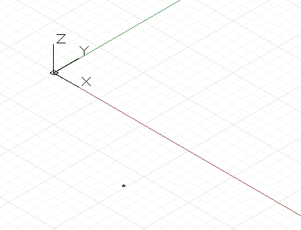
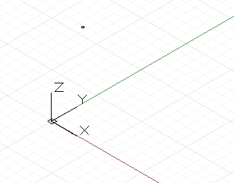
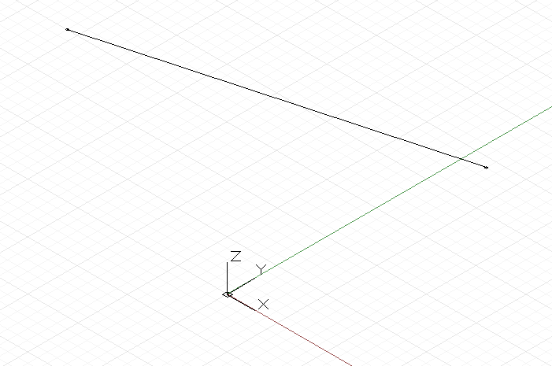
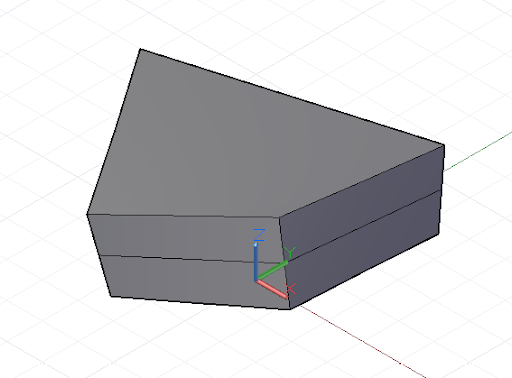

# DesignScript 几何体基础知识

Dynamo 标准几何体库中最简单的几何对象是一个点。所有几何体均使用称为构造函数的特殊函数创建，每个函数都返回该特定几何体类型的新实例。在 Dynamo 中，构造函数以对象类型的名称（在本例中为“Point”）开始，然后是构造方法。要创建由 x、y 和 z 笛卡尔坐标指定的三维点，请使用 *ByCoordinates* 构造函数：



```js
// create a point with the following x, y, and z
// coordinates:
x = 10;
y = 2.5;
z = -6;

p = Point.ByCoordinates(x, y, z);
```

Dynamo 中的构造函数通常使用前缀为“*By*”指定，调用这些函数将返回该类型的新创建对象。此新创建的对象存储在等号左侧命名的变量中。

大多数对象都有许多不同的构造函数，我们可以使用 *BySphericalCoordinates* 构造函数创建位于球体上的点，由球体的半径、第一个旋转角度和第二个旋转角度（以度为单位指定）指定：



```js
// create a point on a sphere with the following radius,
// theta, and phi rotation angles (specified in degrees)
radius = 5;
theta = 75.5;
phi = 120.3;
cs = CoordinateSystem.Identity();

p = Point.BySphericalCoordinates(cs, radius, theta,
phi);
```

点可用于构造更大尺寸的几何体（例如直线）。我们可以使用 *ByStartPointEndPoint* 构造函数在两点之间创建“直线”对象：



```js
// create two points:
p1 = Point.ByCoordinates(3, 10, 2);
p2 = Point.ByCoordinates(-15, 7, 0.5);

// construct a line between p1 and p2
l = Line.ByStartPointEndPoint(p1, p2);
```

同样，直线可用于创建更多维的曲面几何体，例如使用*“放样”*构造函数，该构造函数可获取一系列直线或曲线，并在它们之间内插曲面。


```js
// create points:
p1 = Point.ByCoordinates(3, 10, 2);
p2 = Point.ByCoordinates(-15, 7, 0.5);

p3 = Point.ByCoordinates(5, -3, 5);
p4 = Point.ByCoordinates(-5, -6, 2);

p5 = Point.ByCoordinates(9, -10, -2);
p6 = Point.ByCoordinates(-11, -12, -4);

// create lines:
l1 = Line.ByStartPointEndPoint(p1, p2);
l2 = Line.ByStartPointEndPoint(p3, p4);
l3 = Line.ByStartPointEndPoint(p5, p6);

// loft between cross section lines:
surf = Surface.ByLoft([l1, l2, l3]);
```

曲面也可用于创建更多维的实体几何体，例如通过按指定距离加厚曲面。许多对象都附加了函数（称为方法），程序员可以对该特定对象执行命令。所有几何体通用的方法包括*“平移”*和*“旋转”*，分别按指定的量平移（移动）和旋转几何体。曲面具有*“加厚”*方法，该方法采用单个输入，即指定曲面的新厚度的数字。



```js
p1 = Point.ByCoordinates(3, 10, 2);
p2 = Point.ByCoordinates(-15, 7, 0.5);

p3 = Point.ByCoordinates(5, -3, 5);
p4 = Point.ByCoordinates(-5, -6, 2);

l1 = Line.ByStartPointEndPoint(p1, p2);
l2 = Line.ByStartPointEndPoint(p3, p4);

surf = Surface.ByLoft([l1, l2]);

// true indicates to thicken both sides of the Surface:
solid = surf.Thicken(4.75, true);
```

*交点*命令可以从较多维的对象提取较少维的几何体。提取的较少维的几何体可以在几何体创建、提取和重建的循环过程中形成较多维几何体的基础。在本示例中，我们使用生成的实体来创建曲面，并使用曲面来创建曲线。


```js
p1 = Point.ByCoordinates(3, 10, 2);
p2 = Point.ByCoordinates(-15, 7, 0.5);

p3 = Point.ByCoordinates(5, -3, 5);
p4 = Point.ByCoordinates(-5, -6, 2);

l1 = Line.ByStartPointEndPoint(p1, p2);
l2 = Line.ByStartPointEndPoint(p3, p4);

surf = Surface.ByLoft([l1, l2]);

solid = surf.Thicken(4.75, true);

p = Plane.ByOriginNormal(Point.ByCoordinates(2, 0, 0),
    Vector.ByCoordinates(1, 1, 1));

int_surf = solid.Intersect(p);

int_line = int_surf.Intersect(Plane.ByOriginNormal(
    Point.ByCoordinates(0, 0, 0),
    Vector.ByCoordinates(1, 0, 0)));
```

