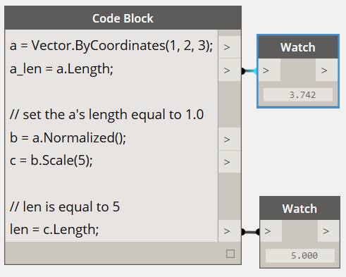

# 向量数学

计算设计中的对象很少在最终位置和形状中显式创建，并且通常基于现有几何体进行转换、旋转和定位。向量数学作为一种几何脚手架，用于提供几何体的方位和方向，以及概念化通过三维空间的移动而不是直观表示。

最基本的是，向量表示三维空间中的位置，并且通常被视为从位置 (0, 0, 0) 到该位置的箭头端点。可以使用 *ByCoordinates* 构造函数创建向量，获取新创建的向量对象的 x、y 和 z 位置。请注意，向量对象不是几何对象，且不显示在 Dynamo 窗口中。但是，有关新创建或修改的向量的信息可以在控制台窗口中打印：


```
// construct a Vector object
v = Vector.ByCoordinates(1, 2, 3);

s = v.X + " " + v.Y + " " + v.Z;
```

在向量对象上定义一组数学运算，可允许您在三维空间中添加、减去、相乘和移动对象，就像在数字行上的一维空间中移动实数一样。

向量相加定义为两个向量的分量之和，如果两个分量向量箭头按“尖端到尾部”放置，则可以将向量相加定义为结果向量。向量相加是使用 *Add* 方法执行的，并由左侧的图表表示。


```
a = Vector.ByCoordinates(5, 5, 0);
b = Vector.ByCoordinates(4, 1, 0);

// c has value x = 9, y = 6, z = 0
c = a.Add(b);
```

同样，可以使用 *Subtract* 方法将两个向量对象相互减去。可以将向量相减看作从第一个向量到第二个向量的方向。


```
a = Vector.ByCoordinates(5, 5, 0);
b = Vector.ByCoordinates(4, 1, 0);

// c has value x = 1, y = 4, z = 0
c = a.Subtract(b);
```

向量相乘可以看作是按给定比例因子在向量自身方向移动向量的端点。


```
a = Vector.ByCoordinates(4, 4, 0);

// c has value x = 20, y = 20, z = 0
c = a.Scale(5);
```

在缩放向量时，通常需要使结果向量的长度与缩放量完全相等。通过首先标准化向量，即将向量的长度精确设置为一，可以轻松实现该目的。



```
a = Vector.ByCoordinates(1, 2, 3);
a_len = a.Length;

// set the a's length equal to 1.0
b = a.Normalized();
c = b.Scale(5);

// len is equal to 5
len = c.Length;
```

c 仍指向与 a (1, 2, 3) 相同的方向，虽然现在它的长度完全等于 5。

向量数学中还存在两种其他方法，它们与一维数学、叉积和点积不完全平行。叉积是生成向量的一种方法，该向量（在 90 度）与两个现有向量正交。例如，x 轴和 y 轴的叉积为 z 轴，尽管这两个输入向量不需要相互正交。使用 *Cross* 方法计算叉积向量。


```
a = Vector.ByCoordinates(1, 0, 1);
b = Vector.ByCoordinates(0, 1, 1);

// c has value x = -1, y = -1, z = 1
c = a.Cross(b);
```

另外，某些向量数学的更高级函数是点积。两个向量之间的点积是一个实数（不是向量对象），它与两个向量之间的角度相关，但并不完全相关。点积的一个有用属性是，仅当两个向量垂直时，它们之间的点积将为 0。点积使用 *Dot* 方法计算。


```
a = Vector.ByCoordinates(1, 2, 1);
b = Vector.ByCoordinates(5, -8, 4);

// d has value -7
d = a.Dot(b);
```

