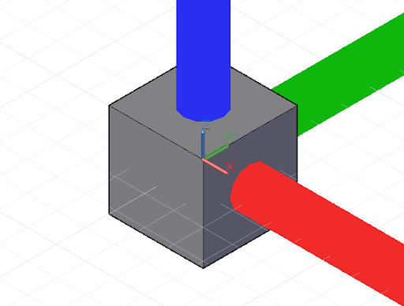

# 平移、旋转和其他变换

通过在三维空间中明确指出 x、y 和 z 坐标，可以创建特定的几何体对象。但是，通常在对象本身或其基本 CoordinateSystem 上使用几何变换将几何体移动到其最终位置。

最简单的几何变换是平移，可在 x、y 和 z 方向上将对象移动指定的单位数。


```js
// create a point at x = 1, y = 2, z = 3
p = Point.ByCoordinates(1, 2, 3);

// translate the point 10 units in the x direction,
// -20 in y, and 50 in z
// p2’s new position is x = 11, y = -18, z = 53
p2 = p.Translate(10, -20, 50);
```

虽然 Dynamo 中的所有对象均可通过在对象名称末尾附加 *.Translate* 方法进行转换，但更复杂的变换需要将对象从一个基础坐标系变换到新坐标系。例如，要绕 x 轴将对象旋转 45 度，我们将对象从其现有 CoordinateSystem（不旋转）变换为 CoordinateSystem（已使用 *.Transform* 方法绕 x 轴旋转 45 度）：


```js
cube = Cuboid.ByLengths(CoordinateSystem.Identity(),
    10, 10, 10);

new_cs = CoordinateSystem.Identity();
new_cs2 = new_cs.Rotate(Point.ByCoordinates(0, 0),
    Vector.ByCoordinates(1,0,0.5), 25);

// get the existing coordinate system of the cube
old_cs = CoordinateSystem.Identity();

cube2 = cube.Transform(old_cs, new_cs2);
```

除了平移和旋转外，还可以缩放或剪切 CoordinateSystems。可以使用 *.Scale* 方法缩放 CoordinateSystem：



```js
cube = Cuboid.ByLengths(CoordinateSystem.Identity(),
    10, 10, 10);

new_cs = CoordinateSystem.Identity();
new_cs2 = new_cs.Scale(20);

old_cs = CoordinateSystem.Identity();

cube2 = cube.Transform(old_cs, new_cs2);
```

通过将非正交向量输入 CoordinateSystem 构造函数，可以创建剪切的 CoordinateSystem。


```js
new_cs = CoordinateSystem.ByOriginVectors(
    Point.ByCoordinates(0, 0, 0),
	Vector.ByCoordinates(-1, -1, 1),
	Vector.ByCoordinates(-0.4, 0, 0));

old_cs = CoordinateSystem.Identity();

cube = Cuboid.ByLengths(CoordinateSystem.Identity(), 
    5, 5, 5);

new_curves = cube.Transform(old_cs, new_cs);
```

缩放和剪切是比旋转和平移更复杂的几何变换，因此并非每个 Dynamo 对象都能进行这些变换。下表概述了 Dynamo 对象可以具有非统一比例缩放的 CoordinateSystems 和剪切的 CoordinateSystems。

|类|非统一比例缩放的 CoordinateSystem|剪切的 CoordinateSystem|
| -- | -- | -- |
|弧|否|否|
|Nurbs 曲线|是|是|
|Nurbs 曲面|否|否|
|圆|否|否|
|直线|是|是|
|平面|否|否|
|点|是|是|
|多边形|否|否|
|实体|否|否|
|曲面|否|否|
|文本|否|否|

