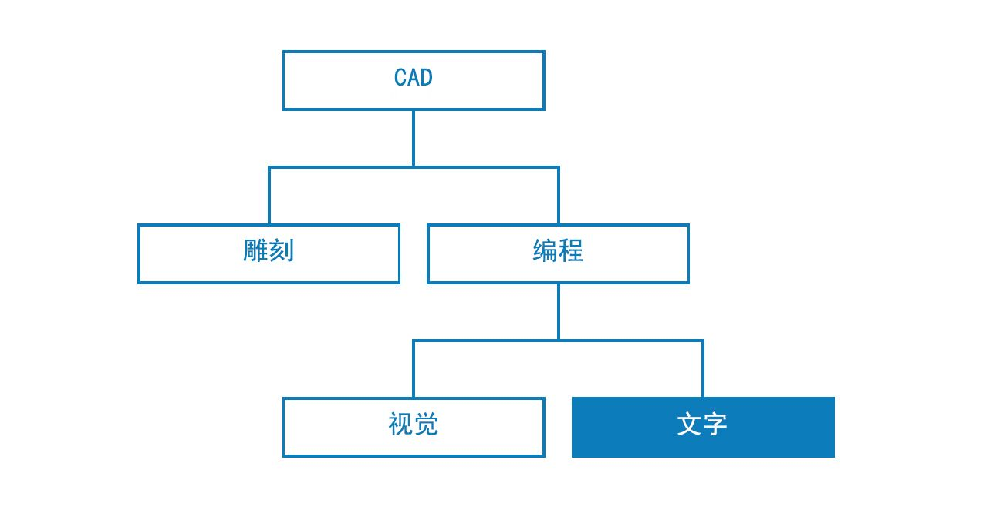

## 脚本编写策略

可视化脚本编写环境中基于文本的脚本编写支持使用 DesignScript、Python 和 ZeroTouch (C#) 实现功能强大的可视化关系。用户可以显示输入滑块等图元，将大型操作压缩为 DesignScript，以及通过 Python 或 C＃ 访问功能强大的工具和库，所有这些操作都可在同一工作空间内进行。在有效管理的情况下，结合使用这些策略可以将大量自定义、清晰和高效提供给整个程序。以下是一组准则，可帮助您用文本脚本来增强可视化脚本。



### 了解何时编写脚本

文本脚本编写可建立比可视化编程复杂度更高的关系，但其功能也会明显重叠。这很有意义，因为节点实际上是预打包的代码，我们可能会采用 DesignScript 或 Python 编写整个 Dynamo 程序。但是，我们使用可视化脚本编写，因为节点和线的接口会创建直观的图形信息流。了解文本脚本编写的功能在哪些方面超出可视化脚本编写，这将向您提供应在何时使用它的重大提示，从而不会放弃节点和线的直觉本质。以下是有关何时编辑脚本以及要使用语言的准则。

**文本脚本编写用于：**

* 循环

* 递归

* 访问外部库

**选择语言：**

|   |循环|递归|压缩节点|扩展名 库|简写|
| -- | -- |
|**DesignScript**|是|是|是|否|是|
|**Python**|是|是|部分|是|否|
|**ZeroTouch (C#)**|否|否|否|是|否|

> 有关每个 Dynamo 库提供的访问内容的列表，请参见[脚本编写参照](http://primer.dynamobim.org/en/12_Best-Practice/12-3_Scripting-Reference.html)。

### 以参数化方式考虑

在不可避免的参数化环境 Dynamo 中编写脚本时，明智的做法是相对于将要驻留的节点和线框架来构建代码。考虑使用包含文本脚本的节点，就像它是程序中具有几个特定输入、函数和预期输出的任何其他节点一样。这会立即为节点内的代码提供一小组在其中起作用的变量（这是干净参数系统的关键）。以下是一些将代码更好地集成到可视化程序中的准则。

**标识外部变量：**

* 尝试确定设计问题中的给定参数，以便可以构造直接基于该数据构建的模型。

* 编写代码之前，请标识变量：

  * 最少的一组输入

  * 预期输出

  * 常数


> 编写代码之前已建立多个变量。
>
> 1. 我们将模拟降雨所基于的曲面。
>2. 我们想要的雨滴（代理）数。
>3. 我们想让雨滴跑多远。
>4. 在降低最陡路径与遍历曲面之间切换。
>5. 具有相应数量输入的 Python 节点。
>6. 用于使返回的曲线变为蓝色的代码块。

**设计内部关系：**

* 参数化允许编辑某些参数或变量，以便操纵或改变表达式或系统的最终结果。

* 只要脚本中的实体在逻辑上相关，就应将它们定义为彼此的函数。这样，当修改一个实体时，另一个实体可以相应更新。

* 通过仅显示关键参数来最大程度减少输入数量：

  * 如果可以从更多父参数派生一组参数，则仅将父参数公开为脚本输入。通过降低脚本接口的复杂性，从而提高脚本的可用性。


> [Python 节点](http://primer.dynamobim.org/en/09_Custom-Nodes/9-4_Python.html)中的示例代码“模块”。

> 1. 输入。
> 2. 脚本内部变量。
> 3. 使用这些输入和变量执行其函数的循环。

> 技巧：与解决方案一样，应尽可能重视过程。

**不要自我重复（DRY 原则）：**

* 当有多种方法用于在脚本中表达同一内容时，有时重复的表示形式将无法进行同步，这可能导致维护困难、分解不良和内部矛盾。

* DRY 原则表述为“系统中的每条知识都必须具有单一、明确、权威的表示形式”：

  * 成功应用该原则后，脚本中的所有相关图元都会以可预测的方式统一更改，并且所有不相关的图元彼此之间不会产生逻辑上的后果。

```
### BAD
for i in range(4):
for j in range(4):
point = Point.ByCoordinates(3*i, 3*j, 0)
points.append(point)
```

```
### GOOD
count = IN[0]
pDist = IN[1]

for i in range(count):
for j in range(count):
point = Point.ByCoordinates(pDist*i, pDist*j, 0)
points.append(point)
```

> 技巧：在脚本中复制实体（如上例中的常量）之前，请问自己是否可以改为链接到源。

### 结构模块化

随着代码变得越来越长，越来越复杂，“大创意”或总体算法变得越来越难以辨认。此外，在跟踪具体内容发生的情况（和地点）、在出错时发现 Bug、集成其他代码以及分配开发任务方面也变得更加困难。为了避免出现这些麻烦，明智的做法是以模块形式编写代码，这是一种根据代码所执行任务将代码分解的组织策略。以下是一些通过模块化方式使脚本更易于管理的一些技巧。

**以模块形式编写代码：**

* “模块”是执行特定任务的一组代码，类似于工作空间中的“Dynamo 节点”。

* 这可以是应与相邻代码（函数、类、一组输入或要输入的库）在视觉上分开的任何内容。

* 以模块形式开发代码可利用节点的可视化直观质量以及只有文本脚本编写才能实现的复杂关系。


> 这些循环调用我们将在练习中开发的名为“agent”的类。

> 1. 定义每个代理的起点的代码模块。
> 2. 更新代理的代码模块。
> 3. 为代理的路径绘制轨迹的代码模块。

**发现代码重用：**

* 如果发现代码在多个位置执行相同（或非常相似）的操作，请找到将该代码聚类为可调用函数的方法。

* “Manager”函数控制程序流，并且主要包含对处理底层细节（如在结构之间移动数据）的“Worker”函数的调用。


> 本示例根据中心点的 Z 值创建具有半径和颜色的球体。

> 1. 两个“worker”父函数：根据中心点的 Z 值创建具有半径和颜色颜色的球体。
> 2. 合并两个“worker”函数的“manager”父函数。调用此函数将调用其中的两个函数。

**仅显示需要查看的内容：**

* 模块接口表示该模块所提供和需要的图元。

* 在已定义单元之间的接口后，即可分别对每个单元进行详细设计。

**可分离性/可替换性：**

* 模块之间彼此不了解，也互不关心。

**模块化的常规形式：**

* 代码分组：

```
# IMPORT LIBRARIES
import random
import math
import clr
clr.AddReference('ProtoGeometry')
from Autodesk.DesignScript.Geometry import *

# DEFINE PARAMETER INPUTS
surfIn = IN[0]
maxSteps = IN[1]
```

* 函数：

```
def get_step_size():
area = surfIn.Area
stepSize = math.sqrt(area)/100
return stepSize

stepSize = get_step_size()
```

* 类：

```
class MyClass:
i = 12345

def f(self):
return 'hello world'

numbers = MyClass.i
greeting = MyClass.f
```

### 连续调整

在 Dynamo 中开发文本脚本时，明智的做法是不断确保实际创建的内容符合您的预期。这将确保不可预见的事件（语法错误、逻辑差异、值不准确、异常输出等）在出现时即被迅速发现并进行处理，而不是在结束时立即全部处理。由于文本脚本位于画布上的节点内，因此它们已集成到可视化程序的数据流中。这使得对脚本的连续监视变得很简单，只需指定要输出的数据、运行程序以及使用“观察节点”评估从脚本流出的内容。以下是一些在构建脚本时不断检查脚本的技巧。

**随手测试：**

* 每当完成一组功能时：

  * 返回并检查代码。

  * 非常重要。协作者是否能够了解这样做的目的？我需要这样做吗？是否可以更高效地执行此函数？我是否在创建不必要的重复项或从属关系？

  * 快速测试以确保返回的数据“有意义”。

* 将正在脚本中使用的最新数据指定为输出，以便在脚本更新时节点始终输出相关数据：


> 调整 [Python 节点](http://primer.dynamobim.org/en/09_Custom-Nodes/9-4_Python.html)中的示例代码。

> 1. 检查实体的所有边是否都将作为曲线返回，以围绕其创建边界框。
> 2. 检查“Count”输入是否成功转换为“Ranges”。
> 3. 检查坐标系是否已在此循环中正确转换和旋转。

**预测“边缘情况”：**

* 在编写脚本时，将输入参数故意指定为其分配域的最小值和最大值，以检查程序在极端条件下是否仍能正常运行。

* 即使程序在其极端条件下正常运行，也应检查它是否会返回意外的 Null 值/空值/零值。

* 有时，暴露脚本的一些潜在问题的 Bug 和错误仅在这些边缘情况下才会出现。

  * 了解导致出现错误的原因，然后确定是需要进行内部修复还是需要重新定义参数域，来避免出现该问题。

> 技巧：始终假定用户将使用已呈现给他/她的每个输入值的每种组合。这将有助于消除意外情况。

### 高效调试

调试是从脚本中消除“Bug”的过程。Bug 可能是错误、效率低下、不准确或任何意外结果。解决 Bug 可能非常简单，只需更正拼写错误的变量名即可解决脚本中普遍存在的结构性问题。理想情况下，在构建脚本时对其进行调整将有助于及早发现这些潜在问题，尽管不能保证该脚本中没有 Bug。以下是对上述几种最佳实践的回顾，以帮助您系统地解决 Bug。

**使用观察气泡：**

* 通过将它指定给 OUT 变量（类似于调整程序的概念），来检查代码中不同位置返回的数据。

**编写有意义的注释：**

* 如果清楚地描述了代码模块的预期结果，则可以更加轻松地进行调试。

```
# Loop through X and Y
for i in range(xCount):
for j in range(yCount):

# Rotate and translate the coordinate system
toCoord = fromCoord.Rotate(solid.ContextCoordinateSystem.Origin,Vector.ByCoordinates(0,0,1),(90*(i+j%seed)))
vec = Vector.ByCoordinates((xDist*i),(yDist*j),0)
toCoord = toCoord.Translate(vec)

# Transform the solid from the source coord system to the target coord system and append to the list
solids.append(solid.Transform(fromCoord,toCoord))
```

> 通常，这会造成过多的注释行和空行，但在调试时，它有助于将内容分解为可管理的各部分。

**利用代码的模块化：**

* 问题的根源可以隔离到特定模块。

* 确定故障模块后，修复问题相当简单。

* 当必须修改程序时，则以模块形式开发的代码将更容易更改：

  * 可以将新模块或已调试模块插入到现有程序中，同时确保程序的其余部分不会更改。


> 调试 [Python 节点](http://primer.dynamobim.org/en/09_Custom-Nodes/9-4_Python.html)中的示例代码。

> 1. 正如我们可以通过将 xDist 和 yDist 指定给 OUT 后所看到的那样，输入几何图元返回的边界框大于自身的大小。
> 2. 输入几何图元的边曲线返回一个适当的边界框，该边界框具有 xDist 和 yDist 的正确距离。
> 3. 我们插入的“模块”代码可解决 xDist 和 yDist 的值问题。

### 练习 - 最陡路径

> 下载本练习随附的示例文件（单击鼠标右键，然后单击“将链接另存为...”）。可以在附录中找到示例文件的完整列表。[SteepestPath.dyn](datasets/13-1/SteepestPath.dyn)

考虑到我们的文本脚本编写的最佳实践，让我们来编写一个下雨模拟脚本。尽管我们能够以“图形策略”将最佳实践应用于杂乱无章的可视化编程，但使用文本脚本编写更难以做到这一点。采用文本脚本编写建立的逻辑关系不太明显，并且几乎不可能在杂乱的代码中解开。借助文本脚本编写的强大功能，可以采用组织形式承担更大责任。我们将逐步完成每个步骤，并沿用最佳实践。


> 我们的脚本已应用于吸引器变形的曲面。

首先，我们需要输入必要的 Dynamo 库。首先执行此操作将在 Python 中提供对 Dynamo 功能的全局访问。


> 我们打算使用的所有库都需要在此处输入。

接下来，我们需要定义脚本的输入和输出，这些将在节点上显示为输入端口。这些外部输入是脚本的基础，也是建立参数化环境的关键。


> 我们需要定义与 Python 脚本中的变量对应的输入，并确定所需的输出：
>
> 1. 我们要漫游的曲面。
> 2. 我们要走的代理数。
> 3. 允许代理采取的最大步数。
> 4. 沿曲面走最短路径或对其进行遍历的选项。
> 5. 具有与脚本中的输入相对应的输入标识符（IN[0]、IN[1]）的 Python 节点。
> 6. 可以用不同颜色显示的输出曲线。

现在，让我们采用模块化的做法，并创建脚本的主体。对于多个起点，沿曲面模拟最短路径是一项艰巨任务，这需要多个函数。与其在整个脚本中调用不同的函数，不如通过将这些函数收集到一个类（即我们的代理）中来对代码进行模块化。此类或“模块”的不同函数可以使用不同变量调用，甚至可以在其他脚本中重用。


> 我们将需要为代理定义一个类或蓝图，以便代理每走一步时都选择沿尽可能陡峭的方向行进，从而漫游曲面：
> 
> 1. 名称。
> 2. 所有代理共享的全局属性。
> 3. 每个代理特有的实例属性。
> 4. 用于执行步骤的函数。
> 5. 用于将每步的位置分类到轨迹列表的函数。

让我们通过定义代理的起始位置来初始化代理。这是调整脚本并确保代理类正常工作的好机会。


> 我们将需要实例化要观察漫游曲面的所有代理，并定义其初始属性：
> 
> 1. 一个新的空轨迹列表。
> 2. 它们将在曲面上开始其旅程的位置。
> 3. 我们已将代理列表指定为输出，以检查脚本在此处返回的内容。返回的代理数目正确，但是稍后我们需要再次调整脚本以验证其返回的几何图元。

每一步都更新每个代理。


> 然后，我们需要进入一个嵌套循环，在该循环中，针对每个代理和每一步，我们更新其位置并记录到其轨迹列表中。在每一步，我们还将确保代理尚未到达曲面上无法采取其他步骤（即允许代理下降）的点。如果满足该条件，我们将结束该代理的行程。

现在，我们的代理已完全更新，让我们返回代表它们的几何图元。


> 在所有代理达到其下降限制或最大步数后，我们将创建一条贯穿其轨迹列表中点的复合线并输出复合线轨迹。

我们的脚本用于查找最陡路径。


> 1. 预设在基础曲面上模拟降雨。
> 2. 可以切换代理以遍历基础曲面，而不是查找最陡路径。


> 完整的 Python 文本脚本。

