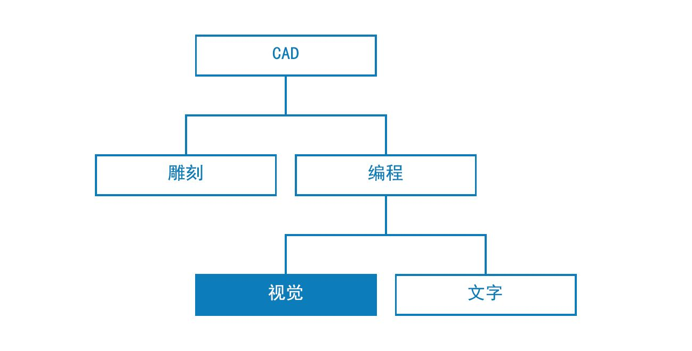
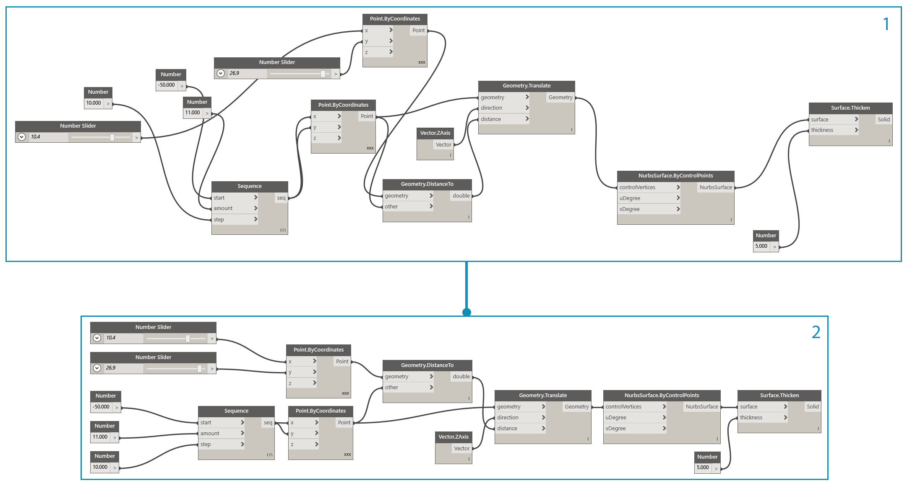
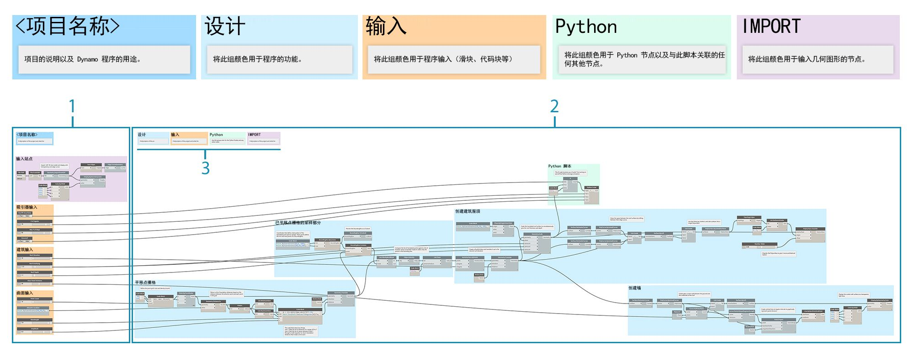

## 图形策略

在本章之前，入门手册介绍了如何实现 Dynamo 的强大可视化脚本编写功能。充分了解这些功能是构建健壮可视化程序的坚实基础和第一步。我们在现场使用可视化程序、与同事共享这些程序、排除错误或测试限制时，我们还要处理其他问题。如果其他人将使用您的程序，或者您希望从现在开始六个月内打开它，则它需要具有直观的图形和清晰的逻辑。Dynamo 有许多工具用于管理程序的复杂性，本章将提供有关何时使用它们的指南。

### 降低复杂性

在开发 Dynamo 图形和测试想法时，它的大小和复杂性会迅速增加。尽管创建一个正常运行的程序很重要，但尽可能简单地实现它也同样重要。您的图形不但将运行得更快且更可预测，而且您和其他用户将在以后了解其逻辑。以下是几种可以帮助您阐明图形逻辑的方法。

#### 使用组模块化

* 组使您在构建程序时可以**创建功能上不同的各部分**
* 组使您可以**移动程序的大部分内容**，同时保持模块化和对齐
* 可以更改**组的颜色以区分**组的功能（输入与函数）
* 可以使用组来开始**组织图形以简化“自定义节点”创建**

> 本程序中的颜色标识了每个组的用途。此策略可用于在您开发的任何图形标准或模板中创建层次结构。

> 1. “函数”组（蓝色）
2. “输入”组（橙色）
3. “脚本”组（绿色）
> 有关如何使用组的信息，请参见[管理程序](http://primer.dynamobim.org/en/03_Anatomy-of-a-Dynamo-Definition/3-4_best_practices.html)。

#### 使用代码块高效开发

* 有时，可以使用代码块**键入数字或节点方法，速度比搜索快**（Point.ByCoordinates、Number、String、Formula）

* 代码块在**您要在 DesignScript 中定义自定义函数以减少图形中的节点数量**时非常有用

> 1 和 2 执行相同的函数。与分别搜索并添加每个节点相比，编写几行代码要快得多。代码块也更加简洁。

> 1. 以代码块形式编写的设计脚本
2. 节点中的等效程序
> 有关如何使用代码块的信息，请参见[什么是代码块](http://primer.dynamobim.org/en/07_Code-Block/7-1_what-is-a-code-block.html)。

#### 使用“节点到代码”压缩

* 可以**通过使用“节点到代码”降低图形的复杂性**，这将采用一组简单节点并将其相应 DesignScript 写入单个代码块。
* “节点到代码”可以**压缩代码，而不会消除程序的清晰度**
* 以下是使用“节点到代码”的**优点**：
* 轻松将代码压缩到一个仍可编辑的组件中
* 可以简化图形的重要部分
* 在“迷你程序”不经常被编辑时非常有用
* 对于合并其他代码块功能（如函数）非常有用

* 以下是使用“节点到代码”的**缺点**：
* 通用命名会降低易读性
* 其他用户难以理解
* 无法轻松返回到可视化编程版本

> 1. 现有程序
2. 基于“节点到代码”创建的代码块
> 有关如何使用“节点到代码”的信息，请参见[设计脚本语法](http://primer.dynamobim.org/en/07_Code-Block/7-2_Design-Script-syntax.html)。

#### 使用 List@Level 灵活访问数据

* 使用 List@Level 可以通过替换 List.Map 和 List.Combine 节点**降低图形的复杂性**，这可能会占用大量画布空间
* List@Level 通过允许您从节点的输入端口访问列表中任何级别的数据，从而向您提供一种**快于 List.Map/List.Combine 的方法来构建节点逻辑**

> 我们可以通过为 CountTrue 的“列表”输入激活 List@Level，来验证 BoundingBox.Contains 返回的 True 值数以及具体列表。List@Level 允许用户确定输入从哪个级别获取数据。与其他涉及 List.Map 和 List.Combine 的方法相比，使用 List@Level 灵活、高效并且强烈建议采用。

> 1. 计算列表级别 2 的 True 值
2. 计算列表级别 3 的 True 值
> 有关如何使用 List@Level 的信息，请参见[列表的列表](http://primer.dynamobim.org/en/06_Designing-with-Lists/6-3_lists-of-lists.html#list@level)。

### 保持可读性

除了使图形尽可能简单且高效之外，还要努力实现图形清晰。尽管您极力通过逻辑分组使图形直观，但关系可能并不容易显现。在组内简单注释或重命名滑块可以让您或其他用户不必经历不必要的混淆或无需在图形上平移。以下是几种可以帮助您在图形内和图形之间应用图形一致性的方法。

#### 节点对齐的视觉连续性

* 为了在完成构建图形后减少工作量，应尝试通过**经常并在构建时对齐节点**来确保节点布局清晰可辩
* 如果其他人将要使用您的图形，则应**确保“节点-线”布局在发布之前轻松流动**
* 为了帮助您进行对齐，请**使用“清理节点布局”功能自动对齐**您的图形，尽管不如您自己做的精确

> 1. 未组织的图形
2. 对齐的图形
> 有关如何使用“节点对齐”的信息，请参见[管理程序](http://primer.dynamobim.org/en/03_Anatomy-of-a-Dynamo-Definition/3-4_best_practices.html)。

#### 通过重命名进行描述性标记

* 重命名输入有助于其他人轻松了解您的图形，**尤其是当他们插入的内容将离屏时**
* **请谨慎重命名输入以外的节点。**除此之外，还可以基于节点群集创建自定义节点并重命名该节点；显而易见，它包含其他内容

> 1. 曲面操纵的输入
2. 建筑参数的输入
3. 排水模拟脚本的输入
> 要重命名某个节点，请在其名称上单击鼠标右键并选择“重命名节点...”。

#### 使用注释说明

* 如果**图形中的某些内容需要节点无法表达的简单语言说明**，则应添加注释
* 如果**一组节点或一个组太大或太复杂且无法轻松理解**，则应添加注释

> 1. 描述程序中返回原始平移距离的部分的注释
2. 描述将这些值映射到正弦波的代码的注释
> 有关如何添加注释的信息，请参见[管理程序](http://primer.dynamobim.org/en/03_Anatomy-of-a-Dynamo-Definition/3-4_best_practices.html)。

### 连续调整

构建可视化脚本时，请务必验证返回的内容是否符合您的预期。并非所有错误或问题都会导致程序立即停止运行，尤其是可能影响远距下游内容的 Null 值或零值。在[脚本编写策略](http://primer.dynamobim.org/en/12_Best-Practice/13-2_Scripting-Strategies.html)中的文本脚本编写上下文中也讨论了此策略。以下练习有助于确保获得预期的效果。

#### 使用“观察”和“预览”气泡监视数据

* 构建程序时使用“观察”或“预览”气泡，来**验证关键输出返回预期内容**

> “观察”节点用于比较：

> 1. 原始平移距离
2. 通过正弦方程传递的值
> 有关如何使用“观察”的信息，请参见[库](http://primer.dynamobim.org/en/03_Anatomy-of-a-Dynamo-Definition/3-2_dynamo_libraries.html)。

### 确保可重用性

很可能会有其他人在某个时候打开您的程序，即使您独立工作也无法避免。他们应该能够通过程序的输入和输出，快速了解该程序所需的内容和生成的结果。在开发要与 Dynamo 社区共享并用于其他人的程序的自定义节点时，这一点尤为重要。这些练习有助于生成健壮的可重用程序和节点。

#### 管理 I/O

* 为了确保可读性和可扩展性，应尝试**尽可能最大程度地减少输入和输出**
* 在即使将一个节点添加到画布之前，也应尝试**为将如何构建逻辑制定策略，方法是先创建逻辑可能如何工作的粗略概要**。在开发粗略概要时，应跟踪脚本中将出现哪些输入和输出。

#### 使用预设嵌入输入值

* 如果有**要嵌入到图形中的特定选项或条件**，则应使用预设进行快速访问
* 还可以使用预设来**通过缓存特定滑块值降低复杂性**（在长运行时间的图形中）

> 有关如何使用预设的信息，请参见[使用预设管理数据](http://primer.dynamobim.org/en/03_Anatomy-of-a-Dynamo-Definition/3-5_presets.html)。

#### 包含具有自定义节点的程序

* 如果**程序可以收集到单个容器中**，则应使用自定义节点
* **当图形的某一部分将经常在其他程序中重复使用时**，应使用自定义节点
* 如果要**与 Dynamo 社区共享功能**，则应使用自定义节点

> 将点平移程序收集到自定义节点，会使健壮的独特程序可移植且更易于理解。命名良好的输入端口将有助于其他用户了解如何使用该节点。请记住为每个输入添加描述和所需的数据类型。

> 1. 现有吸引器程序
2. 收集此程序的自定义节点 PointGrid
> 有关如何使用自定义节点的信息，请参见[自定义节点简介](http://primer.dynamobim.org/en/09_Custom-Nodes/9-1_Introduction.html)。

#### 构建模板

* 可以构建模板以**在整个可视化图形中建立图形标准，以确保协作者能够以标准化方式了解图形**
* 构建模板时，可以标准化**组颜色和字体大小**，以对工作流或数据操作的类型进行分类。
* 构建模板时，甚至可以标准化您希望如何对图形中**前端和后端工作流之间的差异进行标注、上色或设计样式**。

> 1. 程序的 UI 或前端包括项目名称、输入滑块和输入几何图形。
2. 程序的后端。
3. 分组颜色类别（常规设计、输入、Python 脚本、输入的几何图形）。

### 练习 - 建筑屋顶

> 下载本练习随附的示例文件（单击鼠标右键，然后单击“将链接另存为...”）。可以在附录中找到示例文件的完整列表。[RoofDrainageSim.zip](datasets/13-2/RoofDrainageSim.zip)

现在，我们已经建立了几种最佳实践，让我们将它们应用于快速组合在一起的程序中。尽管该程序成功生成了屋顶，但图形的状态是作者的“思维导图”。它缺少任何组织或使用说明。我们将通过最佳实践来组织、描述和分析该程序，以便其他用户可以了解如何使用它。

> 程序运行正常，但图形混乱。

让我们先确定程序返回的数据和几何图形。

> 了解何时对数据进行重大更改对于建立逻辑划分或模块化至关重要。尝试使用“观察”节点检查程序的其余部分，以查看在继续进行下一步之前是否可以确定组。

> 1. 此带有数学方程的代码块看起来像是程序的关键部分。“观察”节点显示它正在返回平移距离列表。
2. 该区域的用途并不明显。来自 BoundingBox.Contains 的列表级别 L2 的 True 值排列以及 List.FilterByBoolMask 的存在表明，我们要对点栅格的一部分进行采样。

在了解程序的基本部分后，让我们将它们放入组中。

> 组允许用户直观地区分程序的各个部分。

> 1. 输入三维场地模型
2. 基于正弦方程平移点栅格
3. 点栅格的采样部分
4. 创建建筑屋顶曲面
5. 创建玻璃幕墙

建立组后，对齐节点以在整个图上创建视觉连续性。

> 视觉连续性有助于用户查看程序流和节点之间的隐式关系。

通过添加另一图形改进层，使程序更易于访问。添加注释以描述程序的特定区域如何工作、为输入提供自定义名称以及为不同类型的组指定颜色。

> 这些图形改进会告诉用户有关程序正在执行的操作的更多信息。不同的组颜色有助于区分输入和函数。

> 1. 说明
2. 带有描述性名称的输入

在开始压缩程序之前，让我们找到一个战略位置来介绍 Python 脚本排水模拟器。将第一个缩放屋顶曲面的输出插入相应的脚本输入。

> 我们选择此时将脚本集成到程序中，以便可以在原始的单屋顶曲面上运行排水模拟。该特定曲面不会被预览，但它让我们无需选择倒角的 Polysurface 的顶面。

> 1. 脚本输入的源几何图形
2. Python 节点
3. 输入滑块
4. 开/关“开关”

现在一切就绪，让我们简化图形。

> 使用“节点到代码”和“自定义节点”压缩我们的程序，大大减小了图形的大小。创建屋顶曲面和墙的组已转换为代码，因为它们非常特定于此程序。点平移组包含在自定义节点中，因为它用于其他程序。在示例文件中，基于平移点组创建您自己的自定义节点。

> 1. “自定义节点”用于包含“平移点栅格”组
2. “节点到代码”用于压缩“创建建筑屋顶曲面和幕墙”组

最后一步，为示例性屋顶成型创建预设。

> 这些输入是屋顶成型的主要驱动力，将帮助用户发现程序的潜力。

我们的程序具有两个预设的视图。

> 屋顶排水模式为用户提供了各个预设的分析视图。

