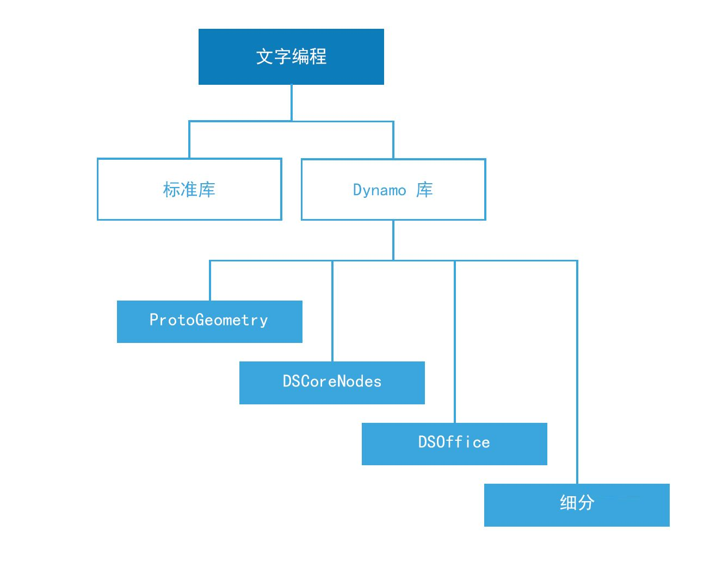

## 脚本参考

本参考页面扩展了脚本编写策略中涵盖的最佳实践，并对代码库、标签和样式进行了更加详细的介绍。我们将使用 Python 说明下面的概念，但相同原则在 Python 和 C#(Zerotouch) 中适用，语法却不同。

### 要使用的库

标准库位于 Dynamo 外部，并以编程语言 Python 和 C# (Zerotouch) 呈现。Dynamo 还有自己的库集，这些库直接对应于其节点层次结构，使用户能够使用代码构建可以由节点和线生成的任何内容。下面介绍了每个 Dynamo 库对哪些内容提供的访问以及何时使用标准库。



**标准库和 Dynamo 库**

* Python 和 C# 的标准库可用于在 Dynamo 环境中构建高级数据和流结构。
* Dynamo 库直接对应于节点层次结构，用于创建几何图形和其他 Dynamo 对象。

**Dynamo 库**

* ProtoGeometry
  * 功能：圆弧、边界框、圆、圆锥体、坐标系、立方体、曲线、圆柱体、边、椭圆、椭圆弧、面、几何图形、螺旋、索引组、线、网格、Nurbs 曲线、Nurbs 曲面、平面、点、多边形、矩形、实体、球体、曲面、拓扑、T 样条曲线、UV、向量、顶点。
  * 如何输入：```import Autodesk.DesignScript.Geometry```
  * **通过 Python 或 C# 使用 ProtoGeometry 时请注意**，正在创建的是非托管对象，这些对象需要手动对其内存进行管理 - 请参见以下部分：**非托管对象**，以了解详细信息。
* DSCoreNodes
  * 功能：颜色、二维颜色范围、日期时间、时间跨度、IO、公式、逻辑、列表、数学、四元树、字符串、线程。
  * 如何输入：```import DSCore```
* 细分
  * 功能：凸面外壳、Delaunay、Voronoi。
  * 如何输入：```import Tessellation```
* DSOffice
  * 功能：Excel。
  * 如何输入：```import DSOffice```

### 小心标记

在编写脚本时，我们会不断使用标识符来表示诸如变量、类型、函数和其他实体等内容。通过这种符号表示法，在构建算法时，我们可以通过标签（通常由字符序列组成）方便地引用信息。在编写易于他人以及您自己将来轻松阅读和理解的代码方面，命名内容也发挥着重要作用！以下是在脚本中命名内容时要牢记的一些技巧：

**可以使用缩写，但要用注释说明缩写：**

```
### BAD
csfX = 1.6
csfY= 1.3
csfZ = 1.0
```

```
### GOOD
# column scale factor (csf)
csfX = 1.6
csfY= 1.3
csfZ = 1.0
```

**避免多余标签：**

```
### BAD
import car
seat = car.CarSeat()
tire = car.CarTire()
```

```
### GOOD
import car
seat = car.Seat()
tire = car.Tire()
```

**对变量名称使用正逻辑，而不是负逻辑：**

```
### BAD
if 'mystring' not in text:
print 'not found'
else:
print 'found'
print 'processing'
```

```
### GOOD
if 'mystring' in text:
print 'found'
print 'processing'
else:
print 'not found'
```

**首选“反转符号”:**

```
### BAD
agents = …
active_agents = …
dead_agents ...
```

```
### GOOD
agents = …
agents_active = …
agents_dead = ...
```

> 从结构角度来说，这更加显得合理。

**别名应用于缩短过长且经常重复的链：**

```
### BAD
from RevitServices.Persistence import DocumentManager

DocumentManager = DM

doc = DM.Instance.CurrentDBDocument
uiapp = DM.Instance.CurrentUIApplication
```

```
### GOOD
from RevitServices.Persistence import DocumentManager as DM

doc = DM.Instance.CurrentDBDocument
uiapp = DM.Instance.CurrentUIApplication
```

> 使用别名可能会快速导致出现令人困惑且非标准程序。

**仅使用必要字词：**

```
### BAD
rotateToCoord = rotateFromCoord.Rotate(solid.ContextCoordinateSystem.Origin,Vector.ByCoordinates(0,0,1),5)
```

```
### GOOD
toCoord = fromCoord.Rotate(solid.ContextCoordinateSystem.Origin,Vector.ByCoordinates(0,0,1),5)
```

> “一切应尽可能简单，但不能为了简单而简单。”– Albert Einstein

### 样式一致

一般来说，几乎所有内容都有一种以上的编程方法，因此您“个人风格”的脚本编写是您一路上选择做出（或不做出）无数小决定的结果。也就是说，您代码的可读性和可维护性直接源于其内部一致性以及其对常规样式约定的遵循。一般来说，在两个位置看起来相同的代码的作用也应该相同。下面是用于编写清晰且一致代码的一些技巧。

**命名约定：**（为代码中每种类型的实体选择以下约定之一并坚持使用！）

* 变量、函数、方法、软件包、模块：
`lower_case_with_underscores`

* 类和例外：
`CapWords`

* 受保护的方法和内部函数：
`_single_leading_underscore(self, ...)`

* 私有方法：
`__double_leading_underscore(self, ...)`

* 常量：
`ALL_CAPS_WITH_UNDERSCORES`

> 技巧：避免使用单字母变量（尤其是 l、O、I），但在非常短的块中，当其含义从即时上下文中清晰可见时除外。

**使用空行：**

* 在顶级函数和类定义周围加上两个空行。

  * 类内部的方法定义周围加上一个空行。

  * 可以使用（谨慎）额外的空行分隔多组相关函数。

**避免使用多余空格：**

* 在圆括号、方括号或大括号内：

```
### BAD
function( apples[ 1 ], { oranges: 2 } )
```

```
### GOOD:
function(apples[1], {oranges: 2})
```

* 逗号、分号或冒号之前：

```
### BAD
if x == 2 : print x , y ; x , y = y , x
```

```
### GOOD
if x == 2: print x, y; x, y = y, x
```

* 在开始函数调用的参数列表的左括号之前：

```
### BAD
function (1)
```

```
### GOOD
function(1)
```

* 在开始索引或切片的左括号之前：

```
### BAD
dict ['key'] = list [index]
```

```
### GOOD
dict['key'] = list[index]
```

* 始终在这些二进制运算符周围的任一侧使用单字节空格：

```
assignment ( = )
augmented assignment ( += , -= etc.)
comparisons ( == , < , > , != , <> , <= , >= , in , not in , is , is not )
Booleans ( and , or , not )
```

**观察线长：**

* 请勿对其强加超过约 79 个字符。

* 限制所需的编辑器窗口宽度可以并排打开多个文件，并且使用在相邻列中显示两个版本的代码审核工具时也可以正常工作。

* 通过将表达式括在括号中，可以将长行分成多行：

**避免出现明显多余的注释：**

* 有时，注释越少，代码越可读。尤其是当它强制您改用有意义的符号名称时。

* 采用良好的编码习惯可减少对注释的依赖：

```
### BAD
# get the country code
country_code = get_country_code(address)

# if country code is US
if (country_code == 'US'):
# display the form input for state
print form_input_state()
```

```
### GOOD
# display state selection for US users
country_code = get_country_code(address)
if (country_code == 'US'):
print form_input_state()
```

> 技巧：注释告诉您原因，而代码告诉您方法。

**检出开源代码：**

* 开源项目基于众多开发人员的协作工作。这些项目需要保持高水平的代码可读性，以便团队可以尽可能高效地协同工作。因此，最好浏览这些项目的源代码，以观察这些开发人员正在进行的工作。

* 改善您的约定：

  * 询问每个约定是否符合当前的需求。

  * 功能/效率是否受到影响？

### C# (Zerotouch) 标准

**查看这些 Wiki 页面，以了解有关为 Zerotouch 编写 C# 以及有益于 Dynamo 的指南：**

  * 此 Wiki 介绍了一些用于记录和测试代码的常规编码标准：[https://github.com/DynamoDS/Dynamo/wiki/Coding-Standards](https://github.com/DynamoDS/Dynamo/wiki/Coding-Standards)

  * 此 Wiki 专门介绍了用于库、类别、节点名称、端口名称和缩写的命名标准：[https://github.com/DynamoDS/Dynamo/wiki/Naming-Standards](https://github.com/DynamoDS/Dynamo/wiki/Naming-Standards)

  **非托管对象：**

  从创建的 Python 或 C# 几何图形对象使用 Dynamo 的几何图形库 *(ProtoGeometry)* 时将不由虚拟机进行托管，将需要手动清理其中许多对象的内存。要清理本地对象或非托管对象，可以使用 **Dispose** 方法或 **using** 关键字。请参见此 Wiki 条目以了解概述：[https://github.com/DynamoDS/Dynamo/wiki/Zero-Touch-Plugin-Development#dispose--using-statement](https://github.com/DynamoDS/Dynamo/wiki/Zero-Touch-Plugin-Development#dispose--using-statement)。

  只需处理不返回到图形或存储对其参照的非托管资源。在本节的其余部分中，我们将这些对象称为*中间几何图形*。在下面的代码示例中，可以看到此类对象的示例。此零接触 C# 函数 **singleCube** 会返回单个立方体，但在其执行期间会额外创建 10000 个立方体。我们可以假定这个其他几何图形用作一些中间构造几何图形。

  **此零接触函数最有可能导致 Dynamo 崩溃。**由于我们创建了 10000 个实体，但仅存储其中的一个，并仅返回该实体。我们应该改为处理所有中间立方体，但要返回的立方体除外。我们不希望对返回的内容进行处理，因为它将传播到图形中并由其他节点使用。
  ```
public Cuboid singleCube(){

var output = Cuboid.ByLengths(1,1,1);

for(int i = 0; i<10000;i++){
output = Cuboid.ByLengths(1,1,1);
}
return output;
}
```

修复的代码将如下所示：

```
public Cuboid singleCube(){

var output = Cuboid.ByLengths(1,1,1);
var toDispose = new List<Geometry>();

for(int i = 0; i<10000;i++){
toDispose.Add(Cuboid.ByLengths(1,1,1));
}

foreach(IDisposable item in toDispose ){
item.Dispose();
}

return output;
}
```

通常，只需处理几何图形，如 ```Surfaces```、```Curves``` 和 ```Solids```。但为安全起见，可以处理所有几何图形类型（```Vectors```、```Points```、```CoordinateSystems```）。

