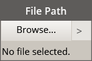
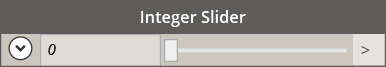
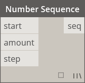
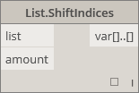
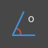
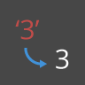
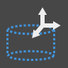
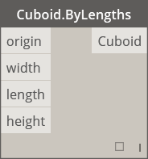
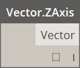

# 节点索引

##### 此索引提供有关此入门手册中使用的所有节点以及其他可能有用构件的信息。这只是对 Dynamo 中提供的 500 个节点中一部分节点的介绍。

## 内置函数

||||
| -- | -- | -- |
||**计数** 返回指定列表中的项数。||
||**展平** 返回多维输入列表的展平一维列表。||
||**Map** 将值映射到输入范围||

## 核心

#### Core.Color

||||
| -- | -- | -- |
||创建||
||**Color.ByARGB** 按 Alpha、红色、绿色和蓝色分量构造颜色。||
||**颜色范围** 基于起点颜色和终点颜色之间的颜色渐变获取颜色。||
||作用力||
||**Color.Brightness** 获取该颜色的亮度值。||
||**Color.Components** 按以下顺序列出颜色分量：Alpha、红、绿、蓝。||
||**Color.Saturation** 获取该颜色的饱和度值||
||**Color.Hue** 获取该颜色的色调值。||
||查询||
||**Color.Alpha** 查找颜色的 Alpha 分量：0 到 255。||
||**Color.Blue** 查找颜色的蓝色分量：0 到 255。||
||**Color.Green** 查找颜色的绿色分量：0 到 255。||
||**Color.Red** 查找颜色的红色分量：0 到 255。||

#### Core.Display

||||
| -- | -- | -- |
||创建||
||**Display.ByGeometryColor** 使用一种颜色显示几何图形。||

#### Core.Input

||||
| -- | -- | -- |
||作用力||
||**布尔** 在“True”和“False”之间选择。||
||**代码块** 允许直接编写 DesignScript 代码。||
||**目录路径 **允许您选择系统上的目录以获取其路径||
||**文件路径** 允许您选择系统上的文件以获取其文件名。||
||**整数滑块** 用于生成整数值的滑块。||
||**数字** 创建数字。||
||**数字滑块** 用于生成数字值的滑块。||
||**字符串** 创建字符串。||

#### Core.List

||||
| -- | -- | -- |
||创建||
||**List.Create** 基于给定输入创建一个新列表。||
||**List.Combine** 将组合器应用于两个序列中的每个元素||
||**数字范围** 按指定范围创建一系列数字。||
||**数字序列** 创建一系列数字。||
||作用力||
||**List.Chop** 将某个列表切成一组列表，其中每个列表包含给定数量的项目。||
||**List.Count** 获取存储于给定列表中的项数。||
||**List.Flatten** 按一定数量展平一列嵌套列表。||
||**List.FilterByBoolMask** 通过在单独布尔列表中查找相应索引过滤序列。||
||**List.GetItemAtIndex** 获取位于指定索引处给定列表中的项目。||
||**List.Map** 将函数应用于列表的所有元素，从而基于结果生成一个新列表。||
||**List.Reverse** 以相反顺序创建包含给定列表各项的新列表。||
||**List.ReplaceItemAtIndex** 替换位于指定索引处给定列表中的项目。||
||**List.ShiftIndices** 将列表中的索引右移给定数量||
||**List.TakeEveryNthItem** 在给定偏移后是给定值倍数的索引处提取给定列表的项。||
||**List.Transpose** 交换一列列表中的行和列。如果一些行长短不一，则 Null 值将作为占位符插入结果数组中，使其始终为矩形||

#### Core.Logic

||||
| -- | -- | -- |
||作用力||
||**If** 条件语句。检查测试输入的布尔值。如果测试输入为 True，则结果将输出 True 输入，否则结果将输出 False 输入。||

#### Core.Math

||||
| -- | -- | -- |
||作用力||
||**Math.Cos** 查找角度的余弦。||
||**Math.DegreesToRadians** 将以度为单位的角度换算为以弧度为单位的角度。||
||**Math.Pow** 求数字的指定次幂。||
||**Math.RadiansToDegrees** 将以弧度为单位的角度换算为以度为单位的角度。||
||**Math.RemapRange** 调整数字列表的范围，同时保留分布率。||
||**Math.Sin** 查找角度的正弦。||

#### Core.Object

||||
| -- | -- | -- |
||作用力||
||**Object.IsNull** 确定给定对象是否为 Null。||

#### Core.Scripting

||||
| -- | -- | -- |
||作用力||
||**公式** 计算数学公式。使用 NCalc 进行评估。请参见 [http://ncalc.codeplex.com](http://ncalc.codeplex.com)||

#### Core.String

||||
| -- | -- | -- |
||作用力||
||**String.Concat** 将多个字符串合并为单个字符串。||
||**String.Contains** 确定给定字符串是否包含给定子字符串。||
||**String.Join** 将多个字符串合并为单个字符串，在每个连接的字符串之间插入给定分隔符。||
||**String.Split** 使用由给定分隔符字符串确定的分段，将单个字符串拆分为字符串列表。||
||**String.ToNumber** 将字符串转换为整数或双精度数。||

#### Core.View

||||
| -- | -- | -- |
||作用力||
||**View.Watch** 将节点输出内容可视化。||
||**View.Watch 3D** 显示几何图形的动态预览。||

## 几何

#### Geometry.Circle

||||
| -- | -- | -- |
||创建||
||**Circle.ByCenterPointRadius** 以世界坐标系 Z 轴为法线，通过在世界坐标系 XY 平面输入圆心和半径创建圆。||
||**Circle.ByPlaneRadius** 在输入平面内以输入平面原点（根）为圆心，按给定半径创建圆。||

#### Geometry.CoordinateSystem

||||
| -- | -- | -- |
||创建||
||**CoordinateSystem.ByOrigin** 创建 CoordinateSystem，方法是使其原点位于输入点，X 和 Y 轴设置为 WCS 的 X 和 Y 轴||
||**CoordinateSystem.ByCyclindricalCoordinates** 在指定柱面坐标参数处相对于指定坐标系创建 CoordinateSystem||

#### Geometry.Cuboid

||||
| -- | -- | -- |
||创建||
||**Cuboid.ByLengths**（原点） 以输入点为中心使用特定宽度、长度和高度创建立方体。||

#### Geometry.Curve

||||
| -- | -- | -- |
||作用力||
||**Curve.Extrude**（距离） 朝法向量方向拉伸曲线。||
||**Curve.PointAtParameter** 获取 StartParameter() 和 EndParameter() 之间指定参数处曲线上的点。||

#### Geometry.Geometry

||||
| -- | -- | -- |
||作用力||
||**Geometry.DistanceTo** 获取从该几何图形到另一几何图形的距离。||
||**Geometry.Explode** 将复合或非单独图元拆分为其构件||
||**Geometry.ImportFromSAT** 输入几何图形的列表||
||**Geometry.Rotate**（基准面） 绕平面原点和法线将对象旋转指定度数。||
||**Geometry.Translate** 将任意几何图形类型按给定距离朝给定方向平移。||

#### Geometry.Line

||||
| -- | -- | -- |
||创建||
||**Line.ByBestFitThroughPoints** 创建最逼近点散布图的直线。||
||**Line.ByStartPointDirectionLength** 从某个点开始创建直线，朝向量方向延伸指定长度。||
||**Line.ByStartPointEndPoint** 在两个输入点之间创建一条直线。||
||**Line.ByTangency** 创建与输入曲线相切的直线，定位于输入曲线的参数点处。||
||查询||
||**Line.Direction** 曲线的方向。||

#### Geometry.NurbsCurve

||||
| -- | -- | -- |
||创建||
||**NurbsCurve.ByControlPoints** 使用显式控制点创建 BSplineCurve。||
||**NurbsCurve.ByPoints** 通过在各点之间插值创建 BSplineCurve|qcomm|

#### Geometry.NurbsSurface

||||
| -- | -- | -- |
||创建||
||**NurbsSurface.ByControlPoints** 通过使用具有指定 U 和 V 度数的显式控制点创建 NurbsSurface。||
||**NurbsSurface.ByPoints** 使用指定插值点以及 U 和 V 度数创建 NurbsSurface。生成的曲面将通过所有点。||

#### Geometry.Plane

||||
| -- | -- | -- |
||创建||
||**Plane.ByOriginNormal** 以原点为中心通过输入法向量创建平面。||
||**Plane.XY** 在世界坐标 XY 平面创建平面||

#### Geometry.Point

||||
| -- | -- | -- |
||创建||
||**Point.ByCartesianCoordinates** 在给定坐标系中通过 3 个笛卡尔坐标形成一个点||
||**Point.ByCoordinates**（二维）  在 XY 平面中通过 2 个笛卡尔坐标形成一个点。Z 分量为 0。||
||**Point.ByCoordinates**(三维) 通过给定的 3 个笛卡尔坐标形成一个点。||
||**Point.Origin** 获取原点 (0,0,0)||
||作用力||
||**Point.Add** 将向量添加到点。相当于平移（向量）。||
||查询||
||**Point.X** 获取点的 X 分量||
||**Point.Y** 获取点的 Y 分量||
||**Point.Z** 获取点的 Z 分量||

#### Geometry.Polycurve

||||
| -- | -- | -- |
||创建||
||**Polycurve.ByPoints** 由连接点的直线序列生成 PolyCurve。对于闭合曲线，最后一个点应与起点位于同一位置。||

#### Geometry.Rectangle

||||
| -- | -- | -- |
||创建||
||**Rectangle.ByWidthLength**（平面） 以输入平面原点为中心按输入宽度(平面 X 轴长度)和长度(平面 Y 轴长度)创建矩形。||

#### Geometry.Sphere

||||
| -- | -- | -- |
||创建||
||**Sphere.ByCenterPointRadius** 以输入点为球心按给定半径创建实心球体。||

#### Geometry.Surface

||||
| -- | -- | -- |
||创建||
||**Surface.ByLoft** 通过在输入横截面曲线之间放样来创建实体||
||**Surface.ByPatch** 通过在由输入曲线确定的闭合边界内填充来创建曲面。||
||作用力||
||**Surface.Offset** 在曲面法线方向按指定距离偏移曲面||
||**Surface.PointAtParameter** 返回指定 U 和 V 参数处的点。||
||**Surface.Thicken** 加厚曲面到实体，朝曲面法线方向在曲面两侧进行拉伸。||

#### Geometry.UV

||||
| -- | -- | -- |
||创建||
||**UV.ByCoordinates** 由两个双精度数创建 UV。||

#### Geometry.Vector

||||
| -- | -- | -- |
||创建||
||**Vector.ByCoordinates**由 3 个欧几里得坐标形成一个向量||
||**Vector.XAxis** 获取规范 X 轴向量 (1,0,0)||
||**Vector.YAxis** 获取规范 Y 轴向量 (0,1,0)||
||**Vector.ZAxis** 获取规范 Z 轴向量 (0,0,1)||
||作用力||
||**Vector.Normalized** 获取向量的规范版本||

## 运算符

||||
| -- | -- | -- |
||**+** 加||
||**-** 减||
||***** 乘||
||**/** 除||
||**%** 模块除法将查找在除以第二个输入后得到的第一个输入的余数||
||**<** 小于||
||**>** 大于||
||**==** 两个值之间的相等测试。||

