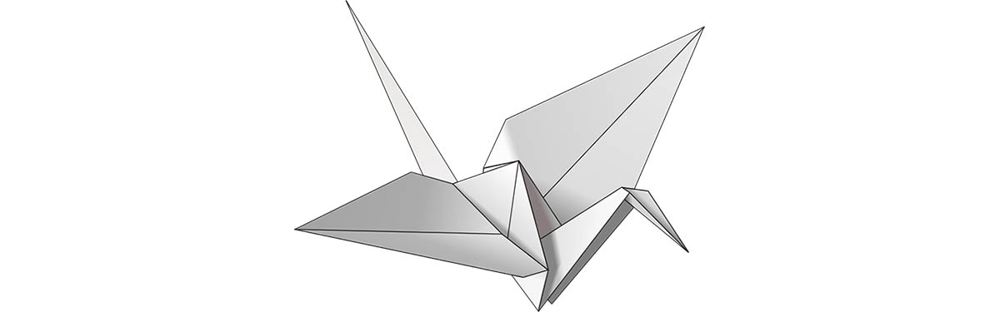
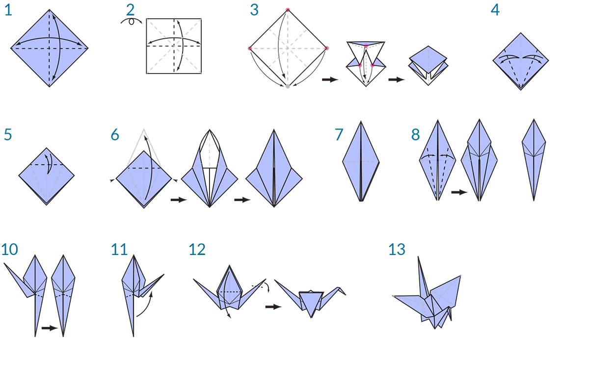

### 什麼是視覺程式設計？

設計經常會涉及在設計的各環節之間建立視覺、系統或幾何關係。大多數狀況下，這些關係由工作流程制定，這些工作流程會透過規則方式讓我們完成從概念到結果的流程。您可能不知道，我們以演算法方式工作，會定義遵循輸入、處理與輸出基本邏輯的一組逐步動作。藉由程式設計，我們可以繼續使用此方式，但要對演算法進行形式化。

### 現有演算法

在提供一些良好機會的同時，**演算法**一詞也帶來一些錯誤觀念。演算法可以產生非預期的、瘋狂的或很酷的結果，但並非無所不能。實際上，演算法本身很普通。接下來我們使用紙鶴的實際範例進行說明。先使用一張方形紙 (輸入)，然後按照一系列折疊步驟 (處理動作)，最後會折成紙鶴 (輸出)。



演算法在哪裡？演算法是一組抽象步驟，可以採用一系列方式 (文字或圖形) 來表示。

**文字說明：**

1. 先使用一張方形紙，有顏色的一面朝上。對折然後展開。然後沿另一方向對折。
2. 將紙翻轉到白色的一面。對折，折好後展開，然後再次沿另一方向對折。
3. 使用已產生的折痕，將模型頂部的 3 個角向下折至底部的角。展平模型。
4. 將頂部的三角形片折至中心，然後展開。
5. 將模型頂部向下折，折好後展開。
6. 展開模型最上方的片，將其向上折，同時向內按壓模型的兩側。展平，折好。
7. 翻轉模型，在另一面重複步驟 4-6。
8. 將頂部的片折至中心。
9. 在另一面重複上述步驟。
10. 向上折疊模型的兩條「腿」，折好然後展開。
11. 沿剛剛產生的折痕對「腿」進行內側反向折疊。
12. 對一面進行內側反向折疊以產生頭，然後向下折疊翅膀。
13. 現在紙鶴就折成了。

**圖形說明：**



### 定義的程式設計

使用其中任何一組說明應該都會折成紙鶴，若您已遵循說明，即已套用演算法。唯一的差異在於我們對該組說明的形式化進行閱讀進而執行**程式設計**所採用的方式。程式設計常用作*電腦程式設計*的簡稱，是形式化動作，會將一系列動作處理成可執行的程式。如果我們將上述紙鶴摺疊說明轉化為電腦可以閱讀並執行的格式，就是在進行程式設計。

程式設計的關鍵與第一個障礙，是我們必須依賴某些抽象形式與電腦進行有效通訊。這需要採用多種形式的程式設計語言 (例如 JavaScript、Python 或 C)。如果我們能寫出一組可重複的說明 (例如紙鶴折疊說明)，只需針對電腦轉換說明即可。我們的電腦將會折疊紙鶴，甚至會折疊彼此略有不同的多種紙鶴。這是程式設計的力量所在，電腦將重複執行我們為其指定的任何單一工作或一組工作，而不會延遲或出現人為錯誤。

#### 定義的視覺程式設計

> 下載此練習隨附的範例檔案 (按一下右鍵，然後按一下「連結另存為...」)：[Visual Programming - Circle Through Point.dyn](datasets/1-1/Visual Programming - Circle Through Point.dyn)。附錄中提供範例檔案的完整清單。

如果您承擔的工作是編寫紙鶴折疊說明，您會如何執行？您要使用圖形、文字或兩者的組合來編寫嗎？

若您的回答包含圖形，則**視覺程式設計**無疑適合您使用。不論是程式設計還是視覺程式設計，此程序實質上是相同的。它們會利用相同的形式化架構，但是，我們會透過圖形 (即「視覺」) 使用者介面定義程式的說明與關係。我們不是鍵入受語法約束的文字，而是將預先封裝的節點連接在一起。以下是相同演算法的比較，對「繪製通過點的圓」分別使用節點與代碼進行程式設計：

**視覺程式：**


**文字程式：**

```
myPoint = Point.ByCoordinates(0.0,0.0,0.0);
x = 5.6;
y = 11.5;
attractorPoint = Point.ByCoordinates(x,y,0.0);
dist = myPoint.DistanceTo(attractorPoint);
myCircle = Circle.ByCenterPointRadius(myPoint,dist);
```

我們的演算法結果：


採用視覺特性進行程式設計的方式可減少入門以及與設計人員頻繁交流的障礙。Dynamo 是視覺程式設計的範例，但我們稍後將看到，在設計應用程式時仍可使用文字程式設計方式。

