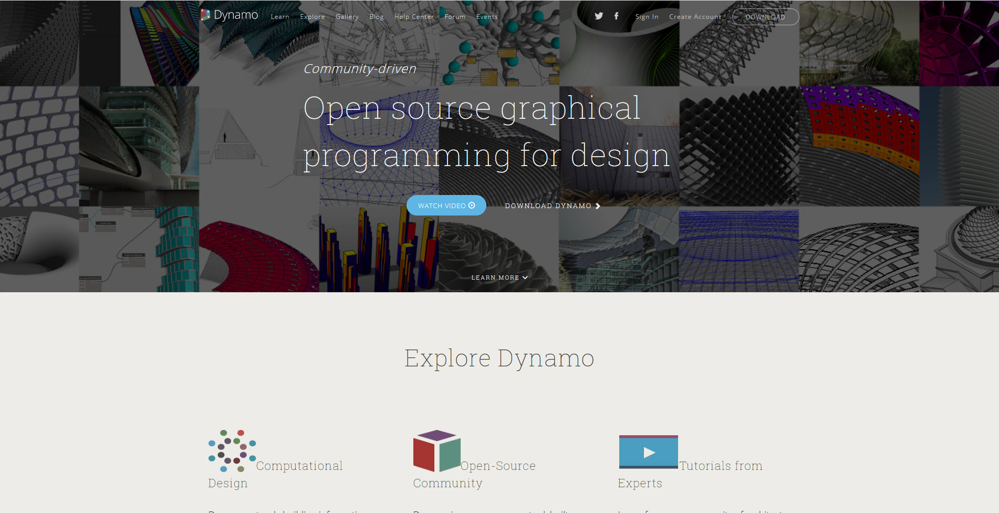
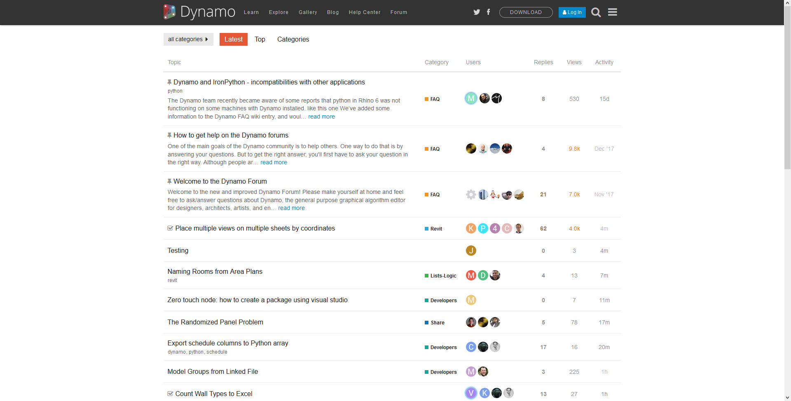

## 什麼是 Dynamo？

Dynamo 即是您所理解的字面意思。 使用 Dynamo 可能包括使用應用程式，可以與其他 Autodesk 軟體一起使用也可單獨使用，涉及視覺程式設計流程或需要廣泛社群的使用者和貢獻者參與。

### 應用程式

Dynamo 應用程式是可下載並以獨立「沙箱」模式或其他軟體（例如，Revit 或 Maya）的外掛程式執行的軟體。其說明為：

> 一種視覺程式設計工具，其目標是讓非程式設計師和程式設計師都能夠使用。此工具讓使用者能夠以可視方式對行為編寫 Script、定義自訂邏輯部分，並使用各種文字的程式設計語言編寫 Script。



> 1. 請參閱與 Revit 一起執行的 Dynamo
2. 下載安裝程式

### 流程

安裝應用程式後，Dynamo 支援我們在視覺程式設計流程中工作，在此流程中，我們將多個元素連結到一起以定義關係和組成自訂算法的動作序列。我們可以將算法用於一系列廣泛的應用程式 - 從處理資料至產生幾何圖形 - 所有動作都是即時動作而不需要編寫一句```代碼```。


> 新增元素和連結，我們已準備就緒可建立視覺程式。

### 社群

如果沒有活躍使用者和積極貢獻者的強大群組，就沒有 Dynamo 的今天。關注部落格、將您的工作新增到展示區或在論壇中討論 Dynamo，以參與社群。

　

### 平台

Dynamo 是針對設計人員的一種視覺程式設計工具，我們可使用其開發各種工具，以利用外部庫或任何具有 API 的 Autodesk 產品。使用 Dynamo Studio，我們可以在「沙箱」形式的應用程式中開發程式 - 但 Dynamo 生態系統會持續增長。

專案的原始碼是開源的，我們可隨心所欲地延伸其功能。檢出 Github 上的專案並瀏覽使用者自訂 Dynamo 的「進行中工作」。


> 根據需要瀏覽、分支並開始延伸 Dynamo

