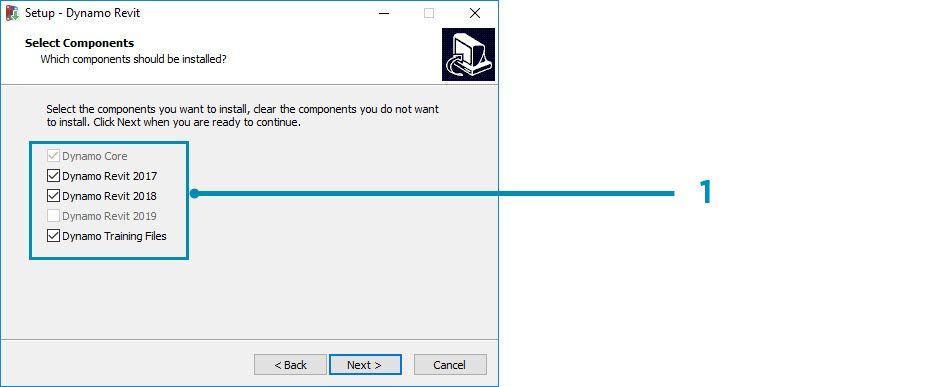
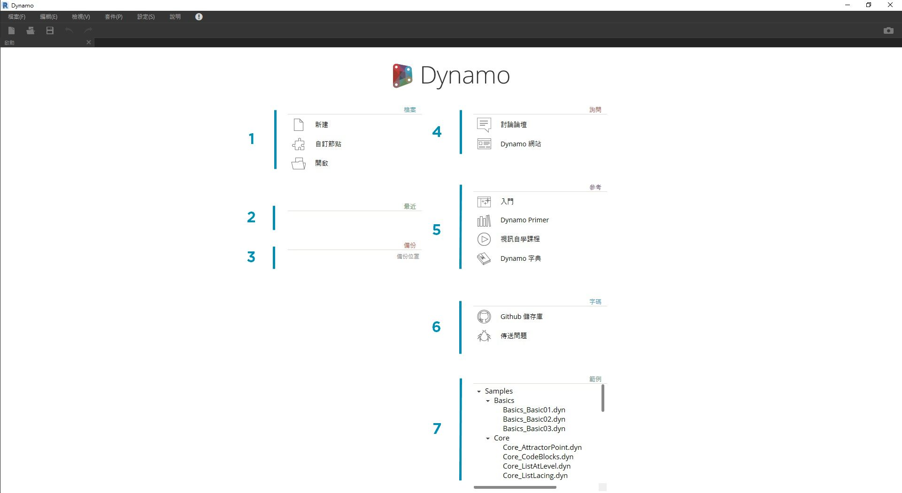

## 安裝並啟動 Dynamo

Dynamo 是一個進展中的開放程式碼開發專案，具有「正式版」和「搶鮮版」(亦即「每日建置」版本) 的可下載安裝程式。請下載正式版來開始進行，或透過每日建置或 GitHub 專案來參與 Dynamo 的演變。

### 下載

若要下載正式發行版本的 Dynamo，請造訪 [Dynamo 網站](http://dynamobim.com/)。透過按一下首頁立即開始下載或瀏覽至專用下載頁面。

> 1. 觀看有關 Dynamo 結構之計算設計的視訊
2. 或瀏覽至下載頁面

您可以在此處下載「最新」開發版本，或跳至 [Dynamo Github](https://github.com/DynamoDS/Dynamo) 專案。

> 1. 下載正式發行的安裝程式
2. 下載每日建置安裝程式
3. 查看開發者社群的自訂套件
4. 參與 GitHub 上的 Dynamo 開發

### 安裝

瀏覽至下載的安裝程式所在目錄並執行可執行檔。在安裝過程中，設置可讓您自訂將安裝的元件。

> 1. 選取要安裝的元件

在此，我們需要決定是否要包括用於將 Dynamo 連接至其他已安裝應用程式 (例如 Revit) 的元件。有關 Dynamo 平台的相關資訊，請參閱 **1.2 章節**。

### 啟動

若要啟動 Dynamo，請瀏覽至 \Program Files\Dynamo\Dynamo Revit\x.y，然後選取 DynamoSandbox.exe。這會開啟獨立版本 Dynamo 並顯示 Dynamo 的*開始頁面*。在此頁面上，會顯示標準功能表與工具列，以及可讓我們存取檔案功能或存取其他資源的捷徑集合。

> 1. 檔案 - 建立新檔案或開啟既有的檔案
2. 最近 - 捲動您最近使用的檔案
3. 備份 - 存取您的備份
4. 詢問 - 直接存取使用者論壇或 Dynamo 網站
5. 參考 - 進一步使用其他學習資源
6. 代碼 - 參與開放程式碼開發專案
7. 範例 - 查看安裝隨附的範例

開啟第一個範例檔案以開啟第一個工作區，並確認 Dynamo 正確工作。按一下「範例」>「基礎知識」> **Basics_Basic01.dyn**。

> 1. 確認執行列顯示「自動」，或按一下「執行」
2. 請遵循指示並將 **Number** 節點連接至 **+** 節點
3. 確認此 Watch 節點顯示結果

如果此檔案成功載入，您應該能夠使用 Dynamo 執行第一個視覺程式。

