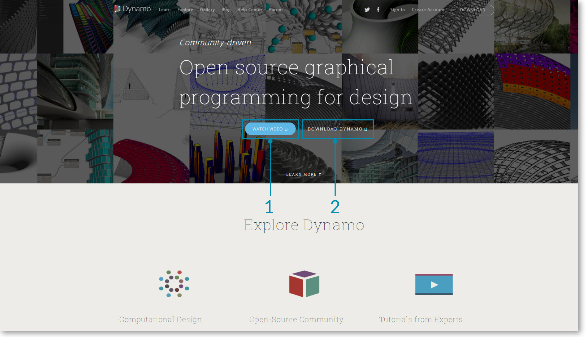
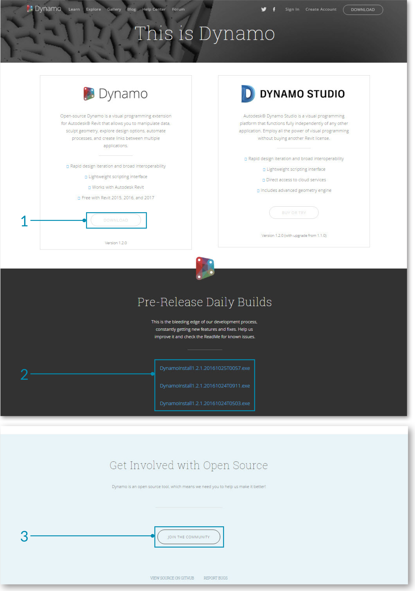
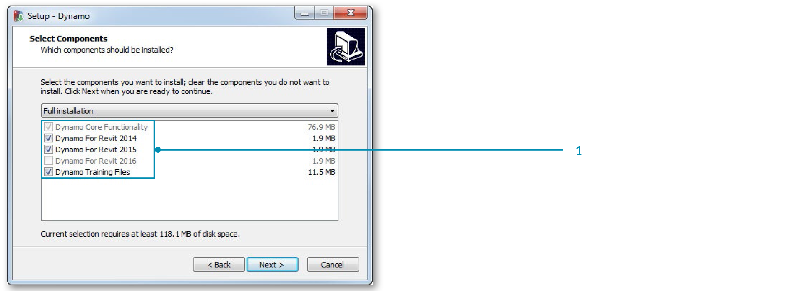
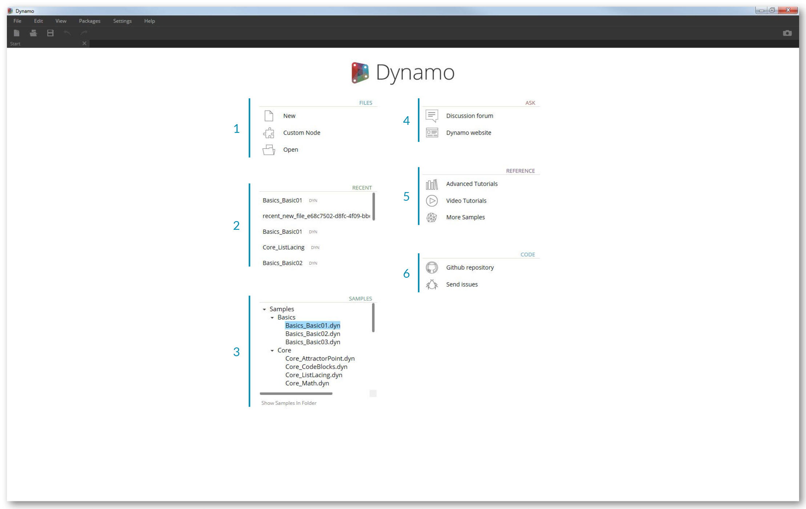
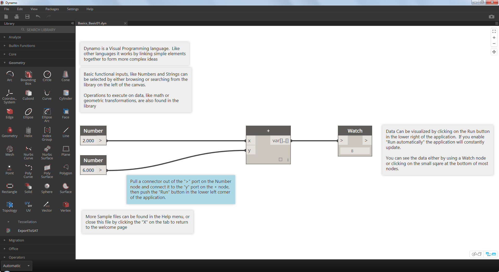

##安裝與執行 Dynamo

Dynamo 是一個活躍進行中的開源開發專案，提供可下載的正式版與預先釋出版本（ pre-release ）安裝檔，例如「每日建置」版本。現在就下載正式版本開始使用，或者透過每日建置或 GitHub 專案一起貢獻 Dynamo 吧。

###下載
下載正式版Dynamo，請造訪 [Dynamo 官方網站](http://dynamobim.com/)。點擊該網站上面的「Download Dynamo」即可瀏覽最新版本的頁面。

>1. 觀賞建築師如何利用 Dynamo 進行概念設計的影片
2.  或直接瀏覽下載頁面

進入下載頁面之後，可以選擇要下載開源版本的 Dynamo 或者專業版本的 Dynamo Studio 。你也可以到 [Dynamo Github](https://github.com/DynamoDS/Dynamo) 頁面下載最新版本的 Dynamo 開發原始碼。

> 1. 下載正式版安裝檔
2. 下載每日建置版本安裝檔
3. 開始參與 Dynamo 的 GitHub 開發社群

###安裝
瀏覽下載資料夾並執行已經下載的安裝檔。在安裝的過程當中，你可以客製化設定你想要安裝的元件。

> 1. 選擇你想要安裝的元件

在這邊需要決定是否安裝 Dynamo 與其他已安裝軟體（如 Revit ）連接的元件。更多關於元件的資訊請參閱 Dynamo Platform 的**第十二章**。

###執行
欲執行Dynamo，打開Windows開始功能表 > Dyanamo > **Dynamo 0.8.1**。 可執行獨立運作版本的Dynamo，並且顯示開始頁面。在這個頁面，可以找到標準清單和工具列以及一些捷徑，方便使用者打開檔案功能或者取得額外資源。

>1. Files（檔案） - 開新檔案或開啟舊檔
2. Recent（最近開啟） - 最近使用者使用過得檔案。
3. Samples（範例） - 開啟安裝時一同附上的範例
4. Ask（詢問） - Dynamo使用者論壇及官方網站
5. Reference（參考資料） - 更多深入參考資料
6. Code（程式碼） - 參與開源專案

打開第一個範例檔案建立你的第一個工作空間（ Workspace ），確認Dynamo正常運作。 點擊「範例」 > 「基本」 > **Basics_Basic01.dyn** 。

> 1. 確認執行設定為「自動」或者「手動」
2. 跟著指南並且連接「**數字**」節點到「**+**」節點
3. 確認 Watch Node 有正確的顯示答案 
如果這個檔案成功的載入，你便可以執行你的第一個 Dynamo 視覺化程式語言了。
