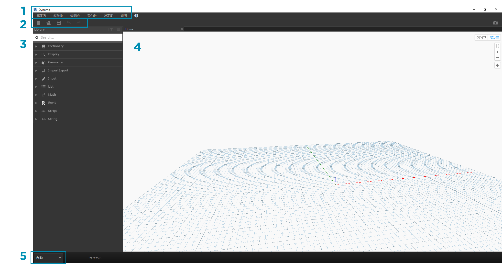
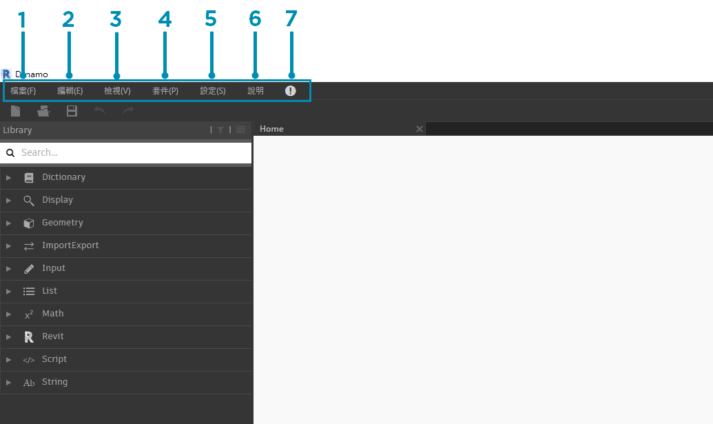
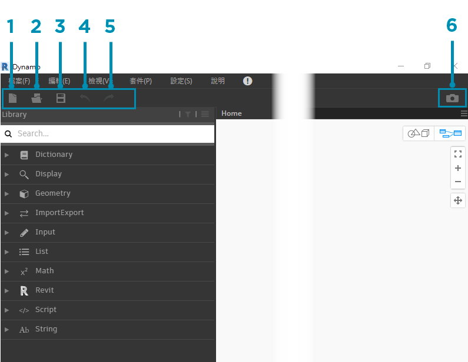
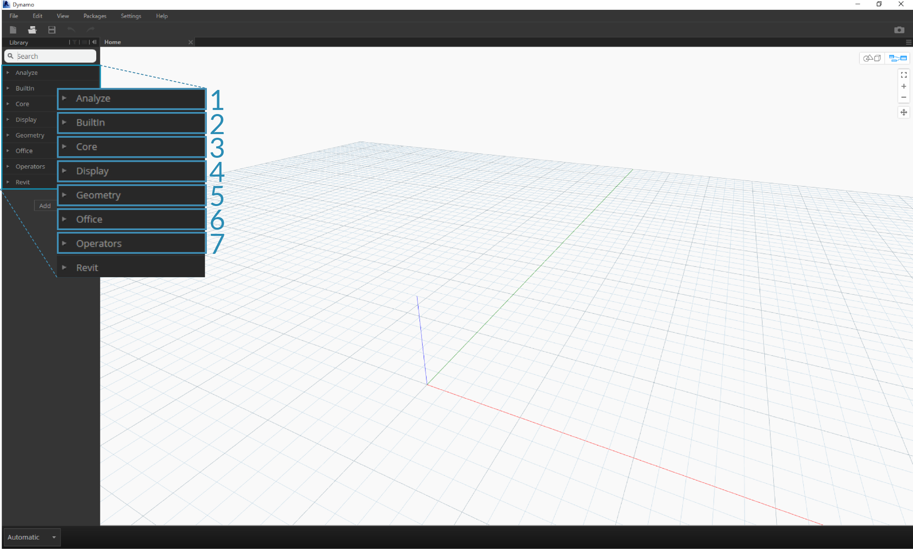
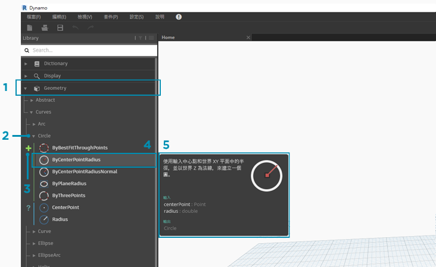
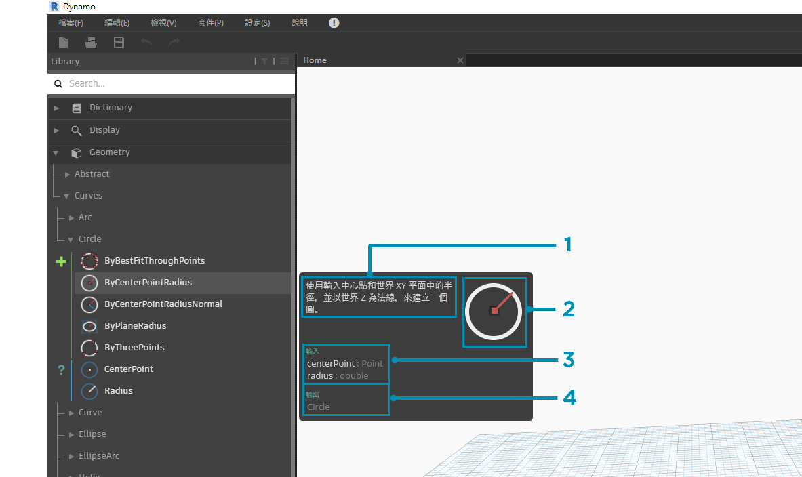
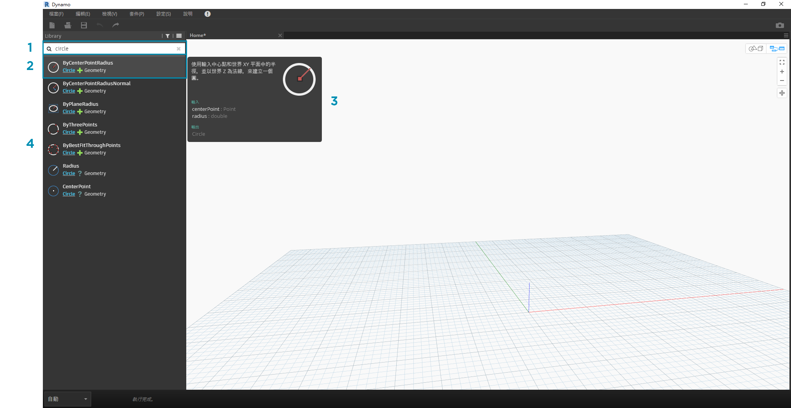
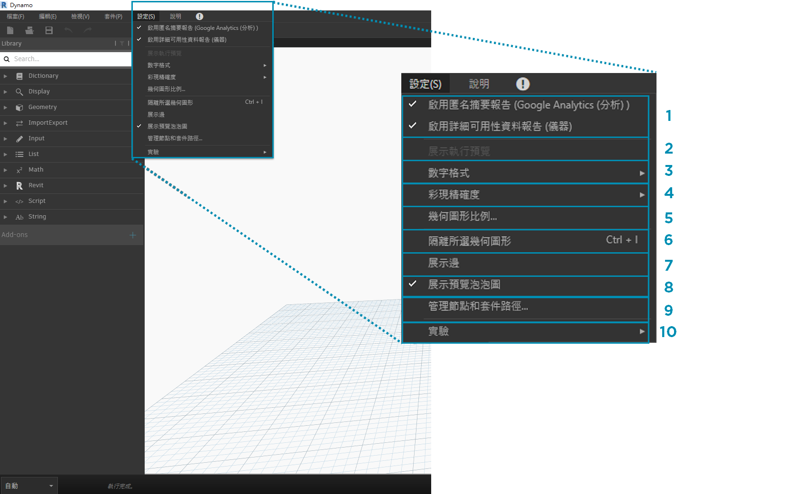
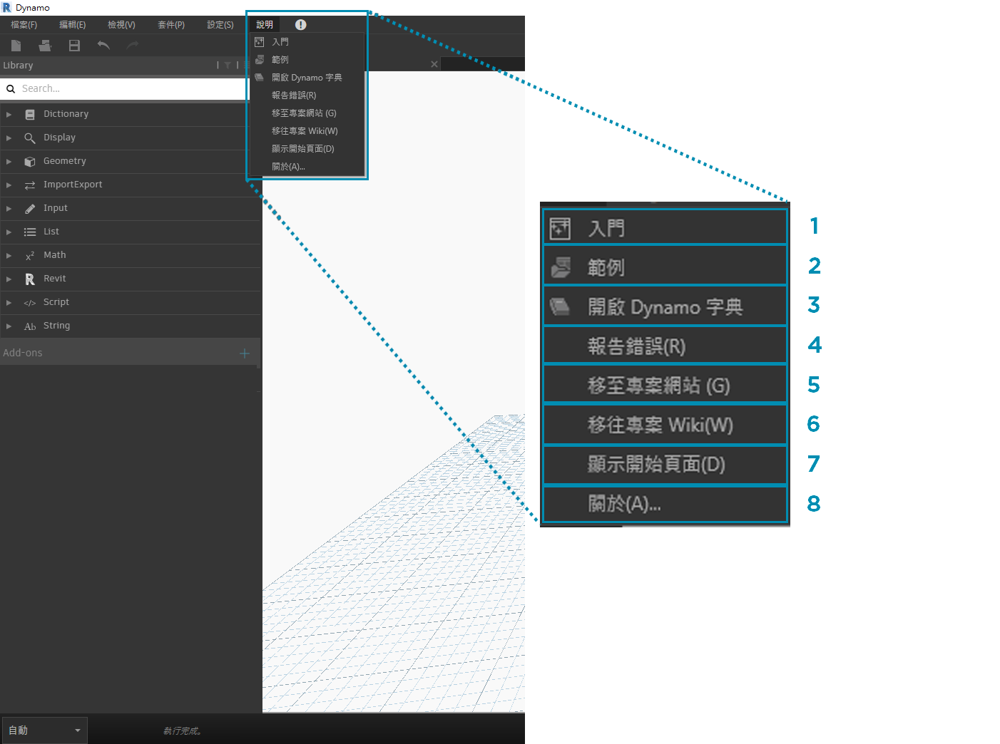

##The Dynamo User Interface Dynamo使用者介面

The User Interface (UI) for Dynamo is organized into five main regions, the largest of which is the workspace where we compose our visual programs.

Dynamo是由五大區域所組成的工作界面，其中最大的區域是構成我們的視覺化的工作平台。

>1. Menus 主選單
2. Toolbar 工具列
3. Library 資源庫
4. Workspace 工作平台
5. Execution Bar 執行列

Let's dive deeper into the UI and explore the functionality of each region.

讓我們深入了解Dynamo各項功能。
####Menus

The Dropdown Menus are a great place to find some of the basic functionality of the Dynamo application. Like most Windows software, actions related to managing files and operations for selection and content editing are found in the first two menus. The remaining menus are more specific to Dynamo.

下拉選單是查詢Dynamo基本功能的地方。與大多數Windows軟體一樣，管理文件和編輯內容的功能可在前兩個選單中找到，其餘便是選項較更特殊的功能。

> 1. File 檔案
2. Edit 編輯
3. View 檢視
4. Packages 套件
5. Settings 設定
6. Help 說明

####Toolbar  工具列

Dynamo's Toolbar contains a series of buttons for quick access to working with files as well as Undo [Ctrl + Z] and Redo [Ctrl + Y] commands. On the far right is another button that will export a snapshot of the workspace, which is extremely useful for documentation and sharing.

Dynamo的工具列控制快速存取工作檔案及復原[Ctrl + Z]和重做[Ctrl + Y]的按鍵。
在右側的按鍵是將工作平台截圖匯出，對檔案和共享相當實用。

1. New - Create a new .dyn file 新建檔案
2. Open - Open an existing .dyn (workspace) or .dyf (custom node) file 開啟檔案
3. Save/Save As - Save your active .dyn or .dyf file 保存/另存新檔
4. Undo - Undo your last action 復原-上一步
5. Redo - Redo the next action 重做-下一步
6. Export Workspace as Image - Export the visible workspace as a PNG file 匯出-匯出工作區作成影像

####Library 資源庫
The Library contains all of the loaded Nodes, including the default Nodes that come with the installation as well as any additionally loaded Custom Nodes or Packages. The Nodes in the Library are organized hierarchically within libraries, categories, and, where appropriate, sub-categories based on whether the Nodes **Create** data, execute an **Action**, or **Query** data.

資源庫控制所有被載入的節點，包含內建的按鍵及加載的按鍵。在資源庫中的這些節點根據各自"建立"資料、執行"運算"或"查詢"資料的功能被分別歸類在適合的分類中。

#####Browsing 瀏覽
By default, the **Library** will contain eight categories of Nodes. **Core** and **Geometry** are great menus to begin exploring as they contain the largest quantity of Nodes.  Browsing through these categories is the fastest way to understand the hierarchy of what we can add to our Workspace and the best way to discover new Nodes you haven't used before.

一般情況下，"資源庫"分別有八個類別的按鍵。"Core"與"Geometry"是最好的選項，因為它們包含最多的節點。瀏覽這些類別是最快可以理解我們可以運用在工作區的層次結構，也是最容易的方法來發現未曾使用過的節點。

> We will focus on the default collection of Nodes now, but note that we will extend this Library with Custom Nodes, additional libraries, and the Package Manager later.
我們將聚焦在一般性的節點，但請注意，我們將在日後擴展資源庫的節點，其他資源庫和套件管理。

>1. Analyze 分析
2. Built-in Functions  內建函數
3. Core 核心
4. Geometry 幾何
5. Migration 遷移
6. Office 辦公軟體
7. Operators 運算

Browse the Library by clicking through the menus. Click the Geometry > Circle. Note the new portion of the menu that is revealed and specifically the **Create** and **Query** Labels.
透過點選選單瀏覽資源庫，點選"幾合" >"圓"，注意選單中特別標示的"建立"與"查詢"的部分。

>1. Library 資源庫
2. Category 類別
3. Subcategory: Create/Actions/Query 子類別:建立/執行/查詢
4. Node 按鍵
5. Node Description and properties - this appears when hovering over the node icon.按鍵的描述與屬性 - 將滑鼠停留在節點上顯示

From the same Circle menu, hover your mouse over **ByCenterPointRadius**. The window reveals more detailed information about the Node beyond its name and icon. This offers us a quick way to understand what the Node does, what it will require for inputs, and what it will give as an output.

在同一選單中，將滑鼠游標停留在 **ByCenterPointRadius**。會顯示出關於該按鍵更多訊息，可協助我們更快理解按鍵需要輸入或將輸出的資訊。

>1. Description - plain language description of the Node  說明 - 節點的簡單描述
2. Icon - larger version of the icon in the Library Menu  圖示 - 資源庫中較大的圖示
3. Input(s) - name,  data type, and data structure  輸入 - 名稱，類型和數據結構
4. Output(s) - data type and structure  輸出 - 類型和數據結構

#####Searching 搜尋
If you know with relative specificity which Node you want to add to your Workspace, the **Search** field is your best friend. When you are not editing settings or specifying values in the Workspace, the cursor is always present in this field. If you start typing, the Dynamo Library will reveal a selected best fit match (with breadcrumbs for where it can be found in the Node categories) and a list of alternate matches to the search. When you hit Enter, or click on the item in the truncated browser, the highlighted Node is added to the center of the Workspace.

如果你知道要將哪個按鍵匯入工作區，利用"搜尋"是個好方法。當你在工作區沒有編輯設定或參數時，滑鼠游標停留在工作區，輸入你想要匯入的按鍵，資源庫會同步搜尋最匹配的選項於選單中。當你按下" Enter" 或單選顯示的選項，按鍵將會匯入於工作區內。

>1. Search Field  搜尋區域
2. Best Fit Result / Selected 最匹配結果
3. Alternate Matches 替代選項

###Settings 設定
From geometric to user settings, these options can be found in the **Settings** menu. Here you can opt in or out for sharing your user data to improve Dynamo as well as define the application's decimal point precision and geometry render quality.

從幾何到使用者設定，這些選項能在"設定"中找到。你能載入或卸載分享你的使用者資料來改善Dynamo ，以及定義小數點精度和幾何渲染品質。

> Note: Remember that Dynamo's units are generic.

注意：切記Dynamo的單位是公制。

>1. Enabling Reporting  問題回報
2. Number Format  小數點精度
3. Render Quality  渲染品質

###Help  說明
If you're stuck, check out the **Help** Menu. Here you can find the sample files that come with your installation as well as access one of the Dynamo reference websites through your internet browser. If you need to, check the version of Dynamo installed and whether it is up to date through the **About** option.

如果你遇到困難，點選選單的"說明"。這裡提供了內建的說明文件及 Dynamo 參考的網站連結。如果有需要也可以在此點選"關於"選項已取得Dynamo 的版本。

>1. Samples
2. Report A Bug 問題回報
3. Go To Project Website  專案網站連結
4. Go To Project Wiki  專案維基連結
5. Display Start Page  顯示開始首頁
6. About 關於

