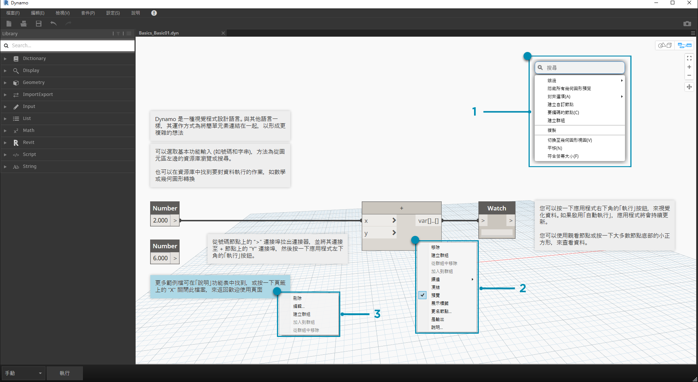
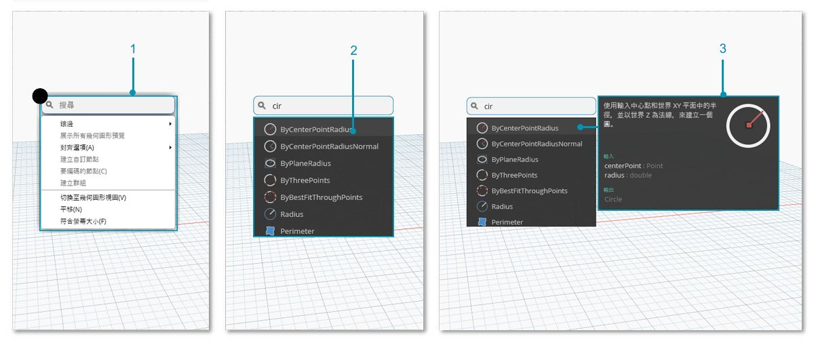

## 工作區

Dynamo **工作區**不但是我們開發視覺程式所在的區域，還可以用於預覽產生的任何幾何圖形。不論我們是在首頁工作區還是在自訂節點中工作，都能使用滑鼠或右上方的按鈕進行導覽。在右下方的模式之間進行切換將切換所導覽的預覽。

> 注意事項：節點與幾何圖形存在繪製順序，因此您可能會彩現兩者之間位於頂部的物件。在循序加入多個節點時，這可能會導致混淆，因為可能會在工作區的相同位置彩現這些節點。

> 1. 頁籤
2. 縮放/平移按鈕
3. 預覽模式
4. 在工作區域點擊滑鼠左鍵兩次

### 頁籤

藉由作用中的工作區頁籤，您可以導覽及編輯程式。在開啟新檔案時，依預設會開啟新的**首頁**工作區。您也可以從「檔案」功能表開啟新的**自訂節點**工作區，或者在選取節點後按一下右鍵，然後選取*「從選項新建節點」*選項以開啟新的自訂節點工作區 (稍後會提供此功能的更多資訊)。

> 注意事項：您一次只能開啟一個首頁工作區，但是可以在更多的頁籤中開啟多個自訂節點工作區。

### 圖表與 3D 預覽導覽的比較

在 Dynamo 中，會在工作區中彩現圖表與圖表的 3D 結果 (若建立幾何圖形)。依預設，圖表是作用中的預覽，因此使用「導覽」按鈕或滑鼠中鍵來平移及縮放可以看到整個圖表。可以透過三種方式在作用中的預覽之間進行切換：

> 1. 工作區中的預覽切換按鈕
2. 在工作區中按一下右鍵，然後選取*「切換至...視圖」*
3. 鍵盤快速鍵 (Ctrl + B)

藉由 3D 預覽導覽模式，我們也可以**直接操控**點，如[「入門」](http://primer.dynamobim.org/02_Hello-Dynamo/2-6_the_quick_start_guide.html)中的範例所示。

### 縮放以重設中心

在 3D 預覽導覽模式中，我們可以輕鬆平移、縮放及圍繞模型旋轉。但是，若要特意在幾何圖形節點建立的物件上縮放，可以在選取單一節點後，使用「縮放全部」圖示。

> 1. 選取將作為視圖中心的幾何圖形對應的節點。
2. 切換至 3D 預覽導覽。

> 1. 按一下右上方的「縮放全部」圖示。
2. 選取的幾何圖形將成為視圖內的中心。

### 你好，滑鼠！

根據作用中的預覽模式，滑鼠按鍵的行為會有所不同。一般而言，按一下滑鼠左鍵會選取及指定輸入，按一下滑鼠右鍵會存取選項，而按一下滑鼠中鍵會導覽工作區。若按一下滑鼠右鍵，會顯示以按一下的位置所在的環境為基礎的選項。

> 1. 在工作區上按一下右鍵。
2. 在節點上按一下右鍵。
3. 在註記上按一下右鍵。

以下表格展示了根據預覽而定的滑鼠互動：

|**滑鼠動作**|**圖表預覽**|**3D 預覽**|
| -- | -- | -- |
|按一下左鍵|選取|N/A|
|按一下右鍵|關聯式功能表|縮放選項|
|按一下中鍵|平移|平移|
|捲動|拉近/拉遠|拉近/拉遠|
|按兩下|建立程式碼塊|N/A|

### 圖元區搜尋

若使用「圖元區搜尋」，可以在存取節點描述與工具提示時，不必離開圖表位置，從而極大提升 Dynamo 工作流程的速度！不論您在圖元區的哪個位置工作，只需按一下右鍵，即可存取「資源庫搜尋」的所有有用功能。

> 1. 在圖元區上的任何位置按一下右鍵，可以顯示搜尋功能。在搜尋列為空時，下拉會顯示預覽功能表。
2. 在搜尋列中鍵入時，下拉式功能表會持續更新，以展示最相關的搜尋結果。
3. 將游標懸停在搜尋結果上可以顯示其相應描述及工具提示。

## 清理節點配置

讓 Dynamo 圖元區保持井井有條的狀態變得越來越重要，因為您的檔案會帶來複雜性。雖然我們可以透過**對齊選項**工具使用少量的所選節點，但 Dynamo 也提供了**清理節點配置**工具，以協助執行整體檔案清理。

#### 節點清理之前

> 1. 選取要自動組織的節點或保留所有未選取的節點，以清理檔案中的所有節點。
2. 清理節點配置功能位於「編輯」頁籤下。
#### 節點清理之後

3. 將自動重新分配並對齊節點，清理所有交錯或重疊的節點，並將其與相鄰節點對齊。

