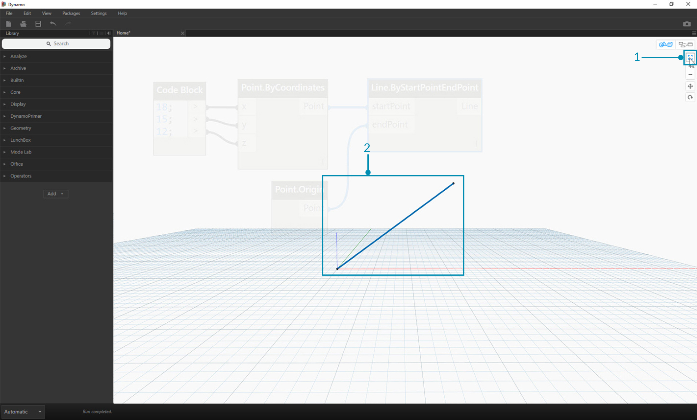
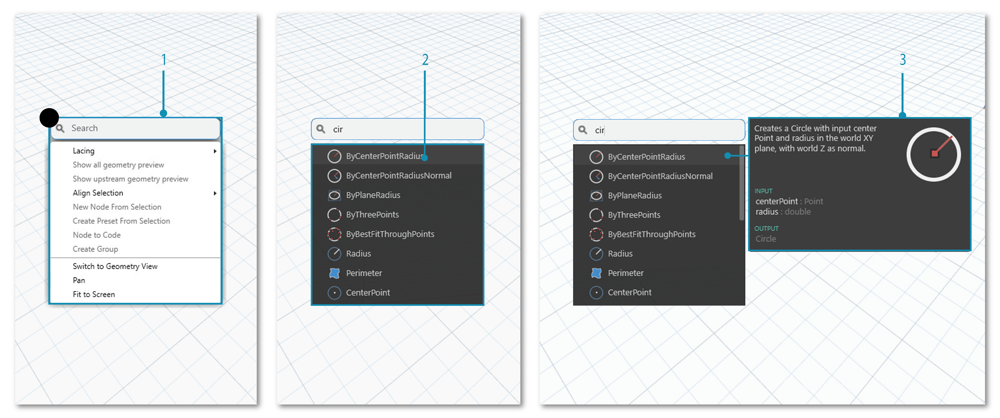

##The Workspace

The Dynamo **Workspace** is where we develop our visual programs, but it's also where we preview any resulting geometry. Whether we are working in a Home Workspace or a Custom Node, we can navigate with our mouse or the buttons at top right. Toggling between modes at bottom right switches which preview we navigate.

Dynamo的工作區域是我們開發視覺化程式的地方，也是我們預覽成果(幾何生成)之所在，不論是在工作區域或者是自定義節點環境中，我們都可以使用滑鼠或點擊右上角的按鈕來導覽，可藉由右上角的開關進行模式的轉換。

> Note: Nodes and geometry have a draw order so you may have objects rendered on top of each other. This can be confusing when adding multiple nodes in sequence as they may be rendered in the same position in the Workspace.

> Note:節點和幾何體都具有繪製的順序，你可以顯示兩者在彼此的上方(在工作區當中)，當按順序添加多個節點時，因為它們可能會在工作空間中的相同位置呈現，可能因此產生混淆。

>1. Tabs
2. Zoom/Pan Buttons
3. Preview Mode
4. Double Clicking on the Workspace

>1. 標籤
2. 縮放/平移按鈕
3. 預覽模式
4. 在工作區域點擊滑鼠左鍵兩次

###Tabs
The active Workspace tab allows you to navigate and edit your program. When you open a new file, by default you are opening a new **Home** Workspace. You may also open a new **Custom Node** Workspace from the File Menu or by the *New Node by Selection* right click option when Nodes are selected (more eon this functionality later).

###標籤
目前使用中的標籤允許你操作與編輯你的程序，當你打開一個新的文件，預設打開一個名為HOME的工作區域，你也可以從選單中打開一個新的自定義節點區域，或者點選節點後右鍵選擇[從選項建立新節點](後續版本會有差異)

> Note: You may have only one Home Workspace open at a time; however, you may have multiple Custom Node Workspaces open in additional tabs.

> Note: 一次只能有一個主要工作區域(HOME)，但可同時開啟多個自定義節點在工作區域中。(註:DYN檔一次只能開一個，DYF檔可開很多個)

###Graph versus 3D Preview Navigation
In Dynamo, the Graph and the 3D results of the Graph (if we are creating geometry) are both rendered in the Workspace. By default the Graph is the active preview, so using the Navigation buttons or middle mouse button to pan and zoom will move us through the Graph. Toggling between active previews can be achieved three ways:

###圖形與3D預覽操作
在DYNAMO中，圖形與圖形的3D成果(如果產生幾何形體)都會在工作區域中顯示，預覽圖型是預設的視圖，使用導覽按鈕或者是滑鼠中鍵滾輪]可以平移與縮放視窗，有三種方式可以在兩種視圖中切換。

> 1. Preview Toggle Buttons in the Workspace
2. Right clicking in the Workspace and selecting *Switch to ... View*
3. Keyboard shortcut (Ctrl + B)

> 1. 右上角顯示切換開關
2. 在工作區域中按滑鼠右鍵並選擇 切換到...
3. 鍵盤快捷鍵 (Ctrl + B)

The 3D Preview Navigation mode also gives us the ability for **Direct Manipulation** of points, exemplified in [Getting Started](http://dynamoprimer.com/02_Hello-Dynamo/2-6_the_quick_start_guide.html).

3D預覽操作模式也提供直接控制點的能力，可參考入門的範例。

###Zoom to Recenter
 We can easily pan, zoom and rotate freely around models in 3D Preview Navigation mode. However, to zoom specifically on an object created by a geometry node, we can use the Zoom All icon with a single node selected.

> 1. Select the node corresponding to the geometry  that will center the view. 
2. Switch to the 3D Preview Navigation. 

> 1. Click on the Zoom All icon in the top right.
2. The selected geometry will be centered inside the view.

###Hello Mouse!

Based on which Preview mode is active, your mouse buttons will act differently. In general, the left mouse click selects and specifies inputs, the right mouse click gives access to options, and the middle mouse click allows you to navigate the Workspace. The right mouse click will present us with options based on the context of where we are clicking.

>1. Right Click on the Workspace.
2. Right Click on a Node.
3. Right Click on a Note.

Here's a table of mouse interactions per Preview:

**Mouse Action** | **Graph Preview** | **3D Preview**
--- | --- | ---
Left Click | Select | N/A
Right Click | Context Menu | Zoom Options
Middle Click | Pan | Pan
Scroll | Zoom In/Out | Zoom In/Out
Double Click | Create Code Block | N/A

###In-Canvas Search

Using the "In-Canvas Search" will add some serious speed to your Dynamo work-flow by providing you access to node descriptions and tool-tips without taking you away from your place on the graph! By just right-clicking, you can access all the useful functionality of the "Library Search" from wherever you happen to be working on the canvas.

>1. Right click anywhere on the canvas to bring up the search feature. While the search bar is empty, the drop-down will be a preview menu.
2. As you type into the search bar, the drop-down menu will continuously update to show the most relevant search results.
3. Hover over the search results to bring up their corresponding descriptions and tool-tips.

##Clean Up Node Layout
Keeping your Dynamo canvas organized becomes increasingly important as your files build in complexity. Although we have the **Align Selection** tool to work with small amounts of selected Nodes, Dynamo also features the **Cleanup Node Layout** tool to help with overall file cleanup. 
####Before Node Cleanup

>1.	Select the Nodes to be automatically organized, or leave all unselected to clean up all nodes in the file. 
2.	The Cleanup Node Layout feature is located under the Edit tab.
####After Node Cleanup 

>1.	The nodes will be automatically re-distributed and aligned, cleaning up any staggered or overlapping nodes and aligning them with neighboring nodes.

