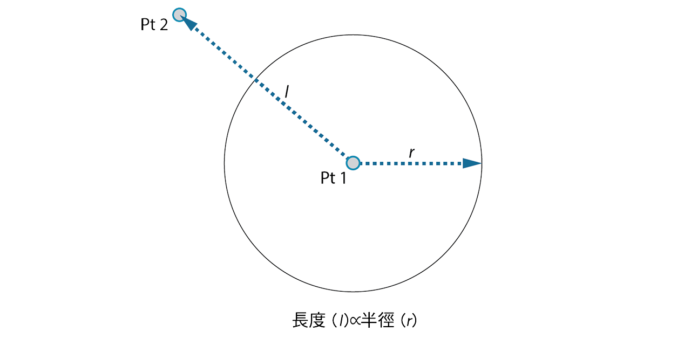
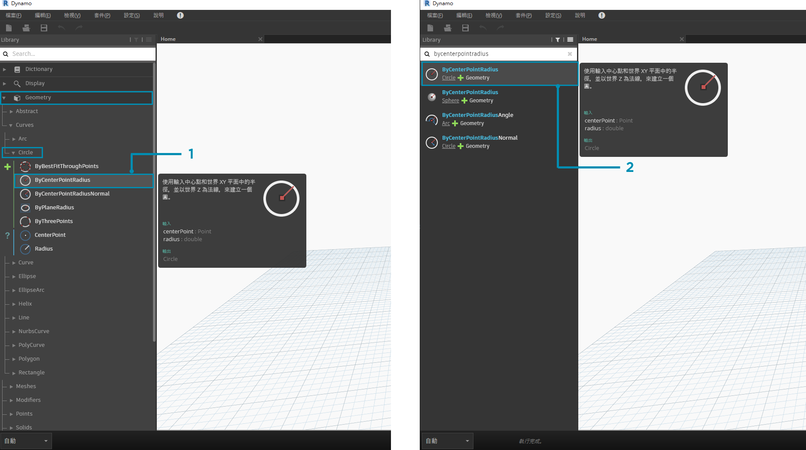
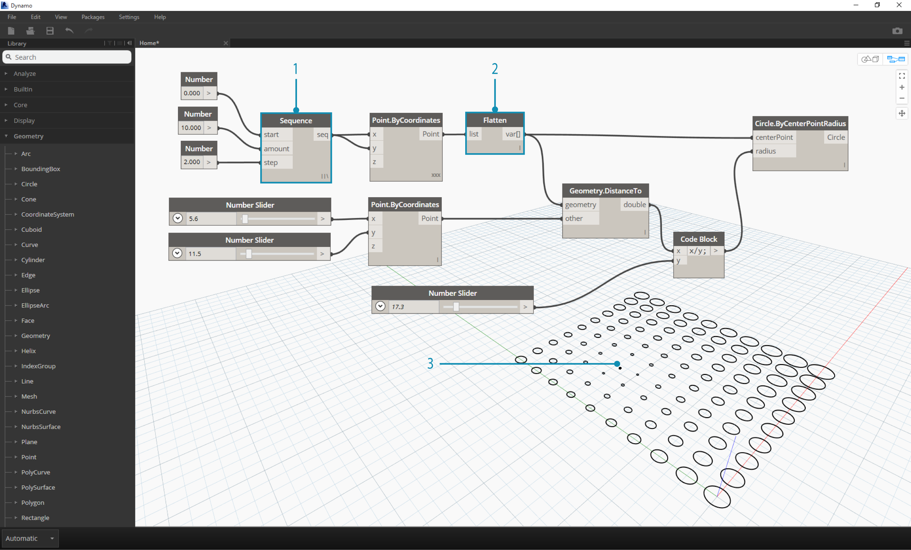

##GETTING STARTED 開始
Now that we have familiarized ourselves with the interface layout and navigating the Workspace, our next step is to understand the typical workflow for developing a graph in Dynamo. Let's get started by creating a dynamically sized circle and then create an array of circles with varying radii.

現在我們已經熟悉了介面呈現和工作空間的導向，下一步就是要了解標準開發Dynamo圖形的工作流程。讓我們從創造可變大小的圓和一個不同半徑的圓陣列開始。
###Defining Objectives and Relationships 定義物件和關係
Before we add anything to the Dynamo Workspace, it is key that we have a solid understanding of what we are trying to achieve and what the significant relationships will be. Remember that anytime we are connecting two Nodes, we are creating an explicit link between them - we may change the flow of data later, but once connected we've commited to that relationship. In this exercise we want to create a circle (*Objective*) where the radius input is defined by a distance to a nearby point (*Relationship*).

在我們加入任何東西進Dynamo的工作空間前，最關鍵的是我們要確切了解要達到的「目的」和它所連帶的「關係」。在我們連接兩個節點的時候，我們在他們之間創造了明顯的連結，儘管之後有可能會改變他們的資料，但一旦創造連結了之後，我們就必須承諾他們之間的關係。在這個練習中，我們想要創造一個圓(目的)，而圓的半徑是由和旁邊點的距離來定義(關係)。


> A point that defines a distance-based relationship is commonly referred to as an "Attractor." Here the distance to our Attractor Point will be used to specify how big our circle should be.

一般來說，若用一個點是用來定義距離關係的，我們則稱那個點為「Attractor」點。在這裡我們就是用到「Attractor」點的距離來指定圓的大小。

###Adding Nodes to the Workspace 在工作平面加入節點
Now that we have our Objectives and Relationships sketched we can begin creating our graph. We need the Nodes that will represent the sequence of actions Dynamo will execute. Since we know we are trying to create a circle, let's start by locating a Node that does so. Using the Search field or browsing through the Library, we will find that there is more than one way to create a circle.

現在我們有了「目的」和「關係」的基本概念後就可以開始創造我們的圖形。我們需要「節點」來呈現Dynamo在執行動作時的程序。因為我們知道目的是要創造一個圓，因此就從放置相關節點開始。利用尋找區或是瀏覽資料庫，就會找到不只一種方法來製造一個圓。

> 1. Browse to Geometry > Circle > **Circle.ByPointRadius**
2. Search > "Circle by Point..."

> 1.瀏覽找到  Geometry > Circle > Circle.ByPointRadius
2.尋找  > "Circle by Point..."

Let's add the **Circle.ByPointRadius** Node to the Workspace by clicking on it in the Library - this should add the Node to the center of the Workspace.

讓在資料庫點一下Circle.ByPointRadius這個節點並將他加入到工作平面上 – 這個動作會將他新增到工作空間的中間。


> 1. The Circle.ByPointandRadius Node in the Library
2. Clicking the Node in the Library adds it to the Workspace

>  1.	在資料庫裡的Circle.ByPointandRadius節點
   2.	點選他並將他加入到工作空間

We also will need **Point.ByCoordinates**, **Number Input**, and **Number Slider** Nodes.

我們另外需要Point.ByCoordinates, Number Input, Number Slider 這三個節點


>  1. Geometry > Point > **Point.ByCoordinates**
   2. Geometry > Geometry > **DistanceTo**
   3. Core > Input > **Number**
   4. Core > Input > **Number Slider**


###Connecting Nodes with Wires 用線連接節點
Now that we have a few Nodes, we need to connect the Ports of the Nodes with Wires. These connections will define the flow of data.

現在我們有了幾個節點之後，要將節點之間的連接處用線連接起來。這些連接的動作會定義資料的流動。

> 1. **Number** to **Point.ByCoordinates**
2. **Number Sliders** to **Point.ByCoordinates**
3. **Point.ByCoordinates** (2) to **DistanceTo**
4. **Point.ByCoordinates** and **DistanceTo** to **Circle.ByCenterPointRadius**

> 1.「Number」 連到 「Point.ByCoordinates」
2.「Number Sliders」 連到 「Point.ByCoordinates」
3.「Point.ByCoordinates」 連到 「DistanceTo」
4.「Point.ByCoordinates」 和 「DistanceTo」 連到 「Circle.ByCenterPointRadius」

###Executing the Program 執行程序
With our Program Flow defined, all we need to do is tell Dynamo to execute it. Once our program is executed (either Automatically or when we click Run in Manual Mode), data will pass through the Wires, and we should see the results in the 3d Preview.

在定義完程序之後，我們就只剩下告訴和Dynamo開始執行的這個步驟。一旦我們的程序執行之後(無論是自動執行或是我們在手動模式點選執行)，資料會經由線來傳遞，之後就可以在3D在結果的預覽。

> 1. (Click Run) - If the Execution Bar is in Manual Mode, we need to Click Run to execute the graph
2. Node Preview - Hovering your mouse over the box on the lower right corner of a Node will give you a pop-up of the results
3. 3D Preview - If any of our Nodes create geometry, we will see it in the 3D Preview.

>  1. (點選執行) – 如果在執行欄位是顯示手動模式，我們就必須點選執行按鈕來執行
   2. 節點預覽 – 將滑鼠游標移到節點右下角，它會跳出結果
   3. 3D預覽 – 如果有創造幾何圖形的節點，我們就會在3D預覽裡看到它

###Adding Detail 加入細節
If our program is working, we should see a circle in the 3D Preview that is passing through our Attractor Point. This is great, but we may want to add more detail or more controls. Let's adjust the input to the circle Node so that we can calibrate the influence on the radius. Add another **Number Slider** to the Workspace, then double click on a blank area of the Workspace to add a **Code Block** Node. Edit the field in the Code Block, specifying ```X/Y```.

在我們的程序執行之後，就可以在3D視圖裡看到我們的「Attractor」點。這很棒，但我們一定會想要加入更多的細節和控制。讓我們改變「circle」節點的輸入，來體會一下改變半徑的影響。增加另外的「Number Slider 」節點到工作空間，然後點兩下工作空間裡空的地方來加入「Code Block」節點。編輯那個區塊來給定X和Y。

>1. **Code Block**
2. **DistanceTo** and **Number Slider** to **Code Block**
3. **Code Block** to **Circle.ByCenterPointRadius**

>1.「Code Block」
2.「DistanceTo 」和 「Number Slider」 連到 「Code Block」
3.「Code Block」 連到 「Circle.ByCenterPointRadius」

###Adding complexity 增加複雜度
Starting simple and building complexity is an effective way to incrementally develop our program. Once it is working for one circle, let's apply the power of the program to more than one circle. Instead of one center point, if we use a grid of points and accommodate the change in the resulting data structure, our program will now create many circles - each with a unique radius value defined by the calibrated distance to the Attractor Point.

一開始簡單到後來慢慢增加複雜度，這是一個有效的方式來擴展我們的程序。之前我們是做一個圓，那現在就來用這個程序來製造更多圓。不再只是用一個中心點，如果我們加入了一整個網格的點並讓最後結果的資料結構接受這樣的改變，那我們的程序將會製造許多圓，而且每一個圓的半徑都是依照和「Attractor」點的距離來給定。

>1. Add a **Number Sequence** Node and replace the inputs of **Point.ByCoordinates** - Right Click Point.ByCoordinates and select Lacing > Cross Reference
2. Add a **Flatten** Node after  Point.ByCoordinates
3. The 3D Preview will update with a grid of circles

>  1.	加入「Number Sequence」節點後取代原本「Point.ByCoordinates」輸入的節點 – 右鍵點擊「Point.ByCoordinates」後選擇 Lacing > Cross
   2.	增加 「Flatten」節點在「Point.ByCoordinates」後面
   3.	在3D預覽更新成網格點

###Adjusting with Direct Manipulation 直接操作並調整
Sometimes numerical manipulation isn't the right approach. Now you can manually push and pull Point geometry when navigating in the background 3D preview. We can also control other geometry that was constructed by a point.  For example, **Sphere.ByCenterPointRadius** is capable of Direct Manipulation as well. We can control the location of a point from a series of X, Y, and Z values with **Point.ByCoordinates**. With the Direct Manipulation approach, however, you are able to update the values of the sliders by manually moving the point in the **3D Preview Navigation** mode. This offers a more intuitive approach to controlling a set of discrete values that identify a point's location.

有時候數值操作上並不是正確的，那麼你就可以在背景3D預覽視圖中直接手動拖拉幾何點位來更改它的位置參數，也可以一併控制其他和這個點一起建構的幾何圖形。例如，「Sphere.ByCenterPointRadius」就是可以直接手動來改變它的數值。我們原本可以利用「 Point.ByCoordinates」節點來控制一個點的X,Y,Z位置，但有了直接操作的方法後，我們就可以再3D視圖裡利用移動點的位置來直接更新它的位置參數。這算是一個比較直觀控制不連續點位置數值的一個方法。

>1. To use **Direct Manipulation**, select the panel of the point to be moved – arrows will appear over the point selected.
2. Switch to **3D Preview Navigation** mode.

>  1.	選擇控制移動點的那個面板並利用上述直接操作的方法 – 箭頭會在選定的那個點上面
   2.	切換到3D預覽模式


>1. Hover over the point and the X, Y, and Z axes will appear.
2. Click and drag the colored arrow to move the corresponding axis, and the **Number Slider** values will update live with the manually moved point.

>  1.	滑鼠游標移到那個點之後X,Y,Z軸會出現
   2.	點擊並拖住彩色的箭頭來移動座標軸，然後會看到「Number Slider 」的值會隨著手動操作而改變


> 1. Note that before **Direct Manipulation** only one slider was plugged into the **Point.ByCoordinates** component. When we manually move the point in the X-direction, Dynamo will automatically generate a new **Number Slider** for the X input.

>  1.	注意到如果再直接操作方法只用之前只有一個「Number slider」連接到「Point.ByCoordinates」，那麼當我們在手動移動點的X位置時，Dynamo會自動產生新的「Number slider」連到x輸入的位置
