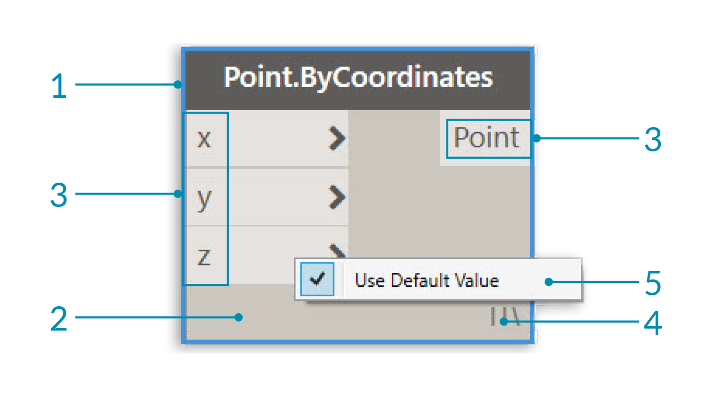
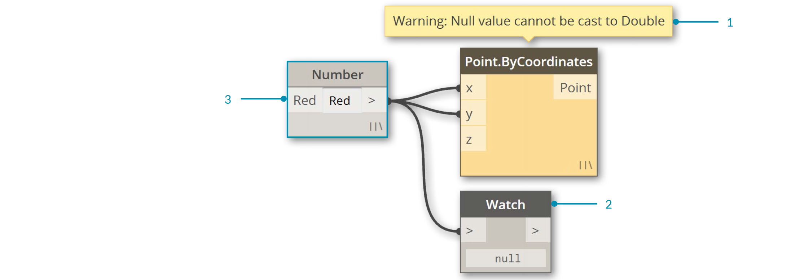

## 節點

在 Dynamo 中，**節點**是互相連結以形成視覺程式的物件。 每個**節點**執行一項作業 - 有時可能是簡單作業（例如，儲存數目）或可能是更複雜的動作（例如，建立或查詢幾何圖形）。

### 剖析節點

Dynamo 中的大多數節點由五個部分組成。雖然有一些例外，例如輸入節點，但每個節點的分析可說明為如下：

> 1. 名稱 - 遵循 Category.Name 命名慣例的節點名稱
2. 主要 - 節點主體 - 在此處按一下右鍵會顯示整個節點層次的選項
3. 埠（入埠和出埠) - 向節點提供輸入資料以及提供節點動作結果之線路的接收器
4. 鑲邊圖示 - 指示鑲邊選項，指定此選項的目的是為了與清單輸入相符 (之後還有其他目的)
5. 預設值 - 對入埠按一下右鍵 - 某些節點具有可以使用或不可使用的預設值。

### 埠

節點的輸入與輸出稱為「埠」，可作為線路的接收器。資料從左側透過埠進入節點，在執行其作業後從右側流出節點。埠預期接收特定類型的資料。例如，將一個數字 *2.75* 連接至座標點節點上的埠將成功建立點 ； 但是，如果我們為同一埠提供 *「RED」*，它會導致錯誤。

> 提示： 將游標懸停在埠上可查看工具提示，顯示其預期的資料類型。

> 1. 埠標籤
2. 工具提示
3. 資料類型
4. 預設值

### 狀態

Dynamo 會透過根據每個節點的狀態為節點呈現不同顏色外觀來指示視覺程式的執行狀態。此外，懸停在名稱或埠上或對名稱或埠按一下右鍵可提供其他資訊和選項。

> 1. 作用中 - 具有深灰色背景名稱的節點已正確連結且其所有輸入已成功連接
2. 非作用中 - 灰色節點處於非作用中狀態，並需要使用線路進行連結以成為作用中工作區程式流的一部分
3. 錯誤狀態 - 紅色表示該節點處於錯誤狀態
4. 凍結 - 透明節點表示已開啟「凍結」，該節點已終止執行
5. 已選取 - 目前所選節點在其邊界會以水藍色強調顯示。
6. 警告 - 黃色節點表示處於警告狀態，這意味著它們可能具有不正確的資料類型
7. 背景預覽 - 深灰色表示幾何圖形預覽已關閉

如果您的視覺程式包含警告或錯誤，Dynamo 會提供有關問題的其他資訊。任何顯示為黃色的節點會在其名稱上方顯示工具提示。請將滑鼠游標置於工具提示上方，以將其展開。

> 提示： 可使用此工具提示資訊，檢查上游節點，以查看所需資料類型或資料結構中是否存在錯誤。

> 1. 警告提示 -「NULL」或沒有資料無法識別為雙 IE。數字
2. 使用「觀看節點」以檢查輸入資料
3. 上游的數字節點正在儲存不是數字的「RED」

