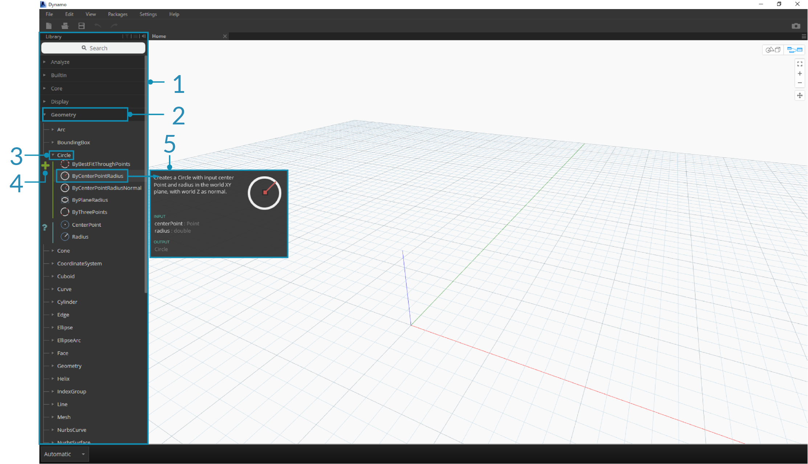
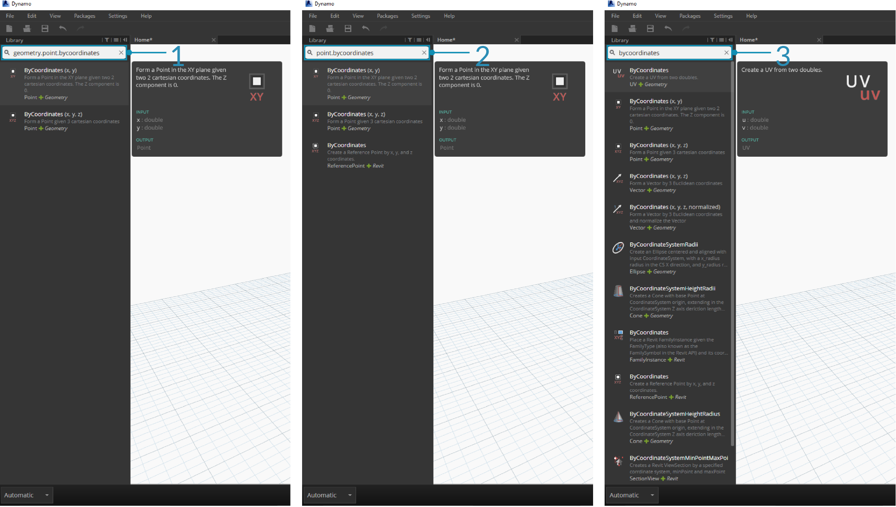
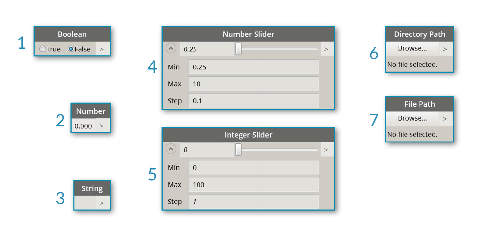
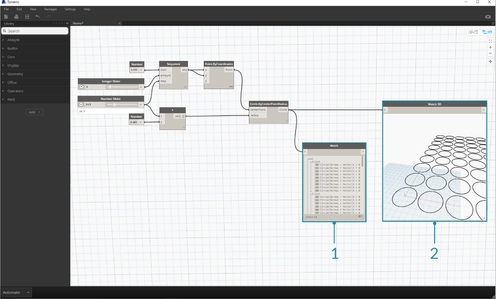
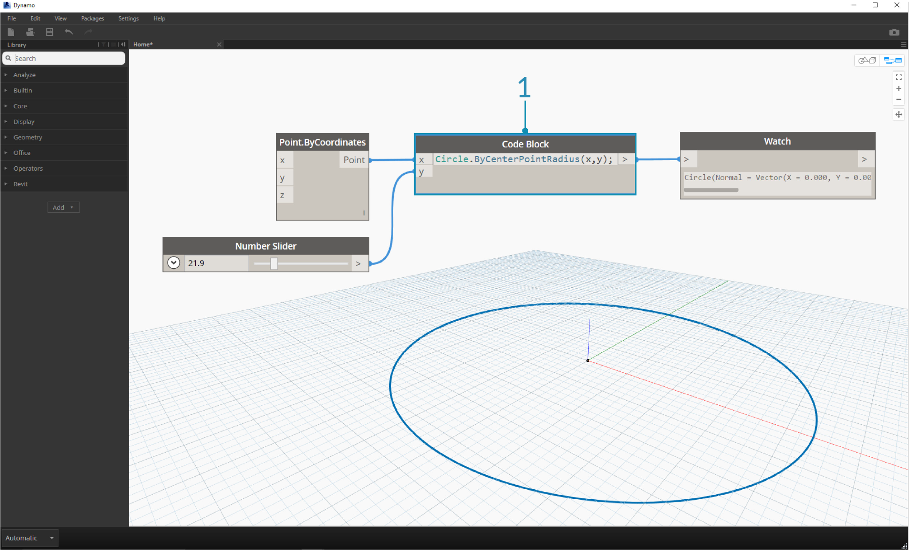

## Dynamo 資源庫

**Dynamo 資源庫**中包含節點，我們會將這些節點加入至工作區以定義供執行的視覺程式。在資源庫中，我們可以搜尋節點或瀏覽至節點。此處包含的節點 (安裝的基本節點、定義的自訂節點，以及我們在 Package Manager 中加入至 Dynamo 的節點) 依品類按階層排列。 接下來我們將檢閱此組織，並探索將頻繁使用的關鍵節點。

### 資源庫的資源庫

我們在應用程式中所連接的 Dynamo **資源庫**實際上是功能資源庫的集合，其中每個功能資源庫都包含依品類進行分組的節點。雖然這種架構起初可能顯得遲鈍，但它可以靈活地組織 Dynamo 的預設安裝所隨附的節點，甚至在一段時間後使用自訂節點與其他套件開始延伸此基準功能時表現更好。

#### 組織配置

Dynamo 使用者介面的**「資源庫」**區段由按階層排列的資源庫構成。深入探究資源庫時，我們會依序瀏覽資源庫、資源庫的品類以及品類的子品類，以尋找節點。



> 1. 資源庫 - Dynamo 介面的區域
2. 資源庫 - 相關品類 (例如 **Geometry**) 的集合
3. 品類 - 相關節點 (例如與 **Circles** 相關的所有內容) 的集合
4. 子品類 - 在品類內通常透過 **Create**、**Action** 或 **Query** 對節點進行分解而產生的內容
5. 節點 - 加入至工作區以執行動作的物件

#### 命名慣例

每個資源庫的階層都會反映在加入至工作區的節點的名稱中，我們也可以將其用於搜尋欄位或搭配使用程式碼塊 (這會使用 *Dynamo 文字語言*)。除了使用關鍵字嘗試尋找節點外，我們也可以鍵入以句點分隔的階層。

以 ```library.category.nodeName``` 格式在節點位於資源庫階層中位置的不同部分鍵入，會傳回不同的結果：



> 1. ```library.category.nodeName```
2. ```category.nodeName```
3. ```nodeName``` 或```keyword```

通常，工作區中節點的名稱將以 ```category.nodeName``` 格式彩現，但尤其是在「輸入」與「視圖」品類中存在一些明顯的例外。請注意名稱相似的節點，並注意品類差異：


> 1. 大多數資源庫中的節點將包括品類格式
2. ```Point.ByCoordinates``` 與 ```UV.ByCoordinates``` 具有相同名稱，但來自不同品類
3. 明顯的例外包括內建函數、Core.Input、Core.View 及運算子

### 常用的節點

Dynamo 的基本安裝中包括數百個節點，哪些節點對於開發視覺程式必不可少？接下來我們著重瞭解定義程式參數 (**Input**)、查看節點動作結果 (**Watch**) 以及透過捷徑 (**Code Block**) 定義輸入或功能所使用的節點。

#### 輸入

輸入節點是視覺程式的使用者 (不論是您自己還是他人) 與關鍵參數結合的主要方式。以下是核心資源庫內輸入品類中提供的節點：



> 1. Boolean
2. Number
3. String
4. Number Slider
5. Integer Slider
6. Directory Path
7. File Path

#### 觀看

觀看節點對於管理流經視覺程式的資料必不可少。雖然您可以透過節點資料預覽來檢視節點的結果，但是您可能希望該結果在 **Watch** 節點中保持顯示狀態，或希望透過 **Watch3D** 節點查看幾何結果。這兩個節點都位於核心資源庫內的視圖品類中。

> 提示：若視覺程式包含許多節點，有時 3D 預覽可能會分散您的注意力。請考慮不勾選「設定」功能表中的「展示背景預覽」選項，並使用 Watch3D 節點以預覽幾何圖形。



> 1. Watch - 請注意，若您在 Watch 節點中選取項目，會在 Watch3D 與 3D 預覽中為該項目建立標籤
2. Watch3D - 擷取右下方的掣點可以使用滑鼠以 3D 預覽中採用的相同方式進行重調大小與導覽

#### Code Block

**Code Block** 節點可以用於定義程式碼塊 (以分號分隔各行)。程式碼塊可以像 ```X/Y``` 一樣簡單。我們也可以使用程式碼塊做為捷徑，以定義數字輸入或呼叫其他節點的功能。若要如此，語法需要遵循 Dynamo 文字語言 DesignScript 的命名慣例 (第 7.2 節中包含此內容)。接下來我們嘗試使用此捷徑建立圓：



> 1. 按兩下以建立 **Code Block** 節點
2. 鍵入 ```Circle.ByCenterPointRadius(x,y);```
3. 按一下工作區以清除會自動加入 ```x``` 與 ```y``` 輸入的選項
4. 建立 **Point.ByCoordinates** 節點與 **Number Slider**，然後將其連接至 Code Block 的輸入
5. 在 3D 預覽中，視覺程式的執行結果將是圓

