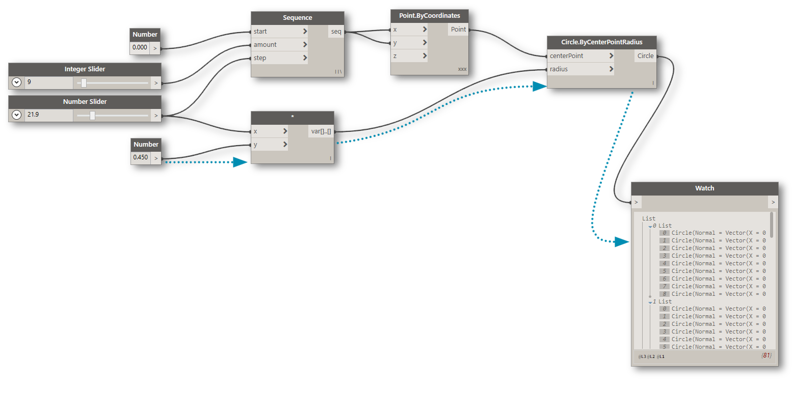
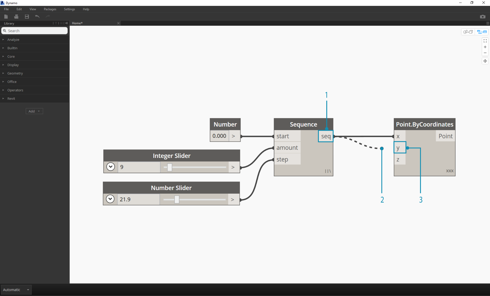

##Wires

Wires connect between Nodes to create relationships and establish the Flow of our Visual Program. We can think of them literally as electrical wires that carry pulses of data from one object to the next.

線路(Wires)連接起節點(Nodes)並建立出視覺化的流程。可以理解成攜帶數據的脈衝線路從一個物件傳遞到下一個物件。

###Program Flow
Wires connect the output Port from one Node to the input Port of another Node. This directionality establishes the **Flow of Data** in the Visual Program. Although we can arrange our Nodes however we desire in the Workspace, because the output Ports are located on the right side of Nodes and the input Ports are on the left side, we can generally say that the Program Flow moves from left to right.

線路(Wires)從一節點的輸出端連接到另一節點的輸入端。這方式建立了視覺化的"數據流"，由於節點(Nodes)輸入端位於左側，輸出端位於右側，當在工作區上放置欲使用的節點將是由左至右的流程所建置的。



###Creating Wires
We create a Wire by left clicking our mouse on a Port and then left clicking on the port of another Node to create a connection. While we are in the process of making a connection, the Wire will appear dashed and will snap to become solid lines when successfully connected. The data will always flow through this Wire from output to input; however, we may create the wire in either direction in terms of the sequence of clicking on the connected Ports.

可以藉由單擊滑鼠左鍵將節點(Node)輸出/輸入端口連接至另一節端的端口。連接的過程線路(Wires)將是虛線，而成功連接才會成為實線。數據始終是由輸出端經由線路通往輸入端，然而我們可以從任何一端單擊滑鼠左鍵拉出線路(Wires)連接。

> Tip: Before completing the connection with your second click, allow the Wire snap to a Port and hover your mouse there to see the Port tooltip.

提示：在使用第二次單擊完成連接之前，請將線路(Wires)對準到端口，將遊標懸停在那裡，以查看輸出/輸入端的提示。


>1. Click on the ```seq``` output Port of the Number Sequence Node
2. As you are moving your mouse towards another Port, the Wire is dashed
3. Click on the ```y``` input Port of the Point.ByCoordiantes to complete the connection

1.單擊數字序列節點的輸出端口"seq"
2.當滑鼠游標移至另一輸入端口，線路會是虛線。
3.在Point.ByCoordiantes的輸入端"y"單擊左鍵即完成連接。

###Editing Wires
Frequently we will want to adjust the Program Flow in our Visual Program by editing the connections represented by the Wires. To edit a Wire, left click on the input Port of the Node that is already connected. You now have two options:

通常，我們會經由編輯線路(Wires)來調整視覺化的程序，編輯線路要單擊左鍵已連接的輸入端口，你將有兩個選項:


> 1. Existing Wire
2. To change the connection to an input Port, left click on another input Port
3. To remove the Wire, pull the Wire away and left click on the Workspace

1.點選線路(Wire)
2.修改與輸入端口的連接，請單擊左鍵另一個輸入端口
3.移除線路，拉開線路並單擊左鍵工作區


###Wire Previews
By default, our Wires will be previewed with a gray stroke. When a Node is selected, it will render any connecting Wire with the same aqua highlight as the Node.

在一般的情況之下，我們的線路將呈現灰階的狀態。當點選一個節點時，將使任何連接的線路具有與節點相同的明亮度。


> 1. Default Wire
2. Highlighted Wire

1.一般線路
2.高明亮度線路


Dynamo also allows us to customize how our Wires look in the Workspace through the View > Connectors Menu. Here we can toggle between Curve or Polyline Wires or turn them off all together.

Dynamo也可以讓我們在選項視圖(View)中的連接器(Connectors)來定義工作區中的線路。我們可以在它們在曲線與聚合線中轉換，或者將他們一起關閉。


> 1. Connector Type: Curves
2. Connector Type: Polylines

1.連接器類型: 曲線
2.連接器類型: 聚合線

