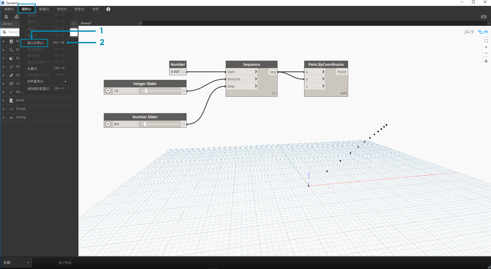
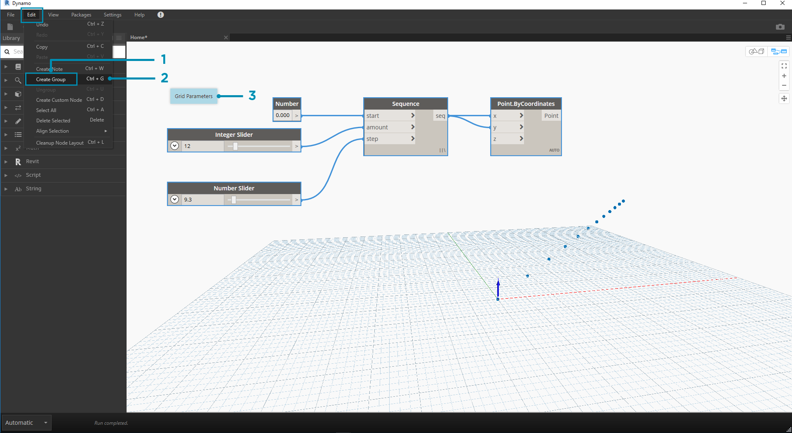

## 管理您的程式

使用視覺程式設計流程可能是一個功能強大的創意活動，但很快，程式流和關鍵使用者輸入就可被工作區的複雜度和/或佈置遮蔽。讓我們先檢閱一些有關管理程式的最佳實務。

### 對齊

當我們新增更多節點至工作區時，我們可能要重新組織節點的佈置以使其更加清楚明瞭。透過選取多個節點，然後對工作區按一下右鍵，會顯示「彈出視窗」，其中包括 **對齊選取**功能表以及在 X 和 Y 方向的調整和分佈選項。

> 1. 選取多個節點
2. 對工作區按一下右鍵。
3. 使用**「對齊選取」** 選項

### 註釋

具有一些經驗後，我們可以透過檢閱節點名稱並遵循程序流來「讀取」視覺程式。對於所有經驗層次的使用者，包括純語言標籤和說明也是很好的做法。Dynamo 具有**「註釋」**節點，該節點提供一個可編輯文字欄位來進行註釋。 我們可以將註釋新增至工作區的方法有兩種：

> 1. 瀏覽至功能表「編輯」>「建立註釋」
2. 使用鍵盤快速鍵 Ctrl + W

將註釋新增至工作區時，會蹦現一個文字欄位可讓我們編輯註釋中的文字。建立之後，我們可以透過按兩下「註釋」節點或按一下右鍵來編輯註釋。

### 分組

當我們的視覺程式變得很大時，識別將執行的較重要步驟將很有幫助。我們可以將節點的較大集合高亮顯示為一個**「群組」**，以使用背景彩色矩形和標題作為其標籤。 有三種方式可以使群組具有一個以上的所選節點：

> 1. 瀏覽至功能表「編輯」>「建立群組」
2. 使用鍵盤快速鍵 Ctrl + G
3. 在「工作區」上按一下右鍵並選取「建立群組 」

建立群組後，我們可以編輯其設定，例如標題和顏色。

> 提示：使用註釋和群組是註解檔案並提高可讀性的有效方法。

這裡我們對 2.4 部分中的程式新增了註釋和群組：

> 1. 註釋：「網格參數」
2. 註釋：「網格點」
3. 群組：「建立網格點」
4. 群組：「建立吸引子點」
5. 註釋：「校正距離值」
6. 註釋：「圓形的變數網格」

