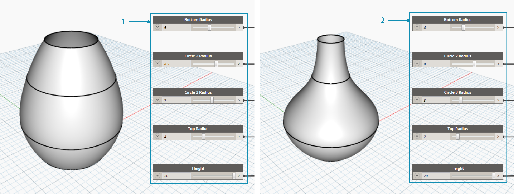
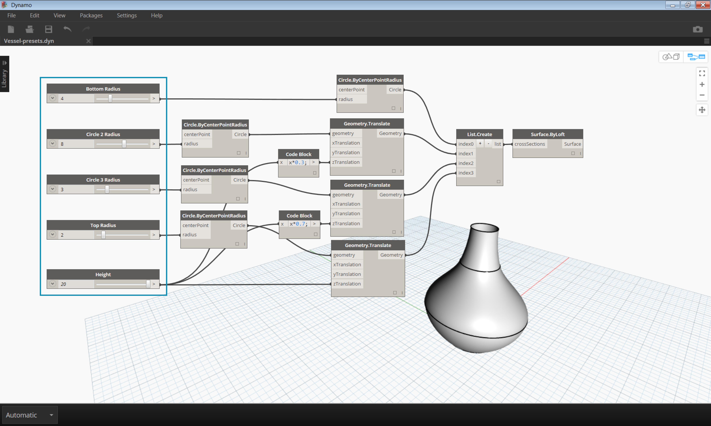
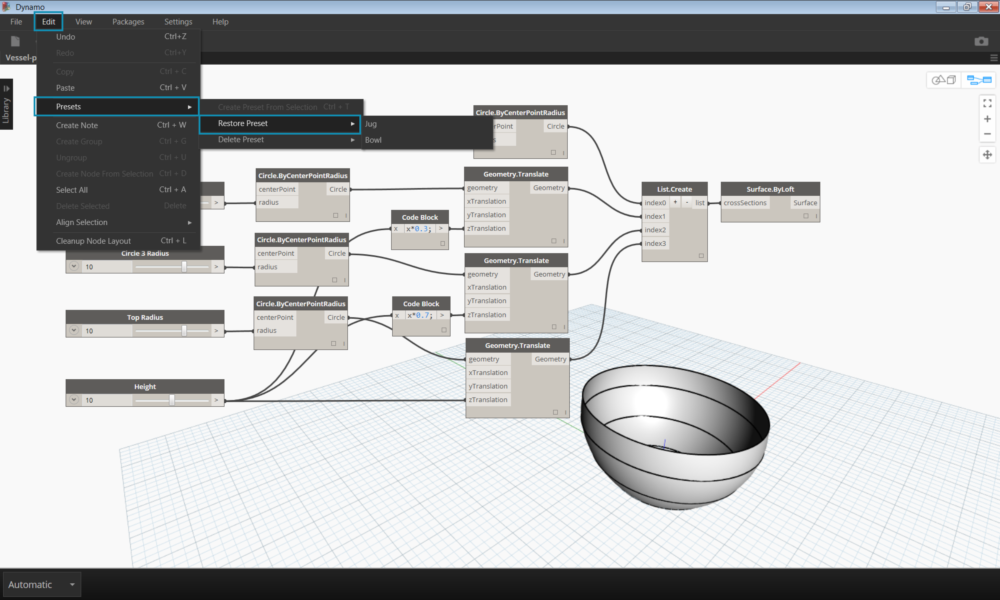
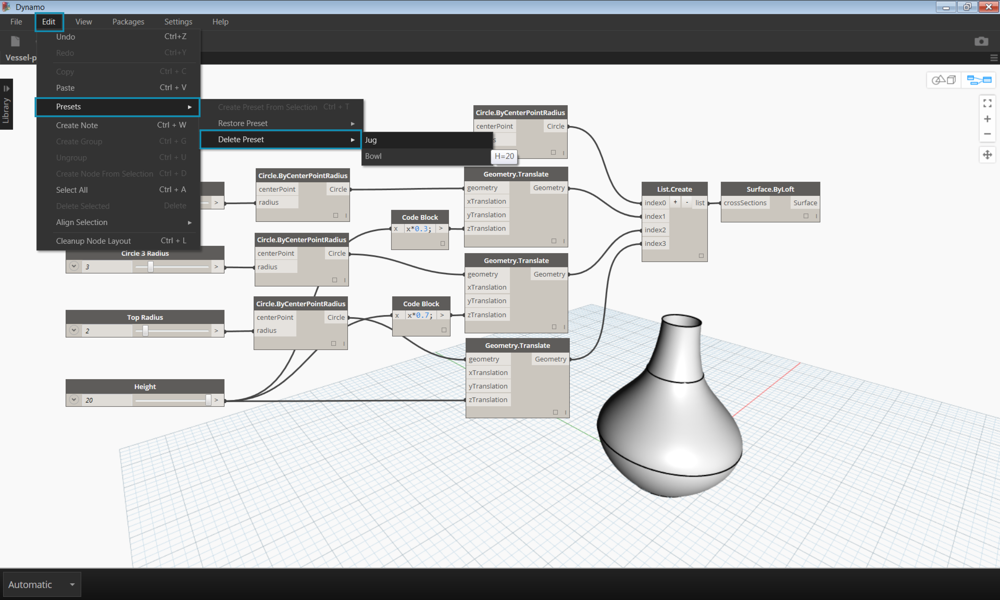

## 使用預設值管理您的資料

在前一部分中，我們瞭解了透過對齊、分組和註釋節點來組織工作區，從而管理程序。這些最佳實務有助於減少圖形的部分視覺複雜性。現在，讓我們更深入地瞭解並組織內容複雜性。通常，Dynamo 圖形具有各種參數，以提供無數迭代反覆運算。我們要組織各種選項，以便我們可以作出真實的設計決策 - 這時預置就可以發揮其作用。

假設您已建立了 Dynamo 圖形以與團隊共用，以便每個團隊成員可以探索參數式模型。您的團隊成員有一定的視覺程式設計經驗，因此您想要為其提供一些方向來探索不同的設計模式。最簡單、最使用者友善的方法是使用預置 - 您可以設置任何數量的參數來定義一個特定設計反覆運算。這容許您重新載入先前的模式，並以參數方式對其進行處理。

### 預置

預置是一種採用所選輸入節點的現行值並將其儲存成預置狀態的方式。這些狀態可以透過「編輯」>「預置」功能表來還原。預置可以用來建立和比較設計反覆運算。預置儲存於檔案中，這使得它們成為共用或提出意見的有用工具。它們還允許其他使用者與圖形交互，而不必搜尋相關的輸入，或從設計角度調整一組能夠互相搭配使用的值。

> 1. 預置 1
2. 預置 2

### 建立預置

> 下載本練習隨附的範例檔案 (按一下右鍵，然後按一下「鏈結另存為...」)： [Prests.dyn](datasets/3-5/Presets.dyn)。 附錄中提供範例檔案的完整清單。

要建立預置，請選取一個或多個輸入節點。在畫布上按一下右鍵，然後選取「根據所選節點建立預置」， 或按下 Ctrl + T。 讓我們查看範例。下面是一個簡單的圖形，該圖形沿著一系列圓圈上升從而建立一個表面。

> 1. 圖形的輸入一系列控制高度和半徑的滑塊

> 選取輸入滑塊並按 CTRL + T

> 在對話框中輸入所儲存狀態的名稱和說明。建立具有不同輸入值的多種狀態。

### 還原預置

若要還原儲存的預置，導覽至「編輯」>「預置」>「還原預置」。這會將該狀態的所有節點設定為儲存的值。如果節點的狀態不再存在於圖形中 (例如，已刪除) ，則將設置所有處於該狀態的節點。

### 刪除預置

要刪除預置，導覽至「編輯」>「預置」>「刪除預置」。這將會從所儲存狀態清單中移除一個狀態。

