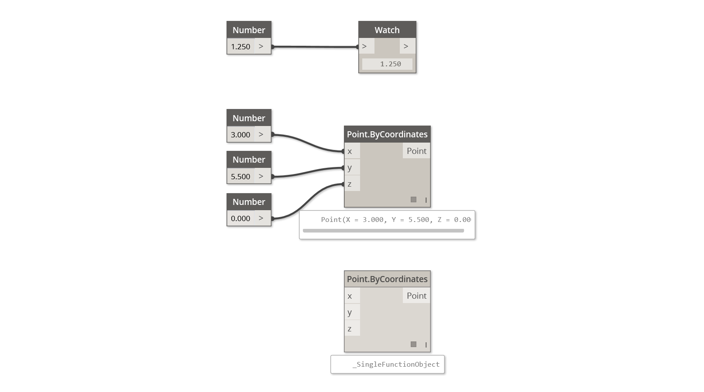
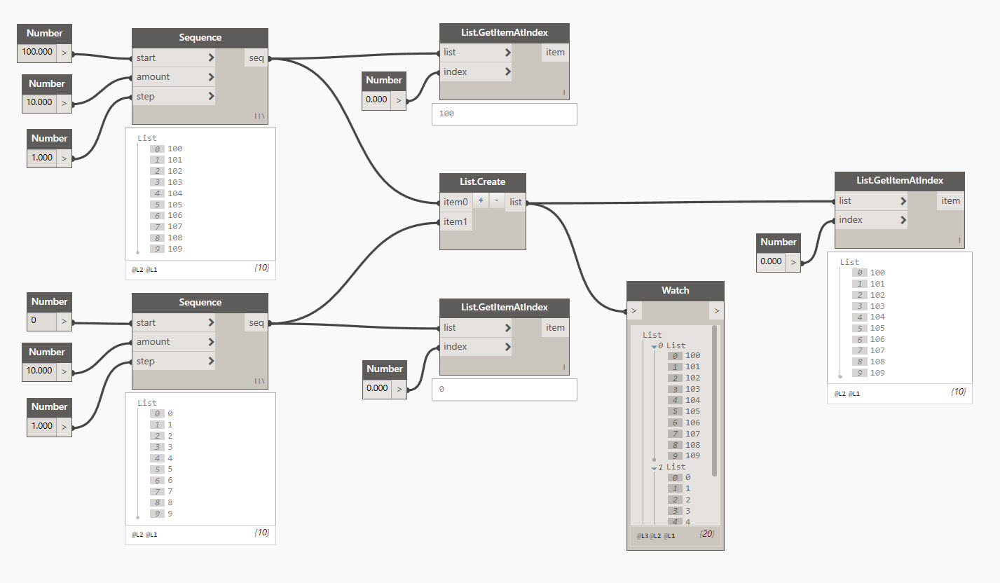
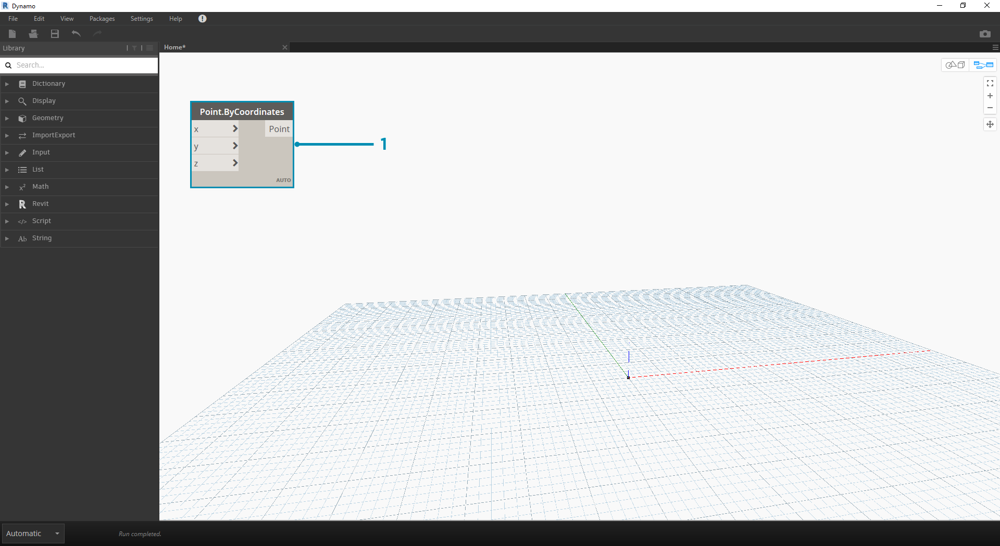
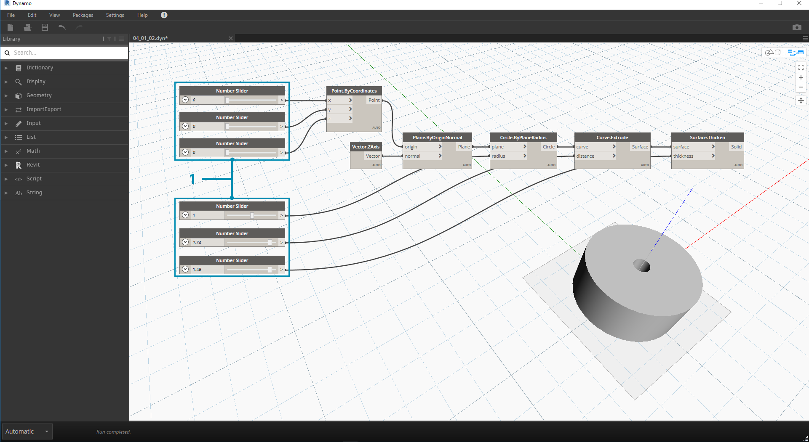
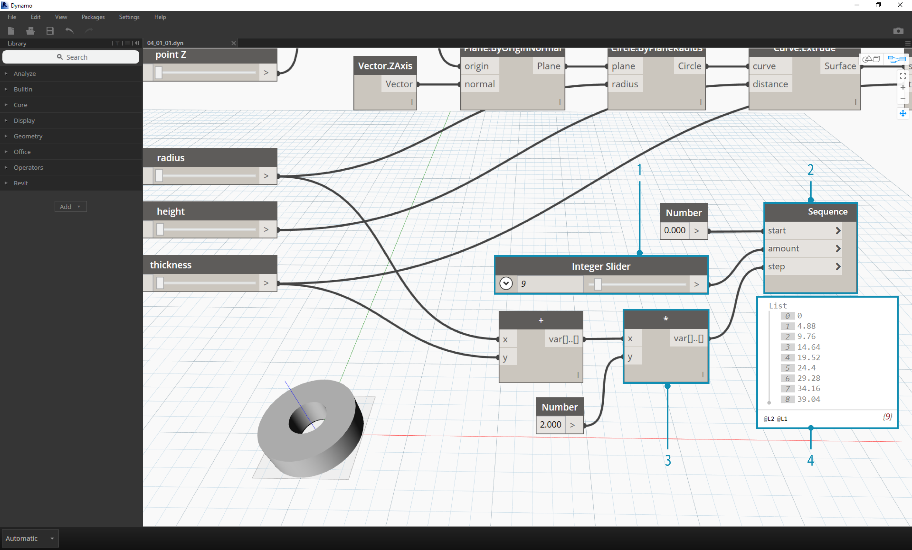
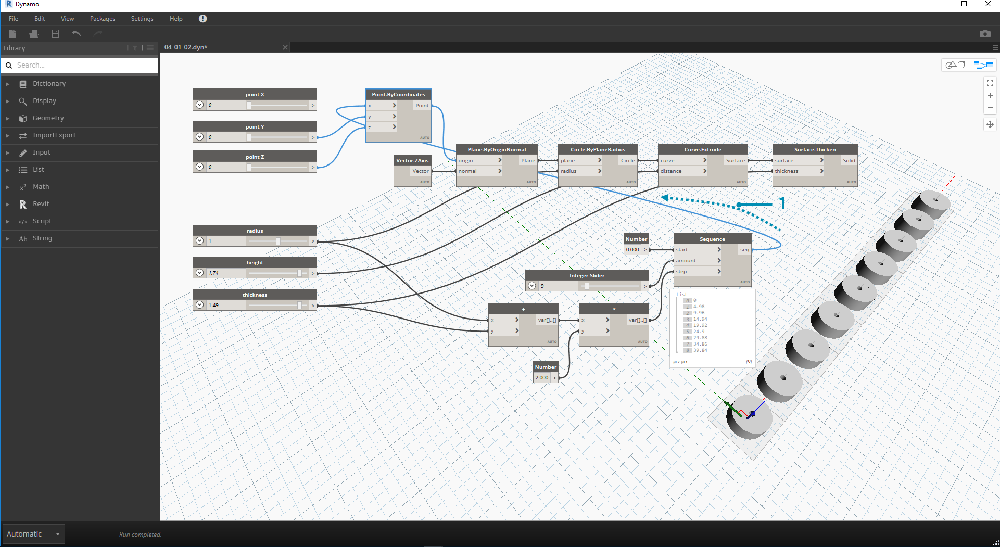
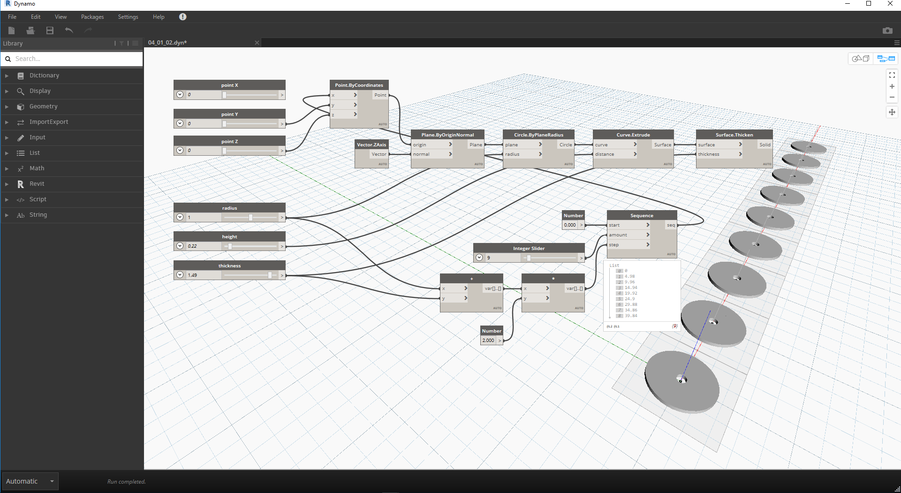

## 資料

資料是程式的內容。它會通過線路向節點提供輸入，並在節點中經過處理變為新形式的輸出資料。接下來我們將檢閱資料的定義、構建方式，並開始在 Dynamo 中使用資料。

### 什麼是資料？

資料是一組定性或定量變數的值。形式最簡單的資料是數字，例如 ```0```、```3.14``` 或 ```17```。但是資料也有許多不同類型：表示變化數字的變數 (```高度```)、字元 (```myName```)、幾何圖形 (```圓```)，或資料項目的清單 (```1,2,3,5,8,13,...```)。我們需要將資料加入至 Dynamo 節點的輸入連接埠 - 我們可以對資料不採取動作，但必須有資料才能處理節點所代表的動作。將節點加入至工作區後，如果未提供任何輸入，則結果將是函數，而不是動作本身的結果。



> 1. 簡單資料
2. 資料與動作 (節點) 已成功執行
3. 無資料輸入的動作 (節點) 將傳回一般函數

### 注意空值

```「null」``` 類型代表沒有資料。雖然這是抽象概念，但是您在使用視覺程式設計時可能已瞭解這一點。若某動作無法建立有效的結果，該節點會傳回空值。測試空值及移除資料結構中的空值是建立功能強大的程式至關重要的構成部分。

|圖示|名稱/語法|輸入|輸出|
| -- | -- | -- | -- |
||Object.IsNull|obj|布林|

### 資料結構

執行視覺程式設計時，會很快產生大量資料，需要對其階層採用某種管理方式。承擔此角色的是資料結構，即我們儲存資料所採用的組織配置。資料結構的詳細資料及使用方法視程式設計語言而不同。在 Dynamo 中，我們透過清單將階層加入至資料。我們將在後續章節中深入探索這一功能，不過接下來先從簡單的內容開始：

清單代表一種資料結構中放置的一系列項目：

* 我的手 (*清單*) 有五根手指 (*項目*)。
* 我所在的街道 (*清單*) 有十棟房子 (*項目*)。



> 1. **Number Sequence** 節點使用*「開始」*、*「數量」*及*「步長」*輸入來定義數字清單。使用這些節點，我們已建立兩個包含十個數字的獨立清單，其中一個清單的範圍是 *100-109*，另一個的範圍是 *0-9*。
2. **List.GetItemAtIndex** 節點會以特定的索引選取清單中的項目。若選擇 *0*，即可取得清單中的第一個項目 (在此案例中是 *100*)。
3. 對第二個清單套用相同的程序，取得值 *0*，即清單中的第一個項目。
4. 現在，我們使用 **List.Create** 節點將兩個清單合二為一。請注意，節點會建立*清單的清單。*這會變更資料結構。
5. 再次使用 **List.GetItemAtIndex** 時，將索引設定為 *0*，即可取得清單之清單中的第一個清單。這意味著將清單視為項目，這與其他腳本語言略有不同。在稍後的章節中，我們將透過清單操控與資料結構取得更高級的結果。

理解 Dynamo 中資料階層的關鍵概念：**對資料結構而言，會將清單視為項目。**換言之，Dynamo 採用由上而下的程序瞭解資料結構。這意味著什麼？接下來我們舉例說明。

### 使用資料建立圓柱鏈

> 下載此練習隨附的範例檔案 (按一下右鍵，然後按一下「連結另存為...」)：[建置程式區塊 - Data.dyn](datasets/4-1/Building Blocks of Programs - Data.dyn)。附錄中提供範例檔案的完整清單。

在這第一個範例中，我們將組裝薄殼圓柱，這將使用我們在本節中討論的幾何圖形階層。

> 1. **Point.ByCoordinates -** 加入節點至圖元區後，我們會在 Dynamo 預覽網格的原點看到某個點。*x、y* 與 *z* 輸入的預設值是 *0.0*，因此該點位於此位置。


> 1. **Plane.ByOriginNormal -** 幾何圖形階層的下一步是平面。有數種方式可以建構平面，我們將使用原點與法線作為輸入。原點是上一步驟中建立的點節點。
2. **Vector.ZAxis -** 這是 z 方向的單位化向量。請注意，沒有輸入，只有值為 [0,0,1] 的向量。我們將此用作 *Plane.ByOriginNormal* 節點的*法向*輸入。由此將在 Dynamo 預覽中產生矩形平面。


> 1. **Circle.ByPlaneRadius -** 接下來是階層，現在我們使用上一步驟中建立的平面來建立曲線。插入至節點後，即可取得位於原點的圓。節點的預設半徑值為 *1*。


> 1. **Curve.Extrude -** 現在我們指定深度與第三個延伸方向，讓其成為比較常見的形狀。此節點將以擠出方式根據曲線建立曲面。節點上的預設距離為 *1*，我們應該會在視埠中看到圓柱。


> 1. **Surface.Thicken** - 此節點會將曲面偏移指定的距離並封閉外形，以產生封閉實體。預設厚度值為 *1*，我們應該會在視埠中看到符合這些值的薄殼圓柱。


> 1. **Number Slider -** 我們接下來不使用所有這些輸入的預設值，而是對模型加入一些參數式控制。
2. **Domain Edit - **加入數字滑棒至圖元區後，按一下左上方的脫字字元以顯示範圍選項。
3. **Min/Max/Step -** 分別將 *min*、*max* 與 *step* 值變更為 *0*、*2* 與 *0.01*。我們這樣做是為了控制整體幾何圖形的大小。



> 1. **Number Sliders -** 在所有的預設輸入中，我們多次複製並貼上此數字滑棒 (選取滑棒，按一下 Ctrl+C，然後按一下 Ctrl+V)，直到具有預設值的所有輸入都改用滑棒為止。某些滑棒值必須大於零，以便讓定義生效 (例如：若要增厚曲面，需要有擠出深度)。

現在我們已使用這些滑棒建立參數式薄殼圓柱。嘗試調整其中某些參數，即可在 Dynamo 視埠中看到幾何圖形的動態更新。


> 1. **Number Sliders -** 在此基礎上更進一步，我們在圖元區上加入了許多滑棒，並需要清理剛剛建立的工具介面。在滑棒上按一下右鍵，選取「更名...」，然後變更每個滑棒的名稱以適當表述其參數。您可以參考上方的影像進行更名。

現在，我們已建立良好的增厚圓柱。這目前只是一個物件，接下來我們瞭解如何建立保持動態連結的一系列圓柱。為了實現這一點，我們將建立圓柱清單，而不是使用單一項目。


> 1. **加 (+) -** 我們的目標是在已建立的圓柱旁，加入一列圓柱。若要在與目前圓柱相鄰的位置加入一個圓柱，需要考慮圓柱的半徑以及薄殼的厚度。我們將滑棒的兩個值相加，即可取得該數值。



> 此步驟較複雜，接下來我們慢慢完成：最終目標是建立數字清單，這些數字會定義圓柱列中每個圓柱的位置。

> 1. **乘 -** 首先，我們要將上一步驟中的值乘以 2。上一步驟中的值表示半徑，我們要將圓柱移動完整直徑的距離。
2. **數字序列 -** 我們使用此節點建立一系列數字。*乘*節點的第一個輸入是上一步驟中的*「步長」*值。可以使用*數字*節點將*「開始」*值設定為 *0.0*。
3. **整數滑棒 - **對於*「大小」*值，我們連接整數滑棒。這會定義所建立圓柱的數量。
4. **輸出 - **此清單會顯示每個圓柱在陣列中的移動距離，並由原始滑棒進行參數式驅動。



> 1. 此步驟足夠簡單 - 將上一步驟中定義的序列插入至原始 *Point.ByCoordinates* 的 *x* 輸入。這將取代我們可以刪除的 *pointX* 滑棒。現在，我們將在視埠中看到一系列圓柱 (請確保整數滑棒大於 0)。



> 圓柱鏈仍動態連結至所有滑棒。調整每個滑棒可以查看定義更新！

