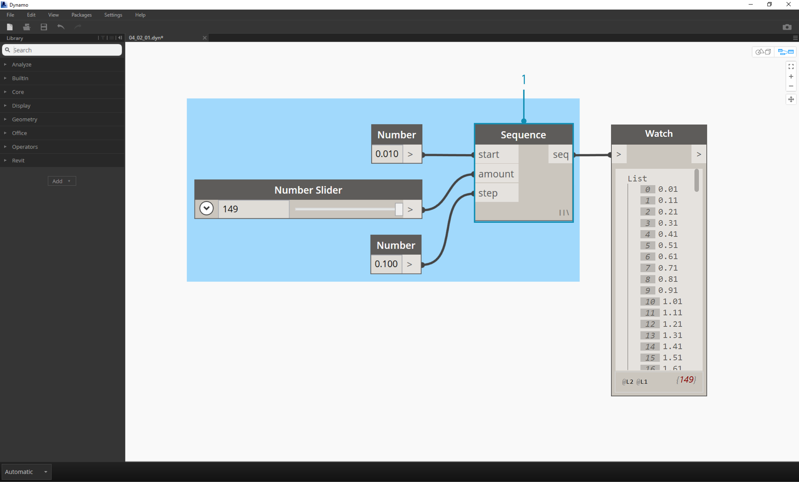
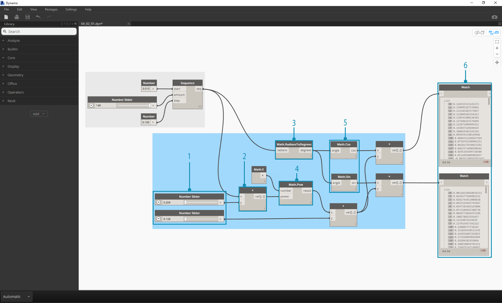
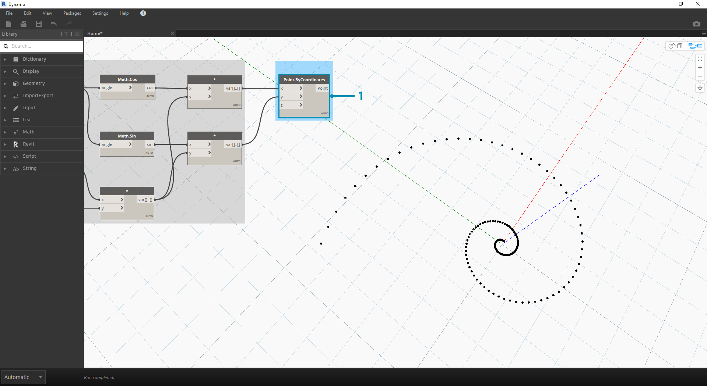
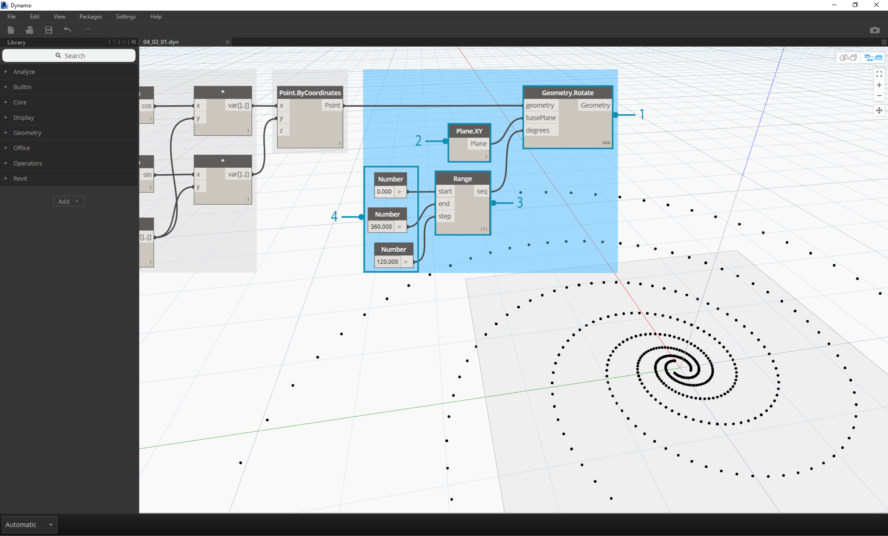

## 數學

如果資料最簡單的形式是數字，則關聯這些數字最簡單的方式就是透過數學運算。從諸如除號等簡單運算子到三角函數，再到更複雜的公式，數學是開始探索數字關係與樣式的良好方式。

### 算術運算子

運算子是一組元件 (加、減、乘、除等)，使用代數函數與兩個數字輸入值，產生一個輸出值。在「運算子」>「動作」下可以找到這些運算子。

|圖示|名稱|語法|輸入|輸出|
| -- | -- | -- | -- | -- |
||加入|+|var[]...[]、var[]...[]|var[]...[]|
||減|-|var[]...[]、var[]...[]|var[]...[]|
||乘|*|var[]...[]、var[]...[]|var[]...[]|
||除|/|var[]...[]、var[]...[]|var[]...[]|

### 參數式公式

> 下載此練習隨附的範例檔案 (按一下右鍵，然後按一下「連結另存為...」)：[Building Blocks of Programs - Math.dyn](datasets/4-2/Building Blocks of Programs - Math.dyn)。附錄中提供範例檔案的完整清單。

以運算子為基礎，下一個邏輯步驟是合併運算子與變數，以便透過**公式**構成更複雜的關係。接下來建立可透過輸入參數 (例如滑棒) 控制的公式。

> 1. **Number Sequence：**根據以下三項輸入定義數字序列：*start、amount* 與 *step*。此序列表示參數式方程式中的「t」，因此，我們希望使用大到足以定義螺旋線的清單。

上述步驟已建立用於定義參數範圍的數字清單。定義黃金螺旋線的方程式如下：= 與 =。以下節點群組以視覺程式設計的形式表示此方程式。

> 逐步檢查節點群組時，請盡力注意視覺程式與書寫方程式之間的對應。

> 1. **Number Slider：**將兩個數字滑棒加入至圖元區。這些滑棒代表參數式方程式中的 *a* 與 *b* 變數。這些表示靈活的常數，或表示我們可以針對所需結果進行調整的參數。
2. ***：**乘法節點由星號表示。我們會重複使用此符號連接相乘的變數
3. **Math.RadiansToDegrees：**「*t*」值需要轉換為度，才能在三角函數中演算。請記住，為了對這些函數進行演算，Dynamo 預設使用度為單位。
4. **Math.Pow：**做為「*t*」與數字「*e*」的函數，此函數會建立 Fibonacci 序列。
5. **Math.Cos 與 Math.Sin：**這兩個三角函數將分別區分每個參數式點的 X 座標與 Y 座標。
6. **Watch：**現在可以看到輸出是兩個清單，分別是產生螺旋線所用點的 *x* 與 *y* 座標。

### 從公式到幾何圖形

現在，上一步中的眾多節點會很有效，但工作量很大。若要建立更高效的工作流程，請看**程式碼塊** (第 3.3.2.3 節)，它能將 Dynamo 表示式的字串定義為一個節點。在接下來的一系列步驟中，我們將瞭解使用參數式方程式來繪製 Fibonacci 螺旋線。

> 1. **Point.ByCoordinates：**將上方的相乘節點連接到「*x*」輸入，將下方的節點連接到「*y*」輸入。現在我們可以在螢幕上看到點的參數式螺旋線。

> 1. **Polycurve.ByPoints：**將上一步的 Point.ByCoordinates 連接到*點*。我們可以保留 *connectLastToFirst* 無輸入，因為不打算繪製封閉曲線。此作業將建立通過上一步中所定義每個點的螺旋線。

我們現在已完成 Fibonacci 螺旋線！接下來進一步將此分為兩個單獨的練習，我們分別稱之為鸚鵡螺與向日葵。這些是自然系統的抽象，但會良好展示 Fibonacci 螺旋線的兩種不同應用。

### 從螺旋線到鸚鵡螺

> 1. 做為起點，我們先執行上一個練習中的相同步驟：使用 **Point.ByCoordinates** 節點建立點的螺旋線陣列。

> 1. **Polycurve.ByPoints：**再說一次，這是上一個練習中的節點，我們將用做參考。
2. **Circle.ByCenterPointRadius：**我們在此處將使用圓節點，採用與上一步相同的輸入。半徑的預設值為 *1.0*，所以我們可以立即看到輸出的圓。它會立即清晰展示點如何進一步偏離原點。

> 1. **Circle.ByCenterPointRadius：**為了建立更具動態的圓陣列，我們將原始數字序列 (「*t*」序列) 插入到半徑值中。
2. **Number Sequence：**這是「*t*」的原始陣列。透過將此序列插入到半徑值中，圓心仍會進一步偏離原點，但半徑會增大，從而產生很酷的 Fibonacci 圓形。如果您使用 3D 製作會更酷！

### 從鸚鵡螺到葉序樣式

現在我們已經建立圓形的鸚鵡螺殼，接下來使用參數式格線。我們將對 Fibonacci 螺旋線使用基本旋轉，以建立 Fibonacci 格線，並在[向日葵種子長大後](http://ms.unimelb.edu.au/~segerman/papers/sunflower_spiral_fibonacci_metric.pdf)對結果進行塑型。

> 1. 再說一次，做為起點，我們先執行上一個練習中的相同步驟：使用 **Point.ByCoordinates** 節點建立點的螺旋線陣列。

> 1. **Geometry.Rotate：**存在多個 Geometry.Rotate 選項，請確保選擇以 *geometry*、*basePlane* 及 *degrees* 為輸入的節點。將 **Point.ByCoordinates** 連接至幾何圖形輸入。
2. **Plane.XY：**連接至*基準面*輸入。我們將繞原點旋轉，原點的位置與螺旋線的基準位置相同。
3. **Number Range：**對於以度為單位的輸入，我們希望建立多個旋轉。使用數字範圍元件可以快速實現這一點。將其連接至*度*輸入。
4. **Number：**為了定義數字範圍，以垂直順序將三個數字節點加入至圖元區。從上到下分別指定值為 *0.0、360.0* 與 *120.0*。這些值將驅動螺旋線旋轉。請注意將三個數字節點連接至 **Number Range** 節點後該節點的輸出結果。

輸出開始與漩渦相似。接下來調整某些 **Number Range** 參數，並查看結果的變化：

> 1. 將 **Number Range** 節點的步長大小從 *120.0* 變更為 *36.0*。請注意，這會建立更多旋轉，因此會產生更密的格線。

> 1. 將 **Number Range** 節點的步長大小從 *36.0* 變更為 *3.6*。現在，這會產生密度大得多的格線，螺旋線的定向性變得不清晰。女士們，先生們，我們已經建立了向日葵。

