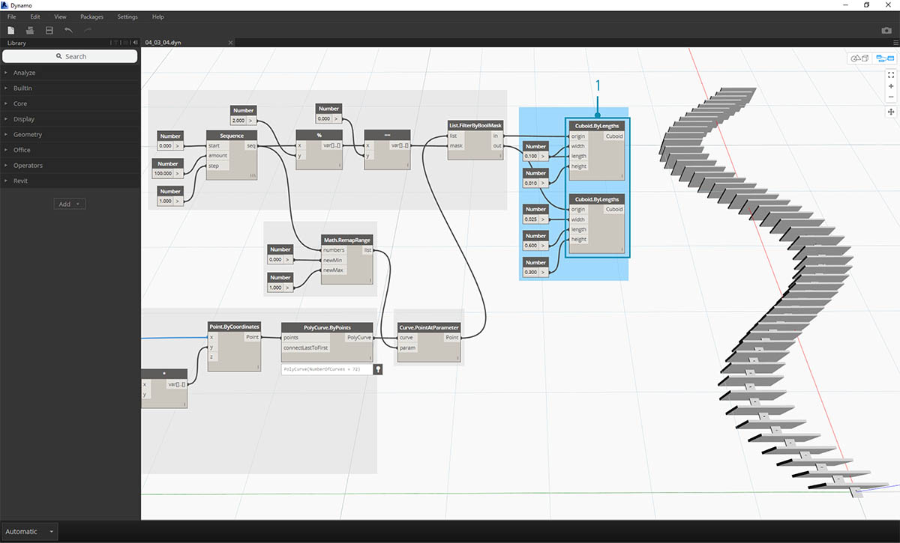

## 邏輯

藉由**邏輯**，或者更明確地說，藉由**條件邏輯**，我們可以根據測試指定單一或一組動作。在評估測試時，將使用布林值表示 ```True``` 或 ```False```，可以由此控制程式流程。

### 布林

數字變數可以儲存所有範圍的不同數字。布林變數只能儲存兩個值，稱為 True 或 False、是或否、0 或 1。由於布林值範圍有限，因此很少使用布林值執行計算。

### 條件陳述式

「If」陳述式是程式設計中的關鍵概念：「如果*這*是真的，則會發生*那件事*，否則會發生*其他事*。」由布林值確定所產生的陳述式動作。在 Dynamo 中，可以採用多種方式定義「if」陳述式：

|圖示|名稱|語法|輸入|輸出|
| -- | -- | -- | -- | -- |
||If|If|test、true、false|result|
||Formula|IF(x,y,z)|x、y、z|result|
||Code Block|(x?y:z)|x、y、z|result|

接下來瞭解使用條件「if」陳述式的三種有效節點中每種節點的簡單範例：


> 在此影像中，*boolean*設為 *true*，這意味著結果是字串*「this is the result if true」。*建立 *If* 陳述式的三個節點在這裡的工作方式完全相同。


> 再說一次，節點的工作方式完全相同。若*boolean*變更為 *false*，則結果是數字 *Pi*，如原始 *If* 陳述式所定義。

### 篩選清單

> 下載此練習隨附的範例檔案 (按一下右鍵，然後按一下「連結另存為...」)：[Building Blocks of Programs - Logic.dyn](datasets/4-3/Building Blocks of Programs - Logic.dyn)。附錄中提供範例檔案的完整清單。

接下來使用邏輯將數字清單分隔為偶數清單與奇數清單。


> 1. **Number Range -** 加入數字範圍至圖元區。
2. **Numbers -** 加入三個數字節點至圖元區。每個數字節點的值應為：*0.0* (*start*)、*10.0* (*end*) 與 *1.0* (*step*)。
3. **Output - ** 輸出是從 0 到 10 的 11 個數字的清單。
4. **模除 (%)-** 將 *Number Range* 連接至 *x*，將 *2.0* 連接至 *y*。這會計算清單中的每個數字除以 2 產生的餘數。此清單的輸出是 0 與 1 交替顯示的數值清單。
5. **相等性測試 (==)** - 加入相等性測試至圖元區。將 *模除* 輸出插入至 *x* 輸入，將 *0.0* 插入至 *y* 輸入。
6. **Watch -** 相等性測試的輸出是 true 與 false 交替顯示的清單。這些值用於分隔清單中的項目。*0* (或 *true*) 表示偶數，*1* (或 *false*) 表示奇數。
7. **List.FilterByBoolMask** - 此節點將根據輸入的布林值，將這些值篩選到兩個不同清單中。將原始 *number range* 插入至 *list* 輸入，將 *equality test* 輸出插入至 *mask* 輸入。輸出 *in* 表示 true 值，而輸出 *out* 表示 false 值。
8. **Watch - ** 結果是我們現在產生了偶數清單與奇數清單。我們已使用邏輯運算子將清單分隔為多種樣式！

### 從邏輯到幾何圖形

接下來我們將建置第一個練習中建立的邏輯，將此設置套用到塑型作業中。


> 1. 我們從上一個練習開始，採用相同的節點。唯一的例外是
2. 我們變更了格式。
3. 輸入值已變更。
4. 我們並未將 in 清單輸入插入至 *List.FilterByBoolMask*。暫時將這些節點放在一旁，它們在稍後的練習中會有用。


> 我們先將節點連接在一起，如以上影像中所示。此節點群組表示定義曲線所用的參數式方程式。一些註記如下：

> 1. **第一個滑棒**的最小值應該是 1，最大值應該是 4，步長應是 0.01。
2. **第二個滑棒**的最小值應該是 0，最大值應該是 1，步長應是 0.01。
3. **PolyCurve.ByPoints** - 若複製以上節點圖，在 Dynamo 預覽視埠中的結果將是正弦曲線。

此處採用的輸入方式：對更具靜態的性質使用數字節點，對更具彈性的性質使用數字滑棒。我們希望保留在這一步開始時定義的原始數字範圍。但是，我們在此建立的正弦曲線應具有某些彈性。我們可以移動這些滑棒以觀看曲線對其頻率與幅度的更新。


> 我們將對定義進行一些調整，因此接下來看一下最終結果，以便可以參考取得的結果。之前，前兩個步驟是分別執行的，現在我們要連接兩者。我們將使用基準正弦曲線以驅動拉鍊元件的位置，並使用 true/false 邏輯實現大小方塊的交替變化。


> 1. **Math.RemapRange** - 接下來使用步驟 01 中建立的數字序列，透過重新對映範圍建立新的數字系列。步驟 01 中的原始數字介於 0-100 之間。現在這些數字的範圍分別由 *newMin* 與 *newMax* 輸入限制為從 0 至 1。


> 1. **Curve.PointAtParameter** - 將步驟 2 中的 *Polycurve.ByPoints* 插入至*curve*，將 *Math.RemapRange* 插入至 *param*。此步驟將建立沿曲線的點。我們將數字重新對映到從 0 至 1 的範圍，因為 *param* 的輸入會尋找此範圍內的值。*0* 值表示起點，*1* 值表示終點。演算的所有數字都位於 *[0,1]* 範圍內。


> 1. **List.FilterByBoolMask** - 將上一步中的 *Curve.PointAtParameter* 插入至 *list* 輸入。
2. **Watch -** *in* 的 Watch 節點與 *out* 的 Watch 節點將展示分別代表偶數項與奇數項的兩個清單。這些點按照在曲線上的位置順序排序，我們將在下一步中展示這一點。



> 1. **Cuboid.ByLengths** - 重新建立以上影像中顯示的連接，以產生沿正弦曲線的拉鍊。立方體在這裡只是方塊，我們將根據方塊中心的曲線點定義其大小。現在，模型中應該已清晰呈現偶數/奇數的區分邏輯。


> 1. **Number Slider -** 返回定義的開始，我們可以調整數字滑棒，然後觀看拉鍊更新。頂部的一列影像表示頂部數字滑棒的範圍值。這是波的頻率。
2. **Number Slider -** 底部的一列影像表示底部滑棒的範圍值。這是波的幅度。

