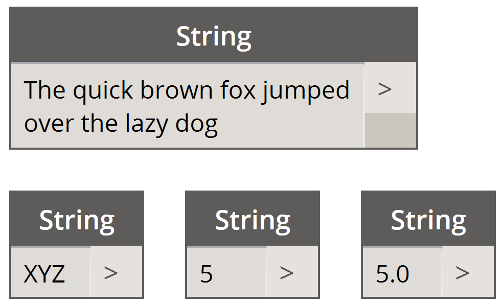
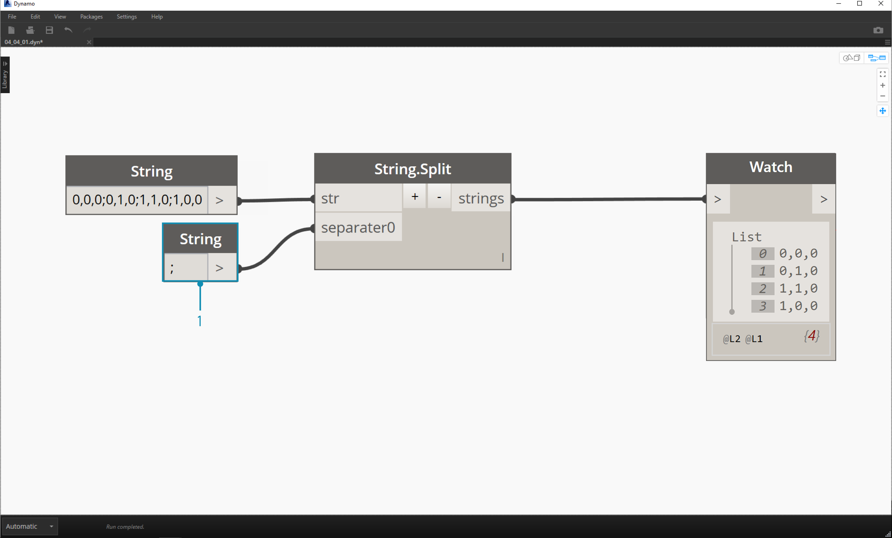
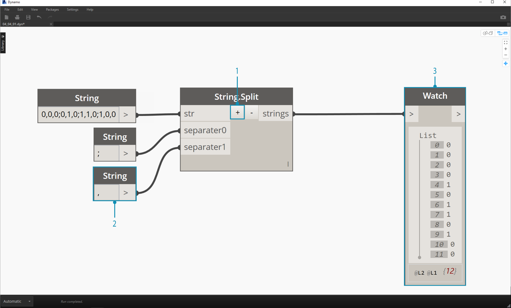
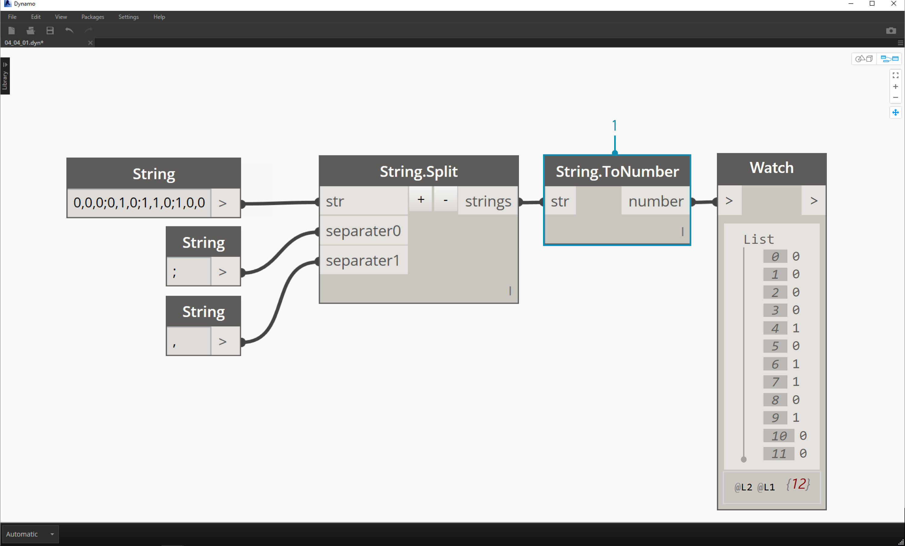
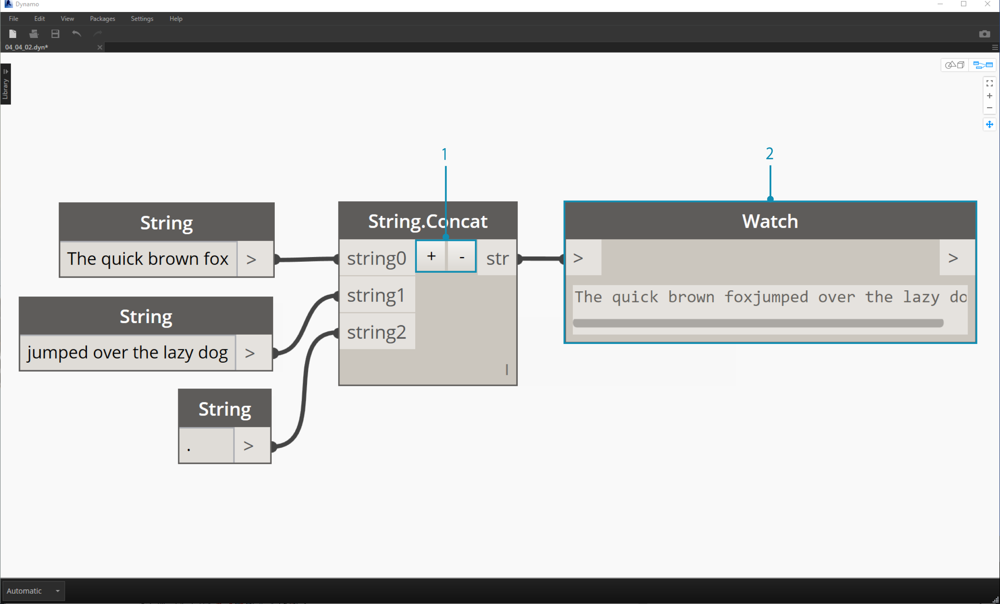
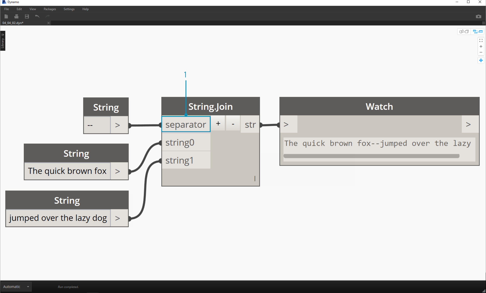
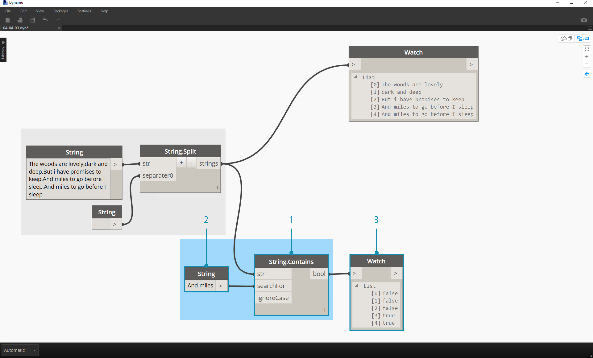
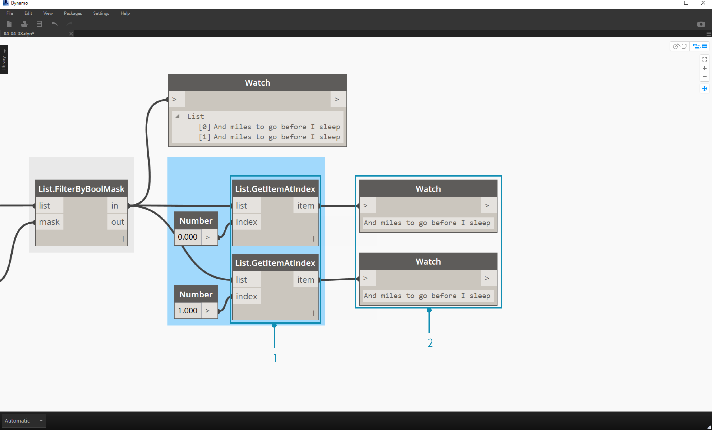
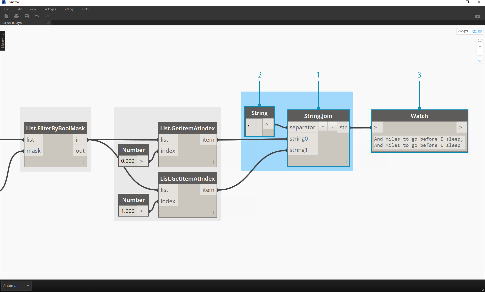

## 字串

正式的說法是，**字串**是字元的序列，表示文字常數或某些類型的變數。非正式的說法是，字串是文字式的程式設計行話。我們曾使用數字 (整數與小數) 來驅動參數，現在使用文字也可以做到這一點。

### 建立字串

字串可以用於多種應用，包括定義自訂參數、註解文件集，以及剖析文字式資料集。字串節點位於 Core > Input 。

> 以上範例節點是字串。可將數字表示為字串、字母或文字陣列。

### 查詢字串

> 下載此練習隨附的範例檔案 (按一下右鍵，然後按一下「連結另存為...」)：[Building Blocks of Programs - Strings.dyn](datasets/4-5/Building Blocks of Programs - Strings.dyn)。附錄中提供範例檔案的完整清單。

透過查詢字串，您可以快速剖析大量資料。我們將討論一些基本作業，這些作業可以加快工作流程，有助於提高軟體互通性。

以下影像將考慮來自外部工作表的資料字串。該字串表示 XY 平面內某矩形的頂點。接下來在小練習中詳細瞭解某些字串分割作業：

> 1. 「;」分隔符號分隔矩形的每個頂點。這將建立清單，其中包含分別表示每個頂點的 4 個項目。

> 1. 透過按一下節點中部的「*+*」，可以建立新分隔符號。
2. 加入「*,*」字串至圖元區，並插入至新的分隔符號輸入。
3. 現在結果將產生含十個項目的清單。節點會先根據 *separator0* 進行分割，然後根據 *separator1* 進行分割。

雖然以上項目清單可能看起來像數字，但是在 Dynamo 中，仍將其視為單獨的字串。若要建立點，需要將其資料類型從字串轉換為數字。我們使用 String.ToNumber 節點實現這一點。

> 1. 本節點非常簡單。將 String.Split 結果插入至輸入。輸出看上去似乎相同，但現在資料類型是 *number* 而不是 *string*。

> 1. 透過其他某些基本作業，我們現在已根據原始字串輸入，在原點繪製了矩形。

### 操控字串

由於字串是一般文字物件，因此可以適用於多種應用。接下來我們看一下在 Dynamo 的 Core > String 中的一些主要動作：

這種方法可以按順序合併兩個字串。它會提取清單中的每個文字字串，然後建立一個合併後的字串。

> 以上影像表示連接三個字串：

> 1. 按一下節點中心的「+/-」按鈕，可以加上或減去連接的字串。
2. 輸出是一個連接後的字串，其中包括空格與標點。

接合方法非常類似於連接，只是會加入標點。

如果您曾使用 Excel，可能會遇到 CSV 檔案。CSV 表示以逗號分隔的值。可以使用逗號 (或此案例中的兩條虛線) 做為分隔符號搭配接合節點，以建立類似的資料結構：

> 以上影像表示接合兩個字串：

> 1. 藉由分隔符號輸入，可以建立對接合後的字串進行分割的字串。

### 使用字串

在此練習中，我們將使用字串的查詢與操控方法解構 Robert Frost 的 [Stopping By Woods on a Snowy Evening](http://www.poetryfoundation.org/poem/171621) 的最後一節。這並不是字串最實用的應用，但將其套用至清晰的節奏與韻律時，將有助於我們掌握概念字串的動作。

> 接下來從這一節的基本字串分割開始。首先，我們注意到書寫格式的依據是逗號。我們將使用此格式將每行分隔為個別項目。

> 1. 將基準字串貼至字串節點。
2. 另一個字串節點用來表示分隔符號。在此案例中，我們將使用逗號。
3. 將 String.Split 節點加入至圖元區，並連接至兩個字串。
4. 輸出顯示我們現在已將各行分隔為個別元素。

> 現在，我們來到該詩的美妙部分：最後兩行。原始的一節是一個資料項目。在第一步，我們已將此資料分隔為個別項目。現在，我們需要搜尋要尋找的文字。雖然我們*可以*透過選取清單中的最後兩個項目來實現這一點，但是如果是整本書，我們不希望通讀所有內容然後手動隔離元素。

> 1. 我們不是手動搜尋，而是使用 String.Contains 節點對一組字元執行搜尋。這類似於文字處理器中的「尋找」指令。在此案例中，會傳回「true」，若項目中找到該子字串，會傳回「false」。
2. 在「searchFor」輸入中，我們會定義將在該節中尋找的子字串。接下來搭配使用字串節點與文字「And miles」。
3. 輸出是 false 與 true 的清單。在下一步中，我們使用此布林邏輯對元素進行篩選。

> 1. 我們將使用 List.FilterByBoolMask 節點篩選出 false 與 true。「in」輸出會傳回「遮罩」輸入為「true」的陳述式，而「out」輸出會傳回「遮罩」輸入為「false」的陳述式。
2. 「in」的輸出與預期相同，是該節詩句的最後兩行。

> 現在，我們希望合併這兩行，以重複這節詩句。檢視上一步的輸出時，我們注意有清單中有兩個項目：

> 1. 透過兩個 List.GetItemAtIndex 節點，我們可以使用值 0 與 1 做為索引輸入以隔離項目。
2. 每個節點的輸出將是遵循正確順序的最後兩行詩句。

> 為了將這兩個項目合併為一個，我們使用 String.Join 節點：

> 1. 加入 String.Join 節點後，我們注意到需要分隔符號。
2. 為了建立分隔符號，我們加入字串節點至圖元區，然後鍵入逗號。
3. 最終的輸出已將最後兩個項目合併為一個。

這看起來似乎要執行很多工作才能隔離最後兩行，的確，字串作業通常需要某些前置工作。但這些作業可擴充，而且可以相對輕鬆地套用至大型資料集。如果您以參數方式使用工作表與互通性，請確保考慮到字串作業。

