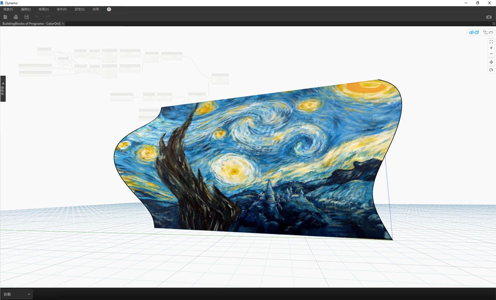

## 色彩

對於營造引人注目的視覺效果以及彩現視覺程式輸出的差異而言，顏色是很棒的資料類型。使用抽象資料及不同的數字時，有時很難查看變更的項目與變更程度。顏色在這裡大有用武之地。

### 建立顏色

在 Dynamo 中使用 ARGB 輸入建立顏色。這對應於 Alpha、紅色、綠色與藍色通道。Alpha 代表顏色的*透明度*，而其他三項用作主要顏色以協同產生顏色的整個光譜。

|圖示|名稱|語法|輸入|輸出|
| -- | -- | -- | -- | -- |
||ARGB 顏色|Color.ByARGB|A、R、G、B|顏色|

### 查詢顏色值

以下表格中的顏色會查詢用於定義顏色的性質：Alpha、紅色、綠色與藍色。請注意，Color.Components 節點會提供所有四項作為不同輸出，因此該節點更適合查詢顏色的性質。

|圖示|名稱|語法|輸入|輸出|
| -- | -- | -- | -- | -- |
||Alpha|Color.Alpha|顏色|A|
||紅|Color.Red|顏色|R|
||綠|Color.Green|顏色|G|
||藍色|Color.Blue|顏色|B|
||元件|Color.Components|顏色|A、R、G、B|

以下表格中的顏色對應於 **HSB 顏色空間**。將顏色分為色相、飽和度與亮度可以更直觀地解譯顏色：顏色應該是怎樣的？顏色是什麼色彩？顏色的明暗程度應該是怎樣的？這是分別劃分的色相、飽和度與亮度。

|圖示|查詢名稱|語法|輸入|輸出|
| -- | -- | -- | -- | -- |
||色相|Color.Hue|顏色|色相|
||飽和度|Color.Saturation|顏色|飽和度|
||亮度|Color.Brightness|顏色|亮度|

### 顏色範圍

顏色範圍類似於 4.2 節中的 **Remap Range** 節點：可將數字清單重新對映至其他範圍。但它並非對映至*數字*範圍，而是根據介於 0 至 1 的輸入數字對映至*顏色漸層*。

目前節點非常有效，但在首次使用時要面面俱到可能會有些困難。熟悉顏色漸層的最佳方式是以互動方式對其進行測試。接下來我們進行快速練習，以檢閱如何設置輸出顏色對應於數字的漸層。

> 1. **定義三種顏色：**使用代碼區塊節點，透過插入 *0* 與 *255* 的適當組合來定義*紅色、綠色*與*藍色*。
2. **建立清單：**將三種顏色合併到一個清單中。
3. **定義索引：**建立清單以定義每種顏色的掣點位置 (從 0 至 1)。請注意值 0.75 為綠色。這會在顏色範圍滑棒上，將綠色置於水平漸層長度的 3/4 處。
4. **Code Block：**輸入值 (介於 0 至 1 之間) 可以轉換為顏色。

### 顏色預覽

使用 **Display.ByGeometry** 節點可以在 Dynamo 視埠中查看顏色幾何圖形。這有助於區分不同類型的幾何圖形、展示參數式概念，或定義模擬的分析圖例。輸入很簡單：幾何圖形與顏色。為了建立與以上影像類似的漸層，將顏色輸入連接至 **color range** 節點。

### 顏色練習

> 下載此練習隨附的範例檔案 (按一下右鍵，然後按一下「連結另存為...」)：[建置程式區塊 - Color.dyn](datasets/4-5/Building Blocks of Programs - Color.dyn)。附錄中提供範例檔案的完整清單。

本練習的內容主要是以參數式方法控制顏色及幾何圖形。幾何圖形是基本螺旋，在以下使用 **Code Block** (3.2.3) 進行定義。這是快速輕鬆的參數式函數建立方式，由於我們的焦點是顏色 (而不是幾何圖形)，因此我們使用代碼區塊高效建立螺旋線，而不贅述圖元區。隨著手冊改用更先進的材料，我們將更頻繁地使用代碼區塊。

> 1. **Code Block：**定義包含上述公式的兩個代碼區塊。這是快速建立螺旋線的參數式方法。
2. **Point.ByCoordinates：**將代碼區塊的三項輸出插入至節點的座標。

現在我們可以看到建立螺旋線的一系列點。下一步是建立通過這些點的曲線，以便能看到螺旋。

> 1. **PolyCurve.ByPoints：**將 *Point.ByCoordinates* 輸出連接至節點的 *points* 輸入。現在將產生螺旋曲線。
2. **Curve.PointAtParameter：**將 *PolyCurve.ByPoints* 輸出連接至 *curve* 輸入。此步驟的目的是建立沿曲線滑動的參數式牽引點。由於曲線透過參數對點進行演算，因此我們需要輸入 0 與 1 之間的 *param* 值。
3. **Number Slider：**加入至圖元區後，將 *min* 值變更為 *0.0*，*max* 值變更為 *1.0*，*step* 值變更為 *0.01*。將滑棒輸出插入至 *Curve.PointAtParameter* 的 *param* 輸入。現在，我們將看到沿螺旋線的長度由滑棒的百分比表示的點 (0 表示起點，1 表示終點)。

建立參考點後，現在我們比較從參考點到螺旋原始定義點的距離。此距離值將驅動幾何圖形與顏色。

> 1. **Geometry.DistanceTo：**將 *Curve.PointAtParameter* 輸出連接至*輸入*。將 *Point.ByCoordinates* 連接至*幾何圖形輸入。
2. **Watch：**產生的結果將顯示從每個螺旋點至曲線上參考點之距離的清單。

下一步驟是使用從螺旋點至參考點之距離的清單來驅動參數。我們將使用這些距離值來定義曲線上一系列圓球的半徑。若要讓圓球保持合適的大小，我們需要*重新對映*距離值。

> 1. **Math.RemapRange：**將 *Geometry.DistanceTo* 輸出連接至數字輸入。
2. **Code Block：**將值為 *0.01* 的代碼區塊連接至 *newMin* 輸入，將值為 *1* 的代碼區塊連接至 *newMax* 輸入。
3. **Watch：**將 *Math.RemapRange* 輸出連接至一個節點，將 *Geometry.DistanceTo* 輸出連接至另一個節點。比較結果。

此步驟已將距離清單重新對映至較小的範圍。我們可以採用合適的任何方式編輯 *newMin* 與 *newMax* 值。這些值將重新對映，並在整個範圍內具有相同的*分配比率*。

> 1. **Sphere.ByCenterPointRadius：**將 *Math.RemapRange* 輸出連接至*半徑*輸入，將原始 *Point.ByCoordinates* 輸出連接至*中心點*輸入。

> 1. **Number Slider：**變更數字滑棒的值，查看圓球大小更新。現在我們建立了參數式樣板。

圓球的大小展示出由曲線上的參考點定義的參數式陣列。接下來我們應用相同的概念，使用圓球半徑來驅動其顏色。

> 1. **Color Range：**加入圖元區頂部。懸停在 *value* 輸入上時，我們會注意到要求的數字介於 0 與 1 之間。我們需要重新對映 *Geometry.DistanceTo* 輸出中的數字，以便其與此範圍相容。
2. **Sphere.ByCenterPointRadius：**我們暫時停用此節點上的預覽 (*按一下右鍵 >「預覽」*)

> 1. **Math.RemapRange：**此程序似乎應該很熟悉。將 *Geometry.DistanceTo* 輸出連接至數字輸入。
2. **Code Block：**與之前的步驟類似，為 *newMin* 輸入建立值 *0*，為 *newMax* 輸入建立值 *1*。請注意，在此案例中，我們可以從一個代碼區塊定義兩個輸出。
3. **Color Range：**將 *Math.RemapRange* 輸出連接至 *value* 輸入。

> 1. **Color.ByARGB：**這是我們為了建立兩種顏色將執行的作業。雖然此程序可能貌似有些難，但是它與其他軟體中的 RGB 顏色相同，我們只是剛剛使用視覺程式設計來執行此作業而已。
2. **Code Block：**建立 *0* 與 *255* 兩個值。將兩個輸出插入至與以上影像相同的兩個 *Color.ByARGB* 輸入 (或建立您最愛的兩種顏色)。
3. **Color Range：***colors* 輸入要求提供顏色清單。我們需要使用上一步驟中建立的兩種顏色建立此清單。
4. **List.Create：**將兩種顏色合併到一個清單中。將輸出插入至 *Color Range* 的 *colors* 輸入。

> 1. **Display.ByGeometryColor：**將 *Sphere.ByCenterPointRadius* 連接至 *geometry* 輸入，將 *Color Range* 連接至 *color* 輸入。現在，我們已在整個曲線範圍內建立平滑的漸層。

> 如果我們變更之前定義中 *number slider* 的值，顏色與大小就會更新。在此案例中，顏色與半徑大小直接相關：我們現在已在兩個參數之間建立視覺連結！

### 曲面上的顏色

透過 **Display.BySurfaceColors** 節點，我們可以使用顏色對映整個曲面上的資料！此功能帶來某些振奮人心的可能性，可以對透過離散分析 (例如日光、能源及鄰近) 取得的資料進行視覺化。在 Dynamo 中將顏色套用至曲面類似於在其他 CAD 環境中將材質套用至材料。接下來在以下簡短練習中演示如何使用此工具。

### 曲面上的顏色練習

> 下載此練習隨附的範例檔案 (按一下右鍵，然後按一下「連結另存為...」)：[建置程式區塊 - ColorOnSurface.zip](datasets/4-5/BuildingBlocks of Programs - ColorOnSurface.zip)。附錄中提供範例檔案的完整清單。

> 首先，我們需要建立 (或參考) 將用作 **Display.BySurfaceColors** 節點輸入的曲面。在此範例中，我們將在正弦及餘弦曲線之間進行斷面混成。

> 1. 此節點**群組**將沿 Z 軸建立點，然後根據正弦及餘弦函數將其取代。然後，使用兩點清單產生 NURBS 曲線。
2. **Surface.ByLoft**：在清單的 NURBS 曲線之間產生內插曲面。

> 1. **檔案路徑**：選取將針對下游像素資料進行取樣的影像檔案
2. 使用 **File.FromPath** 將檔案路徑轉換為檔案，然後傳送至 **Image.ReadFromFile**以輸出供取樣的影像
3. **Image.Pixels**：輸入影像，並提供沿影像的 x 和 y 標註將使用的取樣值。
4. **滑棒**：提供 **Image.Pixels** 的取樣值
5. **Display.BySurfaceColors**：分別沿 x 與 y 軸在整個曲面內對映一系列顏色值

> 取樣解析度為 400x300 之輸出曲面的特寫預覽

