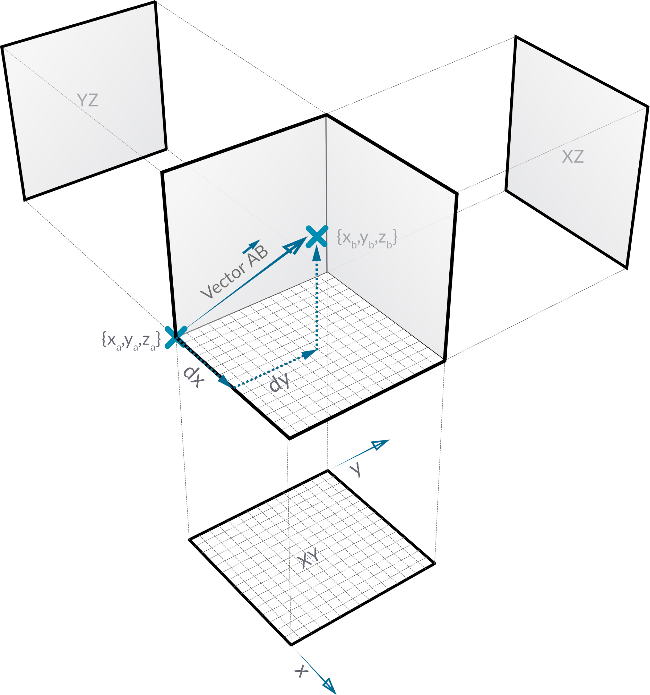
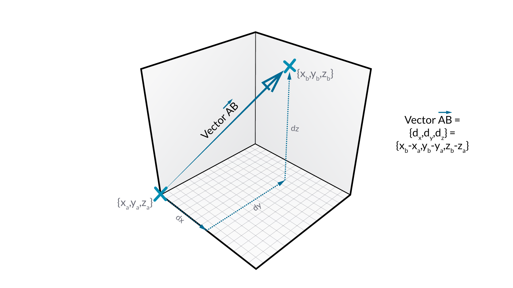
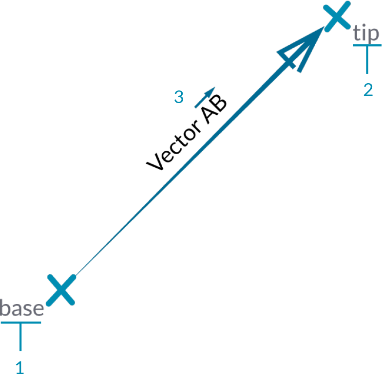
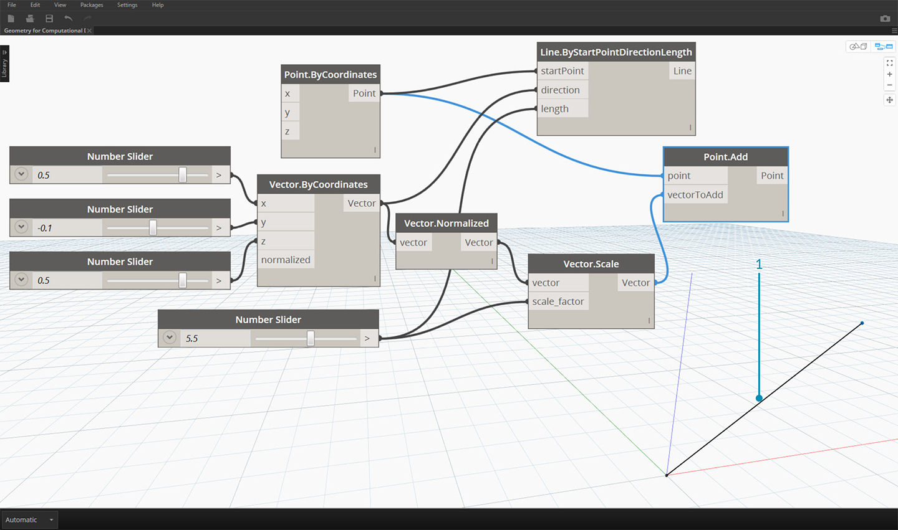
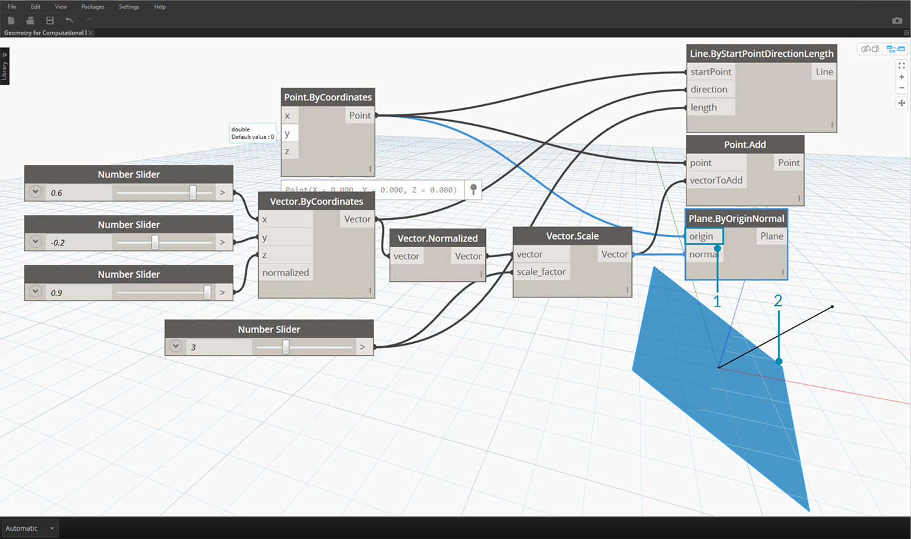
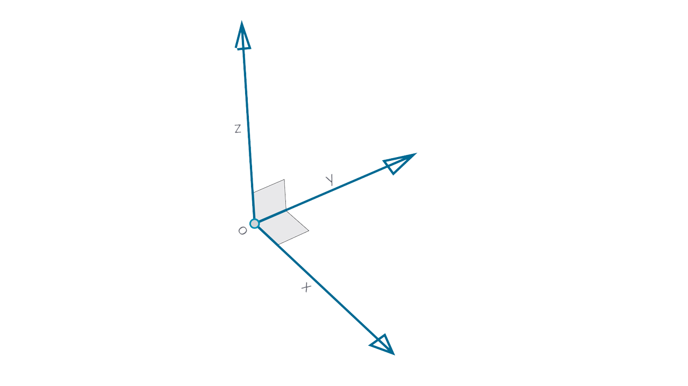
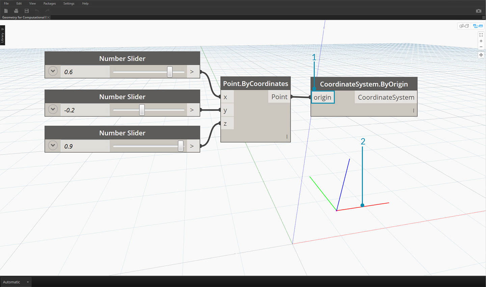

## Vectors, Planes, and Coordinate Systems
Vectors, Planes, and Coordinate Systems make up the primary group of Abstract Geometry Types. They help us define location, orientation, and the spatial context for other geometry that describe shapes. If I say that I'm in New York City at 42nd Street and Broadway (Coordinate System), standing on the street level (Plane), looking North (Vector), I've just used these "Helpers" to define where I am. The same goes for a phone case product or a skyscraper - we need this context to develop our model.

### What's a Vector?

A vector is a geometric quantity describing Direction and Magnitude. Vectors are abstract; ie. they represent a quantity, not a geometrical element. Vectors can be easily confused with Points because they both are composed of a list of values. There is a key difference though: Points describe a position in a given coordinate system while Vectors describe a relative difference in position which is the same as saying "direction."

If the idea of relative difference is confusing, think of the Vector AB as "I'm standing at Point A, looking toward Point B." The direction, from here (A) to there (B), is our Vector.

Breaking down Vectors further into their parts using the same AB notation:

> 1. The **Start Point** of the Vector is called the **Base**.
2. The **End Point **of the Vector is called the **Tip** or the **Sense**.
3. Vector AB is not the same as Vector BA - that would point in the opposite direction.

If you're ever in need of comic relief regarding Vectors (and their abstract definition), watch the classic comedy Airplane and listen for the oft-quoted tongue-in cheek line:

> *Roger, Roger. What's our vector, Victor?*

Vectors are a key component to our models in Dynamo. Note that, because they are in the Abstract category of "Helpers," when we create a Vector, we won't see anything in the Background Preview.

> 1. We can use a line as a stand in for a Vector preview.

>Download the example file that accompanies this image (Right click and "Save Link As..."): [Geometry for Computational Design - Vectors.dyn](datasets/5-2/Geometry for Computational Design - Vectors.dyn). A full list of example files can be found in the Appendix.

### What's a Plane?

Planes are two-dimensional abstract "Helpers." More specifically, Planes are conceptually “flat,” extending infinitely in two directions. Usually they are rendered as a smaller rectangle near their origin.

You might be thinking, "Wait! Origin? That sounds like a Coordinate System... like the one I use to model in my CAD software!"

And you're correct! Most modeling software take advantage of construction planes or "levels" to define a local two-dimentional context to draft in. XY, XZ, YZ -or- North, Southeast, Plan might sound more familiar. These are all Planes, defining an infinite "flat" context. Planes don't have depth, but they do help us describe direction as well - each Plane has an Origin, X Direction, Y Direction, and a Z (Up) Direction.

> 1. Although they are abstract, Planes do have an origin position so we can locate them in space.
2. In Dynamo, Planes are rendered in the Background Preview.

>Download the example file that accompanies this image (Right click and "Save Link As..."): [Geometry for Computational Design - Planes.dyn](datasets/5-2/Geometry for Computational Design - Plane.dyn). A full list of example files can be found in the Appendix.

### What's a Coordinate System?

If we are comfortable with Planes, we are a small step away from understanding Coordinate Systems. A Plane has all the same parts as a Coordinate System, provided it is a standard "Euclidean" or "XYZ" Coordinate System.

There are other, however, alternative Coordinate Systems such as Cylindrical or Spherical. As we will see in later sections, Coordinate Systems can also be applied to other Geometry types to define a position on that geometry.

> Add alternative coordinate systems - cylindrical, spherical

> 1. Although they are abstract, Coordinate Systems also have an origin position so we can locate them in space.
2. In Dynamo, Coordinate Systems are rendered in the Background Preview as a point (origin) and lines defining the axes (X is red, Y is green, and Z is blue following convention).

>Download the example file that accompanies this image (Right click and "Save Link As..."): [Geometry for Computational Design - Coordinate System.dyn](datasets/5-2/Geometry for Computational Design - Coordinate System.dyn). A full list of example files can be found in the Appendix.

