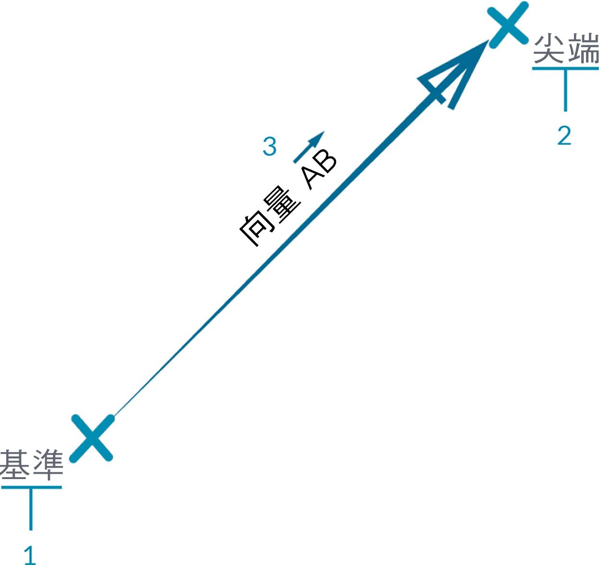

## 向量、平面與座標系統

向量、平面與座標系統構成抽象幾何圖形類型的主要群組。它們能協助我們定義位置、方位以及對造型進行描述的其他幾何圖形空間環境。如果我說我在紐約城第 42 號街，位於百老匯 (座標系統)，站在街面上 (平面)，面向北方 (向量)，這是使用了「協助工具」以定義我的位置。這相同適用於手機殼產品或摩天大樓 - 我們需要此環境來開發模型。

### 什麼是向量？

向量是描述方向與大小的幾何量。向量是抽象概念，例如它們表示數量，而不是幾何元素。向量與點很容易混淆，因為兩者都由一系列值構成。但是兩者之間存在關鍵差異：點描述的是指定座標系統中的位置，而向量描述的是位置的相對差異，該差異與「方向」相同。

若相對差異的概念讓您混淆，請將向量 AB 想像為「我站在點 A，面向點 B」。從此處 (A) 到彼處 (B) 的方向就是向量。

以下將使用上述 AB 表示法進一步詳細說明向量的各部分：

> 1. 向量的**起點**稱為**底端**。
2. 向量的**終點**稱為**頂端**或**指向**。
3. 向量 AB 與向量 BA 不同，兩者指向相反方向。

如果您需要喜劇慈善相關的向量 (及其抽象定義)，請觀看經典喜劇 Airplane，聽聽那句膾炙人口的幽默台詞：

> *Roger, Roger. What's our vector, Victor?*

在 Dynamo 中，向量是模型的關鍵元件。請注意，由於向量屬於「協助工具」抽象品類，因為我們建立向量時，不會在背景預覽中看到任何項目。

> 1. 進行向量預覽時，我們可以使用直線代替向量。
> 下載此影像隨附的範例檔案 (按一下右鍵，然後按一下「連結另存為...」)：[Geometry for Computational Design - Vectors.dyn](datasets/5-2/Geometry for Computational Design - Vectors.dyn)。附錄中提供範例檔案的完整清單。

### 什麼是平面？

平面是二維抽象「協助工具」。更具體地說，平面在概念上是「平」的，在兩個方向無限延伸。通常會將平面彩現為原點附近的較小矩形。

您可能會想，「等等！原點？聽上去像是座標系統...就像我在 CAD 軟體中用於塑型的工具！」

您想的對！大多數塑型軟體會利用建構平面或「水平面」來定義用於繪圖的局部二維環境。平面採用 XY、YZ、XZ 或北、東南等表述，聽上去可能更熟悉。這些都是定義無限「平」環境的平面。平面沒有深度，但有助於描述方向，每個平面都具有原點、X 方向、Y 方向及 Z (向上) 方向。

> 1. 雖然平面是抽象的，但是具有原點位置，因此我們可以在空間中對其定位。
2. 在 Dynamo 中，會在背景預覽中彩現平面。
> 下載此影像隨附的範例檔案 (按一下右鍵，然後按一下「連結另存為...」)：[Geometry for Computational Design - Planes.dyn](datasets/5-2/Geometry for Computational Design - Plane.dyn)。附錄中提供範例檔案的完整清單。

### 什麼是座標系統？

如果我們能夠自如地使用平面，距離理解座標系統就不遠了。平面都有相同的部分，那就是座標系統 (只要是標準的「歐幾里得」或「XYZ」座標系統即可)。

但是，還有其他替代座標系統，例如圓柱座標系統或圓球座標系統。在稍後各節中我們可以看到，也可以將座標系統套用至其他幾何圖形類型，以定義該幾何圖形上的位置。

> 加入替代座標系統 - 圓柱座標系統，圓球座標系統

> 1. 雖然座標系統是抽象的，但是也具有原點位置，因此我們可以在空間中對其定位。
2. 在 Dynamo 中，會在背景預覽中將座標系統彩現為一點 (原點) 與定義軸的直線 (遵循慣例，X 軸為紅色，Y 軸為綠色，Z 軸為藍色)。
> 下載此影像隨附的範例檔案 (按一下右鍵，然後按一下「連結另存為...」)：[Geometry for Computational Design - Coordinate System.dyn](datasets/5-2/Geometry for Computational Design - Coordinate System.dyn)。附錄中提供範例檔案的完整清單。

