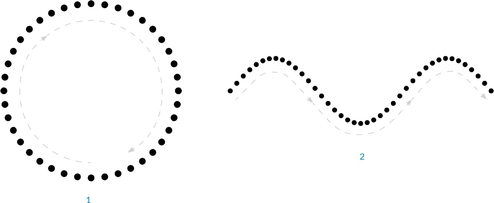
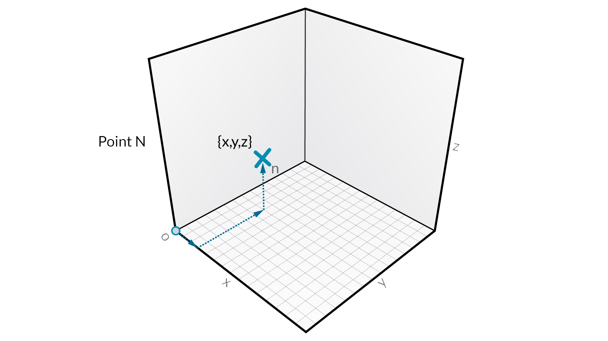
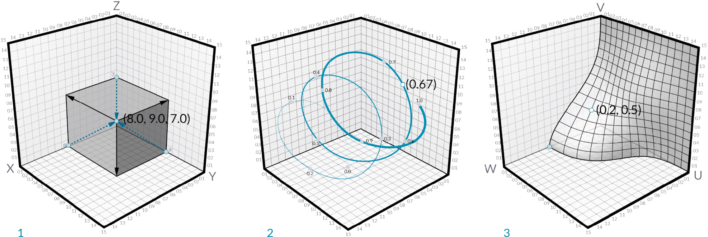
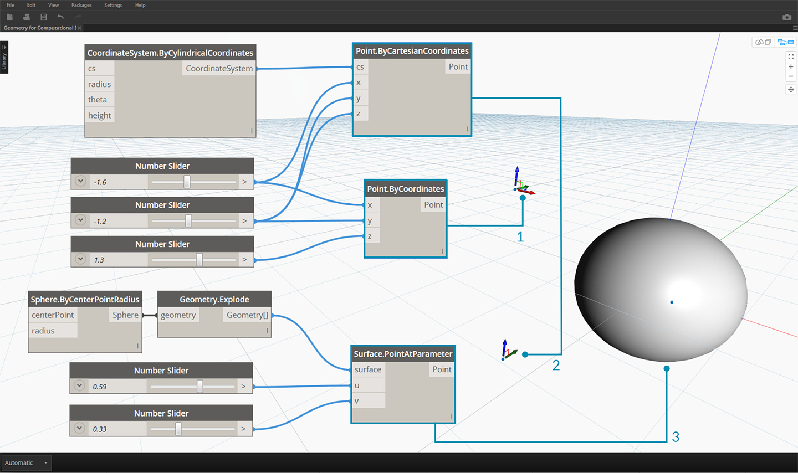

## 點

如果幾何圖形是模型的語言，那麼點是字母。點是建立所有其他幾何圖形的基礎 - 我們需要至少兩個點以建立曲線，我們需要至少三個點以使多邊形或網面等。定義點之間位置、順序和關係 (嘗試正弦函數) 可讓我們定義高級的幾何圖形，例如圓或曲線。



> 1. 圓使用函數 ```x=r*cos(t)```和```y=r*sin(t)```
2. 正弦曲線使用函數 ```x=(t)```和```y=r*sin(t)```
### 什麼是點？

點即是稱為座標的一個以上值。定義點需要的座標值數目取決於點所在的座標系統或環境定義。Dynamo 中最常見的一種點存在於我們的三維世界座標系統中，並有三個座標 [X,Y,Z]」。



### 點座標

點也可以存在於二維座標系統中。根據我們處理的空間種類，依慣例具有不同的字母表示法，對於平面，我們可能會使用 [[X,Y] ，而對於平面可能使用 [U,V]。



> 1. 歐幾里得座標系統中的點：[X,Y,Z]
2. 曲線參數座標系統中的點：[t]
3. 平面參數座標系統中的點：[U,V]

雖然可能有些反直覺，曲線和平面的參數是連續的切會延伸到給定的幾何圖形之外。由於定義參數空間的形狀位於三維世界座標系統中，我們可以一律將參數式座標轉換為「世界」座標。例如，平面上的點 [0.2,0.5] 等同於世界座標中的點 [1.8,2.0,4.1]。



> 1. 假定世界 XYZ 座標中的點
2. 相對於指定座標系統（圓柱）的點
3. 平面上 UV 座標中的點
> 下載此圖像隨附的範例檔案 (按一下右鍵，然後按一下「鏈結另存為...」)： [用於計算設計的幾何圖像 - Points.dyn](datasets/5-3/Geometry for Computational Design - Points.dyn)。 附錄中提供範例檔案的完整清單。

