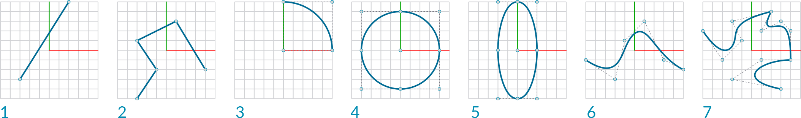
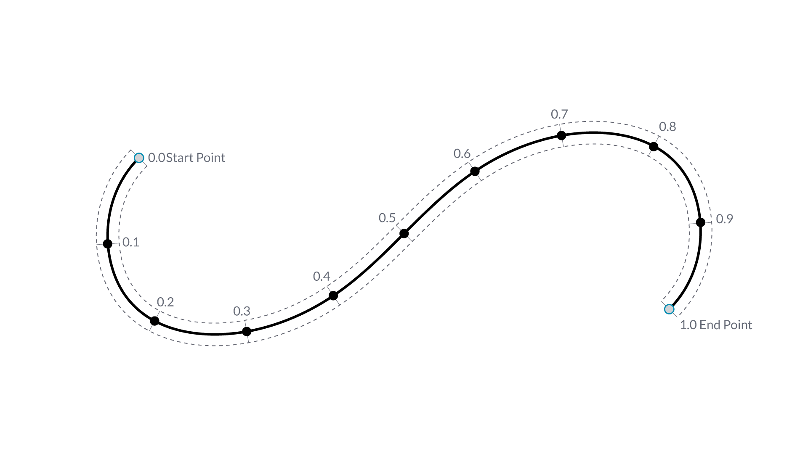
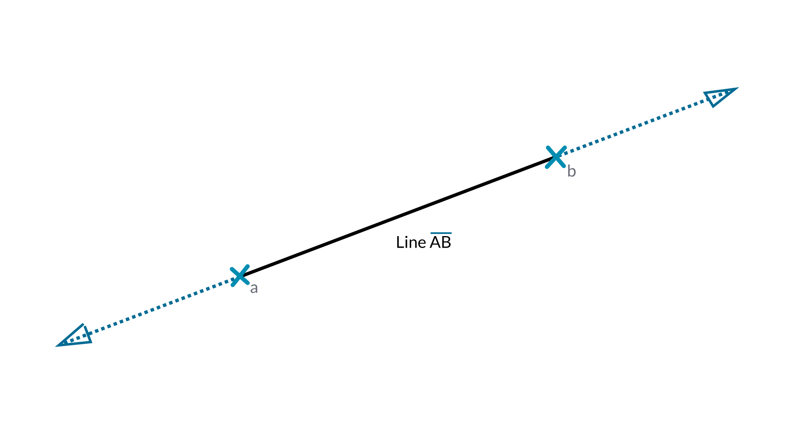
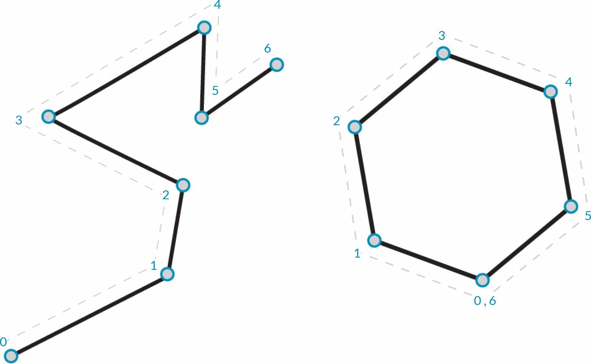
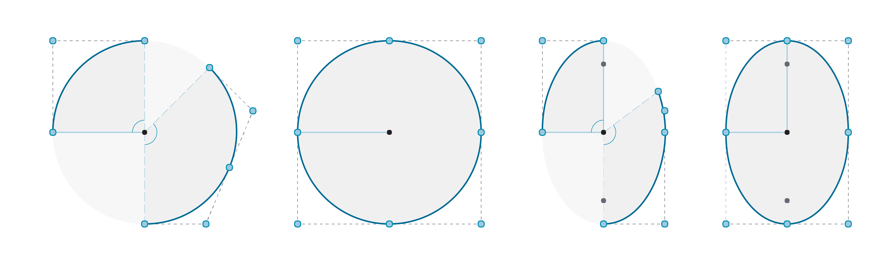
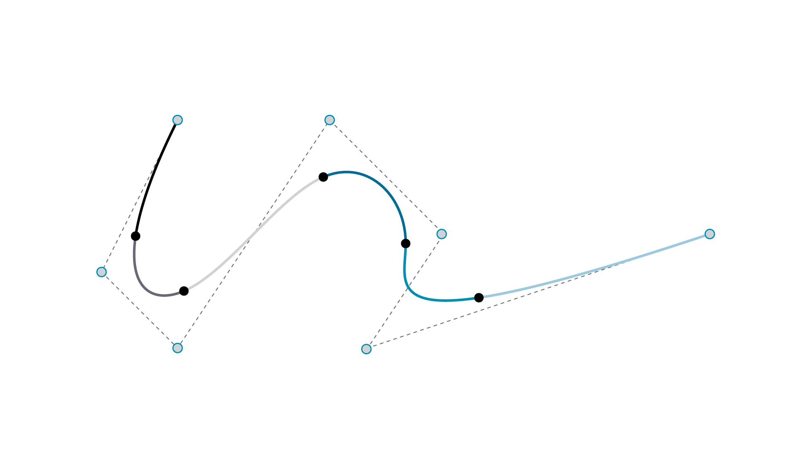
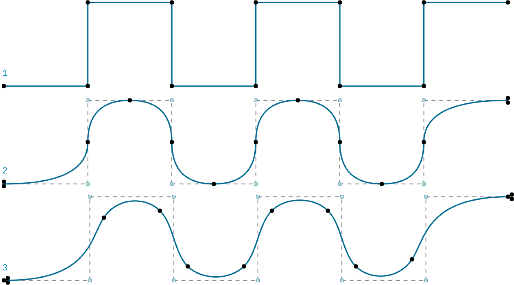
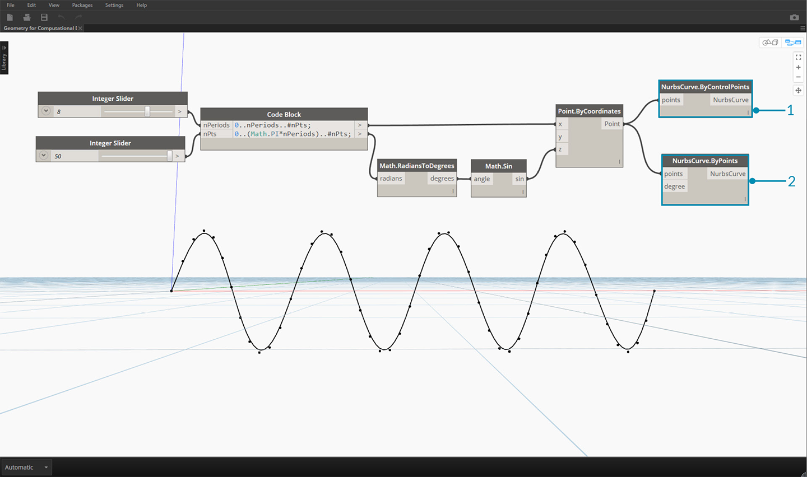

## 曲線

曲線是我們討論的第一種幾何資料類型，具有我們更熟悉的一組形狀描述性質 - 彎曲程度有多大？長度有多大？請記住，點仍是建置區塊，用於定義從直線到雲形線的所有項目以及所有曲線類型。



> 1. 直線
2. 聚合線
3. 弧
4. 圓
5. 橢圓
6. NURBS 曲線
7. Polycurve

### 什麼是曲線？

術語**曲線**通常是所有不同類型彎曲 (甚至筆直) 造型的統稱。曲線是所有這些造型類型 (直線、圓、雲形線等) 的父系分類。若以更具技術性的語言來表述，曲線描述了在一系列函數 (這些函數包含從諸如 ```x = -1.26*t, y = t``` 的簡單函數到涉及微積分的複雜函數) 中輸入「t」即可找到的每個可能點。不論使用何種類型的曲線，稱為「t」的此**參數**都是我們可以演算的性質。此外，不論造型外觀為何，所有曲線都有起點與終點，兩者分別對應於建立曲線所使用的 t 最小值與最大值。這也有助於我們瞭解其定向性。



> 請務必注意，Dynamo 假設我們都知道曲線「t」值的範圍是 0.0 到 1.0。

所有曲線還具有許多性質或特性，可用於對其進行描述或分析。若起點與終點之間的距離是零，則曲線是「封閉」曲線。此外，每條曲線都有許多控制點，若所有這些點都位於同一平面上，則該曲線是「平面」曲線。有些性質會套用至曲線的整體，而其他性質只會套用至曲線上的特定點。例如，平面性是曲線的整體性質，而指定 t 值處的切線向量是局部性質。

### 直線

**直線**是形式最簡單的曲線。直線看上去可能並不彎曲，但實際上屬於曲線，只是沒有曲率而已。可以採用多種不同方式建立直線，最直觀的方式是從點 A 到點 B 繪線。直線 AB 的造型包含兩點之間的點，但在數學上，該直線在兩個方向無限延伸。



將兩條直線連接在一起，就產生**聚合線**。在此可以對控制點進行簡易展示。編輯其中任何點的位置都將變更聚合線的造型。若聚合線是封閉的，則會產生多邊形。若多邊形所有邊的長度都相同，則該多邊形是規則多邊形。



### 弧、圓、橢圓弧與橢圓

正如我們對定義造型的參數式函數提高複雜度一樣，我們可以在直線的基礎上更進一步，透過描述一或兩個半徑來建立**弧**、**圓**、**橢圓弧**或**橢圓**。弧版本與對應的圓或橢圓之間的差異只在於造型是否封閉。



### NURBS + Polycurve

**NURBS** (非均勻合理基準雲形線) 是數學表述，可以對從簡單的二維直線、圓、弧或矩形到最複雜的三維自由形式基本曲線的任何造型進行準確塑型。由於具備靈活性 (控制點相對較少，但根據度設定可以平滑內插) 與精確度 (受強大數學功能約束)，因此 NURBS 模型可用於從插圖與動畫到製造的任何程序。



**度**：曲線的度會決定控制點對曲線的影響範圍，度越高，範圍越大。度是正整數。該數通常是 1、2、3 或 5，但可以是任意正整數。NURBS 直線與聚合線的度通常為 1，而多數自由曲線的度是 3 或 5。

**控制點**：控制點是至少包含 (度 + 1) 個點的清單最簡單的 NURBS 曲線造型變更方式之一，是移動控制點。

**線粗**：控制點具有稱為權值的關聯數字。權值通常是正數。若曲線控制點具有相同的權值 (通常為 1)，則曲線稱為不合理曲線，否則稱為合理曲線。多數 NURBS 曲線都是不合理曲線。

**節點**：節點是 (度 + N - 1) 個數字的清單，其中 N 為控制點的數量。節點與權值搭配使用，以控制控制點對結果曲線產生的影響。節點的一項用途是在曲線的特定點處建立扭折。



> 1. 度 = 1
2. 度 = 2
3. 度 = 3

請注意，度值越高，內插產生的曲線所用的控制點就越多。

接下來在 Dynamo 中建立正弦曲線，使用兩種不同方法來建立 NURBS 曲線以比較結果。



> 1. *NurbsCurve.ByControlPoints* 可使用一系列點做為控制點
2. *NurbsCurve.ByPoints* 可繪製通過一系列點的曲線
> 下載此影像隨附的範例檔案 (按一下右鍵，然後按一下「連結另存為...」)：[Geometry for Computational Design - Curves.dyn](datasets/5-4/Geometry for Computational Design - Curves.dyn)。附錄中提供範例檔案的完整清單。

