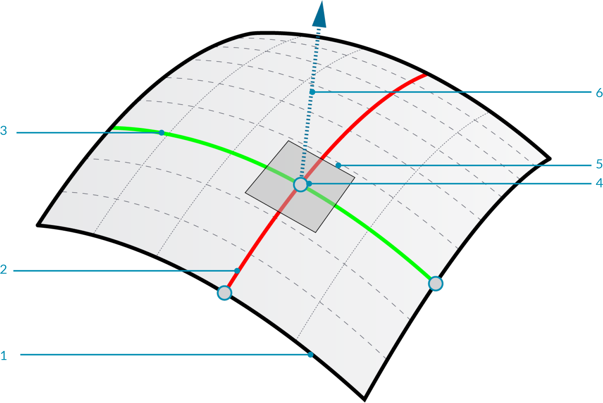
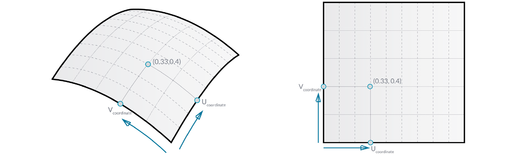
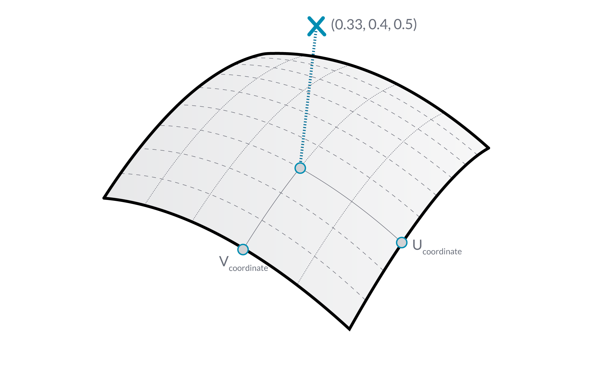
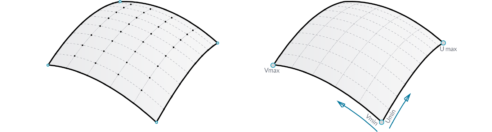
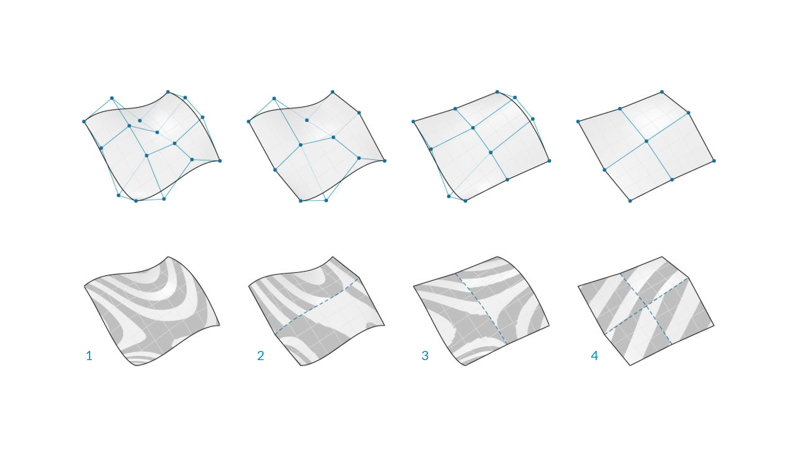
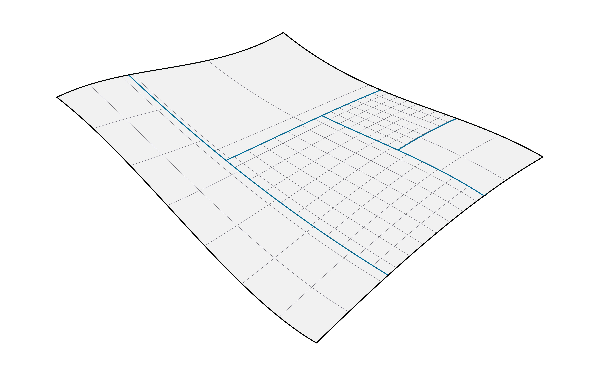
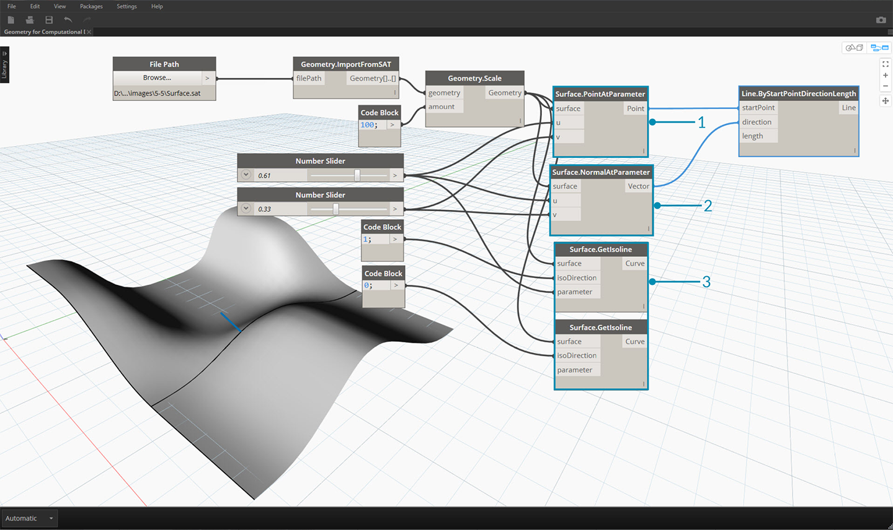

## 曲面

隨著我們在模型中從使用曲線談到使用曲面，現在可以開始表示三維世界中看到的物件。雖然曲線並不總是平面曲線，例如三維曲線，但曲線所定義的空間始終是一維空間。曲面多了一個維度，並具有一系列其他性質，可供我們用於其他塑型作業。

### 什麼是曲面？

曲面是由函數與兩個參數定義的數學造型，我們不使用曲線的 ```t```，而是使用 ```U``` 與 ```V``` 來描述對應的參數空間。這意味著我們使用此類型的幾何圖形時，需要提取更多的幾何資料。例如，曲線具有切線向量與法向平面 (可以沿曲線長度旋轉或扭轉)，而曲面具有方位一致的法線向量與相切平面。



> 1. 曲面
2. U 等角曲線
3. V 等角曲線
4. UV 座標
5. 互垂平面
6. 法線向量

**曲面範圍**：曲面範圍定義為對該曲面上的三維點進行演算的 (U, V) 參數的範圍。每個維度 (U 或 V) 的範圍通常描述為兩個數字，即 U 最小值到 U 最大值與 V 最小值到 V 最大值。



雖然曲面的造型看上去可能不是「矩形」，而且局部可能存在更緊密或更鬆散的一組等角曲線，但曲面範圍所定義的「空間」始終是二維空間。在 Dynamo 中，我們都知道曲面範圍定義為在 U 與 V 兩個方向上從最小值 0.0 到最大值 1.0。平面曲面或修剪曲面可能具有不同的範圍。

**等角曲線** (即等參數曲線)：由曲面上固定的 U 或 V 值以及所對應其他 U 或 V 方向的值範圍所定義的曲線。

**UV 座標**：UV 參數空間中由 U、V (有時還有 W) 定義的點。



**互垂平面**：在指定 UV 座標處與 U 及 V 等角曲線互垂的平面。

**法線向量**：相對於互垂平面定義「向上」方向的向量。

### NURBS 曲面

**NURBS 曲面**非常類似於 NURBS 曲線。您可以將 NURBS 曲面視為 NURBS 曲線在兩個方向構成的網格。NURBS 曲面的造型由許多控制點以及該曲面在 U 與 V 方向的度來定義。根據控制點、權值與度來計算造型、法線、切線、曲率及其他性質採用的演算法相同。



對於 NURBS 曲面，幾何圖形會指示兩個方向，因為 NURBS 曲面不論造型為何，都是控制點的矩形網格。即使這些方向相對於世界座標系統而言通常是任意方向，但我們可以頻繁使用這些方向來分析模型，或根據曲面產生其他幾何圖形。



> 1. 度 (U,V) = (3,3)
2. 度 (U,V) = (3,1)
3. 度 (U,V) = (1,2)
4. 度 (U,V) = (1,1)

### PolySurface

**PolySurface** 由跨邊接合的曲面構成。PolySurface 提供超過二維的 UV 定義，現在我們可以由此透過拓樸在連接的造型中移動。

> 雖然「拓樸」通常描述有關部分如何連接及/或相關的概念，但 Dynamo 中的拓樸也是幾何圖形的類型。確切地說，它是曲面、Polysurface 及實體的父系品類。



有時稱為修補，藉由以此方式接合曲面，我們可以製作更複雜的造型，並定義跨接縫的詳細資料。我們可以便利地將圓角或倒角作業套用至 PolySurface 的邊。

接下來我們在 Dynamo 中匯入曲面，並根據參數演算曲面，以查看我們可以萃取哪類資訊。



> 1. *Surface.PointAtParameter* 會傳回指定 UV 座標處的點
2. *Surface.NormalAtParameter* 會傳回指定 UV 座標處的法線向量
3. *Surface.GetIsoline* 會傳回指定 U 或 V 座標處的等參數曲線 - 注意 isoDirection 輸入。
> 下載此影像隨附的範例檔案 (按一下右鍵，然後按一下「連結另存為...」)。附錄中提供範例檔案的完整清單。

> 1. [Geometry for Computational Design - Surfaces.dyn](datasets/5-5/Geometry for Computational Design - Surfaces.dyn)
2. [Surface.sat](datasets/5-5/Surface.sat)

