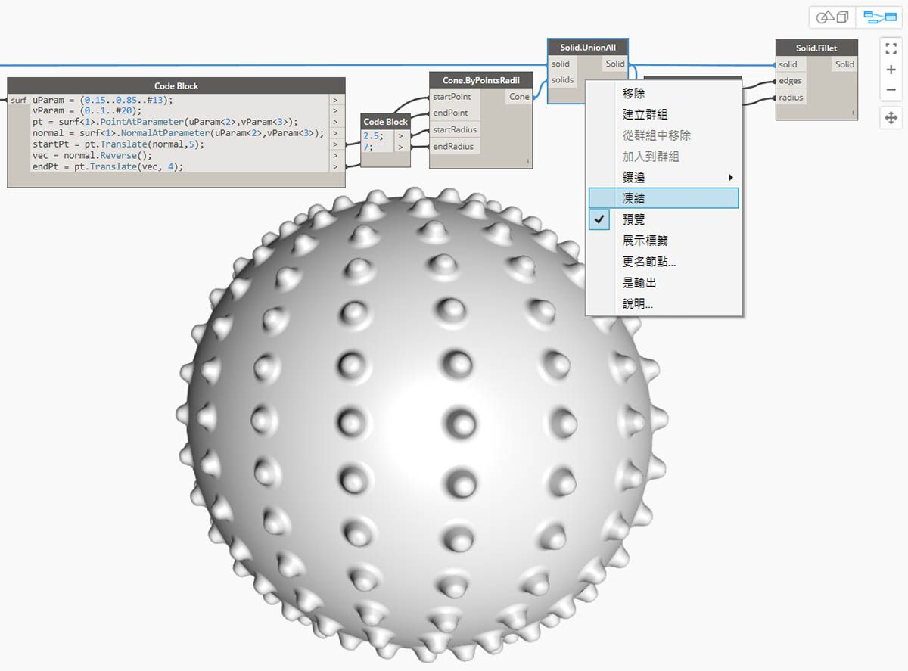
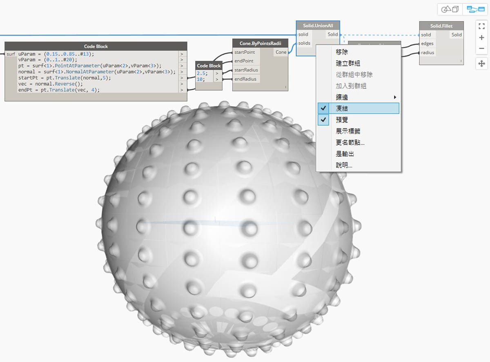

## 立體

如果我們要建構無法從單個平面建立的更複雜模型，或如果我們要定義明確的體積，我們現在必須瞭解立體（和多面體）領域。即使簡單的立方塊也比較複雜，需要六平面，每一面都表示一個平面。立體提供了兩個平面不提供的關鍵概念 - 更細化的拓樸說明 (面、邊、頂點) 和布林作業。

### 什麼是立體？

立體由一個或多個平面組成，透過封閉邊界表示其體積，以定義立體「內」或「外」。無論有多少平面，它們必須形成一個「無縫」體積才會被視為立體。可透過連結平面或多面體來建立立體圖像，或透過使用作業 (例如，上升、沿伸和迴轉）來建立。圓球、立方體、圓錐與圓柱基本型也是立體。將立方塊至少一個面移除所得的圖像為多面體，其具有立體的某些相似性質，但它不是立體。

> 1. 平面是由單一表面組成，不是實體。
2. 圓球由一個表面組成，但*是*立體。
3. 圓錐是由兩個表面接合在一起而建立的立體。
4. 圓柱是由三個表面接合在一起而建立的立體。
5. 立方塊是由六個平面接合在一起而建立的立體。

### 拓樸

立體由三種類型的元素組成： 頂點、邊和面。面是構成實體的平面。邊是定義相鄰面之間連結的曲線，頂點是這些曲線的起點和終點。這些元素可以使用拓樸節點進行查詢。

> 1. 面
2. 邊
3. 頂點

### 作業

可透過對邊執行圓角或倒角作業來消除急轉角和角，從而對實體進行修改。「 倒角」作業會在兩個面之間建立符合規則的表面，而「圓角」作業會混合兩個面使其保持相切。 

> 1. 立體立方塊
2. 倒角的立方塊
3. 圓角的立方塊

### 布林作業

立體布林作業是結合兩個或多個立體的方式。單一布林作業實際意味著執行四個作業：

1. 使兩個或多個物件**相交**。
2. 使其在交點處**分離**。
3. **刪除**幾何圖像的不需要部分。
4. 將所有物件重新**接合**在一起。

這樣可使立體布林運算成為功能強大且節省時間的流程。有三種立體布林運算，識別會保留幾何圖像的哪些部分。

> 1. **聯合：**移除立體的重疊部分並將它們接合為單一立體。
2. **取異：**從一個實體減去另一個。 要減去的實體稱為一個工具。請注意，您可以切換作為工具的實體，以保留相反的部分。
3. **相交：**僅保留兩個實體的相交部分。

除了這三個作業，Dynamo 有 **Solid.DifferenceAll** 和 **Solid.UnionAll** 節點用於執行對多個立體的「取異」和「聯合」作業。 

> 1. **UnionAll：**針對球和向外圓錐的「聯合」作業
2. **DifferenceAll：** 針對球與向內圓錐的「取異」作業

讓我們使用幾個布林運算建立一個尖釘球。

> 1. **Sphere.ByCenterPointRadius**：建立基礎立體。
2. **Topology.Faces**、**Face.SurfaceGeometry**：查詢實體的面並將其轉換為平面幾何圖像 - 在此情況下，該圓球僅有一個面。
3. **Cone.ByPointsRadii**：使用面上的點建構圓錐。
4. **Solid.UnionAll**：聯合「圓錐」和「球」。
5. **Topology.Edges**：查詢新立體的邊
6. **Solid.Fillet**：對尖釘球的邊執行「圓角」作業
> 下載此圖像隨附的範例檔案 (按一下右鍵，然後按一下「連結另存為...」)。附錄中提供範例檔案的完整清單。[用於計算設計的幾何圖像 - Solids.dyn](datasets/5-6/Geometry for Computational Design - Solids.dyn)

### 凍結

布林作業很複雜且可降低計算速度。使用「凍結」功能以暫停執行選取的節點和受影響的下游節點。

> 使用右鍵環境定義功能表來凍結「立體聯合」作業

> 將以淺灰色重像模式預覽所選節點和所有下游節點，且受影響線路將顯示為虛線。受影響的幾何圖像預覽也將被重像。現在，您可以變更上游值，而不計算布林聯合。

> 要解凍節點，按一下右鍵，然後取消勾選「凍結」。

> 所有受影響節點和關聯幾何圖像的預覽將更新並回復至標準預覽模式。

