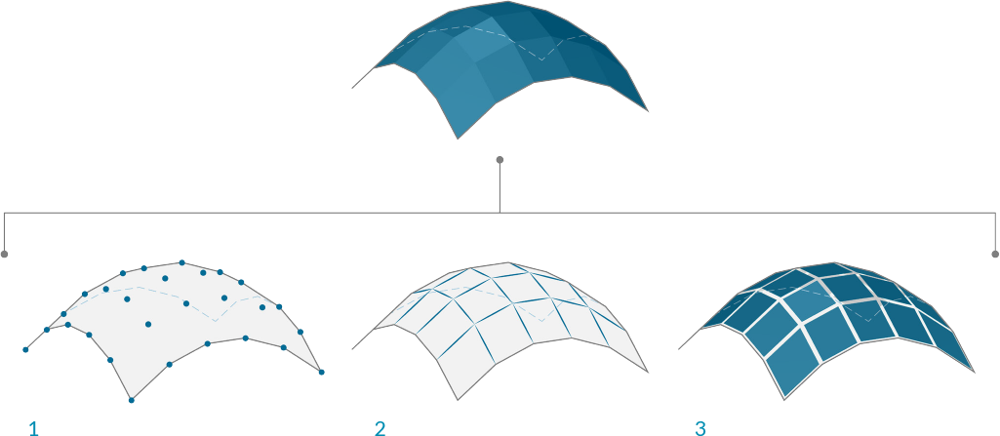
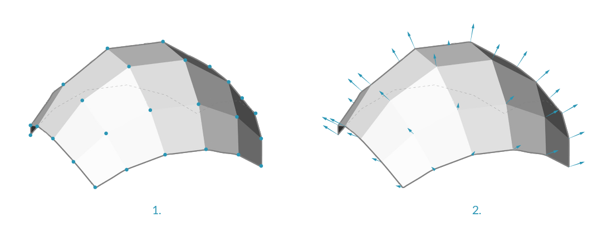

## Meshes
In the field of computational modeling, Meshes are one of the most pervasive forms of representing 3D geometry. Mesh geometry can be a light-weight and flexible alternative to working with NURBS, and Meshes are used in everything from rendering and visualizations to digital fabrication and 3D printing. 

### What's a Mesh?
A Mesh is a collection of quadrilaterals and triangles that represents a surface or solid geometry. Like Solids, the structure of a Mesh object includes vertices, edges, and faces. There are additional properties that make Meshes unique as well, such as normals.

> 1. Mesh vertices
2. Mesh edges *Edges with only one adjoining face are called "Naked." All other edges are "Clothed"
3. Mesh faces

### Mesh Elements
Dynamo defines Meshes using a Face-Vertex data structure. At its most basic level, this structure is simply a collection of points which are grouped into polygons. The points of a Mesh are called vertices, while the surface-like polygons are called faces. To create a Mesh we need a list of vertices and a system of grouping those vertices into faces called an index group.

> 1. List of vertices
2. List of index groups to define faces

####Vertices + Vertex Normals
The vertices of a Mesh are simply a list of points. The index of the vertices is very important when constructing a Mesh, or getting information about the structure of a Mesh. For each vertex, there is also a corresponding vertex normal (vector) which describes the average direction of the attached faces and helps us understand the "in" and "out" orientation of the Mesh. 

>1. Vertices
2. Vertex Normals

####Faces
A face is an ordered list of three or four vertices. The “surface” representation of a Mesh face is therefore implied according to the position of the vertices being indexed. We already have the list of vertices that make up the Mesh, so instead of providing individual points to define a face, we  simply use the index of the vertices. This also allows us to use the same vertex in more than one face.

> 1. A quad face made with indices 0, 1, 2, and 3
2. A triangle face made with indices 1, 4, and 2 
Note that the index groups can be shifted in their order - as long as the sequence is ordered in a counter-clockwise manner, the face will be defined correctly

### Meshes versus NURBS Surfaces
How is Mesh geometry different from NURBS geometry? When might you want to use one instead of the other?

####Parameterization

In a previous chapter, we saw that NURBS surfaces are defined by a series of NURBS curves going in two directions. These directions are labeled ``U`` and ``V``, and allow a NURBs surface to be parameterized according to a two-dimensional surface domain. The curves themselves are stored as equations in the computer, allowing the resulting surfaces to be calculated to an arbitrarily small degree of precision. It can be difficult, however, to combine multiple NURBS surfaces together. Joining two NURBS surfaces will result in a polysurface, where different sections of the geometry will have different UV parameters and curve definitions.

> 1. Surface
2. Isoparametric (Isoparm) Curve
3. Surface Control Point
4. Surface Control Polygon
5. Isoparametric Point
6. Surface Frame
7. Mesh
8. Naked Edge
9. Mesh Network
10. Mesh Edges
11. Vertex Normal
12. Mesh Face / Mesh Face Normal

Meshes, on the other hand, are comprised of a discrete number of exactly defined vertices and faces. The network of vertices generally cannot be defined by simple ``UV`` coordinates, and because the faces are discrete the amount of precision is built into the Mesh and can only be changed by refining the Mesh and adding more faces. The lack of mathematical descriptions allows Meshes to more flexibly handle complex geometry within a single Mesh.

###Local versus Global Influence

Another important difference is the extent to which a local change in Mesh or NURBS geometry affects the entire form. Moving one vertex of a Mesh only affects the faces that are adjacent to that vertex. In NURBS surfaces, the extent of the influence is more complicated and depends on the degree of the surface as well as the weights and knots of the control points. In general, however, moving a single control point in a NURBS surface creates a smoother, more extensive change in geometry.

> 1. NURBS Surface - moving a control point has influence that extends across the shape
2. Mesh geometry - moving a vertex has influence only on adjacent elements

One analogy that can be helpful is to compare a vector image (composed of lines and curves) with a raster image (composed of individual pixels). If you zoom into a vector image, the curves remain crisp and clear, while zooming into a raster image results in seeing individual pixels become larger. In this analogy, NURBS surfaces can be compared to a vector image because there is a smooth mathematical relationship, while a Mesh behaves similarly to a raster image with a set resolution.

### Mesh Toolkit
Dynamo's mesh capabilities can be extended by installing the [Mesh Toolkit](https://github.com/DynamoDS/Dynamo/wiki/Dynamo-Mesh-Toolkit) package. The Dynamo Mesh Toolkit provides tools to import Meshes from external file formats, create a Mesh from Dynamo geometry objects, and manually build Meshes by their vertices and indices. The library also provides tools to modify Meshes, repair Meshes, or extract horizontal slices for use in fabrication.

See chapter 10.2 for an example using Mesh Toolkit.

