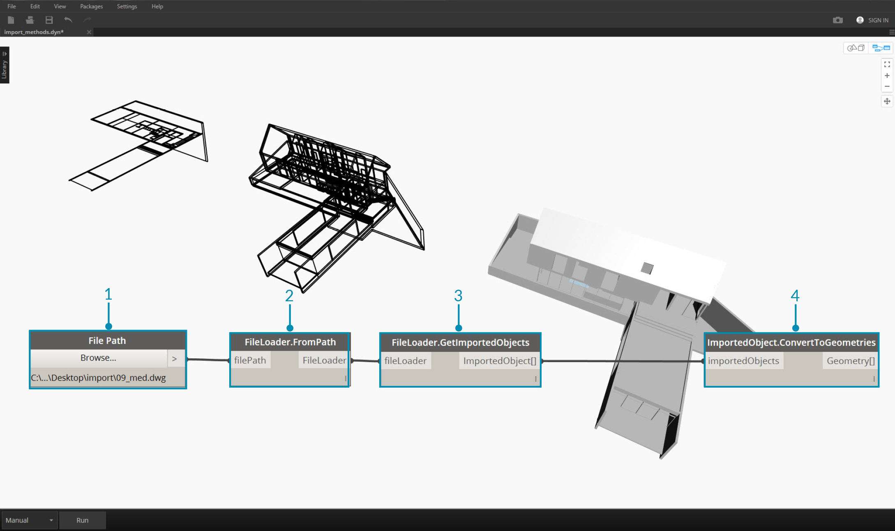
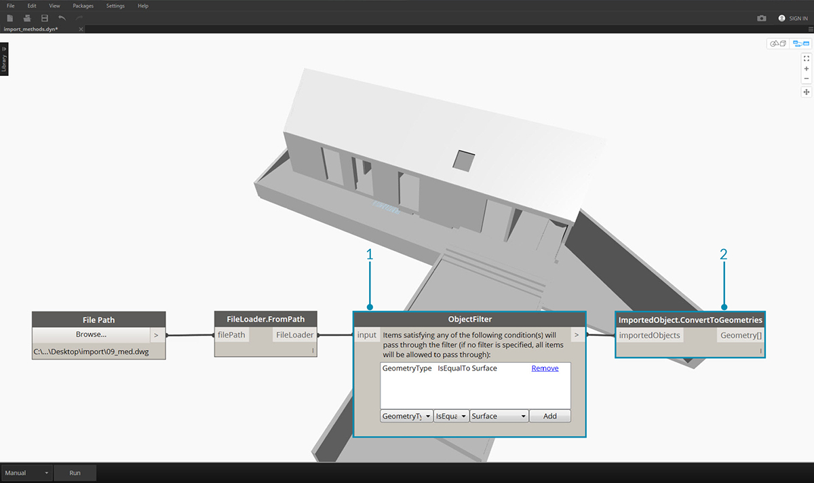
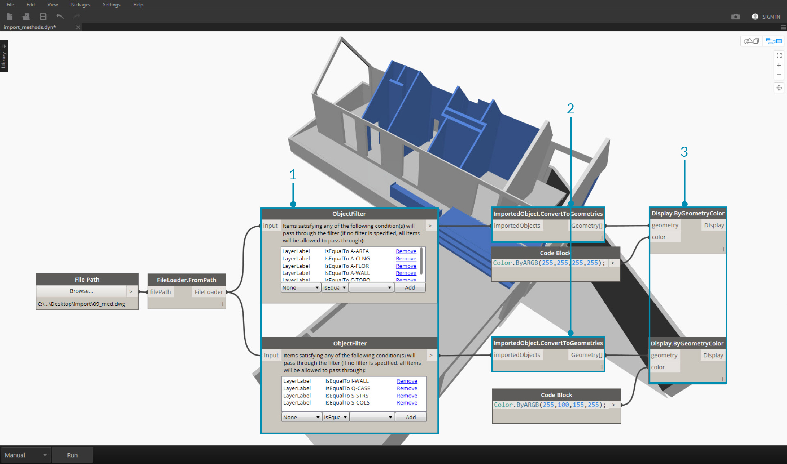
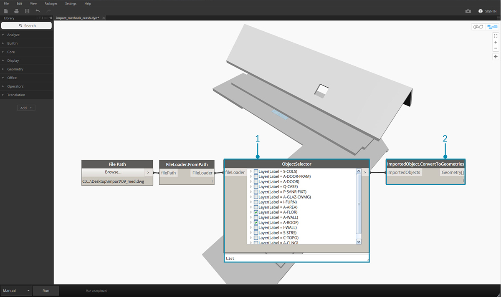

## 匯入幾何圖像

有數種方式可將幾何圖像匯入 Dynamo。在之前的部分中，我們演示了使用*網面工具*匯入網面 - 我們也可以從 .SAT 檔案匯入立體模型。 使用這些流程，我們可以在其他平台上開發幾何圖像，將其載入 Dynamo 及透過視覺程式設計套用參數式作業。

另一種用於匯入幾何圖像的方法使用稱為 *ATF 轉換*的流程。 在此情況下，我們可以匯入的不僅僅是幾何圖像，還包括檔案的結構。例如，我們可以選擇要匯入的 .DWG 圖層，而不是匯入整個模型。我們將在下方展示有關此內容的更多詳細資料。

### 從 DWG 檔案匯入幾何圖形

可在*轉換*標籤下找到用於匯入 DWG 至 Dynamo 環境中的節點，（注意事項：這些工具僅在 [Dynamo Studio](http://www.autodesk.com/products/dynamo-studio/overview) 中提供）。 以下範例展示了一系列元件，用於瀏覽以尋找檔案，匯入檔案內容，並將其轉換為可用 Dynamo 幾何圖形。Dynamo 也可讓我們能夠過濾並選取要從 DWG 檔案匯入的特定物件 - 將在下面說明此功能。若要取得從 DWG 檔案匯入幾何圖形的相關資訊，請於此處讀取 Ben Goh 的[部落格文章](http://dynamobim.org/dwg-import-in-dynamo-studio-0-9-1/)。

### 取得匯入的物件

將 DWG 匯入 Dynamo Studio 的最簡單方法是將整個檔案匯入到工作區：

> 1. 使用「File Path 」元件來瀏覽要匯入至 Dynamo 的 DWG 檔案。
2. 連接至 **FileLoader.FromPath** 可讀取該檔案。
3. 使用 **FileLoader.GetImportedObjects** 元件以將幾何圖形剖析至 Dynamo Studio。
4. **ImportedObject.ConvertToGeometries** 會將物件轉換為 Dyanamo 工作區中可用的幾何圖形。

如上面的圖所示，DWG 檔案中所有類型的幾何圖形 - 平面、網面、曲線和直線 - 都會匯入至 Dynamo。

### 物件過濾

若要指定從 DWG 檔中匯入哪些幾何圖形，可向定義新增其他 **ObjectFilter** 節點。 **ObjectFilter** 節點與 **FileLoader** 或 **ImportedObject ** 清單相容，並輸出 **ImportedObject** 清單。

以下圖像顯示每個 **ObjectFilter ** 節點中的條件陳述式。 任何滿足所有列示條件的 **ImportedObject** 將通過濾器。 過濾可以根據圖層標籤 (例如圖層名稱)、幾何圖形類型、漫射顏色等進行，並可搭配其他過濾器來精細化您的選擇。

> 1. 將 **FileLoader.GetImportedObjects** 替換為 **ObjectFilter** 以在 DWG 檔案中搜尋特定條件。 - 在此情況下，僅將匯入平面幾何圖形，會移除上圖中所有曲線和直線幾何圖形。
2. 將過濾器連接至 **ImportedObject.ConvertToGeometries** 以匯入已過濾的幾何圖形。

透過新增兩個具有其他條件陳述式的過濾器，我們可以將清單中的幾何圖形分為多個串流 ：

> 1. 將 **FileLoader.GetImportedObjects** 替換為兩個具有不同條件陳述式的 **ObjectFilter** 模組。 這會將一個檔案中的幾何圖形分為兩個不同的串流。
2. 將過濾器連接至 **ImportedObject.ConvertToGeometries** 以匯入已過濾的幾何圖形。
3. 連接 **ImportedObject.ConvertToGeometries** 至 **Display.ByGeometryColor** 來以不同顏色顯示每個串流。

### 明確的物件選取

**ObjectSelector ** 節點為我們提供了從 DWG 檔案匯入物件的替代方法。 不使用過濾器，此方法讓我們能夠選擇要匯入至 Dynamo 的特定物件和圖層。

> 1. 將 **FileLoader.GetImportedObjects** 替換為 **ObjectSelector**，以呼叫 DWG 檔案中的特定圖層和物件。
2. 將過濾器連接至 **ImportedObject.ConvertToGeometries**。

