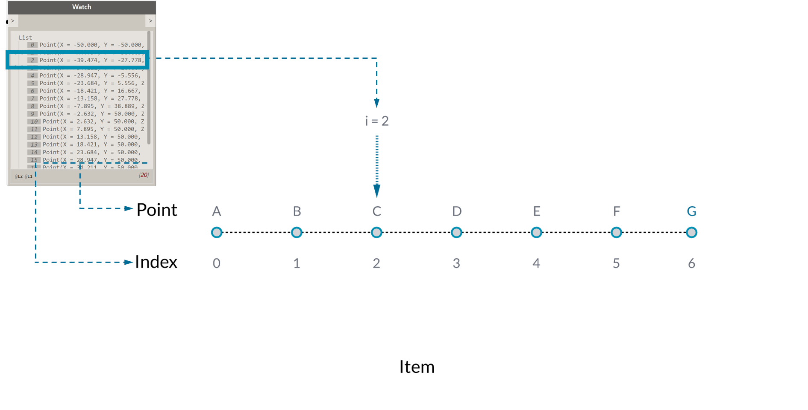
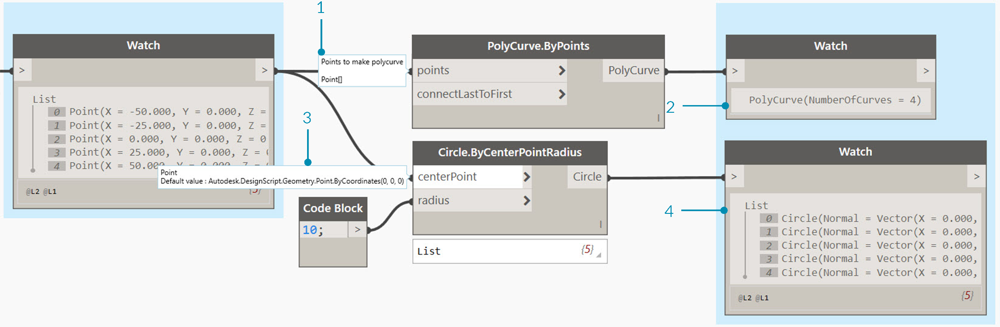
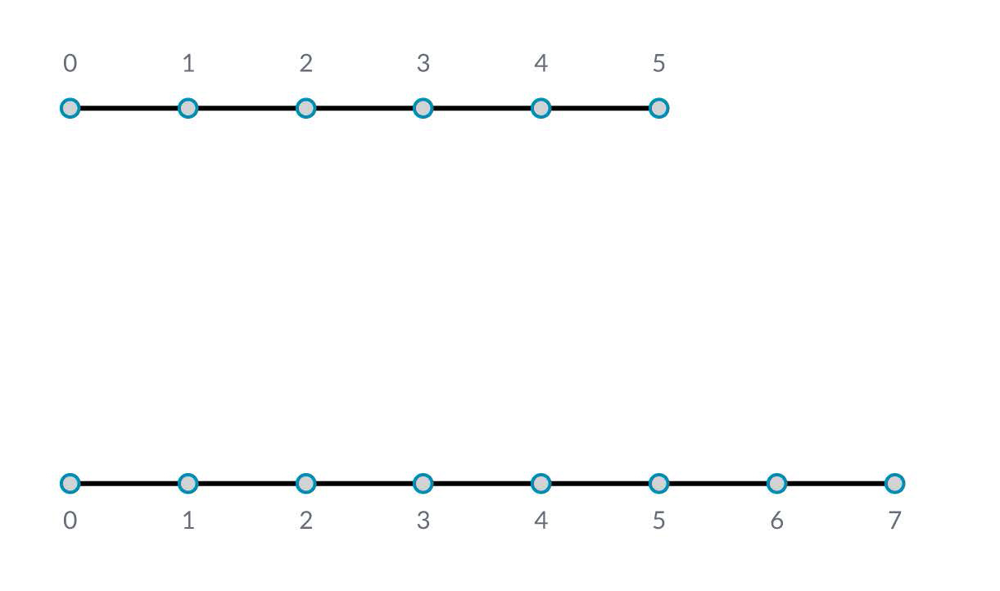
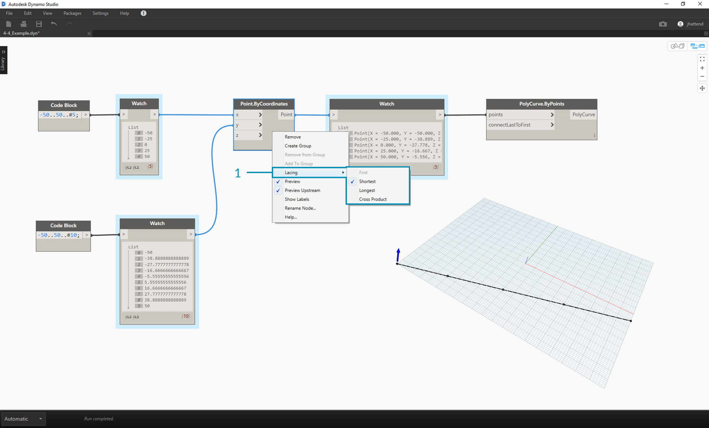
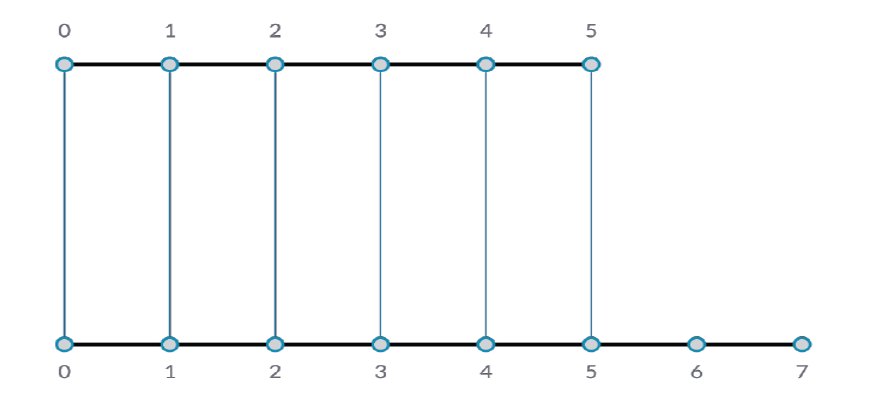
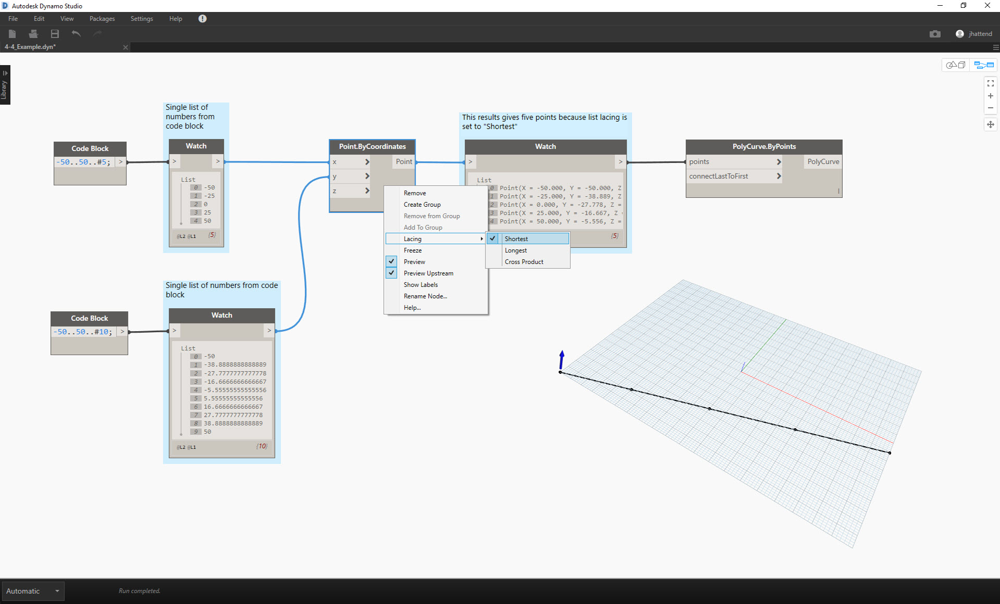
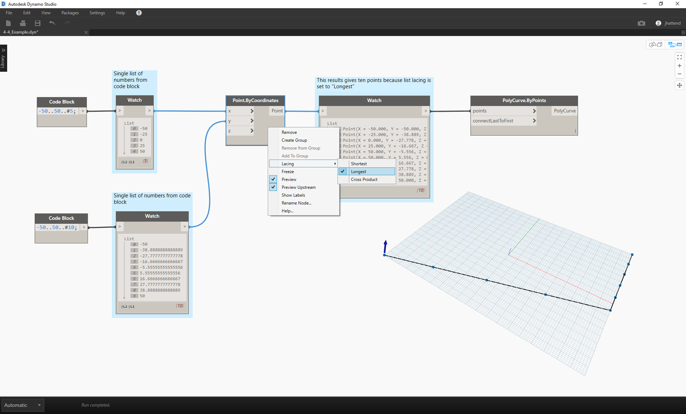
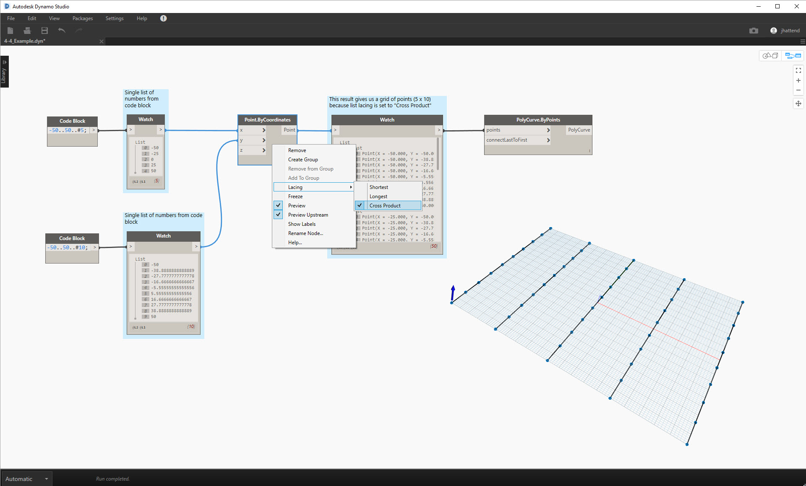

## 什麼是清單？

清單是元素 (即項目) 的集合。例如一束香蕉。每個香蕉都是清單 (即香蕉束) 中的項目。揀選一束香蕉比分別揀選每個香蕉更容易，依據資料結構中的參數式關係對元素進行分組也是如此。

> 相片由 [Augustus Binu](https://commons.wikimedia.org/wiki/File:Bananas_white_background_DS.jpg?fastcci_from=11404890&c1=11404890&d1=15&s=200&a=list) 拍攝。

購買雜貨時，我們會將購買的所有商品放入袋中。這個袋子也是清單。如果要製作香蕉麵包，我們需要 3 束香蕉 (我們將製作*大量*香蕉麵包)。袋子表示香蕉束的清單，而每束香蕉表示香蕉的清單。袋子是清單的清單 (二維)，而香蕉束是清單 (一維)。

在 Dynamo 中，清單資料具有順序，每個清單中第一個項目的索引都是「0」。以下我們將討論在 Dynamo 中如何定義清單，以及多個清單如何彼此相關。

## 從零開始的索引

起初有一點可能看起來很奇怪，那就是清單的第一個索引始終是 0，而不是 1。因此，在談到清單的第一個項目時，實際指的是索引 0 對應的項目。

例如，如果您數數右手手指的數量，很可能會從 1 數到 5。但是，如果將手指放在清單中，Dynamo 會為其指定從 0 至 4 的索引。雖然這對於程式設計的初學者而言可能有些奇怪，但從零開始的索引是多數運算系統中的標準做法。

請注意，我們的清單中仍有 5 個項目，清單恰好使用從零開始的計數系統。清單中正在儲存的項目不一定是數字。它們可以是 Dynamo 支援的任何資料類型，例如點、曲線、曲面、族群等。

通常，查看清單中所儲存資料類型的最簡單方法，是將觀看節點連接至另一個節點的輸出。依預設，觀看節點會在清單的左側自動展示所有索引，並在右側展示資料項目。

使用清單時，這些索引是非常重要的元素。

### 輸入與輸出

對清單而言，輸入與輸出視使用的 Dynamo 節點而有所不同。例如，接下來我們使用包含 5 個點的清單，並將此輸出連接至兩個不同的 Dynamo 節點：*PolyCurve.ByPoints* 與 *Circle.ByCenterPointRadius*：

> 1. *PolyCurve.ByPoints* 的 *points* 輸入是尋找*「Point[]」*。這表示點清單。
2. *PolyCurve.ByPoints* 的輸出是根據包含五個點的清單建立的單一 PolyCurve。
3. *Circle.ByCenterPointRadius* 的 *centerPoint* 輸入要求*「Point」*。
4. *Circle.ByCenterPointRadius* 的輸出是包含五個圓的清單，其中圓的中心對應於點的原始清單。

*PolyCurve.ByPoints* 與 *Circle.ByCenterPointRadius* 的輸入資料相同，但是 PolyCurve 節點的結果是一條 PolyCurve，而圓節點的結果是中心位於每個點的 5 個圓。以直觀方式很容易理解這一點：polycurve 繪製為連接 5 個點的曲線，而圓會在每個點建立不同的圓。資料出現什麼情況？

將游標懸停在 *Polycurve.ByPoints* 的 *points* 輸入上方，可以看到輸入在尋找*「Point[]」*。注意末尾的中括號。這表示點的清單，若要建立 polycurve，輸入需要是每個 polycurve 的清單。因此，此節點會將每個清單濃縮到一條 polycurve 中。

另一方面，*Circle.ByCenterPointRadius* 的 *centerPoint* 輸入要求*「Point」*。此節點會尋找一個點，做為項目以定義圓的中心點。因此輸入資料會產生五個圓。辨識 Dynamo 中這些輸入的差異可協助您更好地瞭解在管理資料時節點的作業方式。

### 鑲邊

資料相符是沒有明確解決方案的問題。在節點對大小不同的輸入具有存取權時，會發生此問題。變更資料相符演算法會產生截然不同的結果。

想像在點之間建立直線段的節點 (Line.ByStartPointEndPoint)。它有兩個輸入參數，都提供點座標：

您可以看到，可以採用不同方法在這組點之間繪製直線。在節點的中心按一下右鍵，然後選擇「鑲邊」功能表，可以找到「鑲邊」選項。

### 基準檔案

> 下載此練習隨附的範例檔案 (按一下右鍵，然後按一下「連結另存為...」)：[Lacing.dyn](datasets/6-1/Lacing.dyn)。附錄中提供範例檔案的完整清單。

為了展示以下的鑲邊作業，我們將使用此基準檔案來定義最短清單、最長清單及叉積。

> 1. 我們將在 *Point.ByCoordinates* 上變更鑲邊，但不會變更有關以上影像的任何其他內容。

#### 最短清單

最簡單的方式是逐一連接輸入，直到其中一個串流結束為止。這稱為「最短清單」演算法。這是 Dynamo 節點的預設行為：

> 透過將鑲邊變更為*最短清單*，可以取得由五個點構成的基本對角線。五個點是較短清單的長度，因此最短清單鑲邊在到達一個清單的末尾後將停止。

#### 最長清單

「最長清單」演算法會保持連接輸入，重複使用元素，直到所有串流結束為止：

> 透過將鑲邊變更為*最長清單*，可以取得垂直延伸的對角線。運用與概念圖相同的方法，含 5 個項目的清單中的最後一個項目將重複，以達到較長清單的長度。

#### 叉積

最後，「叉積」方法會產生所有可能的連接：

> 透過將鑲邊變更為*叉積*，可以取得每個清單之間的每個組合，產生點的 5x10 網格。這是與以上概念圖中所示叉積對等的資料結構，只是現在資料是清單的清單。透過連接 polycurve，我們可以看到每個清單都由其 X 值定義，因此產生一列垂直線。

