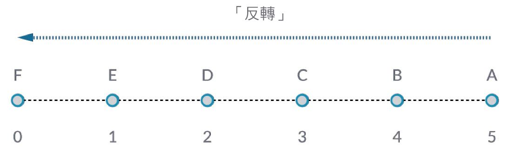
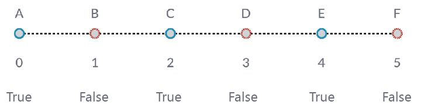

## 使用清單

現在我們已建立清單，接下來討論可以對清單執行哪些作業。將清單想像為一副紙牌。這副紙牌是清單，而其中每張紙牌都代表一個項目。


> 相片由 [Christian Gidlöf](https://commons.wikimedia.org/wiki/File:Playing_cards_modified.jpg) 拍攝

我們可以對清單執行哪些**查詢**？這將存取既有性質。

* 這副紙牌有多少張？52.
* 有幾種花色？4.
* 用哪種材料製成？紙。
* 長度是多少？3.5" 或 89mm。
* 寬度是多少？2.5" 或 64mm。

我們可以對清單執行哪些**動作**？這會根據指定的作業變更清單。

* 我們可以重新洗牌。
* 我們可以根據點數對紙牌排序。
* 我們可以根據花色對紙牌排序。
* 我們可以拆分紙牌。
* 我們可以雙手各握一部分紙牌。
* 我們可以選取其中特定的某張牌。

以上列示的所有作業都有類似的 Dynamo 節點，供您使用一般資料的清單。以下課程將展示我們可以對清單執行的一些基本作業。

## 清單作業

以下影像是我們展示基本清單作業所使用的基準圖表。我們將探究如何管理清單內的資料，並展示視覺結果。

#### 練習 - 清單作業

> 下載此練習隨附的範例檔案 (按一下右鍵，然後按一下「連結另存為...」)：[List-Operations.dyn](datasets/6-2/List-Operations.dyn)。附錄中提供範例檔案的完整清單。


> 1. 首先使用值為 ```500;``` 的 *code block*；
2. 插入至 *Point.ByCoordinates* 節點的 *x* 輸入。
3. 將上一步驟中的節點插入至 *Plane.ByOriginNormal* 節點的 origin 輸入。
4. 使用 *Circle.ByPlaneRadius* 節點，將上一步驟中的節點插入至 plane 輸入。
5. 使用 *code block*，為 *radius* 指定值 ```50;```。這是我們將建立的第一個圓。
6. 使用 *Geometry.Translate* 節點，在 Z 方向將圓上移 100 個單位。
7. 使用 *code block* 節點，透過以下代碼行定義 0 至 1 之間的一系列十個數字：```0..1..#10;```
8. 將上一步驟中的代碼區塊插入至兩個 *Curve.PointAtParameter* 節點的 *param* 輸入。將 *Circle.ByPlaneRadius* 插入至頂部節點的 curve 輸入，將 *Geometry.Translate* 插入至下方節點的 curve 輸入。
9. 使用 *Line.ByStartPointEndPoint*，連接兩個 *Curve.PointAtParameter* 節點。


> 1. *Watch3D* 節點會顯示 *Line.ByStartPointEndPoint* 的結果。我們將在兩個圓之間畫線以表示基本清單作業，並使用此基準 Dynamo 圖表完成以下的清單動作。

### List.Count


> *List.Count* 節點很簡單：它會對清單中的值進行計數，並傳回該數量。使用清單的清單時，此節點將更為精細，不過我們將在後續章節展示該內容。

#### 練習 - List.Count

> 下載此練習隨附的範例檔案 (按一下右鍵，然後按一下「連結另存為...」)：[List-Count.dyn](datasets/6-2/List-Count.dyn)。附錄中提供範例檔案的完整清單。


> 1. *List.Count* 節點會傳回 *Line.ByStartPointEndPoint* 節點中的線數量。在此案例中，該值為 10，這與從原始*代碼區塊*節點建立的點數量一致。

### List.GetItemAtIndex


> *List.GetItemAtIndex* 是對清單中的項目進行查詢的基本方式。在以上影像中，我們使用索引*「2」*查詢標示為*「C」*的點。

#### 練習 - List.GetItemAtIndex

> 下載此練習隨附的範例檔案 (按一下右鍵，然後按一下「連結另存為...」)：[List-GetItemAtIndex.dyn](datasets/6-2/List-GetItemAtIndex.dyn)。附錄中提供範例檔案的完整清單。


> 1. 使用 *List.GetItemAtIndex* 節點，我們將選取索引*「0」*或線清單中的第一個項目。
2. *Watch3D* 節點顯示我們已選取一條線。注意：若要取得以上影像，請確保停用 *Line.ByStartPointEndPoint* 的預覽。

### List.Reverse



> *List.Reverse* 會反轉清單中所有項目的順序。

#### 練習 - List.Reverse

> 下載此練習隨附的範例檔案 (按一下右鍵，然後按一下「連結另存為...」)：[List-Reverse.dyn](datasets/6-2/List-Reverse.dyn)。附錄中提供範例檔案的完整清單。


> 1. 若要正確顯示反轉的線清單，請將代碼區塊變更為 ```0..1..#100;``` 以建立更多線
2. 對其中一個點清單，將 *List.Reverse* 節點插入至 *Curve.PointAtParameter* 與 *Line.ByStartPointEndPoint* 之間。
3. *Watch3D* 節點會顯示兩個不同結果。第一個節點顯示無反轉清單的結果。線垂直連接至相鄰的點。但是，反轉清單會以另一個清單中的相反順序連接所有點。

### List.ShiftIndices


> *List.ShiftIndices* 是建立扭轉或螺旋樣式或任何其他類似資料處理的良好工具。此節點會將清單中的項目移位指定數量的索引。

#### 練習 - List.ShiftIndices

> 下載此練習隨附的範例檔案 (按一下右鍵，然後按一下「連結另存為...」)：[List-ShiftIndices.dyn](datasets/6-2/List-ShiftIndices.dyn)。附錄中提供範例檔案的完整清單。


> 1. 採用對反轉清單的相同程序，將 *List.ShiftIndices* 插入至 *Curve.PointAtParameter* 與 *Line.ByStartPointEndPoint*。
2. 使用*代碼區塊*，指定值*「1」*將清單移位一個索引。
3. 請注意，變更很小，但下方 *Watch3D* 節點中所有的線在連接至其他組的點時已移位一個索引。


> 1. 透過將*代碼區塊*變更為較大的值 (例如*「30」*)，我們注意到對角線有顯著不同。在此範例中，此移位的作用類似於相機的光圈，對原始圓柱形產生了扭轉。

### List.FilterByBooleanMask



> *List.FilterByBooleanMask* 將根據一系列布林值或者「True」或「False」值移除某些項目。

#### 練習 - List.FilterByBooleanMask

> 下載此練習隨附的範例檔案 (按一下右鍵，然後按一下「連結另存為...」)：[List-FilterByBooleanMask.dyn](datasets/6-2/List-FilterByBooleanMask.dyn)。附錄中提供範例檔案的完整清單。


> 為了建立一系列「True」或「False」值，我們需要多做一些工作...

> 1. 使用*code block*，採用以下語法定義表示式：```0..List.Count(list);```。將 *Curve.PointAtParameter* 節點連接至 *list* 輸入。我們將在代碼區塊一章中更詳細地講解此設置，但此範例中的代碼行將產生代表 *Curve.PointAtParameter* 節點每個索引的清單。
2. 使用*「%」* (模數) 節點，將 *code block* 的輸出連接至 *x* 輸入，將值 *4* 連接至 *y* 輸入。這會產生索引清單除以 4 時的餘數。模數在建立樣式時是非常有用的節點。4 的所有可能餘數包括：0、1、2、3。
3. 從*模數*節點，我們知道值 0 表示索引可由 4 整除 (0、4、8 等)。使用*「==」*節點，我們可以測試餘數的值是否為*「0」*，以測試可整除性。
4. *Watch* 節點顯示此狀況：True/False 樣式為：*true,false,false,false...*。
5. 使用此 True/False 樣式，連接至兩個 *List.FilterByBooleanMask* 節點的 mask 輸入。
6. 將 *Curve.PointAtParameter* 節點連接至 *List.FilterByBooleanMask* 的每個 list 輸入。
7. *Filter.ByBooleanMask* 的輸出為 *「in」* 與 *「out」*。*「in」* 表示遮罩值為 *「true」* 的值，而 *「out」* 表示遮罩值為 *「false」* 的值。透過將 *「in」* 輸出插入至 *Line.ByStartPointEndPoint* 節點的 *startPoint* 與 *endPoint* 輸入，我們已建立經過篩選的線清單。
8. *Watch3D* 節點顯示出線較點更少。我們僅篩選了 True 值，因此僅選取了 25% 的節點。

