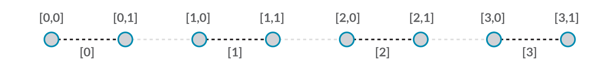
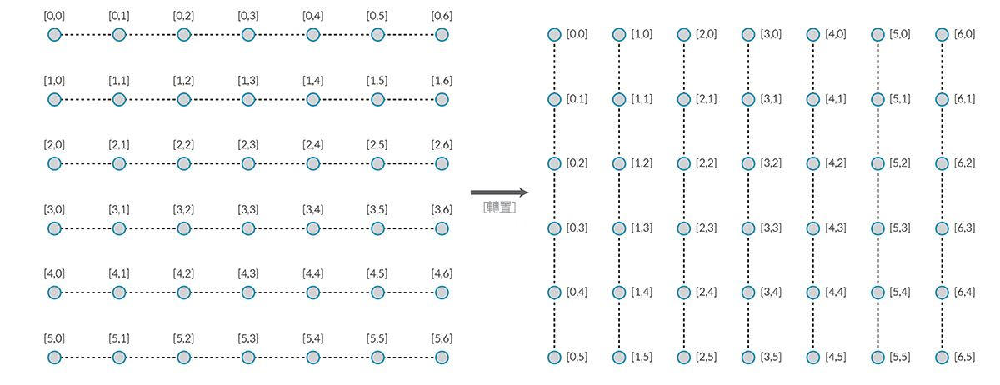
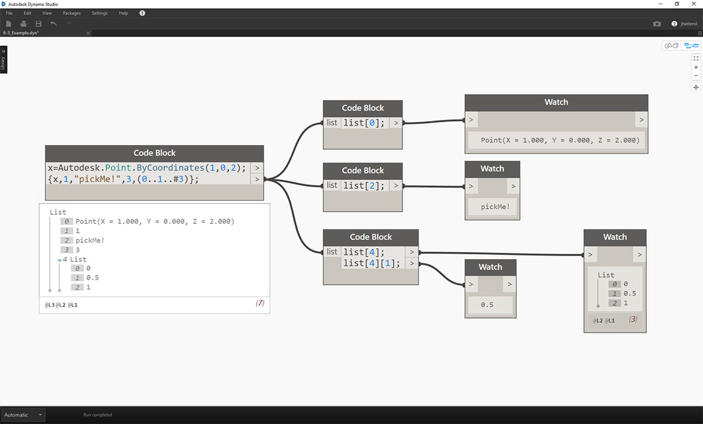
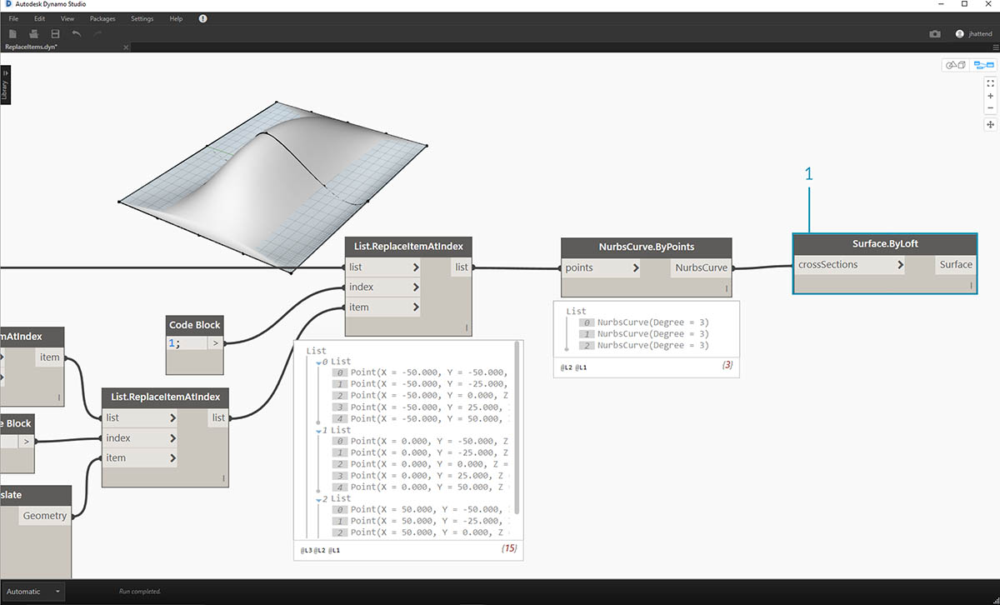

## 清單的清單

接下來在階層中再加入一層。我們以最初範例中的一副紙牌為例，如果製作容納多副紙牌的盒子，那麼現在盒子就代表各副紙牌的清單，而每副紙牌代表紙牌的清單。這是清單的清單。為了說明本節內容，我們進行類比，以下紅色盒子包含多捆硬幣，而每捆包含多個一美分硬幣。


> 相片由 [Dori](https://commons.wikimedia.org/wiki/File:Stack_of_coins_0214.jpg) 拍攝。

我們可以對清單的清單執行哪些**查詢**？這將存取既有性質。

* 有幾種硬幣類型？2.
* 硬幣類型的價值是多少？0.01 美元與 0.25 美元。
* 25 美分硬幣的材料是什麼？75% 的銅與 25% 的鎳。
* 一美分硬幣的材料是什麼？97.5% 的鋅與 2.5% 的銅。

我們可以對清單的清單執行哪些**動作**？這會根據指定的作業變更清單的清單。

* 選取特定的一捆 25 美分硬幣或一美分硬幣。
* 選取特定的一枚 25 美分硬幣或一美分硬幣。
* 重新排列各捆 25 美分硬幣與一美分硬幣。
* 攪亂各捆硬幣。

再說一次，對於上述每項作業，Dynamo 都有類比節點。由於我們使用的是抽象資料，而不是實際物件，因此需要採用一組規則以管理資料階層上下移動的方式。

處理清單的清單時，資料分層放置且非常複雜，但是您可藉此執行某些良好的參數式作業。在以下課程中，我們將分類講解基礎知識，並討論更多作業。

## 由上而下的階層

本節將瞭解的基本概念：**Dynamo 將清單視為其本身的物件**。此由上而下的階層在開發時，考慮到以物件為導向的程式設計。Dynamo 並非使用類似於 List.GetItemAtIndex 的指令選取子元素，而是選取資料結構中的主要清單索引。項目可以是另一個清單。接下來我們使用範例影像進行分解說明：

#### 練習 - 由上而下的階層

> 下載此練習隨附的範例檔案 (按一下右鍵，然後按一下「連結另存為...」)：[Top-Down-Hierarchy.dyn](datasets/6-3/Top-Down-Hierarchy.dyn)。附錄中提供範例檔案的完整清單。


> 1. 我們已使用*code block*定義兩個範圍：``` 0..2; 0..3; ```
2. 這些範圍已連接至 *Point.ByCoordinates* 節點，並將鑲邊設定為 *「叉積」*。這會建立點的網格，也會傳回清單的清單作為輸出。
3. 請注意，*Watch* 節點可產生 3 個清單，每個清單中包含 4 個項目。
4. 使用 *List.GetItemAtIndex* 時，透過索引 0，Dynamo 會選取第一個清單及其所有內容。其他程式可能會在資料結構中選取每個清單的第一個項目，但 Dynamo 在處理資料時，採用由上而下的階層。

### 平坦化與 List.Flatten

平坦化會移除資料結構中的所有資料層。若您的作業不需要資料階層，這會很有用，但是存在風險，因為它會移除資訊。以下範例將展示對資料清單進行平坦化的結果。

#### 練習 - 平坦化

> 下載此練習隨附的範例檔案 (按一下右鍵，然後按一下「連結另存為...」)：[Flatten.dyn](datasets/6-3/Flatten.dyn)。附錄中提供範例檔案的完整清單。


> 1. 插入一行程式碼以定義 *code block* 中的範圍：``` -250..-150..#4; ```
2. 透過將 *code block* 插入至 *Point.ByCoordinates* 節點的 *x* 與 *y* 輸入，我們將鑲邊設定為 *「叉積」* 以取得點的網格。
3. *Watch* 節點顯示出已產生清單的清單。
4. *PolyCurve.ByPoints* 節點將參考每個清單，並建立各自的 polycurve。請注意，在 Dynamo 預覽中有四個 polycurve，分別代表網格的每一列。


> 1. 透過在 polycurve 節點前插入*平坦化*，我們已建立所有點的單一清單。PolyCurve 節點會參考清單來建立一條曲線，由於所有點都在一個清單上，因此我們將取得通過整個清單中所有點的一條曲折 polycurve。

此外，還提供對隔離層的資料進行平坦化的選項。使用 List.Flatten 節點，您可以定義從階層頂部進行平坦化的資料層數量。如果您對運用複雜的資料結構感到吃力，而這些資料結構不一定與您的工作流程相關，則該工具確實非常有用。其他選項會將平坦化節點用作 List.Map 中的函數。以下我們將詳細討論 [List.Map](#listmap-and-listcombine)。

### 細分

執行參數式塑型時，有時您會希望加入更多資料結構至既有清單。有許多節點可用於實現此功能，細分是最基本的版本。使用細分，我們可以將清單分割為包含一定數量項目的子清單。

#### 練習 - List.Chop

> 下載此練習隨附的範例檔案 (按一下右鍵，然後按一下「連結另存為...」)：[Chop.dyn](datasets/6-3/Chop.dyn)。[附錄](../Appendix/A_appendix.md)中提供範例檔案的完整清單。



> 若 *List.Chop* 的 subLength 為 2，將建立 4 個清單，每個清單包含 2 個項目。

「細分」指令可根據指定的清單長度分割清單。在某種程度上，細分與平坦化恰恰相反：細分不是移除資料結構，而是在其中加入新層。對於諸如以下範例等幾何圖形作業，此工具很有用。


### List.Map 與 List.Combine

List.Map/Combine 會將一組函數套用至輸入清單 (但下一層級的清單除外)。組合與對映相同，只是組合可以有多個輸入對應於指定函數的輸入。

#### 練習 - List.Map

*注意：此練習使用舊版本的 Dynamo 建立。大部分 List.Map 功能已透過加入 List@Level 功能進行解析。若要取得更多資訊，請參閱以下的*[*List@Level*](#listlevel)*。*

> 下載此練習隨附的範例檔案 (按一下右鍵，然後按一下「連結另存為...」)：[Map.dyn](datasets/6-3/Map.dyn)。[附錄](../Appendix/A_appendix.md)中提供範例檔案的完整清單。

作為快速介紹，接下來我們檢閱上一節所述的 List.Count 節點。


> *List.Count* 節點會對清單中的所有項目進行計數。我們將使用此節點展示 *List.Map* 的工作方式。


> 1. 將兩行代碼插入至 *code block*：

```
-50..50..#Nx;
-50..50..#Ny;
```

輸入此代碼後，代碼區塊會建立 Nx 與 Ny 的兩個輸入。

2. 使用兩個 *integer sliders*，將其連接至 *code block* 以定義 *Nx* 與 *Ny* 值。
3. 將每行 code block 分別連接至 *Point.ByCoordinates* 節點的 *X* 與 *Y* 輸入。在節點上按一下右鍵，選取「鑲邊」，然後選擇 *「叉積」*。這會建立點的網格。由於我們定義的範圍是從 -50 到 50，因此將跨越預設的 Dynamo 網格。
4. *Watch* 節點會顯示已建立的點。請注意資料結構。我們已建立清單的清單。每個清單都代表網格的一列點。


> 1. 將 *List.Count* 節點連接至上一步驟中觀看節點的輸出。
2. 將*Watch*節點連接至 List.Count 輸出。

請注意，List.Count 節點提供的值為 5。這等於代碼區塊中定義的「Nx」變數。為何會發生這種情況？

* 首先，Point.ByCoordinates 節點使用「x」輸入作為建立清單的主要輸入。若 Nx 為 5 且 Ny 為 3，我們將取得 5 個清單的清單，其中每個清單包含 3 個項目。
* 由於 Dynamo 將清單視為其本身的物件，因此會將 List.Count 節點套用至階層內的主要清單中。結果值為 5，即主要清單中的清單數量。


> 1. 使用 *List.Map* 節點，我們可以在階層中進入下一層級，並在此層級執行*「函數」*。
2. 請注意，*List.Count* 節點沒有輸入。它會用作函數，因此會將 *List.Count* 節點套用至階層中下一層級的每個清單。*List.Count* 的空白輸入對應於 *List.Map* 的清單輸入。
3. 現在 *List.Count* 的結果提供 5 個項目的清單，每個項目的值為 3。這代表每個子清單的長度。

#### 練習 - List.Combine

*注意：此練習使用舊版本的 Dynamo 建立。大部分 List.Combine 功能已透過加入 List@Level 功能進行解析。若要取得更多資訊，請參閱以下的*[*List@Level*](#listlevel)*。*

> 下載此練習隨附的範例檔案 (按一下右鍵，然後按一下「連結另存為...」)：[Combine.dyn](datasets/6-3/Combine.dyn)。[附錄](../Appendix/A_appendix.md)中提供範例檔案的完整清單。

在本練習中，我們將使用與 List.Map 相似的邏輯，但採用多個元素。在此案例中，我們希望根據獨特數量的點對曲線清單進行分割。


> 1. 使用*code block*，運用語法定義範圍：..20..#4; ```and a value of```20; 。
2. 將*code block*連接至兩個 *Point.ByCoordinates* 節點。
3. 從 *Point.ByCoordinates* 節點建立 *Line.ByStartPointEndPoint*。
4. *Watch*節點將顯示四條線。


> 1. 以下是建立線所用的圖表，我們要使用 code block 建立四個不同的範圍，以便採用獨特方式對線進行分割。我們使用以下代碼行執行此作業：
```
0..1..#3;
0..1..#4;
0..1..#5;
0..1..#6;
```

2. 使用 *List.Create* 節點，將*代碼區塊*中的四條線合併為一個清單。
3. *Watch*節點顯示出清單的清單。


> 1. 若將線直接連接至*參數*值，則 *Curve.PointAtParameter* 無效。我們需要在階層中下移一級。為此，我們將使用 *List.Combine*。


> 使用 *List.Combine*，我們可以依指定範圍成功分割每條線。此作業稍顯困難，因此我們將深入細緻講解。

> 1. 首先，加入 *Curve.PointAtParameter* 節點至圖元區。這將是套用至 List.Combine 節點的*「函數」*或*「結合器」*。第二個中的內容更多。
2. 加入 *List.Combine* 節點至圖元區。按一下*「+」*或*「-」*以加入或減去輸入。在此案例中，我們將對節點使用預設的兩個輸入。
3. 我們要將 *Curve.PointAtParameter* 節點插入至 *List.Combine* 的*「comb」*輸入。還有一個重要節點：確保在 Curve.PointAtParameter 的*"param" _input*上按一下右鍵，然後不勾選*「使用預設值」*。將節點作為函數執行時，必須移除 Dynamo 輸入中的預設值。換言之，我們應該將預設值視為有其他節點與其連接。因此，我們需要在此案例中移除預設值。
4. 我們知道建立點需要有兩個輸入，即線與參數。但是，如何將其連接至 *List.Combine* 輸入並採用哪種順序呢？
5. 需要在結合器中以相同順序填寫由上到下的 *Curve.PointAtParameter* 空白輸入。因此，會將線插入至 *List.Combine* 的 *List1*。
6. 之後，會將參數值插入至 *List.Combine* 的 *List2* 輸入。
7. *Watch*節點與 Dynamo 預覽會顯示出我們有 4 條線，每條都根據*code block*範圍進行了分割。

### List@Level

List@Level 功能是 List.Map 的替代，您可藉此在節點的輸入連接埠直接選取要使用的清單層級。此功能可套用至節點的任何輸入，您可藉此較其他方法更快更輕鬆地存取清單的層級。您只需向節點告知要用作輸入的清單層級，節點會執行其餘作業。

#### List@Level 練習

在本練習中，我們將使用 List@Level 功能以隔離特定層級的資料。

> 下載此練習隨附的範例檔案 (按一下右鍵，然後按一下「連結另存為...」)：[List@Level](datasets/6-3/Listatlevel.dyn)。[附錄](../Appendix/A_appendix.md)中提供範例檔案的完整清單。


> 1. 我們將從簡單的點的 3D 網格開始。
2. 由於使用 X、Y 與 Z 的範圍建構網格，因此我們知道資料的結構包含 3 層：X 清單、Y 清單及 Z 清單。
3. 這些層處於不同的**層級**。預覽標示圈底部指出了層級。清單層級欄對應於上述清單資料，以協助識別工作所在的層級。
4. 清單層級以反轉順序排列，因此最低層級的資料始終位於「L1」。這將有助於確保圖形按計劃工作，即使上游發生變更，也是如此。


> 1. 若要使用 List@Level 功能，請按一下「>」。在此功能表中，您將看到兩個勾選方塊。
2. **「使用樓層」** - 這會啟用 List@Level 功能。按一下此選項後，您可以在其中按一下，然後選取希望節點使用的輸入清單層級。使用此功能表，您可以透過按一下上方或下方的選項以快速嘗試使用不同的層級選項。
3. **「保留清單結構」** - 如果啟用，您可以選擇保留該輸入的層級結構。有時，您可能會特意將資料組織到子清單中。透過勾選此選項，您可以保持清單組織不變，確保不會遺失任何資訊。

使用簡單的 3D 網格，我們可以切換清單層級，以存取與視覺化清單結構。清單層級與索引的每個組合都將傳回原始 3D 點集內的一組不同的點。


> 1. 藉由 DesignScript 中的「@L2」，我們可以僅選取層級 2 中的清單。
2. 層級 2 中的清單 (索引為 0) 僅包括第一組 Y 點，僅傳回 XZ 網格。
3. 如果將圖層篩選變更為「L1」，我們可以看到第一個清單層級內的所有內容。層級 1 中的清單 (索引為 0) 包括展開清單中的所有 3D 點。
4. 如果我們嘗試對「L3」執行相同作業，僅會看到第三個清單層級的點。層級 3 中的清單 (索引為 0) 僅包括第一組 Z 點，僅傳回 XY 網格。
5. 如果我們嘗試對「L4」執行相同作業，僅會看到第三個清單層級的點。層級 4 中的清單 (索引為 0) 僅包括第一組 X 點，僅傳回 YZ 網格。

雖然也可以使用 List.Map 建立此特定範例，但是 List@Level 會大幅簡化互動，讓存取節點資料更輕鬆。請查看以下對 List.Map 與 List@Level 方法進行的比較：


> 1. 雖然使用這兩種方法可以存取相同的點，但是藉由 List@Level 方法，可以在單一節點內的資料層之間輕鬆切換。
2. 若要使用 List.Map 存取點網格，我們需要使用 List.GetItemAtIndex 節點與 List.Map。對於我們下移的每個清單層級，都需要使用額外的 List.Map 節點。視清單的複雜性而定，這可能需要您加入大量 List.Map 節點至圖表，以存取適當層級的資訊。
3. 在此範例中，List.GetItemAtIndex 節點 (與 List.Map 節點) 傳回相同的一組點，其清單結構與 List.GetItemAtIndex (已選取「@L3」) 相同。

### 轉置

轉置是處理清單的清單時的基本功能。正如在試算表程式中，轉置會翻轉資料結構的欄與列。我們將使用以下的基本矩陣展示這一點，在之後的一節中，我們將展示如何使用轉置建立幾何關係。



#### 練習 - List.Transpose

> 下載此練習隨附的範例檔案 (按一下右鍵，然後按一下「連結另存為...」)：[Transpose.dyn](datasets/6-3/Transpose.dyn)。附錄中提供範例檔案的完整清單。


> 接下來刪除上一個練習中的 *List.Count* 節點，而改用某些幾何圖形以查看資料的構建方式。

> 1. 將 *PolyCurve.ByPoints* 從 *Point.ByCoordinates* 連接至觀看節點的輸出。
2. 輸出將顯示 5 條 PolyCurve，我們可以在 Dynamo 預覽中看到這些曲線。Dynamo 節點將尋找點清單 (在此案例中是點清單的清單)，並根據點清單建立單一 polycurve。實質上，每個清單都已轉換為資料結構中的曲線。


> 1. 如果我們要隔離一列曲線，將使用 *List.GetItemAtIndex* 節點。
2. 使用*代碼區塊*值 2，查詢主要清單中的第 3 個元素。
3. *PolyCurve.ByPoints* 會產生一條曲線，因為僅有一個清單連接至節點。


> 1. *List.Transpose* 節點會切換所有項目，以及清單的清單中的所有清單。這似乎很複雜，但其邏輯與 Microsoft Excel 中的轉置相同：切換資料結構中的欄與列。
2. 請注意摘要結果：轉置會將清單結構從 5 個清單 (每個含 3 個項目) 變更為 3 個清單 (每個含 5 個項目)。
3. 請注意幾何圖形結果：使用 *PolyCurve.ByPoints*，會在原始曲線的垂直方向產生 3 條 PolyCurve。

### 代碼區塊建立

代碼區塊速寫使用「{}」定義清單。與 List.Create 節點相較，這是更快速更流暢的清單建立方式。我們將在第 7 章更詳細地討論代碼區塊。參考以下影像，請注意使用代碼區塊如何定義具有多個表示式的清單。


### 代碼區塊查詢

代碼區塊速寫使用「[]」是快速輕鬆的方式，可用於從複雜的資料結構中選取所需的特定項目。我們將在第 7 章更詳細地討論代碼區塊。參考以下影像，請注意使用代碼區塊如何查詢具有多種資料類型的清單。



### 練習 - 查詢與插入資料

> 下載此練習隨附的範例檔案 (按一下右鍵，然後按一下「連結另存為...」)：[ReplaceItems.dyn](datasets/6-3/ReplaceItems.dyn)。附錄中提供範例檔案的完整清單。

此練習將使用上一個練習中建立的一些邏輯以編輯曲面。我們在這裡的目標非常直觀，但資料結構導覽較為複雜。我們要透過移動控制點來連接曲面。


> 1. 先從上述節點的字串開始。我們將建立跨越預設 Dynamo 網格的基本曲面。
2. 使用*代碼區塊*，插入這兩行代碼，然後分別連接至 *Surface.PointAtParameter* 的 *u* 與 *v* 輸入：
```
-50..50..#3;
-50..50..#5;
```

3. 請確保將 *Surface.PointAtParameter* 的鑲邊設定為*「叉積」*。
4. *Watch*節點顯示出已產生 3 個清單的清單，其中每個清單包含 5 個項目。


> 在這一步，我們要查詢所建立網格內的中心點。若要執行此作業，我們將選取中間清單內的中間點。很合理，對嗎？

> 1. 若要確認這是否為正確的點，也可以在觀看節點項目中按一下，以確認我們針對的是正確的點。
2. 使用*code block*，我們將編寫用於對清單的清單進行查詢的一行基本程式碼：<br xmlns="http://www.w3.org/1999/xhtml"/>```points[1][2];```
3. 使用 *Geometry.Translate*，我們會將所選點在 *Z* 方向上移 *20* 個單位。


> 1. 接下來另行選取中間列的點與 *List.GetItemAtIndex* 節點。注意：在上一步驟類似，我們也可以透過*代碼區塊*，使用代碼行 ```points[1];``` 對清單進行查詢


> 到目前為止，我們已成功查詢到中心點，並將其上移。現在，我們需要將移動的該點重新插入至原始資料結構。

> 1. 首先，我們要更換上一步驟中所隔離清單的項目。
2. 使用 *List.ReplaceItemAtIndex*，我們將運用索引*「2」*，將中間項目更換為連接至移動點的更換項目 (*Geometry.Translate*)。
3. 輸出顯示出我們已將移動點輸入至清單的中間項目。


> 現在，我們已修改清單，需要將此清單重新插入至原始資料結構：清單的清單。

> 1. 採用相同的邏輯，使用 *List.ReplaceItemAtIndex* 將中間清單更換為我們修改後的清單。
2. 請注意，對這兩個節點的索引進行定義的*代碼區塊*為 1 與 2，這與*代碼區塊* (*points[1][2]*) 中的原始查詢相符。
3. 透過選取位於*索引 1* 的清單，我們可以在 Dynamo 預覽中看到亮顯的資料結構。我們已成功將移動點合併至原始資料結構中。


> 有許多方式可以使用這組點建立曲面。在此案例中，我們將對曲線進行斷面混成，以建立曲面。

> 1. 建立 *NurbsCurve.ByPoints* 節點，並連接新資料結構以建立三條 nurbs 曲線。



> 1. 將 *Surface.ByLoft* 連接至 *NurbsCurve.ByPoints* 的輸出。現在我們已修改曲面。我們可以變更幾何圖形的原始 *Z* 值。平移並查看幾何圖形更新！

