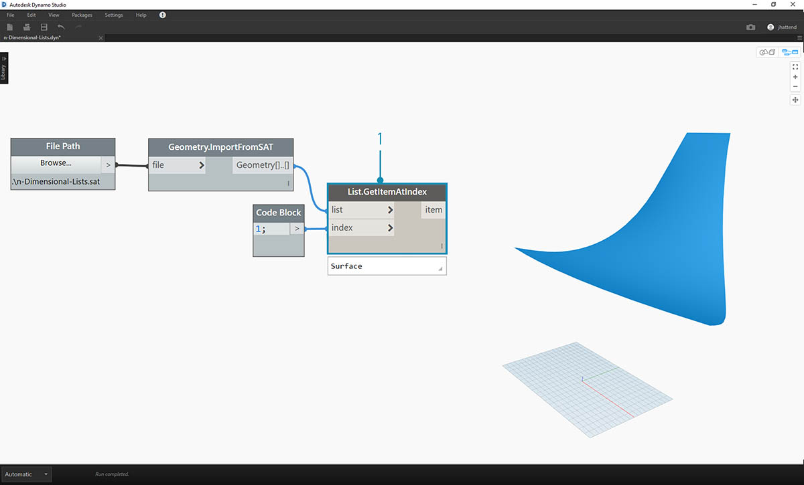
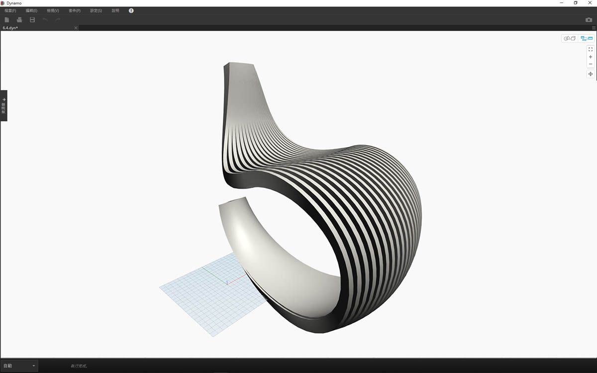
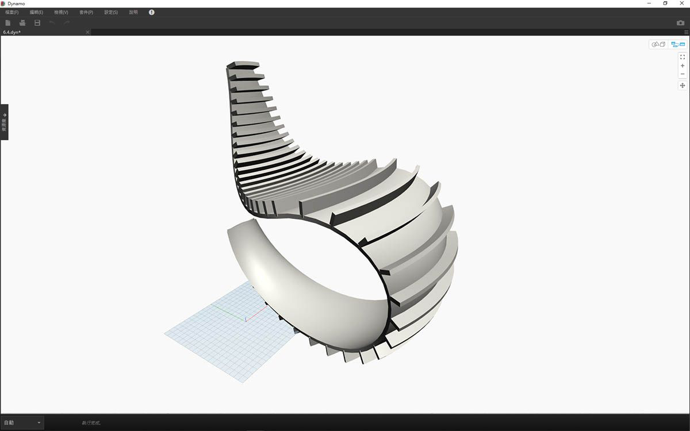

## n 維清單

進一步深入探討，接下來我們在階層中加入更多層。資料結構的擴展範圍遠超二維清單的清單。由於在 Dynamo 中清單是其本身的項目，因此我們可以建立維度儘可能多的資料。

我們在此將使用的類比是俄羅斯套娃。可將每個清單視為包含多個項目的一個容器。每個清單都有自己的性質，也可將每個清單視為自己的物件。


> 一組俄羅斯套娃 (相片由 [Zeta](https://www.flickr.com/photos/beppezizzi/145493363) 拍攝) 可類比為 n 維清單。每層代表一個清單，每個清單包含其內部的項目。在 Dynamo 的案例中，每個容器內部可以有多個容器 (表示每個清單的項目)。

很難以視覺方式解釋 n 維清單，但我們在本章設置了一些練習，以著重說明使用超過二維的清單。

## 對映與組合

對映可能是 Dynamo 中資料管理最複雜的部分，在使用複雜的清單階層時尤其重要。透過以下的一系列練習，我們將展示在資料變成多維時，何時使用對映與組合。

上一節提供了 List.Map 與 List.Combine 的初步介紹。在以下最後一個練習中，我們將對複雜的資料結構使用這些節點。

### 練習 - 2D 清單 - 基本

> 下載此練習隨附的範例檔案 (按一下右鍵，然後按一下「連結另存為...」)。附錄中提供範例檔案的完整清單。1.[n-Dimensional-Lists.dyn](datasets/6-4/n-Dimensional-Lists.dyn) 2.[n-Dimensional-Lists.sat](datasets/6-4/n-Dimensional-Lists.sat)

此練習是一系列三個練習中的第一個，著重講解匯入的幾何圖形。在這一系列練習中，每個部分的資料結構複雜性都有提升。


> 1. 先從練習檔案資料夾中的 .sat 檔案開始。我們可以使用 *File Path* 節點擷取此檔案。
2. 使用 *Geometry.ImportFromSAT*，將幾何圖形匯入為 Dynamo 預覽中的兩個曲面。



> 對於此練習，我們希望執行簡單作業，並使用其中一個曲面。

> 1. 接下來選取索引 *1* 以擷取上方的曲面。我們使用 *List.GetItemAtIndex* 節點執行此作業。


> 下一步是將曲面分割為點的網格。

> 1. 使用*代碼區塊*，插入以下兩行代碼：
```
0..1..#10;
0..1..#5;
```

2. 使用 *Surface.PointAtParameter*，將兩個代碼區塊值連接至 *u* 與 *v*。將此節點的*鑲邊*變更為*「叉積」*。
3. 輸出顯示了資料結構，在 Dynamo 預覽中也可以看到資料結構。


> 1. 為了查看資料結構的組織方式，接下來將 *NurbsCurve.ByPoints* 連接至 *Surface.PointAtParameter* 的輸出。
2. 請注意，沿曲面有十條曲線處於垂直狀態。


> 1. 對於清單的清單，基本 *List.Transpose* 會翻轉欄與列。
2. 將 *List.Transpose* 的輸出連接至 *NurbsCurve.ByPoints*，現在曲面上有五條曲線處於水平狀態。

### 練習 - 2D 清單 - 進階

接下來提高複雜性。假設我們要對上一個練習中建立的曲線執行作業。我們可能希望讓這些曲線與另一個曲面相關，並在這些曲線之間執行斷面混成。這需要更多注意資料結構，但基本邏輯是相同的。


> 1. 從上一個練習的步驟開始，使用 *List.GetItemAtIndex* 節點隔離所匯入幾何圖形的上方曲面。


> 1. 使用 *Surface.Offset*，將曲面偏移值 *10*。


> 1. 使用上一個練習中的相同方式，定義包含以下兩行代碼的 *code block*：
```
0..1..#10;
0..1..#5;
```

2. 將這些輸出連接至兩個 *Surface.PointAtParameter* 節點 (每個節點的*鑲邊*設定為*「叉積」*)。其中一個節點連接至原始曲面，而另一個連接至偏移曲面。


> 1. 與上一個練習中相同，將輸出連接至兩個 *NurbsCurve.ByPoints* 節點。
2. Dynamo 預覽顯示兩條曲線，分別對應於兩個曲面。


> 1. 使用 *List.Create*，可以將兩組曲線合併至一個清單的清單中。
2. 請注意輸出包含兩個清單，每個清單包含十個項目，表示每個清單連接一組 NURBS 曲線。
3. 透過執行 *Surface.ByLoft*，我們能以視覺方式瞭解該資料結構。節點會對每個子清單中的所有曲線執行斷面混成。


> 1. 記住，使用 *List.Transpose*，我們將翻轉所有欄與列。此節點會將各包含十條曲線的兩個清單轉換為各包含兩條曲線的十個清單。現在，我們的每條 NURBS 曲線都與另一個曲面上的相鄰曲線相關。
2. 使用 *Surface.ByLoft*，我們將產生稜紋結構。


> 1. *List.Transpose* 的替代方法是 *List.Combine*。此作業會對每個子清單使用*「結合器」*。
2. 在此案例中，我們將 *List.Create* 用作*「結合器」*，它將建立包含子清單中所有項目的清單。
3. 使用 *Surface.ByLoft* 節點，我們將取得與上一步驟中相同的曲面。在此案例中，轉置更易於使用，但是在資料結構變得更複雜時，*List.Combine* 更可靠。


> 1. 後退幾個步驟，如果我們要切換稜紋結構中曲線的方位，需要在連接至 *NurbsCurve.ByPoints* 之前，使用 List.Transpose。這將翻轉欄與列，產生 5 個水平肋。

### 練習 - 3D 清單

現在，我們要更進一步。在本練習中，我們將使用兩個匯入的曲面建立複雜的資料階層。我們的目標仍是使用相同的基本邏輯完全相同的作業。


> 1. 從上一個練習中所匯入的檔案開始。


> 1. 與上一個練習中相同，使用 *Surface.Offset* 節點以偏移值 *10*。
2. 請注意，輸出顯示我們已使用偏移節點建立了兩個曲面。


> 1. 使用上一個練習中的相同方式，定義包含以下兩行代碼的代碼區塊：
```
0..1..#20;
0..1..#10;
```

2. 將這些輸出連接至兩個 *Surface.PointAtParameter* 節點 (每個節點的鑲邊設定為*「叉積」*)。其中一個節點連接至原始曲面，而另一個連接至偏移曲面。


> 1. 與上一個練習中相同，將輸出連接至兩個 *NurbsCurve.ByPoints* 節點。
2. 查看 *NurbsCurve.ByPoints* 的輸出，請注意這是包含兩個清單的清單，較上一個練習更複雜。資料由基本曲面進行分類，因此我們將另一個層加入至構建的資料。
3. 請注意，*Surface.PointAtParameter* 節點中的狀況變得更複雜。在此案例中，將產生清單的清單的清單。


> 1. 使用 *List.Create* 節點，將多條 NURBS 曲線合併為一個資料結構，建立清單的清單的清單。
2. 透過連接 *Surface.ByLoft* 節點，將取得原始曲面的某個版本，因為每個曲面都位於自己從原始資料結構建立的清單中。


> 1. 在上一個練習中，我們可以使用 *List.Transpose* 建立稜紋結構。在本練習中，此方法將無效。轉置應該用於二維清單，而由於我們使用的是三維清單，因此「翻轉欄與列」的作業無法輕鬆執行。請記住，清單是物件，因此 *List.Transpose* 會翻轉無子清單的清單，但不會翻轉 NURBS 曲線與階層中下一層級內的一個清單。


> 1. *List.Combine* 在本練習中更有效。面對更複雜的資料結構時，我們會使用 *List.Map* 與 *List.Combine* 節點。
2. 將 *List.Create* 用作*「結合器」*會建立更有效的資料結構。


> 1. 資料結構仍需要在階層中的下一層級進行轉置。若要執行此作業，我們將使用 *List.Map*。此工作類似於 *List.Combine*，只是使用一個輸入清單，而不是至少兩個。
2. 我們將套用至 *List.Map* 的函數是 *List.Transpose*，它將翻轉主要清單中子清單的欄與列。


> 1. 最後，我們可以使用正確的資料階層對 NURBS 曲線進行斷面混成，從而產生稜紋結構。


> 1. 接下來使用 *Surface.Thicken* 節點向幾何圖形加入一些深度。


> 1. 加入支撐這兩個結構的曲面會很好，因此我們將使用 *List.GetItemAtIndex* 從上一步驟中的斷面混成曲面中選取背面。


> 1. 增厚這些所選曲面，我們的連接即可完成。



> 它並不是最舒服的搖椅，但是會取得大量資料。


> 最後一步，我們將反轉帶條紋成員的方向。在上一個練習中使用轉置時，我們曾執行過與此類似的作業。

> 1. 由於階層中還有一層，因此我們需要搭配使用 *List.Map* 與 *List.Tranpose* 函數來變更 NURBS 曲線的方向。


> 1. 我們可能希望提高踏板數量，因此可以將代碼區塊變更為
```
0..1..#20;
0..1..#10;
```



> 第一個版本的搖椅造型優美，因此我們的第二個模型將作為運動設備提供在野外的休息功能。

