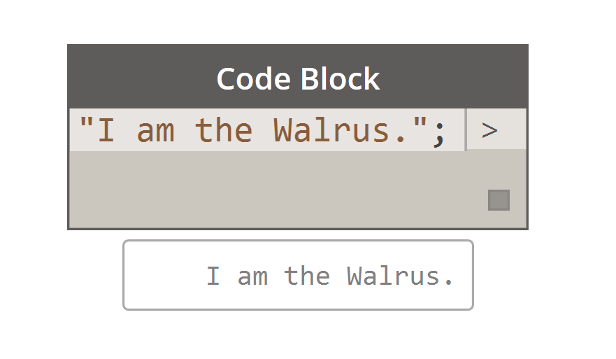

## What's a Code Block?
Code blocks are a window deep into DesignScript, the programming language at the heart of Dynamo.  Built from scratch to support exploratory design workflows, DesignScript is a readable and concise language that offers both immediate feedback to small bits of code and also scales to large and complex interactions.  DesignScript also forms the backbone of the engine that drives most aspects of Dynamo “under the hood”.  Because nearly all of the functionality found in Dynamo nodes and interactions have a one-to-one relationship with the scripting language, there are unique opportunities to move between node-based interactions and scripting in a fluid way. 

For beginners, nodes can be automatically converted to text syntax to aid in learning DesignScript or simply to reduce the size of larger sections of graphs.  This is done using a process called "Node to Code", which is outlined in more detail in the [DesignScript Syntax section](7-2_Design-Script-syntax.md).   More experienced users can use Code Blocks to create customized mashups of existing functionality and user authored relationships using many standard coding paradigms.  In between the beginner and advanced user, there are a huge number of shortcuts and code snippets that will accelerate your designs.  While the term 'code block' may be a little intimidating to non-programmers, it is both easy to use and robust. A beginner can use the code block efficiently with minimal coding, and an advanced user can define scripted definitions to be recalled elsewhere in a Dynamo definition.

###Code Block: A brief overview
In short, code blocks are a text-scripting interface within a visual-scripting environment.  They can be used as numbers, strings, formulas, and other data types.  The code block is designed for Dynamo, so one can define arbitrary variables in the code block, and those variables are automatically added to the inputs of the node:

With code blocks, a user has the flexibility to decide how to specify inputs. Here are several different ways to make a basic point with coordinates *(10, 5, 0)*:

As you learn more of the available functions in the library, you might even find that typing “Point.ByCoordinates” is faster than searching in the library and finding the proper node.  When you type in *"Point."* for example, Dynamo will display a list of possible functions to apply to a Point.  This makes the scripting more intuitive and will help with learning how to apply functions in Dynamo.

### Creating Code Block Nodes
The code block can be found in *Core>Input>Actions>Code Block*. But even faster, just double click on the canvas and the code block appears.  This node is used so often, it's given full double-click privileges.

### Numbers, strings, and formulas

Code blocks are also flexible towards data types.  The user can quickly define numbers, strings, and formulas and the code block will deliver the desired output.

In the image below, you can see the "old school" way of doing things is a little long-winded: the user searches for the intended node in the interface, adds the node to the canvas, and then inputs the data.  With code block, the user can double-click on the canvas to pull up the node, and type in the correct data type with basic syntax.

> The *number*, *string*, and *formula* nodes are three examples of Dynamo nodes which are arguably obsolete in comparison to the *code block*.

