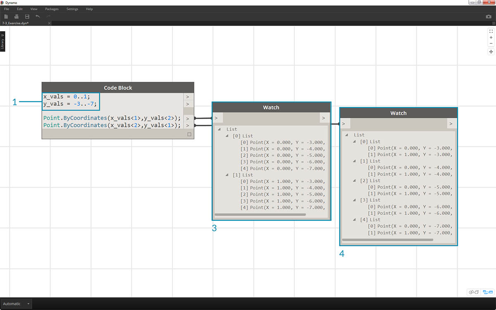
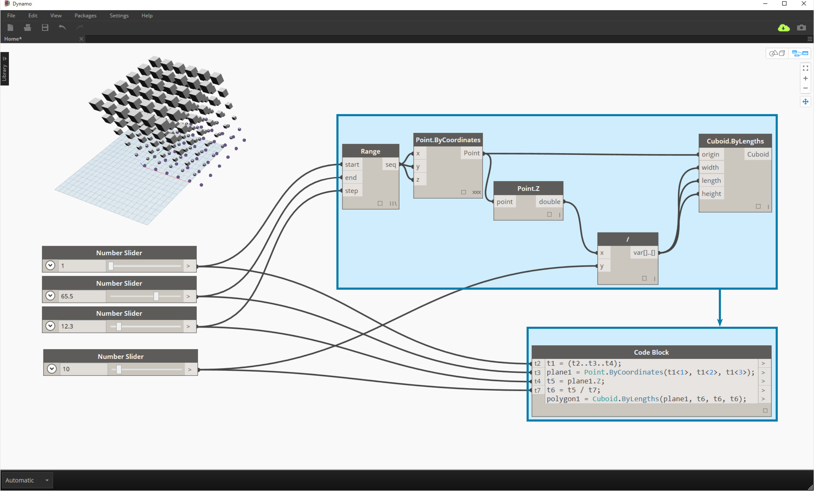
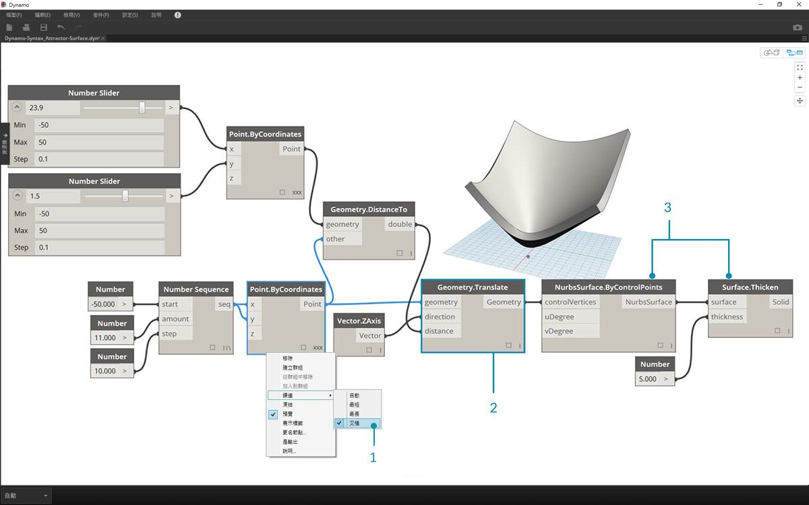
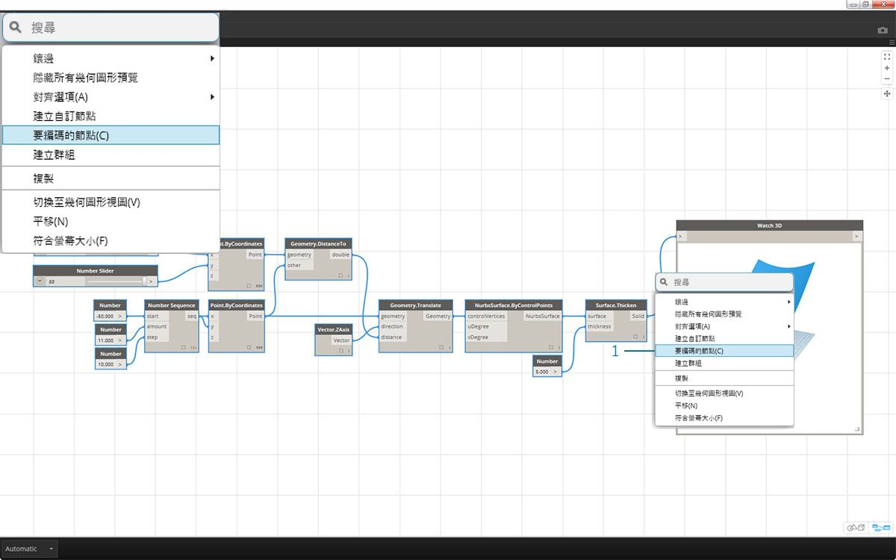

## DesignScript 語法

您可能已注意到 Dynamo 中節點名稱的常見現象：每個節點都使用不含空格的*「.」* 語法。這是因為每個節點頂部的文字表示腳本的實際語法，*「.」*(即*圓點符號*) 會區分我們可以呼叫的可能方法中的元素。這將建立從視覺腳本到文字型腳本的輕鬆轉換。


作為圓點符號的一般類比，在 Dynamo 中如何處理參數式蘋果呢？以下是我們在決定吃蘋果之前先對蘋果執行的一些方法。(注意：這些方法不是實際的 Dynamo 方法)。

|人類可讀|圓點符號|輸出|
| -- | -- | -- |
|蘋果的顏色是什麼？|Apple.color|紅色|
|蘋果成熟了嗎？|Apple.isRipe|true|
|蘋果有多重？|Apple.weight|6 盎司。|
|蘋果來自何處？|Apple.parent|樹|
|蘋果建立哪些項目？|Apple.children|種子|
|這個蘋果是本地生長的嗎？|Apple.distanceFromOrchard|60 英里。|

我不瞭解您，但根據以上表格的輸出進行判斷，似乎這是一個美味的蘋果。我認為我會執行 *Apple.eat()*。

### 代碼區塊中的圓點符號

記住蘋果的類比，接下來瞭解 *Point.ByCoordinates*，並展示如何使用以下代碼區塊來建立點：


> 在 Dynamo 中，*code block* 語法 ```Point.ByCoordinates(0,10);``` 產生的結果與 *Point.ByCoordinates * 節點相同，只是我們可以使用一個節點來建立點。相較於將不同節點連接至*「X」*與*「Y」*，此方法更有效。

> 1. 透過在代碼區塊中使用 *Point.ByCoordinates*，我們將以與即裝即用節點 *(X,Y)* 相同的順序指定輸入。

### 呼叫節點

您可以透過 Code Block 呼叫資源庫中的任何一般節點，只要該節點不是特殊的*「使用者介面」節點* (具有特殊的使用者介面功能) 即可。例如，您可以呼叫 *Circle.ByCenterPointRadius*，但是呼叫 *Watch 3D* 節點意義不大。

一般節點 (資源庫中的大多數節點) 通常分為三種類型：

* **Create** - 可建立 (或建構) 項目
* **Action** - 可對某項目執行動作
* **Query** - 可取得既有項目的性質

您會發現資源庫在組織時考慮到了這些品類。在 Code Block 中呼叫時，對這三種類型方法 (或節點) 的處理方式不同。


#### Create

「Create」品類將從零開始建構幾何圖形。我們在代碼區塊中以從左至右的順序輸入值。這些輸入的順序與節點上從上到下的輸入順序相同：

> 對 *Line.ByStartPointEndPoint* 節點與代碼區塊中的對應語法進行比較，可以取得相同結果。

#### Action

動作是您對該類型的物件執行的行為。Dynamo 使用許多編碼語言中通用的*圓點符號*將動作套用至物件。確定物件後，輸入圓點，後接動作名稱。動作類型方法的輸入將放置在括號中，類似於建立類型的方法，只是您不必指定對應節點上看到的第一個輸入。我們改為指定執行動作時所依據的元素：


> 1. *Point.Add* 節點是動作類型節點，因此語法稍有不同。
2. 輸入是 (1) *point*　以及將加入點的 (2) *vector*。在 *Code Block* 中，我們已將點 (物件) 命名為*「pt」*。為了將命名為*「vec」*的向量加入至*「pt」*，我們會編寫 *pt.add(vec )* 或採用「物件, 圓點, 動作」的格式。加入動作僅有一個輸入，也就是 *Point.Add * 節點的所有輸入減去第一個輸入。*Point.Add* 節點的第一個輸入是點本身。

#### Query

Query 類型方法會取得物件的性質。由於物件本身就是輸入，因此您不必指定任何輸入。不需要使用括號。


### 鑲邊的狀況怎樣？

節點的鑲邊與代碼區塊的鑲邊稍有不同。對於節點，使用者會在節點上按一下右鍵，然後選取要執行的鑲邊選項。對於代碼區塊，使用者針對資料的構建方式會有更多的控制。代碼區塊速寫方法使用*複製指南*來設定多個一維清單應採用的配對方式。角括號「<>」中的數字會定義所產生巢狀清單的階層：<1>、<2>、<3> 等。</3></2></1>

> 1. 在此範例中，我們使用速寫來定義兩個範圍 (本章的下一節將講述速寫的更多內容)。簡言之，```0..1;``` 等效於 ```{0,1}```，```-3..-7``` 等效於 ```{-3,-4,-5,-6,-7}```。結果將產生包含 2 個 x 值與 5 個 y 值的清單。如果我們不使用複製指南與這些不相符的清單，則會取得包含兩個點的清單，這是長度最短的清單。使用複製指南，我們可以尋找 2 個 x 座標與 5 個 y 座標的所有可能組合 (即**叉積**)。
2. 使用語法 ```Point.ByCoordinates(x_vals<1>,y_vals<2>);```，可以產生**兩個**清單，其中每個清單包含**五個**項目。
3. 使用語法 ```Point.ByCoordinates(x_vals<2>,y_vals<1>);```，可以產生**五個**清單，其中每個清單包含**兩個**項目。

使用該表現法，我們也可以指定佔主要地位的清單：2 個清單 (各包含 5 個項目) 還是 5 個清單 (各包含 2 個項目)。在此範例中，若變更複製指南的順序，結果將產生網格中點列的清單或點欄的清單。

### 要編碼的節點

以上代碼區塊方法可能花一點時間才能習慣，而 Dynamo 中提供稱為「要編碼的節點」功能，可以讓程序更輕鬆。若要使用此功能，請在 Dynamo 圖表中選取一系列節點，在圖元區上按一下右鍵，然後選取「Node to Code」。Dynamo 會將這些節點及所有輸入與輸出縮攏到代碼區塊中！這不僅是強大的代碼區塊學習工具，也能讓您使用更高效的參數式 Dynamo 圖表。我們將使用「要編碼的節點」結束以下練習，因此請勿錯過。



### 練習

> 下載此練習隨附的範例檔案 (按一下右鍵，然後按一下「連結另存為...」)。附錄中提供範例檔案的完整清單。[Dynamo-Syntax_Attractor-Surface.dyn](datasets/7-2/Dynamo-Syntax_Attractor-Surface.dyn)

為了展示代碼區塊的強大功能，我們要將既有的牽引欄位定義轉換為代碼區塊形式。使用既有定義可展示代碼區塊與視覺腳本如何具有相關性，有助於學習 DesignScript 語法。

> 開始先重新建立以上影像中的定義 (或開啟範例檔案)。

> 1. 請注意，*Point.ByCoordinates* 的 Lacing 已設定為 *Cross Product*。
2. 網格中的每個點都會根據其距參考點的距離而在 Z 方向上移。
3. 重新建立並增厚曲面，同時在幾何圖形上建立相對於距參考點距離的凸度。


> 1. 我們從零開始，先建立參考點：```Point.ByCoordinates(x,y,0);```。我們使用的 *Point.ByCoordinates* 語法與參考點節點上方指定的語法相同。
2. 將變數 *x* 與 *y* 插入至 code block，以便我們可以使用滑棒動態更新這些內容。
3. 加入一些 *sliders* 至 *code block* 的輸入，它們的範圍是 *-50* 至 *50*。這樣我們可以跨越整個預設 Dynamo 網格。


> 1. 在 *code block* 的第二行，我們定義了速寫以取代數字序列節點：```coordsXY = (-50..50..#11);```。我們將在下一節詳細討論此內容。現在，請注意此速寫等效於視覺腳本中的 *Number Sequence* 節點。


> 1. 現在，我們將從 *coordsXY* 序列建立點的網格。若要執行此作業，我們需要使用 *Point.ByCoordinates* 語法，但還需要以我們在視覺腳本中採用的相同方式，啟動清單的 *Cross Product*。為了執行此作業，我們輸入以下代碼行：```gridPts = Point.ByCoordinates(coordsXY<1>,coordsXY<2>,0);```。角括號表示叉積參考。
2. 請注意，在 *Watch3D* 節點中，將顯示跨越 Dynamo 網格的點網格。


> 1. 現在講解困難的部分：我們希望根據點距參考點的距離，將這些點的網格上移。首先，呼叫這一組新點 *transPts*。由於轉換是針對既有元素的動作，而不是使用 ```Geometry.Translate ...```，因此我們使用 ```gridPts.Translate```。
2. 讀取圖元區上的實際節點，我們可以看到有三個輸入。已宣告要轉換的 geometry，因為我們將對該元素執行動作 (使用 *gridPts.Translate*)。其餘兩個輸入將插入到函數的括號內：*direction* 與 *distance*。
3. 方向足夠簡單，我們使用 ```Vector.ZAxis()``` 執行垂直移動。
4. 參考點與每個網格點之間的距離仍需要計算，因此我們使用相同方式對參考點執行此動作：```refPt.DistanceTo(gridPts)```
5. 最後一行代碼將提供轉換點：```transPts = gridPts.Translate(Vector.ZAxis(),refPt.DistanceTo(gridPts));```


> 1. 現在，我們已經建立具有適當資料結構的點網格，可以建立 Nurbs 曲面。我們將使用 ```srf = NurbsSurface.ByControlPoints(transPts);``` 建構曲面


> 1. 最後，為了加入某些深度到曲面，我們使用 ```solid = srf.Thicken(5);``` 來建構實體。在此案例中，我們使用代碼將曲面增厚了 5 個單位，不過可以始終將其宣告為變數 (例如將其稱為 *厚度*)，然後使用滑棒控制該值。

### 使用「要編碼的節點」簡化圖表

只需按一下按鈕，「要編碼的節點」功能即可自動執行我們剛剛完成的整個練習。這不僅在建立自訂定義及可重複使用的代碼區塊時功能強大，也是瞭解 Dynamo 中腳本編寫方式的非常有用的工具。



> 1. 先使用練習的第 1 步驟中使用的既有視覺腳本。選取所有節點，在圖元區上按一下右鍵，然後選取 *「Node to Code」*。非常簡單。


> Dynamo 已自動建立文字式版本的視覺圖表、鑲邊與全部項目。在您的視覺腳本上測試這一點，並釋放代碼區塊的強大功能！

