## 速寫

代碼區塊中提供了一些基本速寫方法，簡言之，這些方法可以*顯著*降低資料管理的難度。以下我們將分類講解基本知識，並討論如何使用此速寫來建立與查詢資料。

|資料類型|標準 Dynamo|代碼區塊等效|
| -- | -- | -- |
|數字||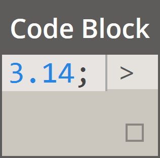|
|字串||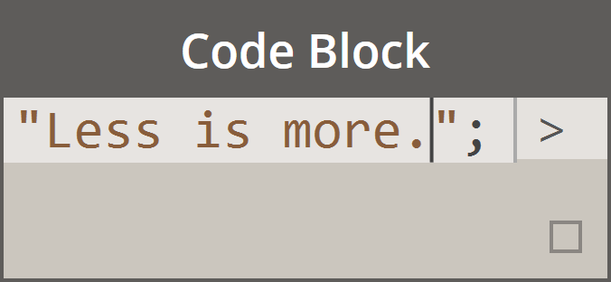|
|順序|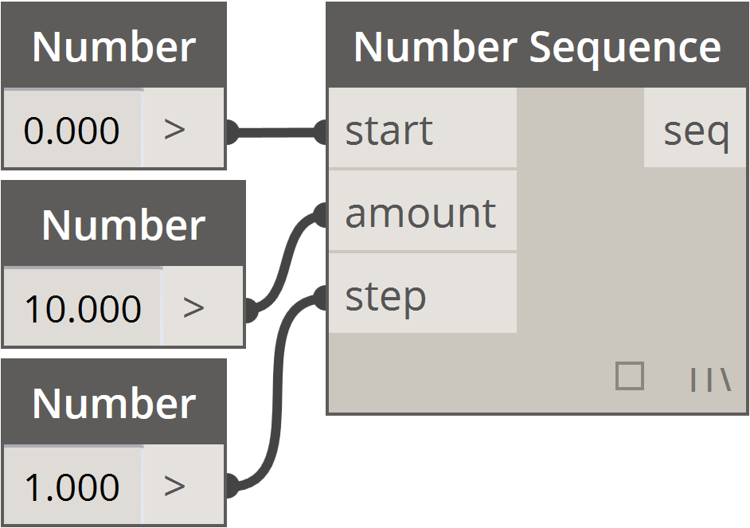|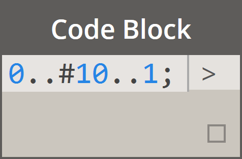|
|範圍|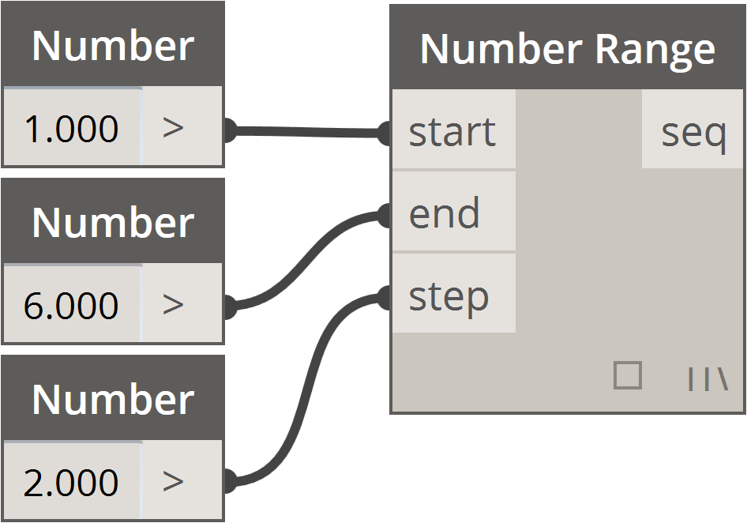|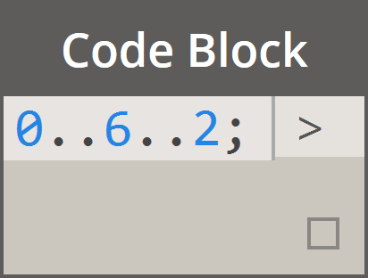|
|取得索引處的項目|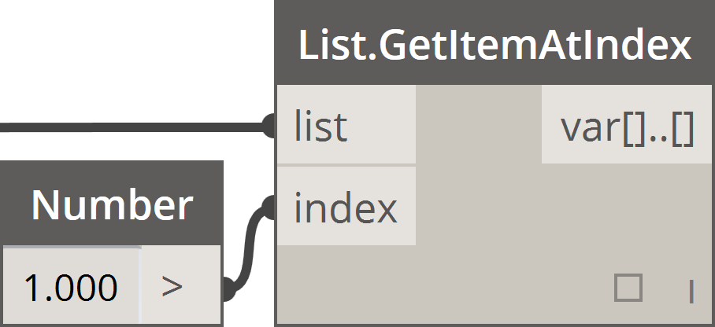||
|建立清單|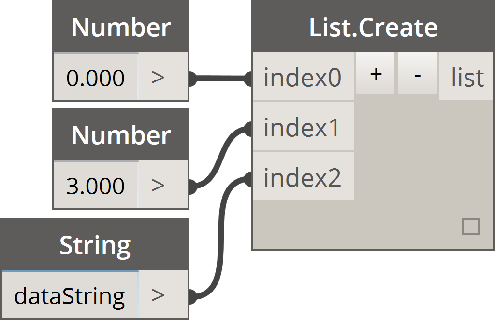|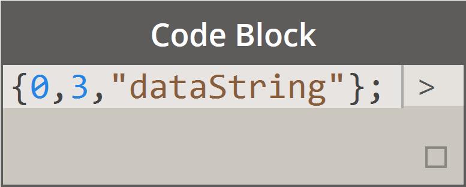|
|連接字串|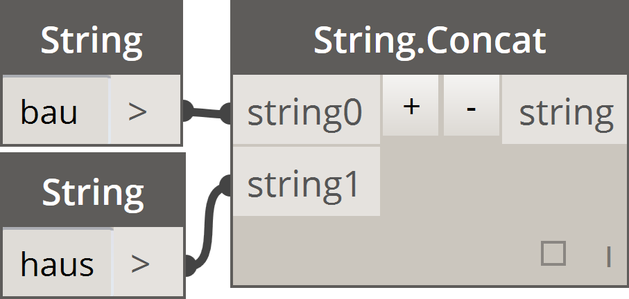||
|條件陳述式|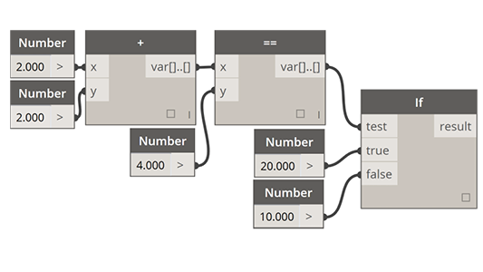||

### 其他語法

|節點|代碼區塊等效|註記|
| -- | -- | -- |
|任何運算子 (+、&&、>=、Not，等等)|+、&&、>=、!，等等|請注意「Not」變為「!」但節點稱為「Not」以便與「Factorial」區分|
|Boolean True|true；|請注意小寫|
|Boolean False|false；|請注意小寫|

### 範圍

定義範圍與序列的方法可以精簡為基本速寫。使用以下影像作為「..」語法的指南，以便使用代碼區塊定義一系列數字資料。瞭解此表現法後，建立數字資料就成為非常高效的程序：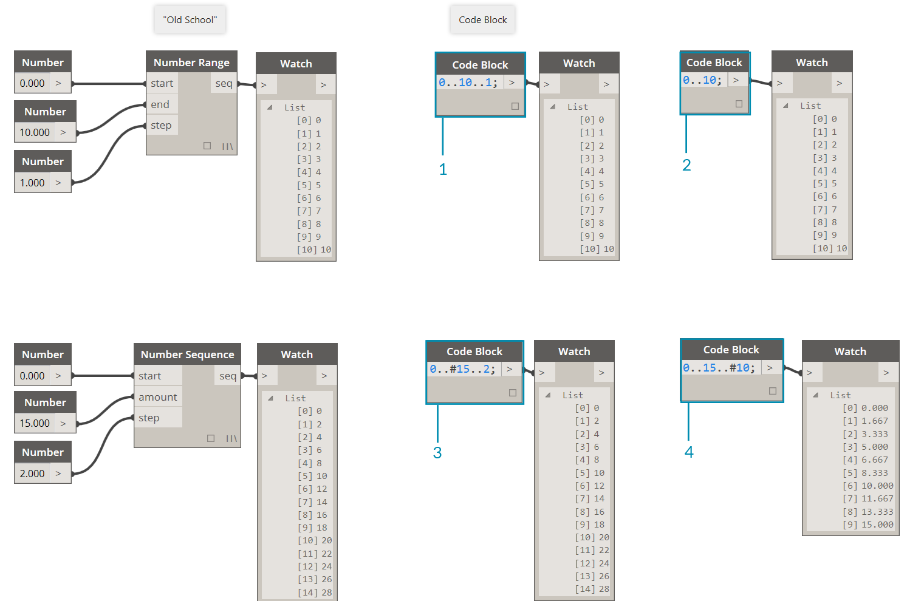

> 1. 在此範例中，數字範圍由定義 ```beginning..end..step-size;``` 的基本代碼區塊語法所取代。以數字方式表示，可以取得 ```0..10..1;```
2. 請注意，語法 ```0..10..1;``` 等效於 ```0..10;```。步長大小 1 是速寫符號的預設值。因此 ```0..10;``` 將產生從 0 至 10 且步長大小為 1 的序列。
3. *數字序列*範例與此類似，只是我們使用*「#」*來說明希望清單包含 15 個值，而非清單中的值不超過 15。在此案例中，我們將定義：```beginning..#ofSteps..step-size:```。序列的實際語法是 ```0..#15..2```
4. 使用上一步驟中的*「#」*，現在將其放置在語法的*「步長大小」*部分。現在，我們產生的*數字範圍*是從*「起點」*至*「終點」*，*「步長大小」*符號在起點與終點之間均勻分佈諸多值：```beginning..end..#ofSteps```

### 進階範圍

藉由建立進階範圍，我們能以簡單方式使用清單的清單。在以下範例中，我們將隔離變數與主要範圍符號，並建立該清單的另一個範圍。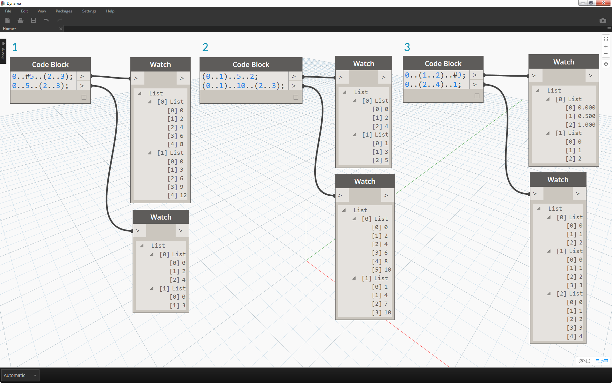

> 1. 建立巢狀範圍，對含與不含*「#」*的符號進行比較。套用基本範圍內的相同邏輯，只是變得稍複雜一些。
2. 可以在主要範圍內的任何位置定義子範圍，請注意我們可以有兩個子範圍。
3. 透過控制範圍內的 *「end」* 值，我們可以建立長度不同的多個範圍。

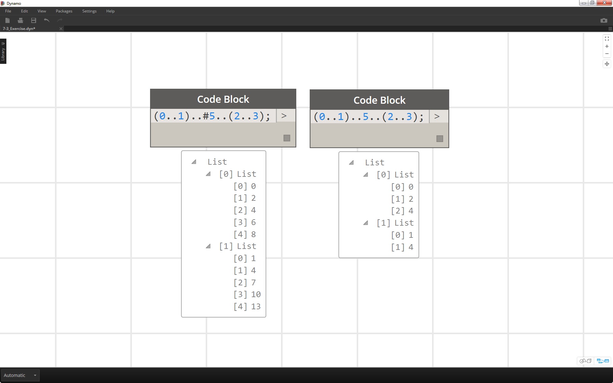

> 作為邏輯練習，比較以上兩個速寫，並嘗試剖析*子範圍*與*「#」*符號如何產生結果輸出。

### 建立清單與取得清單中的項目

除了使用速寫建立清單外，我們也可以快速建立清單。這些清單可以包含多種元素類型，也可以進行查詢 (請記住，清單是其本身的物件)。總而言之，使用代碼區塊，您將使用「大括號」建立清單，並使用「中括號」查詢清單中的項目：

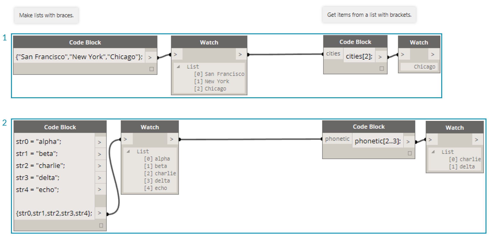

> 1. 使用字串快速建立清單，並使用項目索引對清單進行查詢。
2. 使用變數建立清單，並使用範圍速寫符號對清單進行查詢。

使用巢狀清單進行管理是類似的程序。請注意清單順序，並使用多組中括號進行召回：

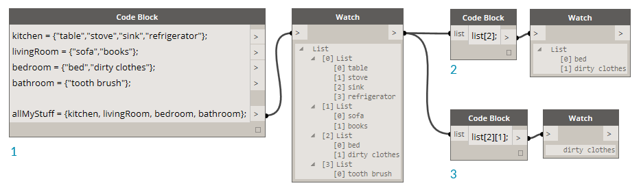

> 1. 定義清單的清單。
2. 使用單邊括號對清單進行查詢。
3. 使用雙邊括號對項目進行查詢。

### 練習

> 下載此練習隨附的範例檔案 (按一下右鍵，然後按一下「連結另存為...」)。附錄中提供範例檔案的完整清單。[Obsolete-Nodes_Sine-Surface.dyn](datasets/7-3/Obsolete-Nodes_Sine-Surface.dyn)

在本練習中，我們將靈活運用新的速寫技能，以建立由範圍與公式定義的炫酷蛋殼曲面。在本練習中，請注意我們如何搭配使用代碼區塊與既有 Dynamo 節點：我們對處理大量資料的工作使用代碼區塊，而以視覺方式配置 Dynamo 節點以實現定義的易讀性。

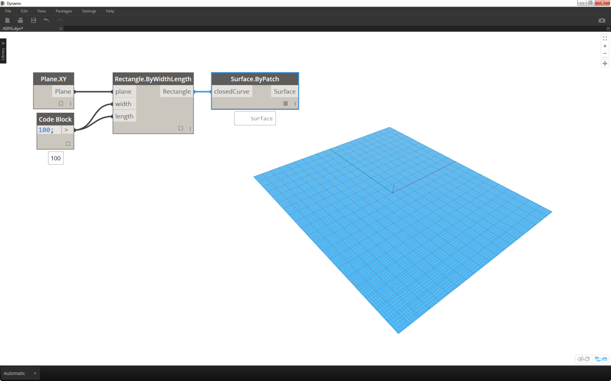

> 首先，透過連接以上節點以建立曲面。不是使用數字節點來定義寬度與長度，而是按兩下圖元區，然後在代碼區塊中輸入 ```100;```。

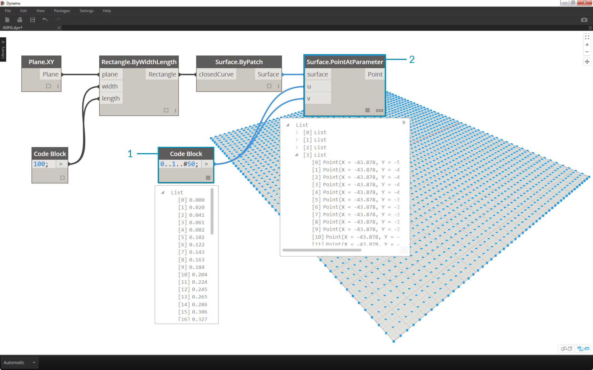

> 1. 在代碼區塊中輸入 ```0..1..#50```，以定義介於 0 至 1 之間且分為 50 份的範圍。
2. 將該範圍連接至 *Surface.PointAtParameter*，這會在曲面內為 *u* 與 *v* 指定介於 0 與 1 之間的值。請記住在 *Surface.PointAtParameter* 節點上按一下右鍵，以便將 *Lacing* 變更為 *Cross Product*。

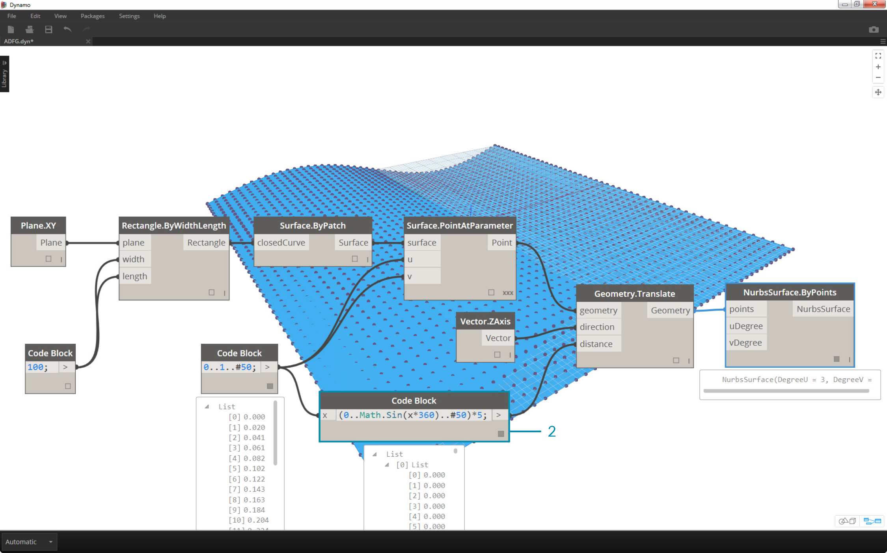

> 在此步驟中，我們使用第一個函數在 Z 方向將點的網格上移。此網格將根據基本函數驅動產生的曲面。

> 1. 加入視覺節點至圖元區，如以上影像所示。
2. 我們不是使用公式節點，而是使用包含以下代碼行的代碼區塊：```(0..Math.Sin(x*360)..#50)*5;```。為了快速詳細說明這一點，我們將定義內含公式的範圍。此方程式是正弦函數。正弦函數會接收 Dynamo 中輸入的角度，因此為了取得完整的正弦波形，我們將 *x* 值 (這是 0 到 1 的範圍輸入) 乘以 *360*。接下來，我們希望份數與每列的控制網格點數量相同，所以使用 *#50* 定義五十份。最後，乘數 5 只會增大轉換的幅度，以便我們能在 Dynamo 預覽中查看效果。

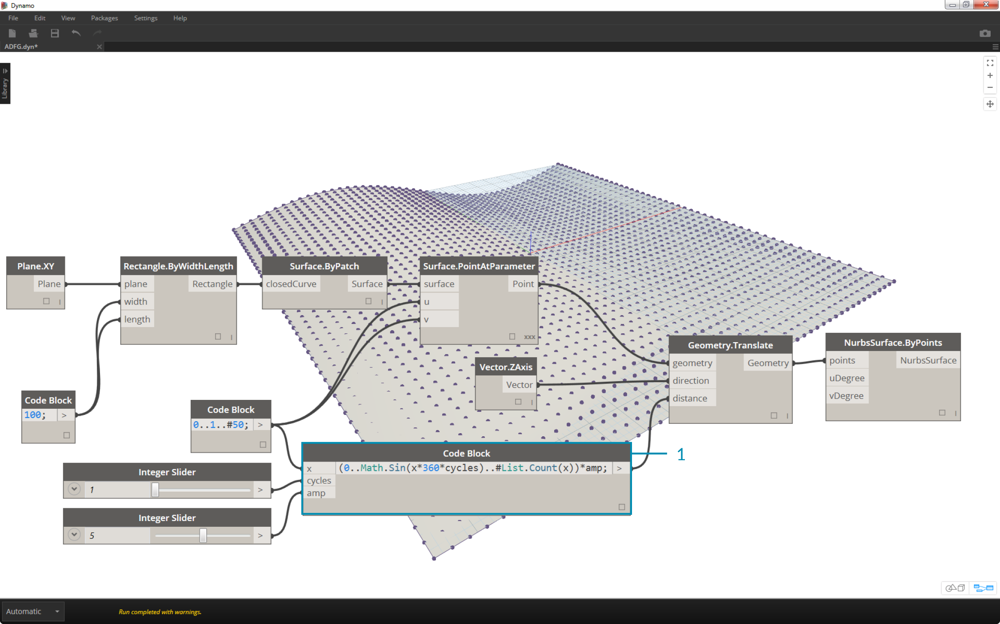

> 1. 雖然上一個代碼區塊效果很好，但它並非完全是參數式方法。我們要動態驅動其參數，因此將使用 ```(0..Math.Sin(x*360*cycles)..#List.Count(x))*amp;``` 取代上一個步驟中的代碼行。藉此我們能根據輸入定義這些值。

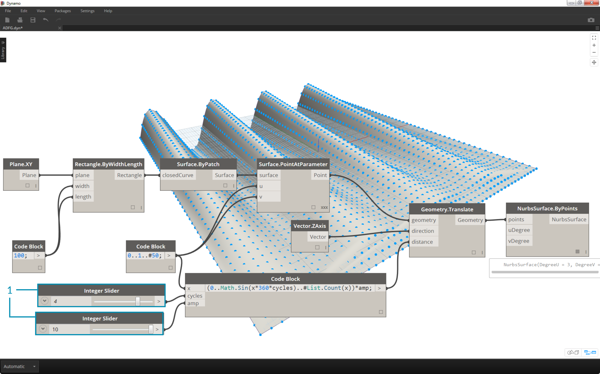

> 1. 透過變更滑棒 (範圍從 0 到 10)，我們將取得一些有趣的結果。

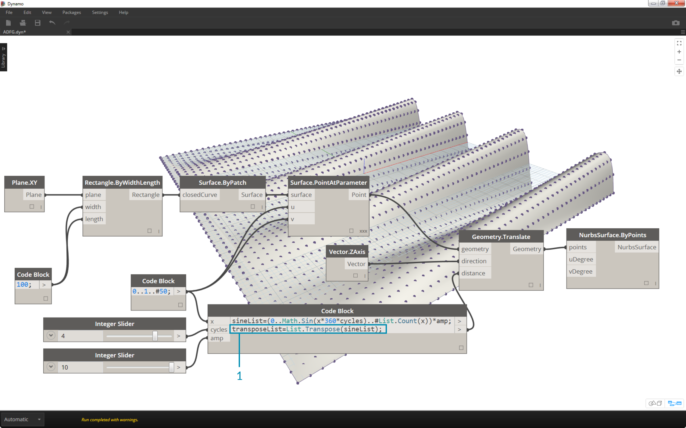

> 1. 透過對數量範圍執行轉置，我們將反轉帷幕波的方向：```transposeList = List.Transpose(sineList);```

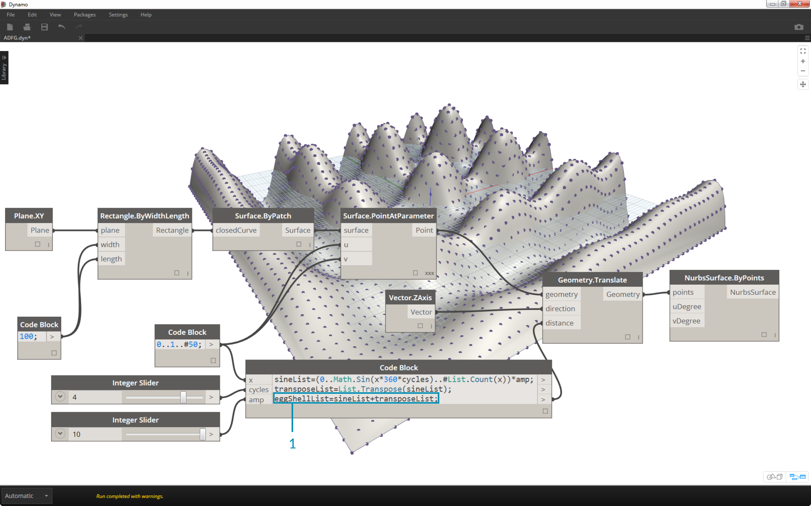

> 1. 加入 sineList 與 tranposeList 後取得扭曲的蛋殼曲面：```eggShellList = sineList+transposeList;```

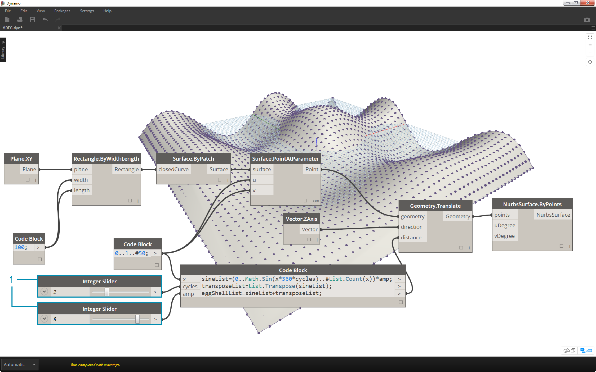

> 1. 再次變更滑棒，接下來我們停止此演算法的變動。

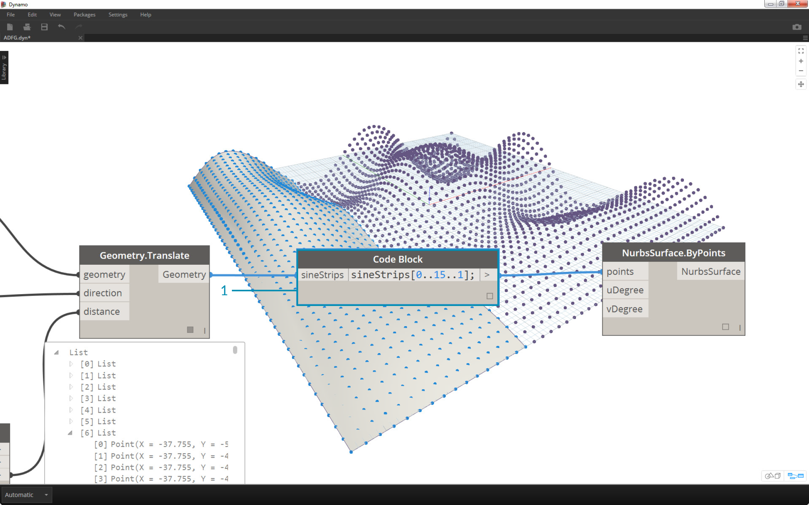

> 1. 最後，我們使用代碼區塊查詢資料的隔離部分。若要重新產生具有特定範圍點的曲面，請在 *Geometry.Translate* 與 *NurbsSurface.ByPoints* 節點之間加入以上代碼區塊。這包括文字行：```sineStrips[0..15..1];```。這將選取前 16 列的點 (從 50 個點中)。重新建立曲面，我們可以看到已產生點網格的隔離部分。

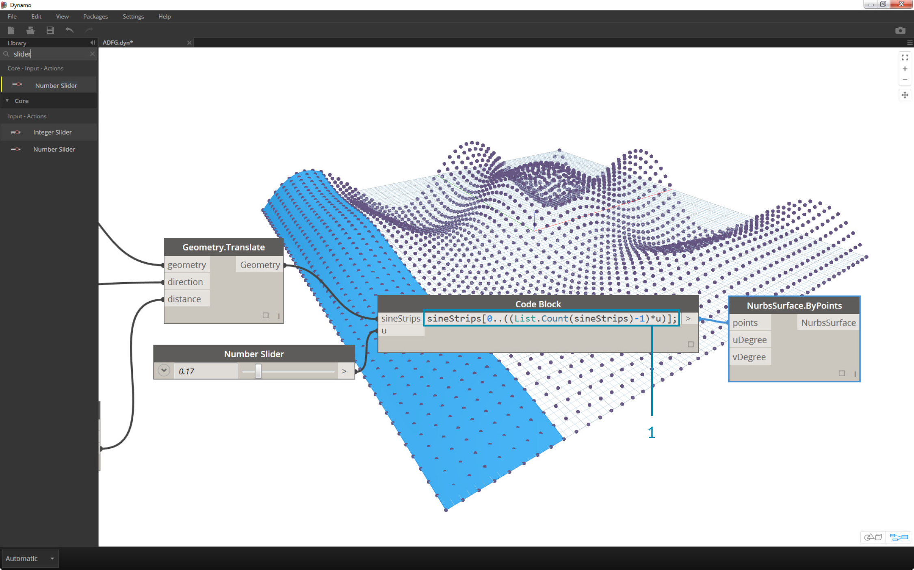

> 1. 在最後一個步驟中，為了使此代碼區塊的參數式程度更高，我們使用範圍從 0 至 1 的滑棒來驅動該查詢。我們使用以下代碼行執行此作業：```sineStrips[0..((List.Count(sineStrips)-1)*u)];```。這可能有些混亂，但使用該行代碼可以快速運用介於 0 和 1 之間的乘數來擴充清單長度。

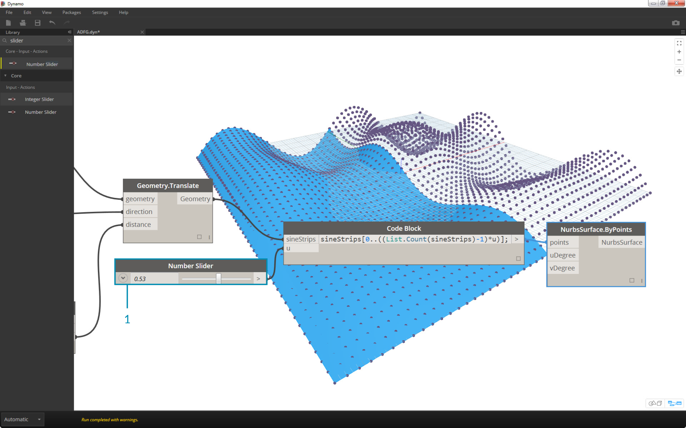

> 1. 若滑棒使用值 *0.53*，會建立剛好通過網格中點的曲面。

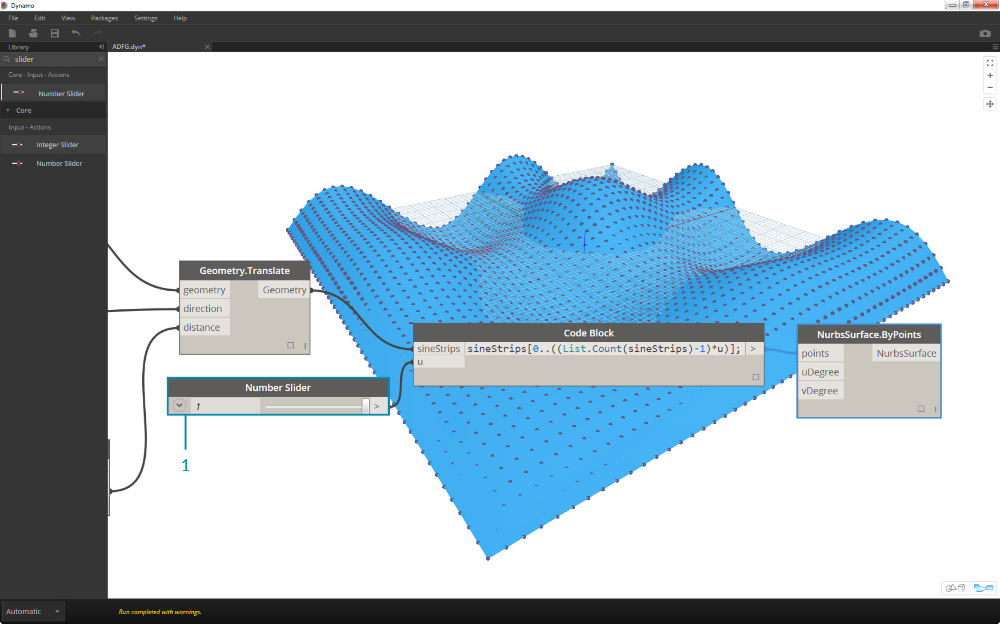

> 1. 與預期一致，滑棒值使用 *1* 時，會從完整的點網格建立曲面。

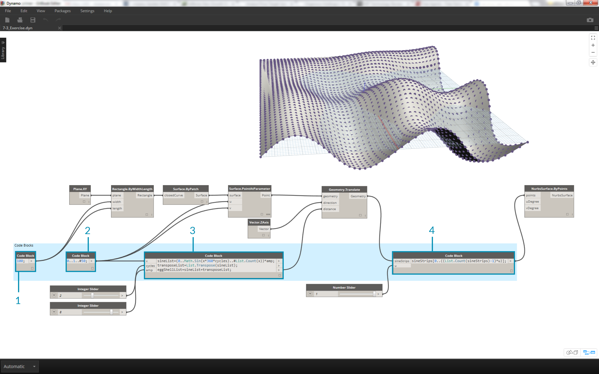

> 查看產生的視覺圖表，我們可以亮顯代碼區塊，並查看其中的每項函數。

> 1. 第一個代碼區塊將取代 *Number* 節點。
2. 第二個代碼區塊將取代 *Number Range* 節點。
3. 第三個代碼區塊將取代 *Formula* 節點 (以及 *List.Transpose*、*List.Count* 與 *Number Range*)。
4. 第四個代碼區塊將查詢清單的清單，並取代 *List.GetItemAtIndex* 節點。

