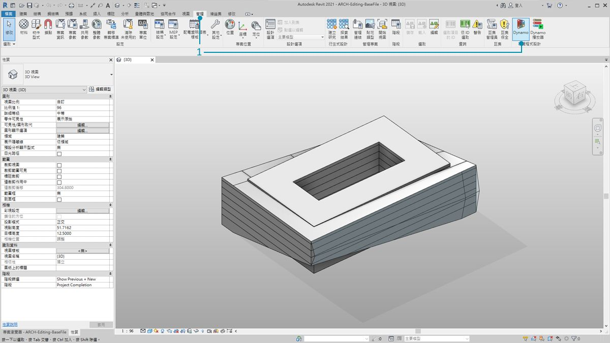

## Revit 連接

 Dynamo for Revit 使用圖形演算法編輯器的資料和邏輯環境來延伸建築資訊建模。其靈活性以及功能強大的 Revit 資料庫，為 BIM 提供了新視角。

本章的重點在於 BIM 的 Dynamo 工作流程。各小節主要基於練習，因為直接開始處理專案是熟悉 BIM 圖形算法編輯器的最佳方法。但是，首先讓我們來瞭解程式的開頭。

### #

#### Revit 版本相容性

隨著 Revit 和 Dynamo 兩者持續開發，您可能會發現，您使用的 Revit 版本與安裝在您電腦上的 Dynamo for Revit 版本不相容。以下概述哪些版本的 Dynamo for Revit 與 Revit 相容。

|Revit 版本|第一個穩定的 Dynamo 版本|最後一個支援的 Dynamo for Revit 版本|
| -- | -- | -- |
|2013|[0.6.1](http://dyn-builds-data.s3-us-west-2.amazonaws.com/DynamoInstall0.6.1.exe)|[0.6.3](http://dyn-builds-data.s3-us-west-2.amazonaws.com/DynamoInstall0.6.3.exe)|
|2014|[0.6.1](http://dyn-builds-data.s3-us-west-2.amazonaws.com/DynamoInstall0.6.1.exe)|[0.8.2](http://dyn-builds-data.s3-us-west-2.amazonaws.com/DynamoInstall0.8.2.exe)|
|2015|[0.7.1](http://dyn-builds-data.s3-us-west-2.amazonaws.com/DynamoInstall0.7.1.exe)|[1.2.1](http://dyn-builds-data.s3-us-west-2.amazonaws.com/DynamoInstall1.2.1.exe)|
|2016|[0.7.2](http://dyn-builds-data.s3-us-west-2.amazonaws.com/DynamoInstall0.7.2.exe)|[1.3.2](http://dyn-builds-data.s3-us-west-2.amazonaws.com/DynamoInstall1.3.2.exe)|
|2017|[0.9.0](http://dyn-builds-data.s3-us-west-2.amazonaws.com/DynamoInstall0.9.0.exe)|[最新的每日建置](http://dynamobuilds.com/)|
|2018|[1.3.0](http://dyn-builds-data.s3-us-west-2.amazonaws.com/DynamoInstall1.3.0.exe)|[最新的每日建置](http://dynamobuilds.com/)|
|2019|[1.3.3](http://dyn-builds-data.s3-us-west-2.amazonaws.com/DynamoInstall1.3.3.exe)|[最新的每日建置](http://dynamobuilds.com/)|

### #

#### Dynamo 歷程

> 在專注投入的開發人員團隊和充滿熱情的社群的努力下，專案從一開始的微不足道取得了長足的發展。

Dynamo 最初建立的目的是為了簡化 Revit 中的 AEC 工作流程。雖然 Revit 為每個專案建立了功能強大的資料庫，但對於普通使用者來說，在介面約束外存取此資訊可能很困難。Revit 提供了全面的 API (應用程式介面)，讓協力廠商開發人員可建立自訂工具。雖然程式設計人員已使用此 API 多年，但並非所有人都能存取文字型 scripting。Dynamo 的目標是透過可訪問的圖形算法編輯器使 Revit 資料可供所有人存取。

將核心 Dynamo 節點與自訂 Revit 節點搭配使用，使用者可以大大展開參數式工作流程以進行交互、記錄、分析和產生。使用 Dynamo，繁瑣的工作流程可以自動化，設計探索領域可蓬勃發展。

### 在 Revit 中執行 Dynamo

> 1. 在 Revit 專案或族群編輯器中，導覽至「外掛程式」，然後按一下「*Dynamo*」。注意：Dynamo 僅會在開啟它的檔案中執行。

> 1. 在 Revit 中開啟 Dynamo 時，會有一個稱為「*Revit*」的新品類。這是使用者介面的全面新增組件，其中提供了專用於 Revit 工作流程的節點。*

**注意 - 使用 Revit 特定的節點族群，Dynamo 圖表就只能在於 Dynamo for Revit 中開啟時運作。例如，如果在 Dynamo 沙箱中開啟 Dynamo for Revit 圖表，則 Revit 節點將會遺失。*

### 凍結節點

由於 Revit 是功能強大的專案管理平台，Dynamo 中的參數式作業可能會很複雜且計算速度緩慢。如果 Dynamo 要花費較長時間來計算節點，您可能希望使用「凍結」節點的功能，以在您開發圖表時暫停所執行的 Revit 作業。若要取得有關凍結節點的相關資訊，請參閱[實體章節](../05_Geometry-for-Computational-Design/5-6_solids.md#freezing)中的「凍結」部分。

### 社群

由於 Dynamo 最初是為 AEC 建立，其大型且不斷成長的社區是一個向行業專家學習和連線至行業專家的很棒資源。Dynamo 的社群由樂於分享和創造的建築師、工程師、程式設計人員及設計師組成。

Dynamo 是不斷發展的開放程式碼專案且大量開發與 Revit 相關。如果您是新使用者，可造訪「討論論壇」並開始[發佈問題](http://dynamobim.org/forums/forum/dyn/)！如果您是程式設計人員並想要參與 Dynamo 開發，可造訪 [Github 頁面](https://github.com/DynamoDS/Dynamo)另外，協力廠商資源庫的絕佳資源是 [Dynamo 套件管理程式](http://dynamopackages.com/)。 許多這些套件都是在 AEC 基礎上開發的，本章中我們將瞭解用於面板化的協力廠商套件。

> Dynamo 也會積極更新[部落格](http://dynamobim.com/blog/)。 讀取最新的貼文以瞭解最新開發！

