## 選取

Revit 是資料豐富的環境。它能為我們提供許多選取功能，而不僅僅是「點選」。我們可以查詢 Revit 資料庫，並將 Revit 元素動態連結至 Dynamo 幾何圖形，同時執行參數式作業。


> 使用者介面中的 Revit 資源庫提供「Selection」品類，藉此可採用許多方式選取幾何圖形。

若要正確選取 Revit 元素，請務必全面理解 Revit 元素階層。要選取專案中所有的牆嗎？依品類選取。要選取中世紀現代大廳中的每把 Eames 椅子嗎？依族群選取。在跳至練習之前，我們先快速檢閱 Revit 階層。

#### Revit 階層

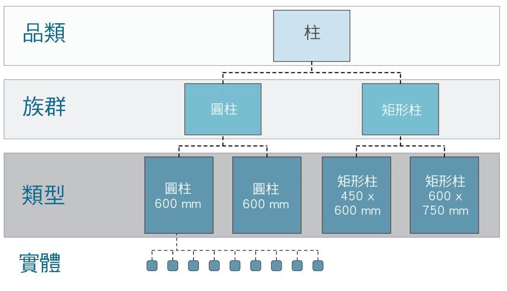

記得生物學的分類法嗎？界、門、綱、目、科、屬、種？Revit 元素的分類方式與此類似。在基本層級，可將 Revit 階層分為不同的品類、族群、類型*及例證。例證是個別模型元素 (具有唯一的 ID)，而品類可定義一般群組 (例如「牆」或「地板」)。以此方式組織 Revit 資料庫後，我們可以選取一個元素，然後根據階層中的指定層級選擇所有類似元素。

**注意：Revit 中類型的定義與程式設計中的類型不同。在 Revit 中，類型是指階層的分支，而非「資料類型」。*

#### 使用 Dynamo 節點進行資料庫導覽

以下三個影像分別展示了 Dynamo 中 Revit 元素選取的主要品類。這些是搭配使用的強大工具，我們將在後續練習中探究其中一些工具。

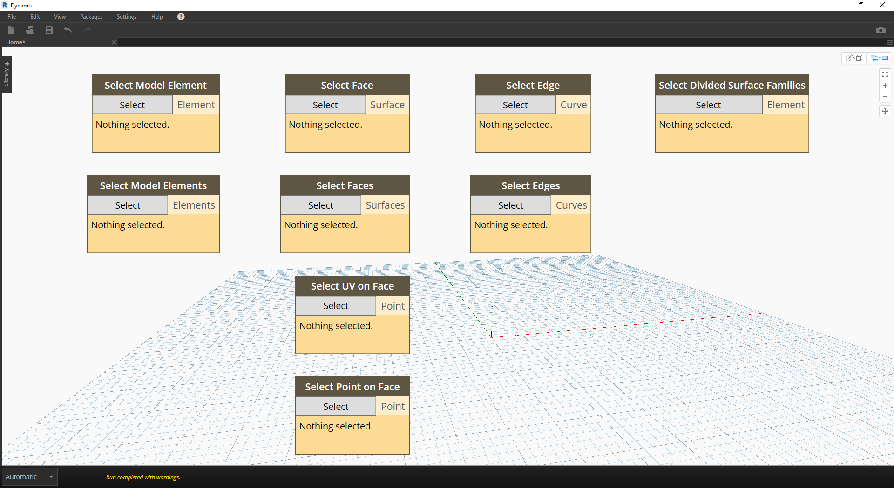

> *點選*是直接選取 Revit 元素最簡單的方式。您可以選取完整的模型元素，也可以選取其拓樸的一部分 (例如一個面或一條邊)。這會與該 Revit 物件保持動態連結，因此在 Revit 檔案更新其位置或參數時，參考的 Dynamo 元素在圖表中也將更新。


> *下拉式功能表*會建立 Revit 專案中所有可存取元素的清單。您可以使用下拉式功能表參考視圖中不一定可見的 Revit 元素。這是非常強大的工具，可用於在 Revit 專案或族群編輯器中查詢既有元素或建立新元素。


> 您也可以依 *Revit 階層*中的特定層選取 Revit 元素。這是功能強大的選項，可用於自訂大型資料陣列，以便為記錄或生產例證化及自訂做好準備。

記住以上三個影像，接下來深入研習練習，練習會選取基本 Revit 專案中的元素，以便為我們將在本章的其餘各節建立的參數式應用程式做好準備。

### 練習

> 下載此練習隨附的範例檔案 (按一下右鍵，然後按一下「連結另存為...」)。附錄中提供範例檔案的完整清單。

> 1. [Selecting.dyn](datasets/8-2/Selecting.dyn)
2. [ARCH-Selecing-BaseFile.rvt](datasets/8-2/ARCH-Selecting-BaseFile.rvt)

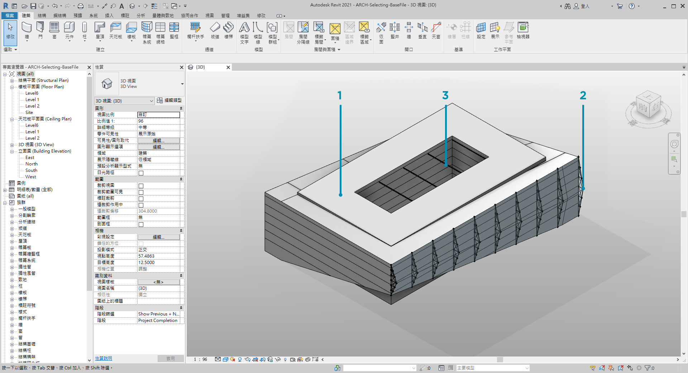

> 在此範例 Revit 檔案中，包含簡單建築的三種元素類型。我們將以此為例，瞭解在 Revit 階層的環境中選取 Revit 元素：

> 1. 建築量體
2. 桁架 (自適應元件)
3. 樑 (結構框架)

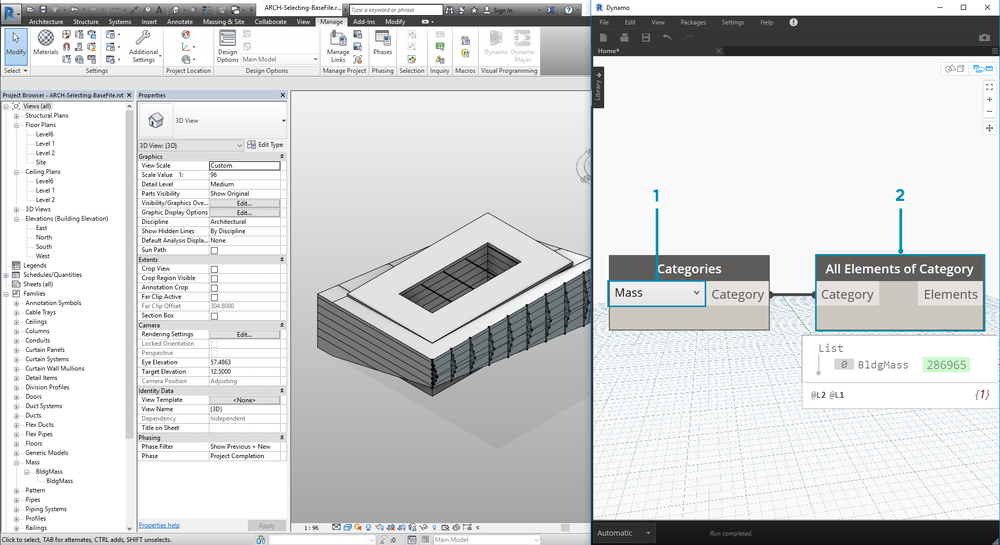

> 根據 Revit 專案視圖中目前存在的元素，我們可以做出哪些結論？若要選取適當的元素，我們需要在階層中下移多遠？處理大型專案時，這無疑會變為更複雜的工作。提供許多選項：我們可以依品類、層級、族群、例證等選取元素。

> 1. 由於我們使用基本設置，因此接下來選擇「Categories」下拉式節點中的「*Mass*」以選取建築量體。該選項位於 Revit > Selection 頁籤中。
2. 「Mass」品類的輸出是品類自身。我們需要選取元素。為了執行此作業，我們使用 *All Elements of Category*節點。

此時請注意，我們在 Dynamo 中看不到任何幾何圖形。我們已選取 Revit 元素，但尚未將該元素轉換為 Dynamo 幾何圖形。這是重要的區分。若您選取大量元素，不會希望在 Dynamo 中預覽所有這些元素，因為這會拖慢所有作業的速度。Dynamo 是無需執行幾何圖形作業即可對 Revit 專案進行管理的工具，我們將在本章的下一節瞭解該功能。

在此案例中，我們將使用簡單的幾何圖形，因此希望將幾何圖形引入 Dynamo 預覽。以上觀看節點中的「BldgMass」旁有綠色的數字*。這表示元素的 ID，並表明我們處理的是 Revit 元素，而不是 Dynamo 幾何圖形。下一步是將此 Revit 元素轉換為 Dynamo 中的幾何圖形。

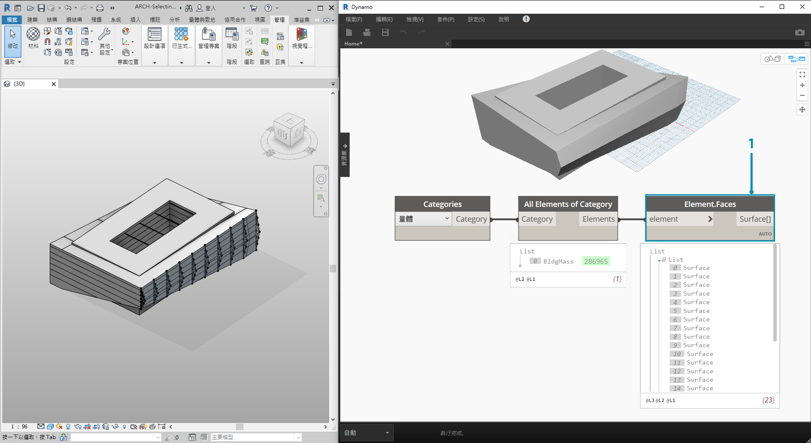

> 1. 我們使用 *Element.Faces* 節點，取得表示 Revit 量體每個面之曲面的清單。我們現在可以在 Dynamo 視埠中看到幾何圖形，可以開始參考用於參數式作業的面。

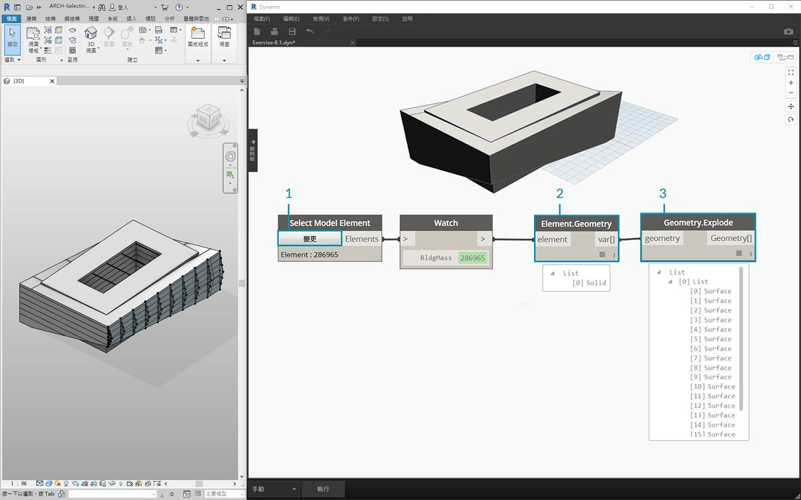

> 以下是替代方法。在此案例中，我們不是透過 Revit 階層進行選取 *(「All Elements of Category」)*，而是選擇在 Revit 中明確選取幾何圖形。

> 1. 使用*「Select Model Element」*節點，按一下*「select」* (或*「change」*) 按鈕。在 Revit 視埠中，選取所需的元素。在此案例中，我們將選取建築量體，
2. 我們可以使用 *Element.Geometry* 選取完整量體作為一個實體幾何圖形，而非 *Element.Faces*。這會選取量體內包含的所有幾何圖形。
3. 我們可以使用 　*Geometry.Explode*　取得曲面清單。這兩個節點的工作方式與 *Element.Faces* 相同，但是提供其他選項用於探究 Revit 元素的幾何圖形。

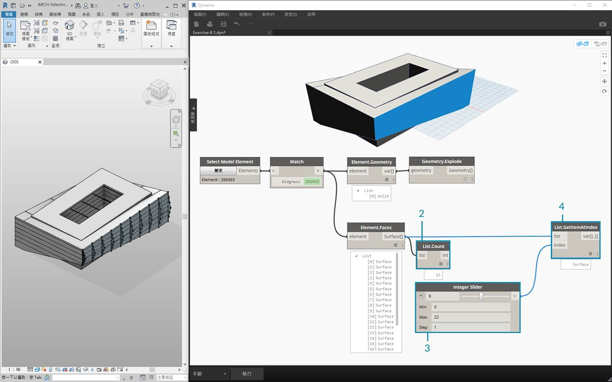

> 1. 使用一些基本清單作業，我們可以查詢感興趣的面。
2. 首先，*List.Count* 節點展示出我們正在處理量體中的 23 個曲面。
3. 參考此數量，我們將 *integer slider* 的最大值變更為*「22」*。
4. 使用 *List.GetItemAtIndex*，我們輸入清單與 *integer slider* 以提供 *index*。採用所選值進行滑動時，若到達 *index 9* 並已隔離對桁架提供支撐的主要正面，作業就會停止。

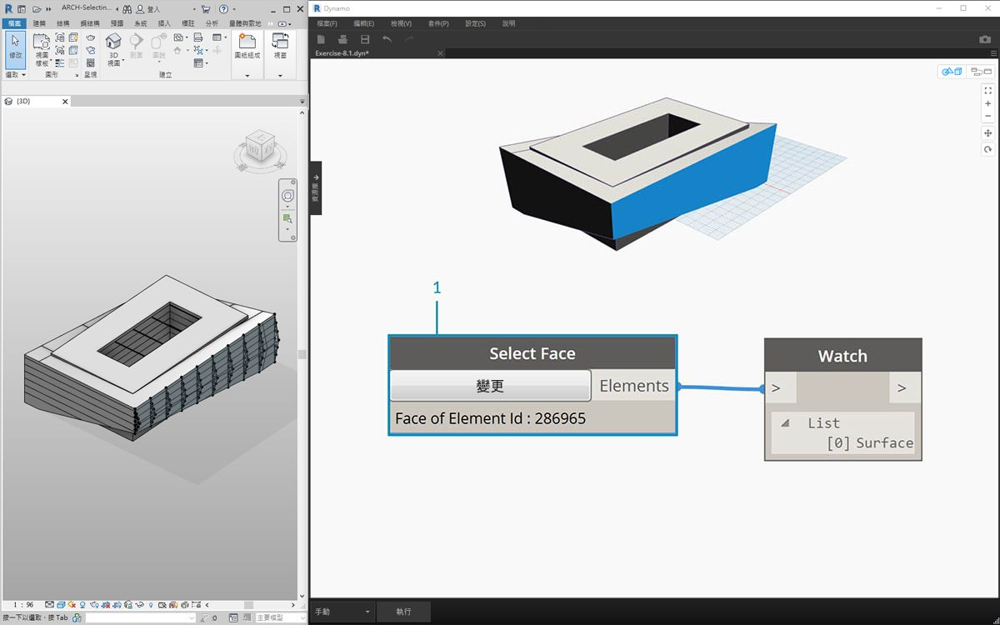

> 1. 上一個步驟稍顯繁瑣。使用*「Select Face」*節點可以更快執行此作業。藉此可以隔離 Revit 專案中並非元素本身的面。套用與*「Select Model Element」*相同的互動，只是我們選取曲面，而不是完整的元素。


> 假設我們要隔離建築的主要正面牆。我們可以使用*「Select Faces」*節點執行此作業。按一下「Select」按鈕，然後在 Revit 中選取四個主要正面。

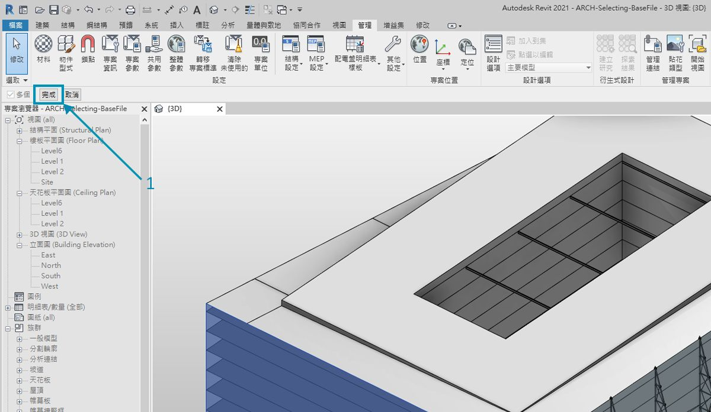

> 1. 在 Revit 中選取四面牆後，確保按一下*「Finish」*按鈕。

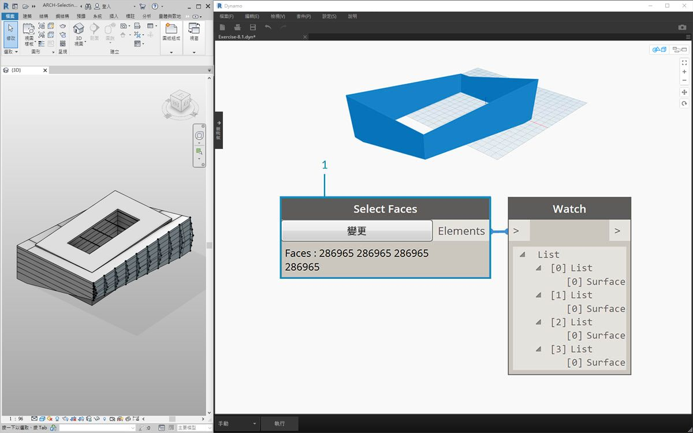

> 1. 現在，這些面已作為曲面匯入至 Dynamo。

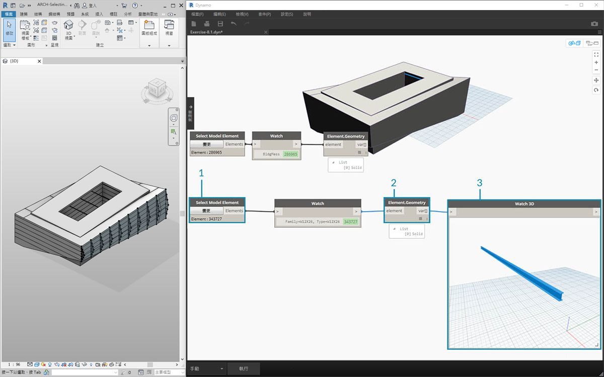

> 1. 現在，我們看看中庭上方的樑。使用*「Select Model Element」*節點，選取其中一根樑。
2. 將樑元素插入至 *Element.Geometry* 節點，現在可在 Dynamo 視埠中看到樑。
3. 可以使用 *Watch3D* 節點拉近幾何圖形 (若未在 Watch3D 中看到樑，請按一下右鍵，然後按一下「zoom to fit」)。

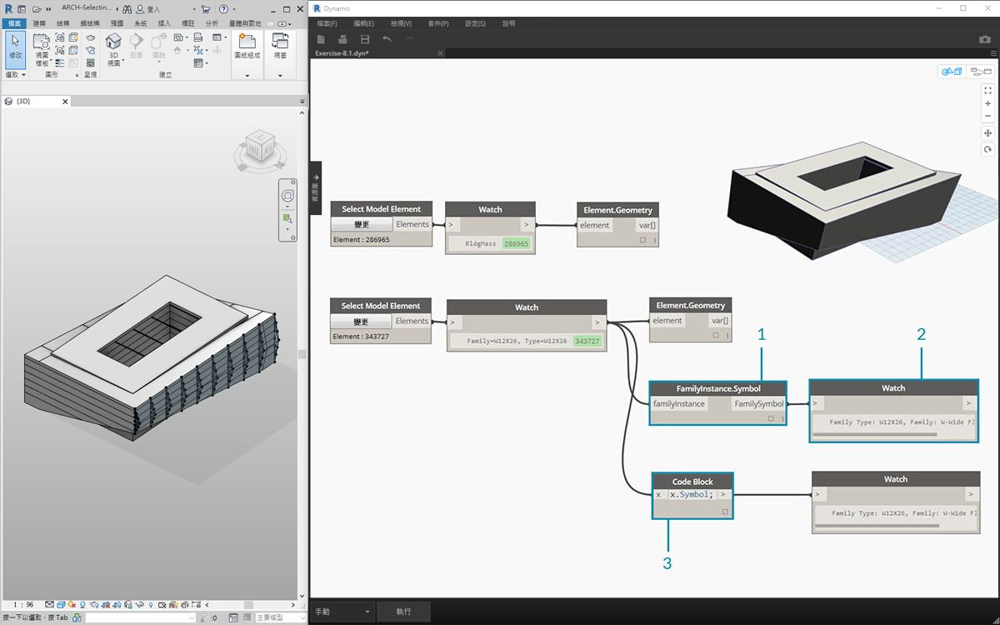

> Revit/Dynamo 工作流程中可能經常會遇到以下問題：如何選取一個元素並取得所有類似元素？由於選取的 Revit 元素包含其所有階層資訊，因此我們可以查詢其族群類型，並選取該類型的所有元素。

> 1. 將樑元素插入至 *FamilyInstance.Symbol** 節點。
2. *Watch* 節點顯示現在輸出是族群符號，而不是 Revit 元素。
3. *FamilyInstance.Symbol* 是簡單的查詢，因此我們在代碼區塊執行此作業可以像使用 ```x.Symbol;``` 時一樣輕鬆，並會取得相同結果。

**注意：族群符號是族群類型的 Revit API 術語。由於這可能會導致某些混淆，因此在未來版本中將對其進行更新。*

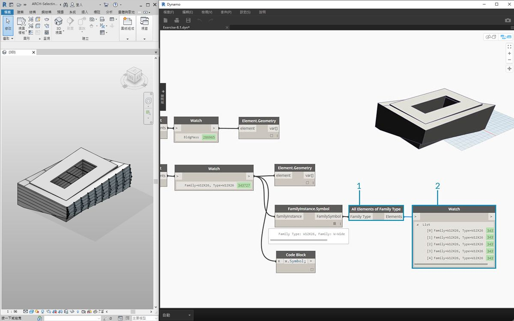

> 1. 為了選取其餘的樑，我們使用*「All Elements of Family Type」*節點。
2. Watch 節點顯示我們已選取五個 Revit 元素。

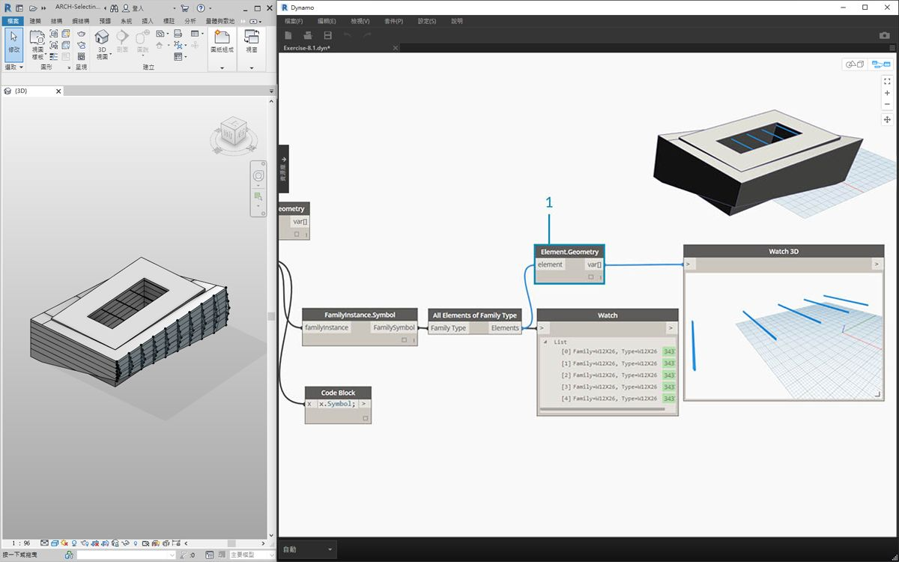

> 1. 我們也可以將所有這五個元素轉換為 Dynamo 幾何圖形。

如果有 500 根樑會怎樣呢？將所有這些元素轉換為 Dynamo 幾何圖形會非常慢。若 Dynamo 花費很長時間來計算節點，您可能要在開發圖表時，使用「freeze」節點功能以暫停所執行的 Revit 作業。若要取得有關凍結節點的更多資訊，請參閱[「實體」一章](../05_Geometry-for-Computational-Design/5-6_solids.md#freezing)中的「凍結」一節。

在案例中，如果我們將匯入 500 根樑，是否需要所有曲面都執行所需的參數式作業？或者，我們能否萃取樑的基本資訊，並使用基本幾何圖形執行生產工作？我們在瞭解本章內容時，需要記住這個問題。例如，我們看看桁架系統：

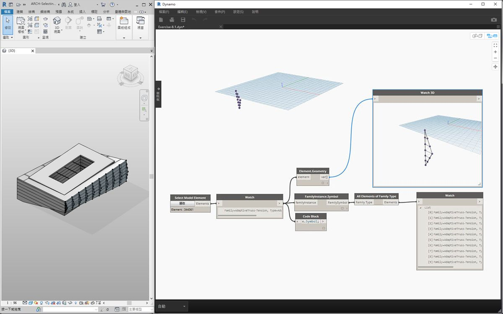

> 使用相同的節點圖表，選取桁架元素而不是樑元素。執行此作業之前，刪除上一步驟中的 Element.Geometry。

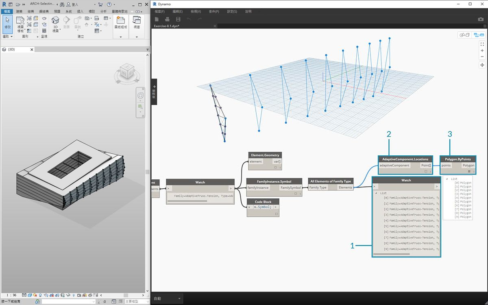

> 1. 在 *Watch* 節點中，可以看到我們從 Revit 中所選自適應元件的清單。我們希望萃取基本資訊，因此從自適應點開始。
2. 將*「All Elements of Family Type」*節點插入至*「AdaptiveComponent.Location」*節點。這將產生清單的清單，其中每個清單都包含三點，表示自適應點的位置。
3. 連接*「Polygon.ByPoints」*節點將傳回 polycurve。我們可以在 Dynamo 視埠中看到它。透過此方法，我們已視覺化一個元素的幾何圖形，並提取了其餘一系列元素 (數量可能多於此範例) 的幾何圖形。

**秘訣：若在 Dynamo 中按一下 Revit 元素的綠色數字，Revit 視埠將縮放至該元素。*

