## 建立

您可以在 Dynamo 中建立具有完整參數式控制的一系列 Revit 元素。藉由 Dynamo 中的 Revit 節點，可以將元素從一般幾何圖形匯入至特定的品類類型 (例如牆與地板)。在本節中，我們將著重講解使用自適應元件以參數式方式匯入彈性元素。


### 自適應元件

自適應元件是非常適用於生產應用的彈性族群品類。在例證化之後，您可以建立由自適應點的基本位置驅動的複雜幾何元素。

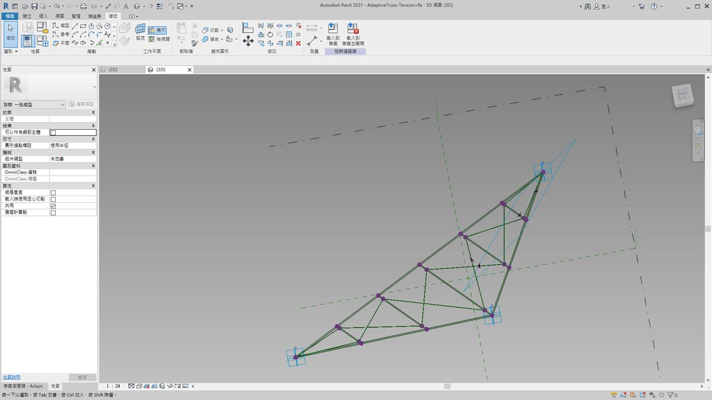

> 族群編輯器中的三點自適應元件範例。這將產生由每個自適應點的位置定義的桁架。在以下練習中，我們將使用此元件在正面產生一系列桁架。

#### 互通性原則

自適應元件是採用互通性最佳實務的良好範例。我們可以定義基本自適應點，以建立一系列自適應元件。此外，若將此資料傳輸至其他程式，我們可以將幾何圖形精簡為簡單的資料。使用程式 (例如 Excel) 執行匯入與匯出將遵循類似的邏輯。

假設正面顧問希望瞭解桁架元素的位置，而無需剖析完全連接的幾何圖形。在準備製造時，顧問可以參考自適應點的位置，以便在諸如 Inventor 等程式中重新產生幾何圖形。

藉由我們將在以下練習中設置的工作流程，我們可以存取所有此類資料，同時建立用於建立 Revit 元素的定義。透過此程序，我們可以將概念化、記錄與製造合併為順暢的工作流程。此作業會建立更智慧、更高效的程序以實現互通性。

#### 多個元素與清單


以下練習將講解 Dynamo 如何參考用於建立 Revit 元素的資料。為了產生多個自適應元件，我們定義了清單的清單，其中每個清單都包含三點，表示自適應元件的每個點。在 Dynamo 中管理資料結構時，我們將記住這一點。

### 練習

> 下載此練習隨附的範例檔案 (按一下右鍵，然後按一下「連結另存為...」)。附錄中提供範例檔案的完整清單。

> 1. [Creating.dyn](datasets/8-4/Creating.dyn)
2. [ARCH-Creating-BaseFile.rvt](datasets/8-4/ARCH-Creating-BaseFile.rvt)

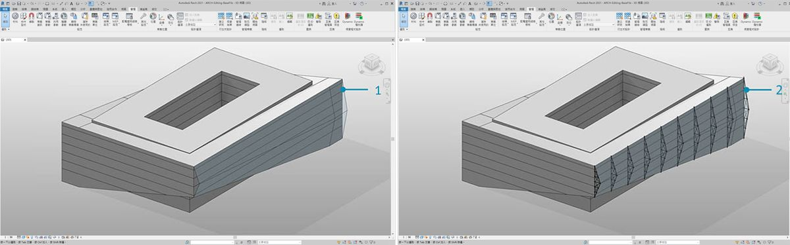

> 從本節的範例檔案開始 (或繼續使用上一節課的 Revit 檔案)，我們查看同一 Revit 量體。

> 1. 這是開啟的檔案。
2. 這是我們使用 Dynamo 建立的桁架系統，並採用智慧方式將其連結至 Revit 量體。

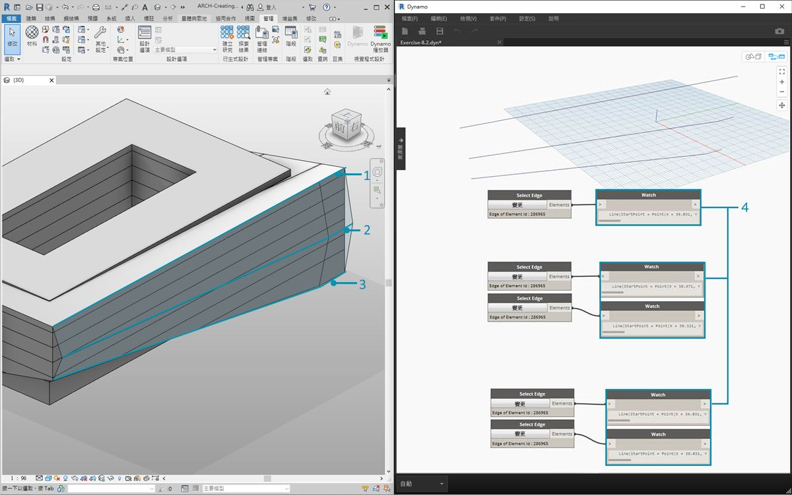

> 我們此前使用的是*「Select Model Element」*與*「Select Face」*節點，現在我們在幾何圖形階層中更進一步，使用*「Select Edge」*。將 Dynamo 求解器設定為*「自動」*執行後，圖表會根據 Revit 檔案中的變更而持續更新。我們將選取的邊已動態連結至 Revit 元素拓樸。只要拓樸*不會變更，Revit 與 Dynamo 之間的關聯就會保持連結狀態。

> 1. 選取鑲嵌玻璃正面最頂端的曲線。它跨越建築的完整長度。如果您無法選取邊，請記住將游標懸停在邊上，然後按一下*「Tab」*鍵，直到所需的邊亮顯為止，由此在 Revit 中選擇供選取的物件。
2. 使用兩個*「Select Edge」*節點，選取表示正面中央處超高的每條邊。
3. 在 Revit 中對正面底部的邊執行相同程序。
4. *Watch* 節點顯示出我們現在已在 Dynamo 中建立線。這會自動轉換為 Dynamo 幾何圖形，因為邊本身不是 Revit 元素。這些曲線是我們在正面對自適應桁架進行例證化將使用的參考。

**注意：為了讓拓樸保持一致，我們將參考未加入額外面或邊的模型。雖然參數可變更其造型，但是其建置方式保持一致。*


> 我們需要先接合曲線，並將其合併至一個清單。這樣我們可以將曲線*「分組」*以執行幾何圖形作業。

> 1. 建立正面中央兩條曲線的清單。
2. 將 *List.Create* 元件插入至 *Polycurve.ByJoinedCurves* 節點，以便將兩條曲線接合為 polycurve。
3. 建立正面底部兩條曲線的清單。
4. 將 *List.Create* 元件插入至 *Polycurve.ByJoinedCurves* 節點，以便將兩條曲線接合為 polycurve。
5. 最後，將三條主要曲線 (一條直線與兩條 PolyCurve) 接合到一個清單中。


> 我們希望利用頂部曲線，它是直線，並能呈現正面的完整跨度。我們將沿此線建立與我們在清單中歸為一組的一組曲線相交的平面。

> 1. 運用 *code block*，使用以下語法定義範圍：```0..1..#numberOfTrusses;```
2. 將 *integer slider * 插入至代碼區塊的輸入。您可能已猜到，這將展示桁架的數量。請注意，滑棒在定義的從 *0* 至 *1* 的範圍內控制項目數量。
3. 將 *code block* 插入至*「Curve.PlaneAtParameter」*節點的 *param* 輸入，將頂部的邊插入至 *curve* 輸入。這會產生十個平面，均勻分佈在正面的跨度內。


> 平面是抽象的幾何圖形，表示無限的二維空間。平面非常適合描述等高與相交，正如我們在此步驟中的設置所示。

> 1. 使用 *Geometry.Intersect* 節點 (注意是笛卡兒積交織)，將 *Curve.PlaneAtParameter* 插入 *Geometry.Intersect* 節點的 *entity* 輸入。將主要 *List.Create* 節點插入至 *geometry* 輸入。現在，我們可以在 Dynamo 視埠中看到表示每條曲線與定義的平面相交的點。

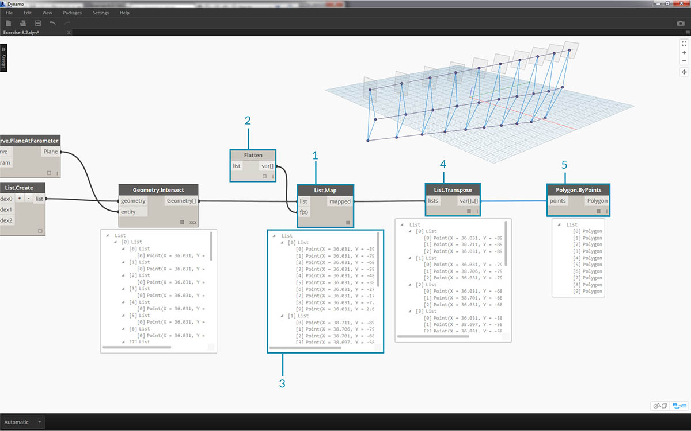

> 請注意，輸出是清單的清單的清單。我們為達到目的而使用的清單過多。在此，我們希望進行局部平坦化。我們需要對清單更進一步，對結果執行平坦化。為了執行此作業，我們使用 *List.Map* 作業，正如手冊的清單一章中的討論所示。

> 1. 將 *Geometry.Intersect* 節點插入至 *List.Map* 的清單輸入。
2. 將 *Flatten* 節點插入至 *List.Map* 的 f(x) 輸入。結果將產生 3 個清單，每個清單都包含與桁架數量相等的計數。
3. 我們需要變更此資料。如果我們希望例證化桁架，必須使用與族群中所定義的數量相同的自適應點。這是三點自適應元件，因此我們希望使用的不是各包含 10 個項目 (numberOfTrusses) 的三個清單，而是各包含三個項目的 10 個清單。這樣我們可以建立 10 個自適應元件。
4. 將 *List.Map* 插入至 *List.Transpose* 節點。現在我們已取得所需的資料輸出。
5. 若要確認資料正確無誤，請加入 *Polygon.ByPoints* 節點至圖元區，然後詳細查看 Dynamo 預覽。


> 我們以同樣的方式建立了多邊形，並對自適應元件進行排列。

> 1. 加入 *AdaptiveComponent.ByPoints* 節點至圖元區，將 *List.Transpose* 節點插入至 *points* 輸入。
2. 使用 *Family Types* 節點，選取*「AdaptiveTruss」*族群，並將其插入至 *AdaptiveComponent.ByPoints* 節點的 *familySymbol* 輸入。

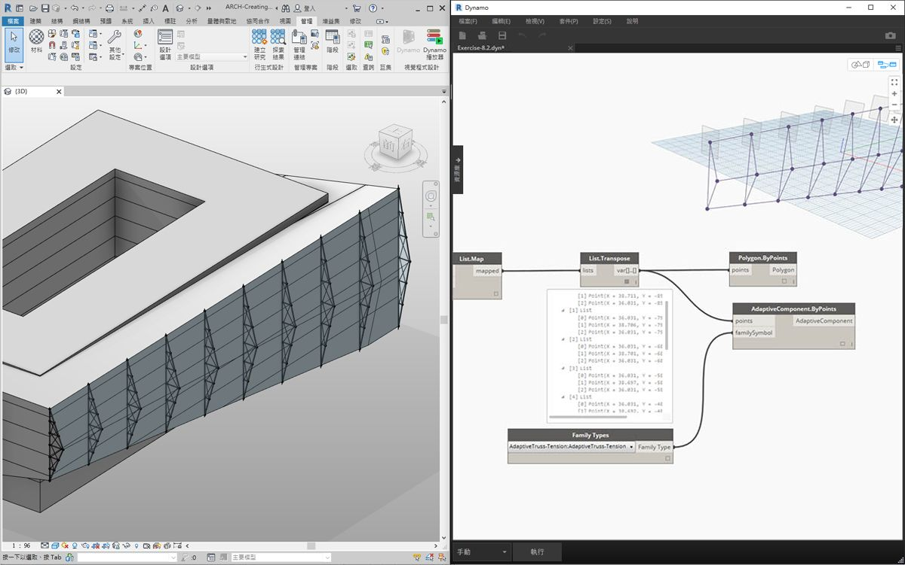

> 在 Revit 中查看，我們現在建立了均勻分佈在正面跨度範圍內的十個桁架。

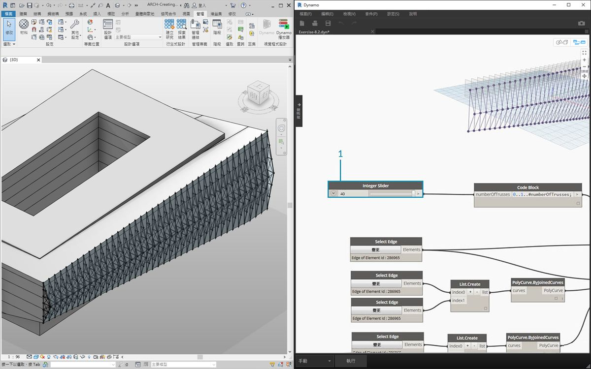

> 1. 「調整」圖表，透過變更 *slider* 將 *numberOfTrusses* 提高為 *40*。桁架很多，這並非很現實，但是參數式連結的確有效。


> 1. 改良桁架系統，接下來對 *numberOfTrusses* 折衷採用值 *15*。

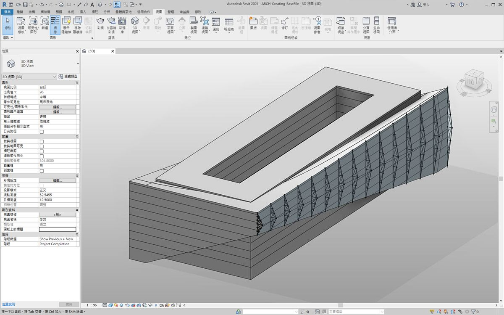

> 在最終測試中，透過在 Revit 內選取量體並編輯例證參數，我們可以變更建築的塑形，並看到桁架與之相符。請記住，必須開啟此 Dynamo 圖表，才能看到此更新，一旦該圖表關閉，連結將中斷。

### DirectShape 元素

將參數式 Dynamo 幾何圖形匯入至 Revit 的另一種方法是使用 DirectShape。總之，DirectShape 元素與相關類別支援在 Revit 文件中儲存外部建立的幾何造型。幾何圖形可以包括封閉實體或網面。DirectShape 主要用於在未提供足夠的資訊以建立「真實」的 Revit 元素時，匯入其他資料格式 (例如 IFC 或 STEP) 的造型。與 IFC 與 STEP 工作流程類似，DirectShape 功能可以很好地將 Dynamo 建立的幾何圖形匯入至 Revit 專案中作為真實的元素。

接下來針對將 Dynamo 幾何圖形作為 DirectShape 匯入至 Revit 專案進行逐步瞭解與練習。使用此方法，我們可以指定所匯入幾何圖形的品類、材料與名稱等所有內容，同時保持 Dynamo 圖表的參數式連結。

### 練習

> 下載此練習隨附的範例檔案 (按一下右鍵，然後按一下「連結另存為...」)。附錄中提供範例檔案的完整清單。

> 1. [DirectShape.dyn](datasets/8-4/DirectShape.dyn)
2. [ARCH-DirectShape-BaseFile.rvt](datasets/8-4/ARCH-DirectShape-BaseFile.rvt)

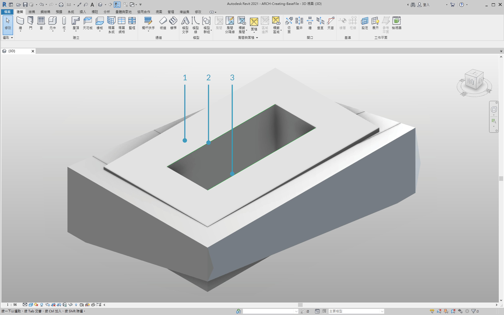

> 首先，開啟本課程的範例檔案 ARCH-DirectShape-BaseFile.rvt。

> 1. 在 3D 視圖中，我們可以看到上一課的建築量體。
2. 沿著中庭的邊是一條參考曲線，我們會將其用作在 Dynamo 中參考的曲線。
3. 沿著中庭的相對一邊是另一條參考曲線，我們也會在 Dynamo 中對其進行參考。

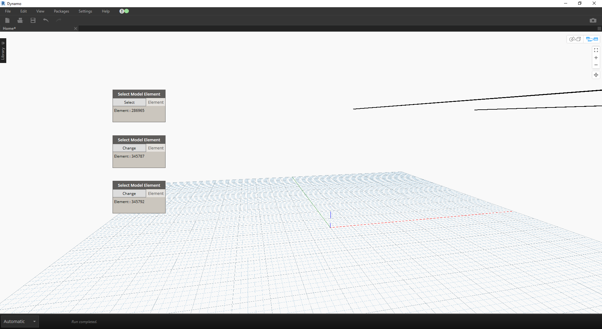

> 1. 為了在 Dynamo 中參考幾何圖形，我們將對 Revit 中的每個成員使用*Select Model Element*。在 Revit 中選取量體，並使用 *Element.Faces* 將幾何圖形匯入至 Dynamo，現在 Dynamo 預覽中應該可以看到量體。
2. 使用 *Select Model Element* 與 *CurveElement.Curve* 將一條參考曲線匯入至 Dynamo。
3. 使用 *Select Model Element* 與 *CurveElement.Curve* 將另一條參考曲線匯入至 Dynamo。


> 1. 拉遠並平移至範例圖表中的右側，可以看到大型節點群組，這些是幾何圖形作業，將產生 Dynamo 預覽中可見的格架屋頂結構。使用手冊的[代碼區塊一節](../07_Code-Block/7-2_Design-Script-syntax.md#Node)中討論的*要編碼的節點*功能產生這些節點。
2. 結構由三個主要參數驅動，分別是對角線偏移、拱角與半徑。


> 進行縮放，特寫查看此圖表的參數。我們可以調整這些參數，以取得不同的幾何圖形輸出。

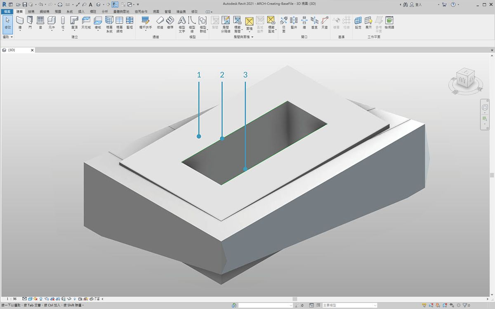

> 1. 將 *DirectShape.ByGeometry* 節點置於圖元區上，我們可以看到它有四個輸入：**geometry、category、material**與**name**。
2. 幾何圖形是將要從圖表的幾何圖形建立部分建立的實體
3. 使用下拉式*Categories*節點選擇品類輸入。在此案例中，我們將使用「結構框架」。
4. 透過以上的一系列節點選取材料輸入 (雖然在此案例中定義為「預設」會更簡單)。

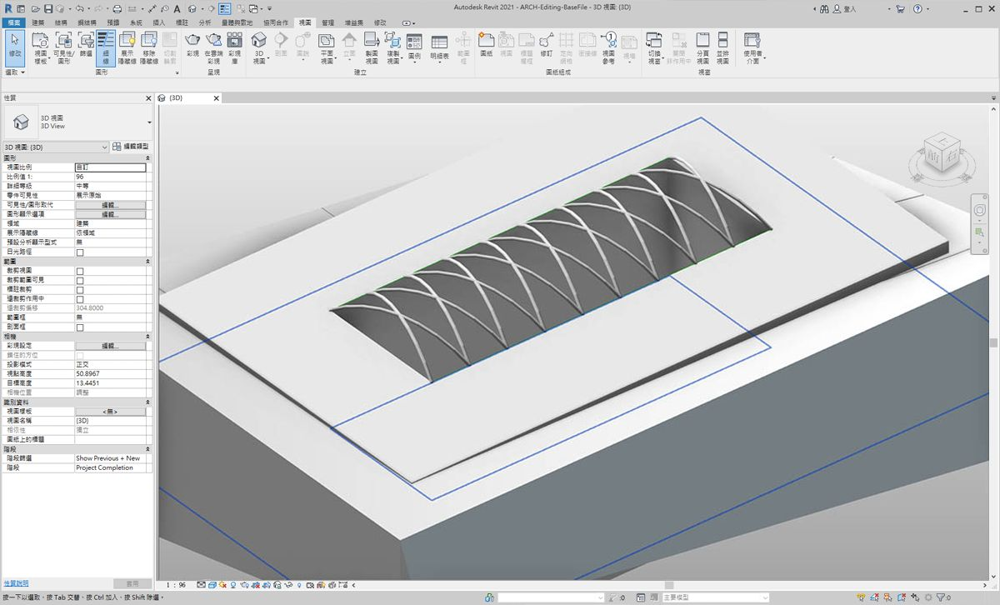

> 執行 Dynamo 後，返回 Revit，專案中的屋頂上已存在匯入的幾何圖形。這是結構框架元素，而不是一般模型。Dynamo 的參數式連結保持不變。


> 1. 如果我們將「對角線偏移」參數變更為「-2」以「調整」Dynamo 圖表，再次執行 Dynamo 時，即可取得匯入的新 DirectShape！

