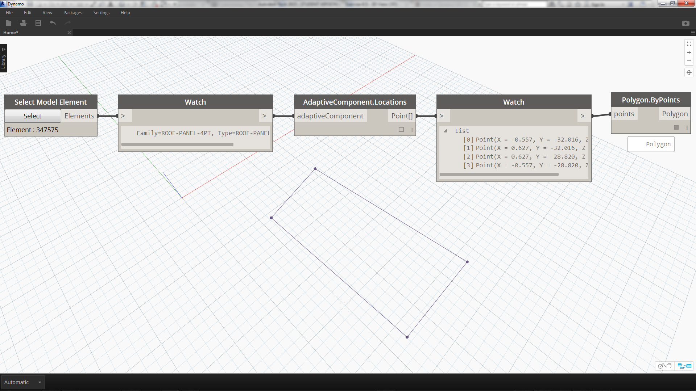
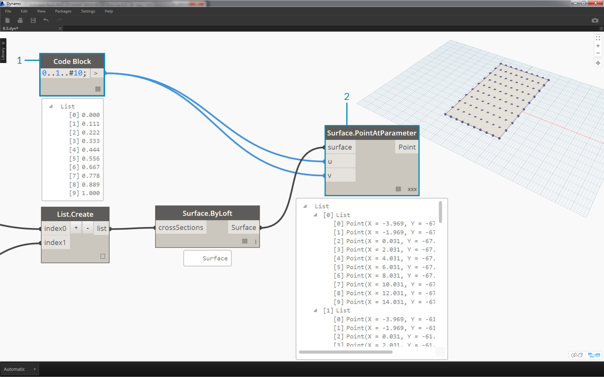
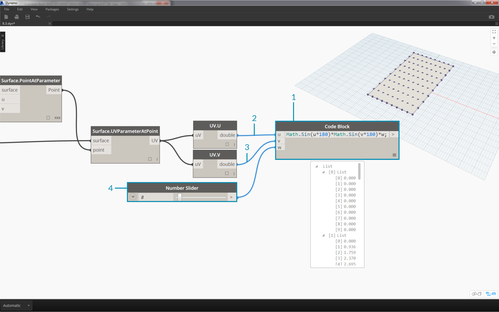
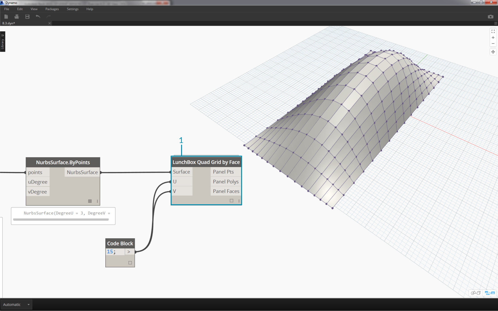
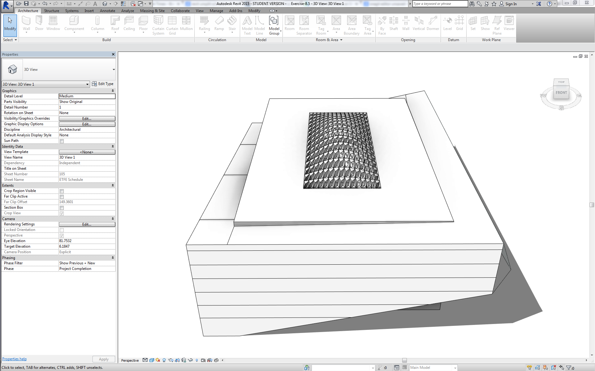
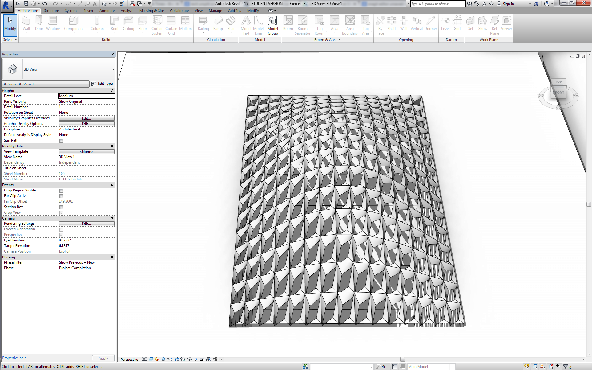
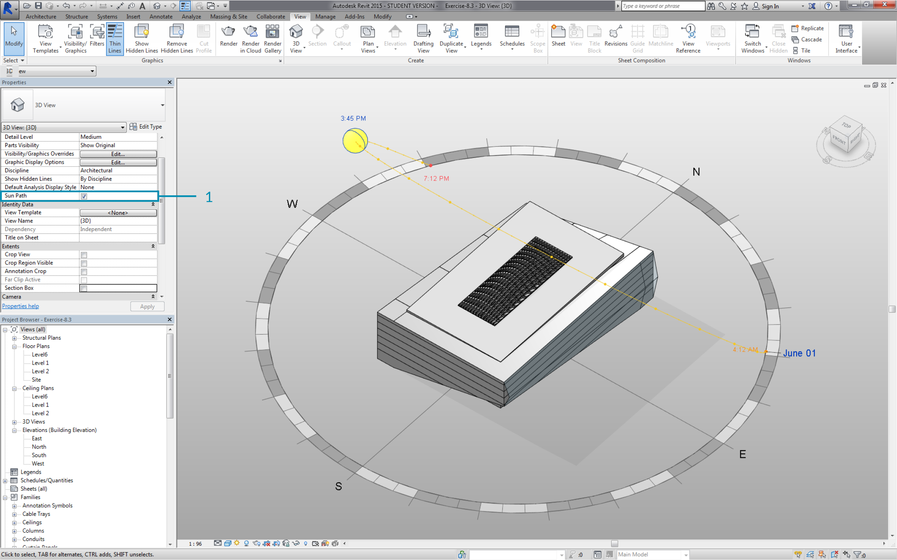
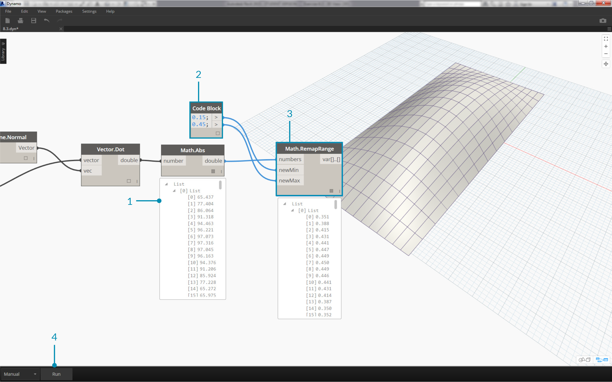
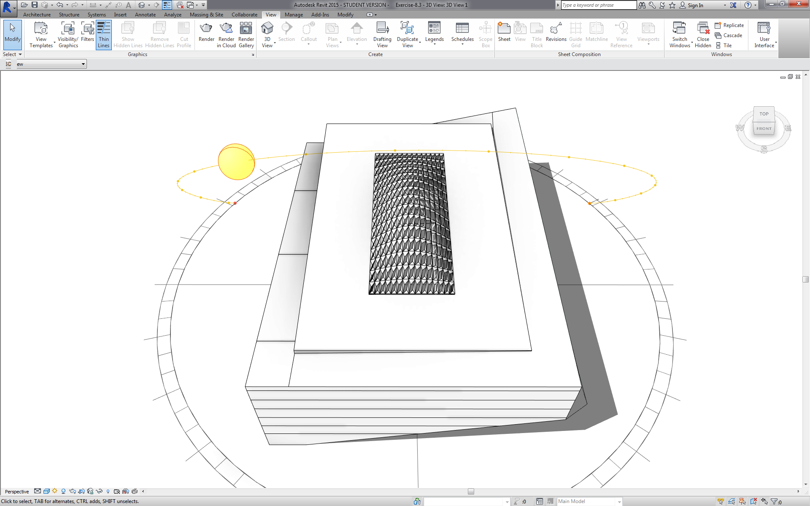

## 自訂

我們先前對編輯基本建築量體進行瞭解時，希望一次編輯大量元素，以更深入地探究 Dynamo/Revit 連結。大規模自訂變得更加複雜，因為資料結構需要更高級的清單作業。但是，此作業所遵循的基本原則在本質上並無不同。接下來針對一組自適應元件瞭解分析的某些因素。

#### 點位置

假設我們已建立一系列自適應元件，希望根據其點位置來編輯參數。例如，點可以驅動與元素面積相關的厚度參數。或者，點可以驅動與全年日曬相關的不透明度參數。藉由 Dynamo，可以使用一些簡單的步驟將分析連接至參數，我們將在以下練習中探究基本版本。



> 使用 *AdaptiveComponent.Locations* 節點查詢所選自適應元件的自適應點。藉此我們可以使用所提取版本的 Revit 元素進行分析。

透過萃取自適應元件的點位置，我們可以對該元素執行一系列分析。藉由四點自適應元件，您可以針對諸如指定面板等物件研究平面的偏差。

#### 日光方位分析


> 使用重新對映將一組資料對映至參數範圍。這是參數式模型中使用的基本工具，我們將在以下練習中展示該工具。

使用 Dynamo，自適應元件的點位置可用於建立每個元素的最佳擬合平面。我們也可以在 Revit 檔案中查詢日光位置，研究平面相對於日光的方位，並與其他自適應元件進行比較。在以下的練習中，我們將建立由演算法控制的屋頂，以設置該功能。

### 練習

> 下載此練習隨附的範例檔案 (按一下右鍵，然後按一下「連結另存為...」)。附錄中提供範例檔案的完整清單。

> 1. [Customizing.dyn](datasets/8-5/Customizing.dyn)
2. [ARCH-Customizing-BaseFile.rvt](datasets/8-5/ARCH-Customizing-BaseFile.rvt)

此練習將詳細說明上一節中展示的技術。在此案例中，我們將使用 Revit 元素定義參數式曲面，同時例證化四點自適應元件，然後根據日光方位對其進行編輯。


> 1. 先選取兩條邊與*「Select Edge」*節點。兩條邊是中庭的長跨距。
2. 使用 *List.Create* 節點將兩條邊合併到一個清單中。
3. 使用 *Surface.ByLoft* 在兩條邊之間建立曲面。



> 1. 使用*code block*，定義從 0 至 1 的範圍 (包含均勻分佈的 10 個值)：```0..1..#10;```
2. 將 *code block* 插入至 *Surface.PointAtParameter* 節點的 *u* 與 *v* 輸入，並將 *Surface.ByLoft* 節點插入至 *surface* 輸入。在節點上按一下右鍵，並將 *lacing* 變更為*「Cross Product」*。這將在曲面上產生點的網格。

此點網格可作為以參數式方式定義之曲面的控制點。我們希望萃取其中每個點的 u 與 v 位置，以便能將其插入至參數式公式，並保留相同的資料結構。我們可以查詢剛剛所建立點的參數位置，以執行此作業。


> 1. 加入 *Surface.ParameterAtPoint* 節點至圖元區，連接輸入，如上所示。
2. 使用 *UV.U* 節點查詢這些參數的 *u* 值。
3. 使用 *UV.V* 節點查詢這些參數的 *v* 值。
4. 輸出會顯示每個曲面點的對應 *u* 與 *v* 值。現在我們已取得所需範圍，每個值都介於 *0* 與 *1* 之間，並具有正確的資料結構，已準備好套用參數式演算法。



> 1. 加入 *code block* 至圖元區，然後輸入以下代碼：```Math.Sin(u*180)*Math.Sin(v*180)*w;```。這是參數式函數，可從平曲面建立正弦凸塊。
2. *u* 輸入連接至 *UV.U*。
3. *v* 輸入連接至 *UV.V*。
4. *w* 輸入表示造型的*幅度*，因此我們為其連接 *number slider*。


> 1. 現在，已產生由演算法定義的值清單。接下來使用此值清單在 *+Z* 方向將點上移。使用 *Geometry.Translate*，將 *code block * 插入至 *zTranslation*，並將 *Surface.PointAtParameter* 插入至*幾何圖形*輸入。您應該已看到新點顯示在 Dynamo 預覽中。
2. 最後，我們使用 *NurbsSurface.ByPoints* 節點建立曲面，將上一步驟中的節點插入至點輸入。我們已建立自己的參數式曲面。自由拖曳滑棒，觀看凸塊的收縮與膨脹。

使用參數式曲面，我們要定義將其面板化的方式，以排列四點自適應元件。Dynamo 沒有即裝即用的曲面面板化功能，因此我們可以留心社群以尋找有用的 Dynamo 套件。


> 1. 移至*「套件」>「搜尋套件...」*
2. 搜尋*「LunchBox」*，並下載*「LunchBox for Dynamo」*。對於諸如此類的幾何圖形作業，這是非常有用的一組工具。



> 1. 下載之後，您具有 LunchBox 套件的完整存取權。搜尋*「Quad Grid」*，然後選取*「LunchBox Quad Grid By Face」*。將參數式曲面插入至 *surface* 輸入，並將 *U* 與 *V* 分割份數設定為 *15*。您在 Dynamo 預覽中應該會看到四邊面板化的曲面。


> 如果您對其設置感到好奇，可以按兩下 *Lunch Box* 節點，並查看其內容。


> 返回 Revit，接下來快速查看我們將在這裡使用的自適應元件。無需沿其作業，但這是我們將要例證化的屋頂面板。它是四點自適應元件，是 ETFE 系統的粗略表示。中心空心的鎖點框與稱為*「ApertureRatio」*的參數有關。


> 1. 我們將在 Revit 中例證化大量幾何圖形，因此請確保將 Dynamo 求解器旋至*「手動」*。
2. 加入 *Family Types* 節點至圖元區，然後選取*「ROOF-PANEL-4PT」*。
3. 加入 *AdaptiveComponent.ByPoints* 節點至圖元區，將 *Panel Pts* 從*「LunchBox Quad Grid by Face」*輸出連接至 *points* 輸入。將 *Family Types* 節點連接至 *familySymbol* 輸入。
4. 按一下*「執行」*。建立幾何圖形時，Revit 需要*考慮*一段時間。若該時間太長，請將 *code block 的「15」*降低至更小的數字。這將減少屋頂上面板的數量。

*注意：若 Dynamo 花費很長時間來計算節點，您可能要在開發圖表時，使用「freeze」節點功能以暫停所執行的 Revit 作業。若要取得有關凍結節點的更多資訊，請參閱[「實體」一章](../05_Geometry-for-Computational-Design/5-6_solids.md#freezing)中的「凍結」一節。*



> 返回 Revit，我們已在屋頂上建立一系列面板。



> 拉近，我們可以更近地查看其曲面品質。

### 分析


> 1. 從上一步繼續執行，接下來更進一步，根據其日曬時間驅動每個面板的鎖點框。拉近至 Revit，選取一個面板，可以看到在性質列中，存在名為*「Aperture Ratio」*的參數。設置族群，以便鎖點框的範圍大致介於 *0.05* 至 *0.45* 之間。



> 1. 如果打開日光路徑，可以在 Revit 中看到目前的日光位置。


> 1. 我們可以使用 *SunSettings.Current* 節點參考此日光位置。
2. 將日光設定插入至 *Sunsetting.SunDirection* 以取得日光向量。
3. 從用於建立自適應元件的*「Panel Pts」*中，使用 *Plane.ByBestFitThroughPoints* 以近似元件的平面。
4. 查詢此平面的 *normal*。
5. 使用 *dot product* 計算日光方位。Dot product 是公式，可用於確定兩個向量的平行程度或不平行程度。我們將取得每個自適應元件的平面法向，並對其與日光向量進行比較，以粗略模擬日光方位。
6. 利用結果的*絕對值*。這可確保在平面法向指向相反方向時，點積準確無誤。
7. 按一下*「執行」*。



> 1. 查看 *dot product*，我們產生了許多數字。我們希望使用其相對分佈，但需要將這些數字縮攏到我們計劃編輯的適當的*「Aperture Ratio」*參數範圍內。
2. *Math.RemapRange* 是執行此作業的強大工具。它採用輸入清單，並將邊界重新對映至兩個目標值。
3. 在 *code block* 中，將目標值定義為 *0.15* 與 *0.45*。
4. 按一下*「執行」*。


> 1. 將重新對映的值連接至 *Element.SetParameterByName* 節點。
2. 將字串*「Aperture Ratio」*連接至 *parameterName* 輸入。
3. 將 *adaptive components* 連接至 *element* 輸入。
4. 按一下*「執行」*。



> 返回 Revit，透過距離，我們可以瞭解日光方位對 ETFE 面板的鎖點框產生的影響。


> 拉近，我們可以看到在面向日光時，ETFE 面板更為封閉。此時我們的目標是減少日曬帶來的過熱。如果我們根據日曬而希望進入更多光線，只需在 *Math.RemapRange* 上切換範圍即可。

